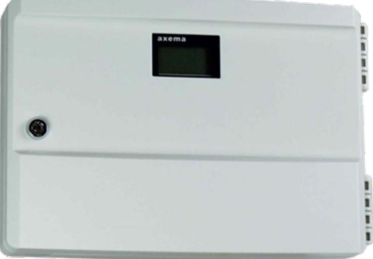

## Datablad

Uppdaterad 2022-03-14

## **Dörrcentral VAKA B27-R**

B27-R hanterar en dörrmiljö i VAKA-system, med läsare, dag- och nattlås, dörrautomatik, porttelefon, två moduler för extra funktionalitet m.m.

B27-R är en tillfällig ersättare till B28. Se avsnittet Viktig [information](#page--1-0) för förutsättningar och skillnader mellan produkterna.

# Viktig information

#### Säkerställ rätt version före installation.

Om B27-R ska installeras i ett befintligt (eller nytt) VAKA-system gäller lägst version 3.87.0024 eller VAKA Generation 4 Hotfix 3. Se https://info.axema.se?version, eller läs QR-koden, för information kring uppdateringar.

Observera följande skillnader i funktion mellan B27-R och B28:

- l B27-R har inbyggt interface för styrning av externt inbrottslarm (C20 behövs ej).
- l B27-R saknar 2 st. ingångar med följd att nedan funktioner inte kan konfigureras:
	- o Deaktivering läsning
	- o UPS-status
	- o Avbryt olåst-tid
	- o Fritt tillträde
	- o Förhöjd säkerhetsnivå
	- o Anti PassBack (APB)-neutralisering
- l B27-R kan inte följa status för Fritt tillträde och Förhöjd säkerhetsnivå.
- l B27-R har andra elektriska prestanda än B28:
	- o Högre strömförbrukning (kontrollera vid ev. krav på lång backup-tid).
	- o Vid PoE-matning levereras 12/24V på ett plint-par (+ & -)
- l B27-R hanterar inte aktivering av olika reläer (lås/AUX) vid identifiering via läsare A respektive B.

### Funktionalitet och användningsområden

- l VAKA B27-R är en komplett centralenhet för en dörr, med integrerad webbplattform och programvara. B27-R stödjer Power over Ethernetstandarden 802.3at (PoE+), vilket innebär att en enda kabel räcker för dörrmiljöns alla funktioner. Sammanlagt finns 7 st. reläutgångar och 4 ingångar för att klara en mängd funktioner vid dörren.
- l B27-R hanterar läsare för in-/utpassering och ingår i ett VAKA-system med upp till 1000 dörrmiljöer.
- l Inbyggd kalender och registrering av de 5 000 senaste händelserna.
- l B27-R hanterar A66, A63, A61 och A45 läsarterminaler (MIFARE/EM)
- l Kablage 4-ledare mellan B27-R och läsarterminaler, upp till 150 meter.

### Teknisk Data

| Attribut                                 | B27-R                                                                  |  |  |  |
|------------------------------------------|------------------------------------------------------------------------|--|--|--|
| (HxBxD) mm Mått                    | 170x257x54                                                             |  |  |  |
| Kapsling                                 | Slagtålig ABS-plast                                                 |  |  |  |
| Montage                                  | Väggmontage utanpåliggande                                          |  |  |  |
| Display                                  | Ja                                                                     |  |  |  |
| Låsbar kapsling                       | Ja                                                                     |  |  |  |
| Strömförsörjning                         | 12-35 VAC/ 12-40VDC eller PoE 802.3 at               |  |  |  |
| Elektrisk anslutning                  | RJ45/ Skruvplint                                                    |  |  |  |
| Antal RJ45                            | 2 st                                                                |  |  |  |
| Inbyggd switch                        | Ja (två portar)                                                  |  |  |  |
| Inbyggd brandvägg                     | Nej                                                                    |  |  |  |
| PoE-stöd                                 | Ja                                                                     |  |  |  |
| Effektförbrukning vila (W)         | 2                                                                      |  |  |  |
| Effektförbrukning max (W)          | 2.5                                                                    |  |  |  |
| Strömförbrukning vila @12V (mA) | 150                                                                    |  |  |  |
| Max strömförbrukning @12V(mA)      | 170                                                                    |  |  |  |
| Strömförbrukning vila @24V (mA) | 75                                                                     |  |  |  |
| Max strömförbrukning @24V(mA)      | 85                                                                     |  |  |  |
| Maxlast relä                          | 1A 30 VDC                                                        |  |  |  |
| IP-klass                                 | IP22                                                                   |  |  |  |
| IK-klass                                 | IK06                                                                   |  |  |  |
| Temperaturområde (C)                  | 0° till +55°                                                     |  |  |  |
| Inloggningskonton                        | 5 (500 med B60)                                               |  |  |  |
| Personer (Brickor/sändare)            | 1 000 (4 000 med C30 och 80 000 med B60) |  |  |  |
| Behörighetsgrupper                       | 40 (4 000 med B60)                                         |  |  |  |
| Org.-grupper                             | 10 (1 000 med B60)                                         |  |  |  |
| Kalendrar                                | 1 (100 med B60)                                               |  |  |  |
| Zoner                                    | 6 (600 med B60)                                               |  |  |  |

| Attribut                                    | B27-R      |  |  |
|---------------------------------------------|------------|--|--|
| Bokning                                     | Med B60 |  |  |
| Import och export av persondata | Ja         |  |  |
| Art.-nr                                     | 2-2271     |  |  |
| E-nummer                                    | E5871929   |  |  |