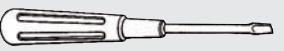
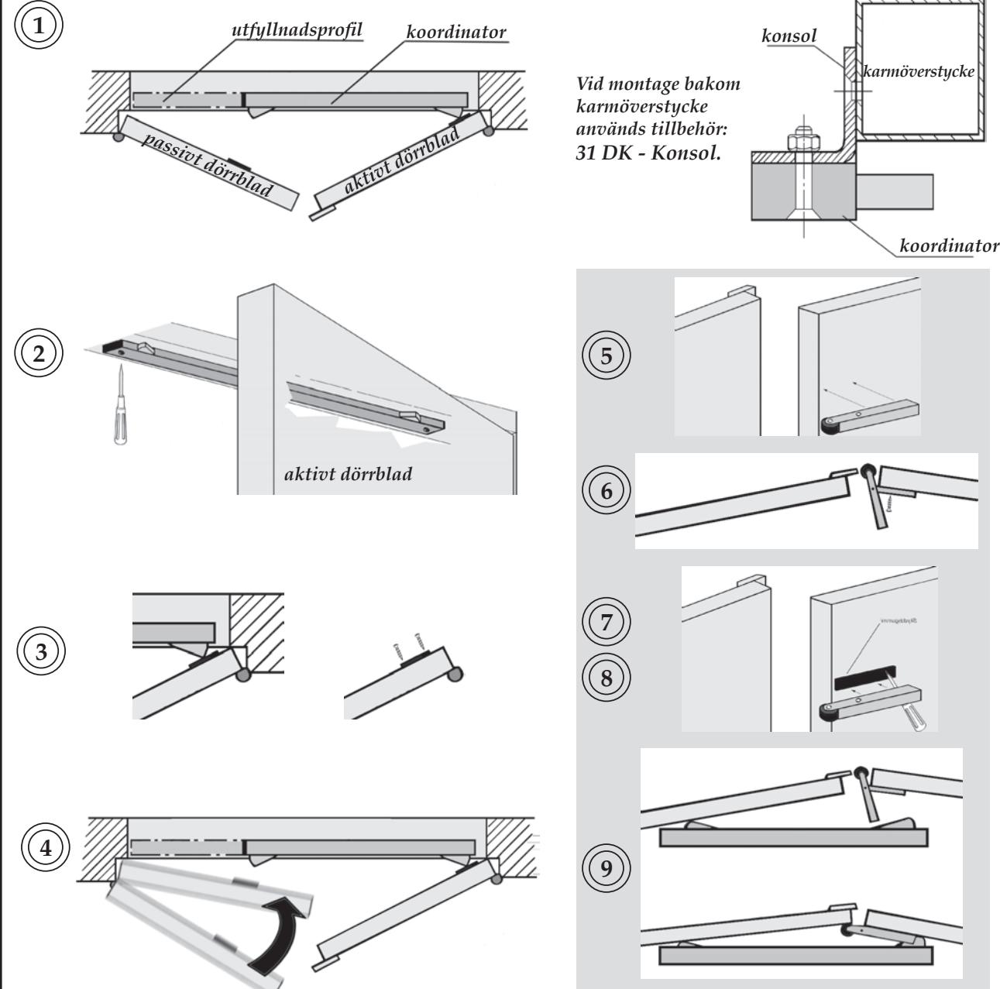
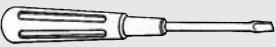
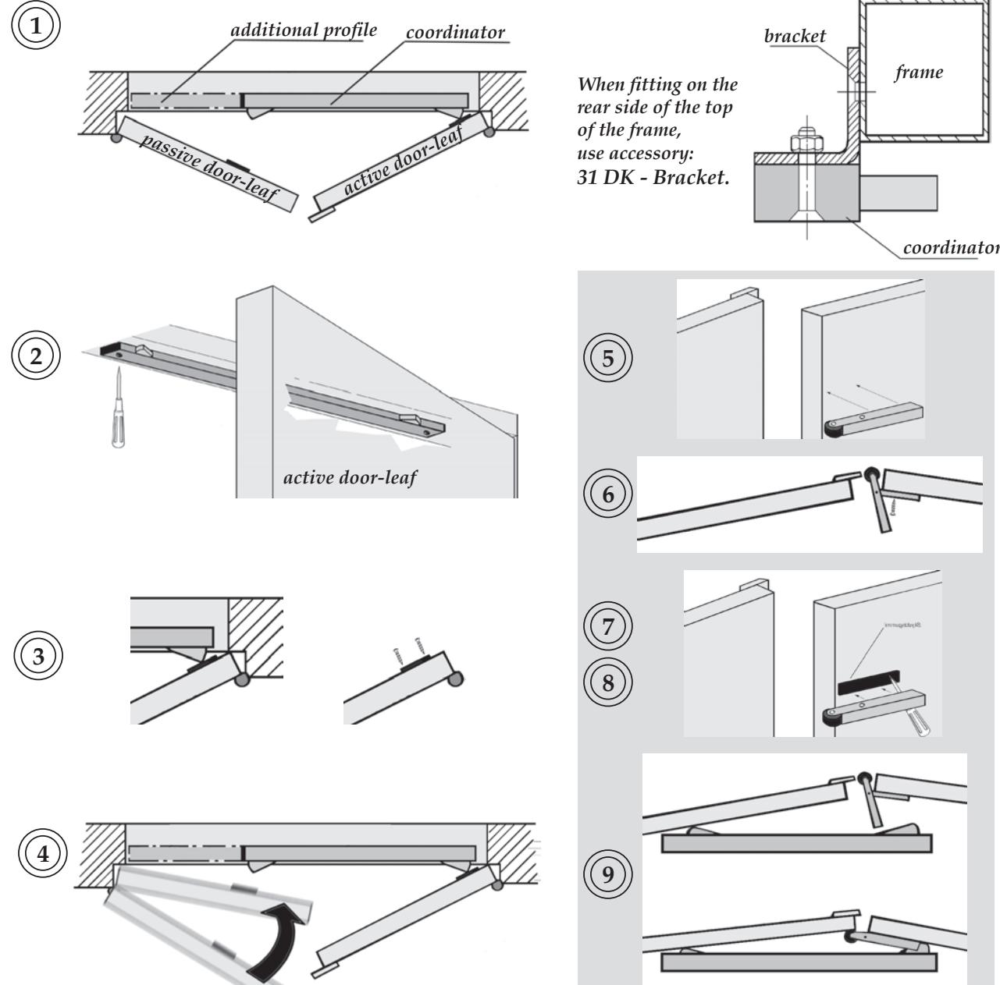

*Monteringsanvisning 30 DK :*

- **1. Markera koordinatorns placering på karmöverstycke. (***Alt. på konsol 31 DK.***) Koordinatorn skall monteras så den tillser att passivt dörrblad passerar aktivt dörrblad som spärras av koordinatorn.**
- **2. Borra hål för montage (3x). Montera koordinatorn. Dra skruvar. Används utfyllnadsprofil, skall denna kapas till rätt längd och monteras.**
- **3. Markera placering för skyddsplattor på båda dörrbladen, mitt för koordinatorns nockar. Borra hål för montage (2x / platta). Montera skyddsplattor. Dra skruvar.**
- **4. Kontrollera koordinatorns funktion.**

*Monteringsanvisning 33 DK :*

- **5. Märk ut placering på passivt dörrblad.**
- **6. Märk ut samt borra hål för montage (2x).**
- **7. Applicera skyddsgummi. Gör hål för skruvar i skyddsgummit.**
- **8. Montera medbringare. Dra skruvar.**
- **9. Kontrollera systemets funktion. Medbringare ska tillse att aktivt dörrblad öppnas tillräckligt för att aktivera koordinatorn.**

*Förpackningarna innehåller:* Dörrkoordinator 30 DK Skyddsplatta (2 st.) Skruv för montage av koordinator (3 st.) Skruv för montage av skyddsplattor (4 st.) Art.Nr: grå: 471014430-850(-1150)/GR galvaniserad: 471014430-850(-1150)/GALV

Konsol 31 DK (3 st.) Art.Nr: 471014431

Medbringare 33 DK Skyddsgummi, Skruv för montage (2 st.) Art.Nr: vit: 471014433/WT grå: 471014433/GR

# Dörrkoordinator 30 DK och tillbehör

OLDA Innovation AB, Vagnmakaregatan 14, 415 07 Göteborg tel: 031-26 68 92 fax: 031-26 68 67 e-post: info@olda.com web: www.olda.com

### *Mounting instructions 30 DK :*

- **1. Mark the position of the coordinator on the top of the frame. (***Alt. on Bracket 31 DK.***) The coordinatorisfittedso thatthepassivedoor-leaf canpass the activedoor-leaf whichis stoppedby the coordinator.**
- **2. Drill holes for fitting (3x). Mount the coordinator. Tighten the screws. If an additional profile is used, it should be cut to the correct length and mounted.**
- **3. Mark the position of the protection plates on both door-leaves,inline withthe latches ofthecoordinator.Drillholesforfitting(2x/plate). Mount the protection plates. Tighten the screws.**
- **4. Check the function of the coordinator.**

*Mounting instructions 33 DK :*

- **5. Mark the position on the passive door-leaf.**
- **6. Mark and drill holes for fitting (2x).**
- **7. Fit the protection rubber. Make holes for screws in the rubber.**
- **8. Mount the carry open. Tighten the screws.**
- **9. Check the function of the system. The carry open should ensure that the active door-leaf is carried open, enough to activate the coordinator.**

*Packages contains:* Door coordinator 30 DK Protection plates (2 pcs.) Screws for fitting of coordinator (3 pcs.) Screws for fitting of protection plates (4 pcs.) Art.No: grey: 471014430-850(-1150)/GR galvanized: 471014430-850(-1150)/GALV

Bracket 31 DK (3 pcs.) Art.No: 471014431

Carry open 33 DK Protection rubber, screws for fitting (2 pcs.) Art.No: white: 471014433/WT grey: 471014433/GR

## Door coordinator 30 DK and accessories

OLDA Innovation AB, Vagnmakaregatan 14, SE-415 07 Göteborg, Sweden tel: +46 (0)31-26 68 92 fax: +46 (0)31-26 68 67 e-mail: info@olda.com web: www.olda.com