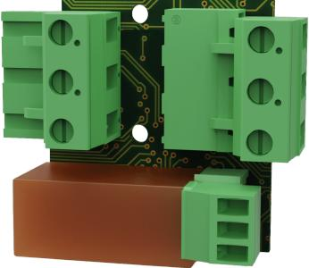
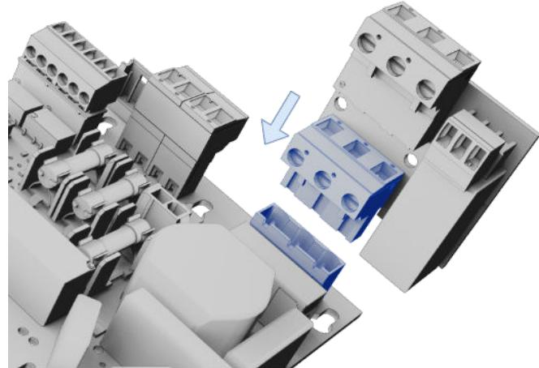
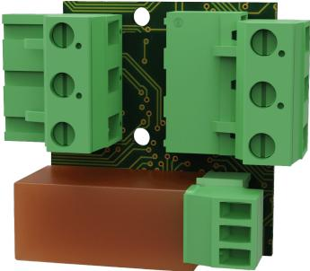
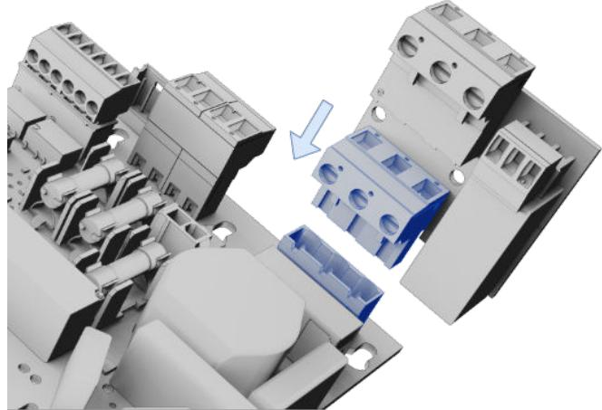
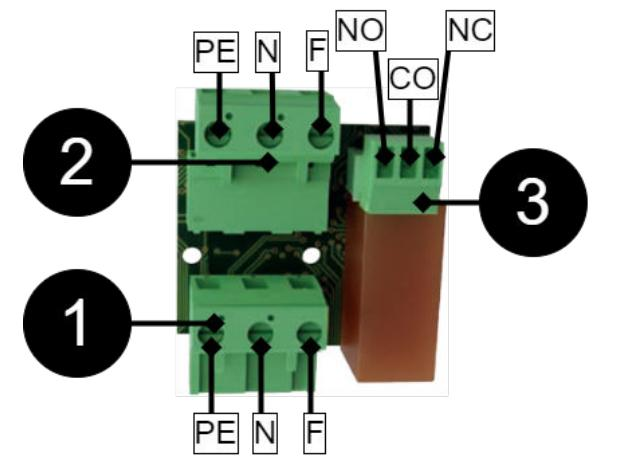

## OM

MONTERING OCH INKOPPLING

- 1. Montera kortet på moderkortet i batteribackupen.
- 2. Koppla elnät.
- ECO Main failure alarm card

Tryck ner kortet på moderkortet i batteribackupen.

Koppla Fas, Noll och Jord som bilden visar.

ECO mains failure alarm card är ett larmkort för övervakning av nätbortfall. Larmkortet kan sättas i 24 V batteribackuper ECO M och ECO FLX S.

| Nr | Förklaring                                                                     |  |  |
|----|--------------------------------------------------------------------------------|--|--|
| 1  | Plint som möter moderkort i batteribackup, skyddsjord (PE), Noll (N), Fas (F). |  |  |
| 2  | Plint för inkommande elnät, skyddsjord (PE), Noll (N), Fas (F).                |  |  |
| 3  | Larmutgång, NO/CO/NC.                                                          |  |  |

**Varning** Korsa inte kablar - risk för skada på utrustning.

# TEKNISKA DATA

| Artikelnummer     | A-AL1224ECO01card                                        |  |  |
|-------------------|----------------------------------------------------------|--|--|
| Produkbeskrivning | Larmkort för ECO M och ECO FLX S. Larm på växlande relä. |  |  |
| Mått              | 21 x 55 x 42 mm                                          |  |  |
| Egenförbrukning   | N/A                                                      |  |  |
| Spänning, in      | 27,3 V DC                                                |  |  |
| Larmutgång:       | Nätavbrott NC/CO/NO                                      |  |  |
|                   |                                                          |  |  |
|                   |                                                          |  |  |

| Tekniska data                       |                                                                                                                                                                                                                                                            |  |  |  |  |  |
|-------------------------------------|------------------------------------------------------------------------------------------------------------------------------------------------------------------------------------------------------------------------------------------------------------|--|--|--|--|--|
| Rekommenderad miljö                 | Miljöklass 1, Inomhus, 20% ~ 90% relativ fuktighet                                                                                                                                                                                                         |  |  |  |  |  |
| Produkterna möter kra ven enligt | EMC Directive 2014/30EU, Low Voltage directive: 2014/35/EU CE directive according to 765/2008, Emission: EN61000-6-:2001, EN55022:1998:-A1:2000, A2:2003 Klass B, EN61000-3-2:2001. Im munity: EN61000-6-2:2005, EN61000-4-2, -3, 4, -5, -6, -11. |  |  |  |  |  |

#### **Tekniska data** Garanti 2 år

Tillverkad i Milletekniks fabrik i Partille, Sverige.

Bruksanvisning i original: Svenska.

Manualens artikelnummer: 350-243

Detta dokument kan ändras utan föregående meddelande.

Alla uppgifter publiceras med reservation för tryckfel.

#### ADRESS OCH KONTAKTUPPGIFTER

Milleteknik AB Ögärdesvägen 8 B 433 30 Partille 031-340 02 30 www.milleteknik.se

## ABOUT

ECO mains failure alarm card is an alarm card for monitoring mains failure. The alarm card can be inserted into 24 V battery backups ECO M and ECO FLX S.

## INSTALLATION AND CONNECTION

- 1. Mount the card on the motherboard in the battery backup.
- 2. Connect the mains.
- ECO Main failure alarm card

Push the card down onto the motherboard in the battery backup.

Connect Phase, Neutral and Ground as the picture shows.

| No | Explanation                                                                                          |  |
|----|------------------------------------------------------------------------------------------------------|--|
| 1  | Terminal that meets motherboard in battery backup, protective earth (PE), Neutral (N), Phase (F). |  |
| 2  | Terminal for incoming mains, protective earth (PE), Neutral (N), Phase (F).                          |  |
| 3  | Alarm output, NO/CO/NC.                                                                              |  |

**ENGLISH**

**Warning**

Do not cross cables - risk of equipment damage.

# TECHNICAL DATA

| Item number A-AL1224ECO01 card                                                         |                                                                                                                                                                                            | Technical data                                                                                            |         |
|-------------------------------------------------------------------------------------------|--------------------------------------------------------------------------------------------------------------------------------------------------------------------------------------------|-----------------------------------------------------------------------------------------------------------|---------|
| Product description                                                                       | Alarm card for ECO M and ECO FLX S. Alarm on changing relay.                                                                                                                               | Guarantee                                                                                                 | 2 years |
| Measure                                                                                   | 21 x 55 x 42 mm                                                                                                                                                                            |                                                                                                           |         |
| Own energy consumption N/A                                                             |                                                                                                                                                                                            | Manufactured in Milleteknik's factory in Partille, Sweden.                                                |         |
| Tension, in                                                                               | 27.3V DC                                                                                                                                                                                   |                                                                                                           |         |
| Alarm output:                                                                             | Mains failure NC/CO/NO                                                                                                                                                                     | This translation is not verified and should be cross referenced with the swed ish original before use. |         |
|                                                                                           | Technical data                                                                                                                                                                             |                                                                                                           |         |
| Recommended environ Environmental class 1, Indoor, 20% ~ 90% relative humidity ment |                                                                                                                                                                                            | User manual article number: 350-243                                                                       |         |
| The products meet the requirements according to                                     | EMC Directive 2014/30EU, Low Voltage directive: 2014/35/EU CE directive according to 765/2008, Emission: EN61000-6-:2001, EN55022:1998:-A1:2000, A2:2003 Class B, EN61000-3 -2:2001. | This document is subject to change without notice.                                                        |         |
|                                                                                           | Immunity: EN61000-6-2:2005, EN61000-4-2, -3, 4, -5, -6, -11.                                                                                                                               | All information is published subject to typographical errors.                                             |         |

#### ADDRESS AND CONTACT DETAILS

Milleteknik AB Ögärdesvägen 8 B S-433 30 Partille +46 31 340 02 30 www.milleteknik.se