## **Nyheter vid montering**

**På nya ED  100 / ED  250 är bland annat växellådan moderniserad och armsystemet uppgraderat med nya funktioner och enhetlig XEA-design.** 

Den nya standardarmen och glidskenan möjliggör enklare och snabbare installationer. Här går vi igenom hur det nya armsystemet monteras, där ett viktigt moment är fjäderförspänning för att säkra att automatikens axel är i noll-läge.

# ED  100 / ED  250 **Fler nyheter**

- Ny infästning mellan arm och växellåda
- Förbättrad transformator
- Axeldekor i olika färger, för axelförlängare
- ED 250 kan nu monteras som EN 7

**SV**

### **Standardarm**

- 1. För tryckande armsystem (standardarm) ställs fjäderförspänningen till respektive 10/14 varv. (fig. 1) Därefter monteras länkarmen på i 90 ° och skruvas fast med 23Nm. (fig. 2)
- 2. Länkarmen monteras på dörrbladet och kopplas ihop med armen, justera därefter länkarmen så den är i 90° vinkel mot dörrbladet. (fig. 3)
- 3. Justera fjäderkraften så den är anpassad till den aktuella dörrmiljön.

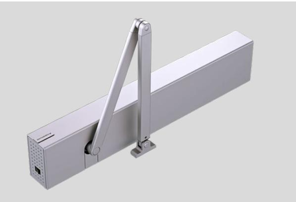

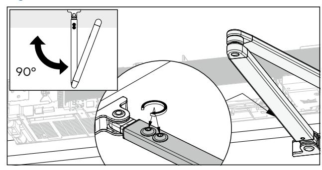

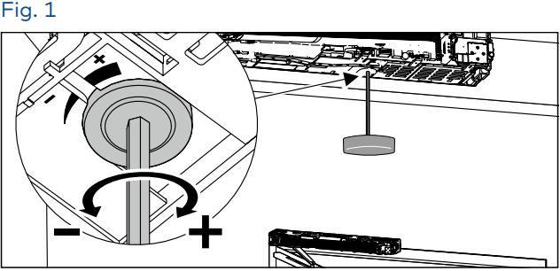

Fig. 2

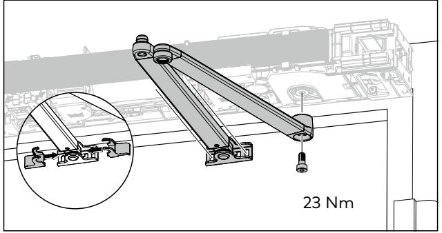

### **Tryckande glidskena**

- 1. Ställ in fjäderförspänningen med 10 varv, axeln vrider sig då till noll-läget. Vrid fjäderspänningen tillbaka till 0. (fig. 4)
- 2. Tryck fast armen i en vinkel på ca 12° från stängt läge, detta är första kugg utåt från stängt läge. (fig. 5)
- 3. Montera armen på axeln och skruva fast med 23 Nm. (fig. 8)
- 5. Skruva fast tappen till glidklossen i armen med 8–10 Nm. Justera fjäderkraften så den är anpassad dörrmiljön. (fig. 9) Observera att montaget reducerar kraften med 33%, kompensera med fjäderkraften, minimum 14/18 varv.

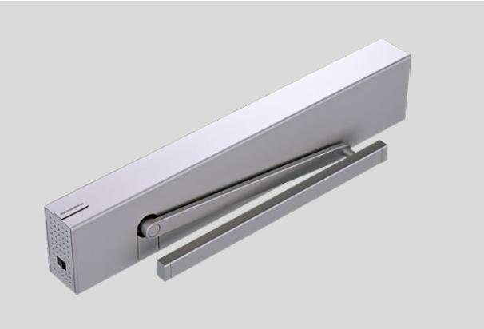

### **Dragande glidskena**

- 1. Ställ in fjäderförspänningen med 10 varv, axeln vrider sig då till noll-läget. Vrid fjäderspänningen tillbaka till 0. (fig. 4)
- 2. Tryck fast armen i en vinkel på ca 12° från stängt läge, detta är första kugg utåt från stängt läge. (fig. 5)
- 3. Vrid armen med drivaxeln ca 10° i öppningsriktningen. (fig. 6) Lossa försiktigt armen från axeln.
- 4. **Rotera armen en kugg mot stängt läge.** Montera armen på axeln och skruva fast med 23 Nm. (fig. 7 och 8)
- 5. Skruva fast tappen till glidklossen i armen med 8–10 Nm. Justera fjäderkraften så den är anpassad dörrmiljön, minimum 10/14 varv. (fig. 9)

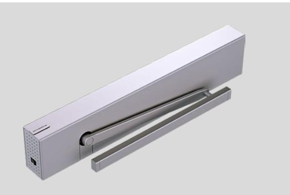

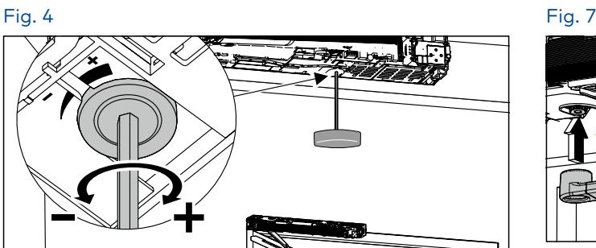

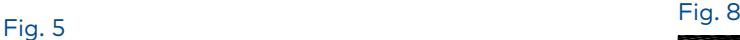

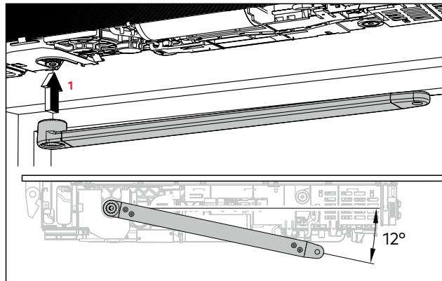

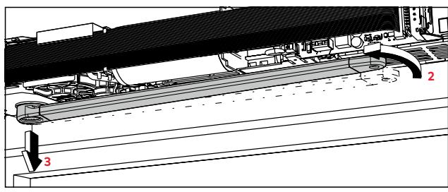

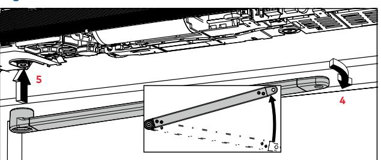

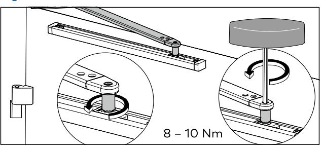

dormakaba Sverige AB F O Petersons gata 28 421 31 Västra Frölunda T: 031-355 20 00 info.se@dormakaba.com www.dormakaba.se