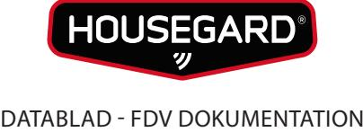
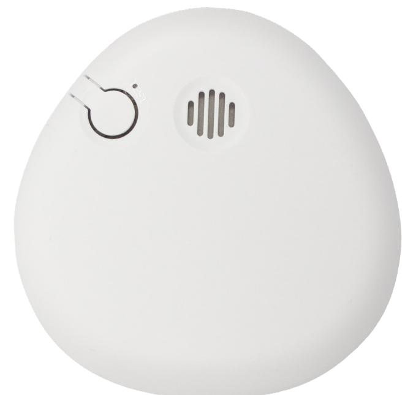

## HOUSEGARD SA700 PEBBLE Optisk brandvarnare

SA700 är en optisk standard brandvarnare. Optiska brandvarnare är den vanligaste typen av brandvarnare, de reagerar snabbt vid glödbränder.

Den optiska kammaren är känslig för små partiklar, brandvarnaren bör därför inte placeras där den ger falskalarm, t.ex nära en fläkt eller en spis.

Det samlas dammpartiklar runt en brandvarnare, dessa kan tränga in i detektionskammaren och ge upphov till falskalarm. Kammaren bör därför rengöras regelbundet.

Brandvarnaren bör testas varje vecka och bytas ut vart tionde år.

| Modell:           | SA700          |
|-------------------|----------------|
| Typ:              | Standard       |
| Detektion:        | Optisk kammare |
| Radio:            | nej            |
| Programmering:    | nej            |
| Testfunktion:     | ja             |
| Pausfunktion:     | nej            |
| Alarm ljudstyrka: | 85 dB/3m       |
| Strömkälla:       | 1st 9V         |

Drifttid: ca 1 år Temp.område: -10 °C till +40 °C Mått dia/djup (mm): 105 x 34 Certifiering: EN 14604, CE

Service/Kontroll: Testas regelbundet, dammsugs eller blåses ren med tryckluft två gånger per år.

### Teknisk data Godkännanden

# EN 14604

### Artikelinformation

Artnr: 601107 EAN: 7320896011076 Försäljningsenhet: st / kartong 10 st