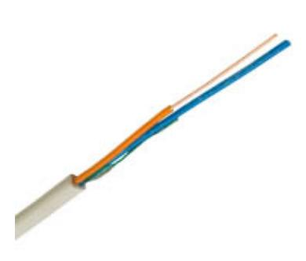
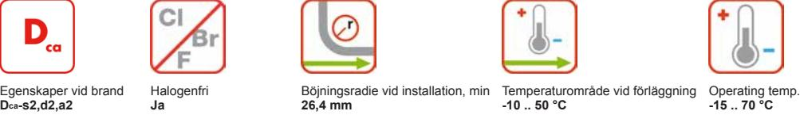

Kontaktuppgifter

Försäljning Tele/Datakabel Telefon: +46 325 80 000 telecomcable-pc.se@nexans.com

**Artikelnr:** 18440241-802-02 **E-nr:** 4836852 **EAN 13:** 7330000079823

HFFR-isolerad signalkabel med halogenfri, flamskyddad mantel. Ledare av entrådig koppar.

# **BESKRIVNING**

## **Konstruktion**

HFFR-isolerad signalkabel med halogenfri, flamskyddad mantel. EQQRB används som signalkabel i diverse styr- och reglertekniska anläggningar, även brandlarmsanläggningar. Kabeln är konstruerad enligt SS 424 16 09. Förläggs inomhus enligt SS 424 14 38 och utomhus, även på bärlina och skyddad mot mekanisk åverkan i mark enligt SS 424 14 37. Uppfyller brandkrav enligt CPR klass Dcas2d2a2. Vid brand avger kabeln inga korrosiva gaser och har liten rökutveckling.

## **Kvalitets- och miljöledningssystem**

Certifierade enligt ISO 9001, IRIS, ISO/TS 16949 och ISO 14001.

### **PRESTANDADEKLARATION**

Egenskaper vid brand: Dcas2,d2,a2 enligt EN50575:2014+A1:2016

### **STANDARDER**

**Nationell** SS 424 16 09

Alla illustrationer, konstruktioner, specifikationer, ritningar och angivelser om vikt, storlek och dimensioner i Nexans tekniska eller kommersiella dokumentation är endast indikativa och kan inte förbinda Nexans eller anses vara representativa för Nexans. **Genererad 2017-07-04 www.nexans.se Sida 1 / 2**

#### Kontaktuppgifter

Försäljning Tele/Datakabel Telefon: +46 325 80 000 telecomcable-pc.se@nexans.com

## **EGENSKAPER**

| Konstruktionsegenskaper             |                      |
|-------------------------------------|----------------------|
| Färg                                | Vit                  |
| Ledare, tvärsnittstyp               | Entrådig             |
| Ledare, material                    | Blank glödgad koppar |
| Skärm                               | Nej                  |
| Mantel, material                    | HFFR                 |
| Isolering, material                 | HFFR                 |
| Halogenfri                          | Ja                   |
| Dimensionsegenskaper                |                      |
| Antal ledare                        | 2                    |
| Mantel, tjocklek                    | 0,8 mm               |
| Ytterdiameter, nom                  | 4,9 mm               |
| Vikt                                | 2,7 kg/100m          |
| Ledardiameter                       | 1,0 mm               |
| Elektriska egenskaper               |                      |
| Ledarresistans vid 20° C, max       | 23,3 Ohm/km          |
| Isolationsresistans, min            | 5000 MOhm.km         |
| Spänning vid drift, max             | 100 V                |
| Hanteringsinformation               |                      |
| Böjningsradie vid installation, min | 26,4 mm              |
| Längd                               | 100 m                |
| Förpackning                         | Bobin                |
| Temperaturområde vid förläggning    | -10  50 °C           |
| Drifttemperatur, område             | -15  70 °C           |

## **LEVERANSINFORMATION**

EQQRB levereras i längder om 100 eller 500 m enligt tabellen Beställningsinformation. Förpackningen är märkt med tillverkare, kabeltyp och längd. Kabeländarna är förslutna.

Alla illustrationer, konstruktioner, specifikationer, ritningar och angivelser om vikt, storlek och dimensioner i Nexans tekniska eller kommersiella dokumentation är endast indikativa och kan inte förbinda Nexans eller anses vara representativa för Nexans. **Genererad 2017-07-04 www.nexans.se Sida 2 / 2**

