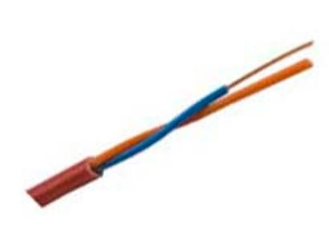
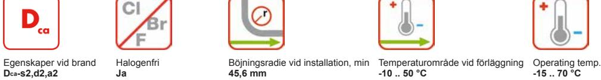
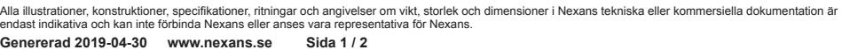

**Artikelnr:** 17490171 **E-nr:** 4804665 **EAN 13:** 7330000082168

HFFR isolerad, partvinnad brandlarmkabel med halogenfri, flamskyddad mantel.

## **BESKRIVNING**

### **Konstruktion**

HFFR-isolerad, partvinnad brandlarmkabel med halogenfri, flamskyddad mantel. EQQYB används i anläggningar för brandlarm som matarledning och för anslutning av detektorer. Kabeln förläggs inomhus i fast förläggning och i rör enligt SS 424 14 38 eller utomhus på vägg eller bärlina. Uppfyller brandkrav enligt CPR klass Dcas2d2a2. Vid brand avger kabeln inga korrosiva gaser och har liten rökutveckling. .

### **Kvalitets- och miljöledningssystem**

Certifierade enligt ISO 9001, IRIS, ISO/TS 16949 och ISO 14001.

### **PRESTANDADEKLARATION**

Egenskaper vid brand: Dcas2,d2,a2 enligt EN50575:2014+A1:2016

#### **STANDARDER**

**Internationell** IEC 60332-1

**Nationell** SS 424 16 16

Kontaktuppgifter

Försäljning Tele/Datakabel Telefon: +46 325 80 000 telecomcable-pc.se@nexans.com

#### Kontaktuppgifter

Försäljning Tele/Datakabel Telefon: +46 325 80 000 telecomcable-pc.se@nexans.com

## **EGENSKAPER**

| Konstruktionsegenskaper             |                 |
|-------------------------------------|-----------------|
| Ledare, tvärsnittstyp               | Entrådig        |
| Ledare, material                    | Annealed copper |
| Isolering, material                 | HFFR            |
| Skärm                               | Nej             |
| Mantel, material                    | HFFR            |
| Färg                                | Red             |
| Halogenfri                          | Ja              |
| Dimensionsegenskaper                |                 |
| Ledardiameter                       | 1,0 mm          |
| Antal par                           | 1               |
| Mantel, tjocklek                    | 0,8 mm          |
| Ytterdiameter, nom                  | 5,4 mm          |
| Vikt                                | 3,4 kg/100m     |
| Elektriska egenskaper               |                 |
| Ledarresistans vid 20° C, max       | 24,5 Ohm/km     |
| Kapacitans ledare-ledare, max       | 70 nF/km        |
| Isolationsresistans, min            | 5000 MOhm.km    |
| Spänning vid drift, max             | 100 V           |
| Transmissionsegenskaper             |                 |
| Dämpning, max, vid 800 Hz, 20°C     | 0,7 dB/km       |
| Hanteringsinformation               |                 |
| Böjningsradie vid installation, min | 45,6 mm         |
| Längd                               | 500 m           |
| Förpackning                         | E4              |
| Temperaturområde vid förläggning    | -10  50 °C      |
| Drifttemperatur, område             | -15  70 °C      |

# **LEVERANSINFORMATION**

EQQYB levereras i längder om 100 till 500 m. Förpackningen är märkt med tillverkare, kabeltyp och längd. Kabeländarna är förslutna.

Alla illustrationer, konstruktioner, specifikationer, ritningar och angivelser om vikt, storlek och dimensioner i Nexans tekniska eller kommersiella dokumentation är endast indikativa och kan inte förbinda Nexans eller anses vara representativa för Nexans. **Genererad 2019-04-30 www.nexans.se Sida 2 / 2**

