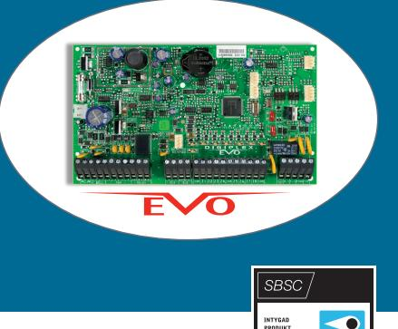
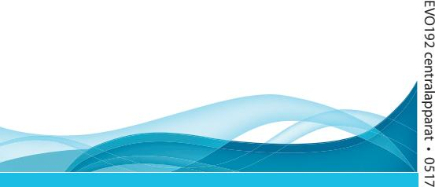

‣ Kraftfull processor som är pålitlig och robust, klarar utbyggnad och stora installationer **EVO192 centralapparat**

## Helintegrerad säkerhet på toppnivå!

*Paradox EVO192 centralapparat har ett system istället för två som är vanligt idag om du önskar en centralenhet för både larm, – övervakning, – och passagesystem. Ett system som reducerar falsklarm, sänker kostnaden vid inköp och uppsättning. EVO192 centralapparat har högre säkerhet än andra som har dubbla system där ett system hämtar information till det andra.* 

### **Lägg till moduler i systemet**

Lägg till den användarvänliga TM50 touchscreen-manöverenheten till centralapparaten och styr Paradox HD77/HD78F kamerorna (IR-detektor med inbyggd HD-video-kamera). Kamerorna sänder livevideo i HD-kvalitet (ljud och bild i toppklass) och bilder samtidigt till appen samt larmcentralen när larmet går.

Centralapparaten stödjer anslutning av kommunikationsmoduler för IP, GSM, GPRS, fast telefoni eller en kombination av dessa, med flera rapporteringsvägar finns stark redundans för rapportering. Tack vare enkel installation och förberedd integration med andra enheter kan EVOHD stödja upp till 254 moduler och 192 sektioner. Centralapparatens flexibla uppdelning av områden gör att det är möjligt att koppla detektorerna till områden helt oberoende av detektorernas fysiska placering.

#### **Systemets kommunikationssystem**

Systemet kan byggas ut med trådlös RTX3 expansionsmodul. Digiplex avancerade kommunikationssystem har en 4-tråds buss, en enda busslinga för upp till ca 900 m med en konstant sabotagesäker anslutning för högsta möjliga nivå av säkerhet. Den enkla och smidiga "plug and play" anslutningen av moduler med automatisk identifiering och lokalisering av modulerna förenklar installationen, sparar arbete och tid. Den smarta programmeringen tillåter dig att programmera alla moduler via Programvaran (BabyWare) eller knappsatsen och låter dig flexibelt tilldela enheter i systemet till valfri sektion.

*Certifierad produkt SBSC (larmklass 3). Med reservation för tryckfel och ändringar*

### Innehåller

- ‣ **EVO192 Centralapparat**
192 sektioners bussystem, plug & play

- 5 programmerbara utgångar
- 8 traditionella ingångar, centralkortet

8 områden

2048 händelser i händelseminnet

999 användarkoder

Matningsspänning 17 V AC

Passagesystem för upp till 32 dörrmiljöer (Paradox alternativt EM/Mifare läsarmodul)

## ‣ **Plåtlåda, inklusive transformator**

Skyddstransformator 16/18 40 VA

IP43

# ‣ Larm-, passage och övervakning EVO192 centralapparat

EVO192-systemet är kompatibelt med brandvarnare, och integrerat klimat-, och belysningssystem för intelligent kontroll

#### **Kapsling/plåtlåda**

Plåtlåda standard 31 x 32 x 13 cm. Inkluderar skyddstransformator 16/18 40 VA, IP43. Innehåller även sabotagekontakt för vägg och front.

Vid installation finns snabbsäkring (strömlös under installation/montering).

Extra hylla finns för sektionskort/PGM.

#### Ladda ned Paradox Insight övervakningsapp **Certifiering**

via Google Play (Android v1.4.0) eller App Store (iOS v.1.3.8). Då får du tillgång till HD77 kamerorna och systemet. CE EN 50130-5. Class ll EN 45011. System 5 SBSC i larmklass 3, cert nr 13-455. SSF 1014, utgåva 5

#### **Spänning**

16 VAC 20/40 VA, 50 – 60 Hz

**Strömförbrukning**

#### 97 mA

**Backup batteri**

12 VDC, 7 Ah minimum

#### **AUX-ström**

12 VDC 600 mA typiskt, 700 mA maximalt, automatisk säkringsnedkoppling vid 1.1A

#### **Siren utgång**

1A, automatisk säkringsnedkoppling vid 3A

#### **PGM utgångar**

PGM1 till PGM4 100mA mikrorelä. PGM5 Form C relä (5A/28 VDC N.O. / N.C.)

#### **Driftstemperatur**

-20ºC – +50ºC

**Sektioner**

192 st.

#### **Områden**

8 st.

#### **Användarkapacitet**

999 st.

#### **Passage**

Upp till 32 dörrmiljöer

**Alla centralapparatsutgångar är klassade för mellan 10.8 VDC och 12.1 VDC**

Paradox Security • Ekholmsvägen 36 • 127 48 Skärholmen • 08-556 465 50. www.paradox-security.se