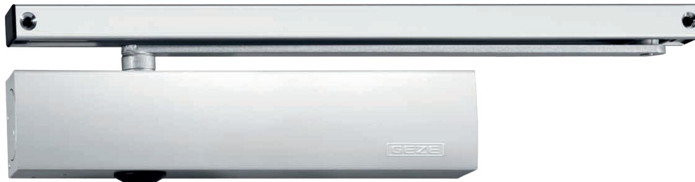
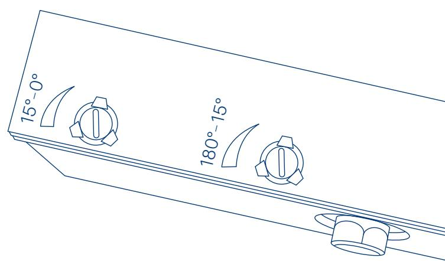

TS 5000 SOFTCLOSE: SAFE AND QUIET

## Efficiency is a matter of application

### **TS 5000 SOFTCLOSE**

# Safe, quiet, efficient

**The TS 5000 SoftClose door closer makes it possible to adjust the closing speed between 15° and 0° especially quickly and conveniently – even under difficult environmental conditions such as varying air pressures acting on the door leaf.** 

#### **AREAS OF APPLICATION:**

- Fire and smoke protection doors
- Right and left single-action doors
- Single-action doors up to 1400 mm leaf width
- Door leaf installation hinge side and transom installation opposite hinge side

#### **PRODUCT FEATURES:**

- Latching action speed (opening angle 15° 0°) with variable adjustment using a valve
- Closing speed (180° 15°) individually adjustable
- Adjustable closing force of EN2-6 with variable adjustment
- Visual closing force display for easy control of the setting
- For right and left hand doors
- Integrated back check, decelerates the door
- All functions can be adjusted from the front
- Compact dimensions

#### **EFFICIENCY IS A MATTER OF APPLICATION**

The innovative technology in the TS 5000 SoftClose separates the closing speed from the latching action speed. The latching action speed can be set with variable adjustment over the last 15° – the door can close in a controlled manner. Your advantage: the door closer is simple and quick to adjust!

#### **SAFETY IS A MATTER OF APPLICATION**

The TS 5000 SoftClose delivers all-round safety: Doors with access control are closed safely, with reliable compliance to all regulations, e.g. for fire protection and building protection. And since the TS 5000 SoftClose is also individually adjustable, it prevents loud slamming doors in noise-sensitive areas, even under difficult conditions such as varying air pressures acting on the door leaf.

#### **COMPATIBILITY IS A MATTER OF APPLICATION**

The TS 5000 SoftClose in the familiar slim GEZE design can be used with all available guide rail variants. It offers full freedom to architects and specifiers – whether in new builds or retrofitting – while saving time and costs.

Ver. 2022_09 – ID no. 204102 EN – Subject to change without notice

Follow us! **www.geze.com**

