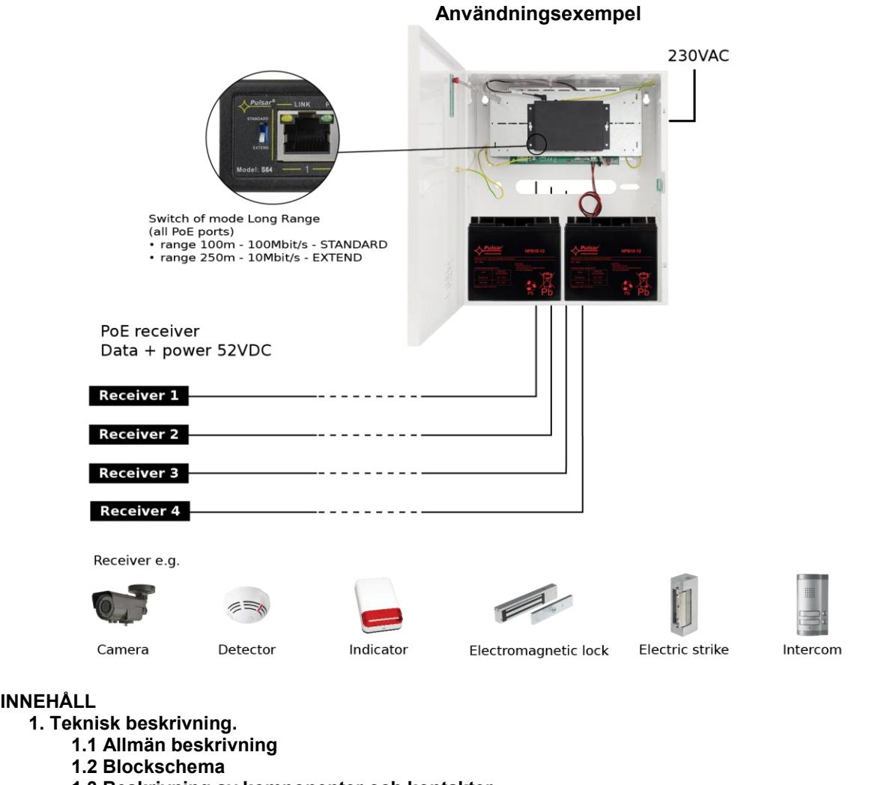
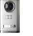
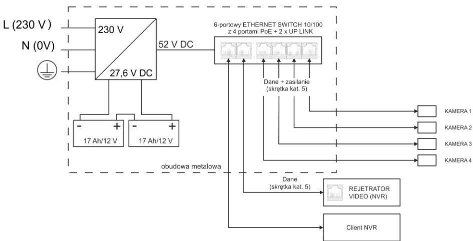
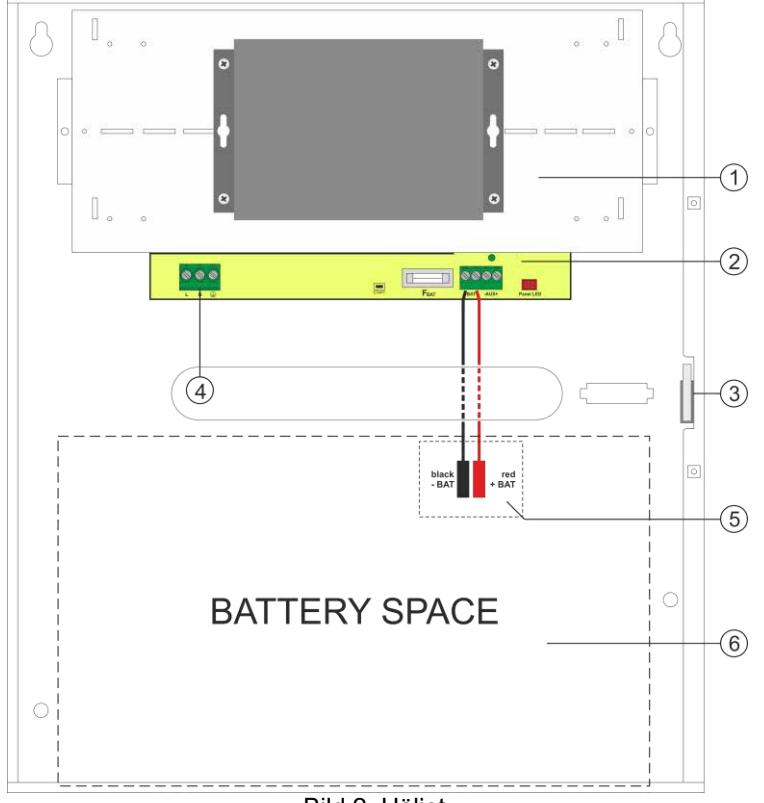
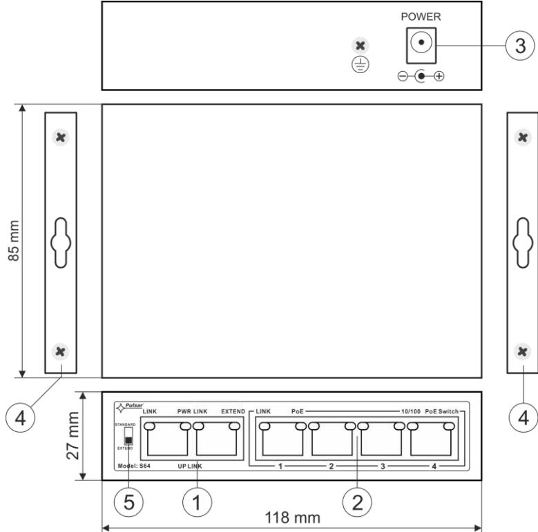
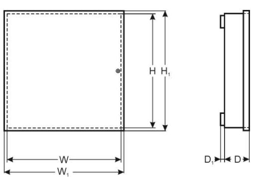
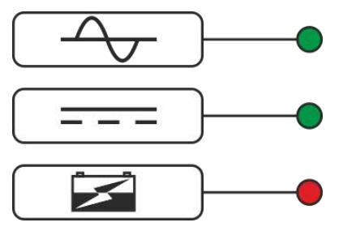
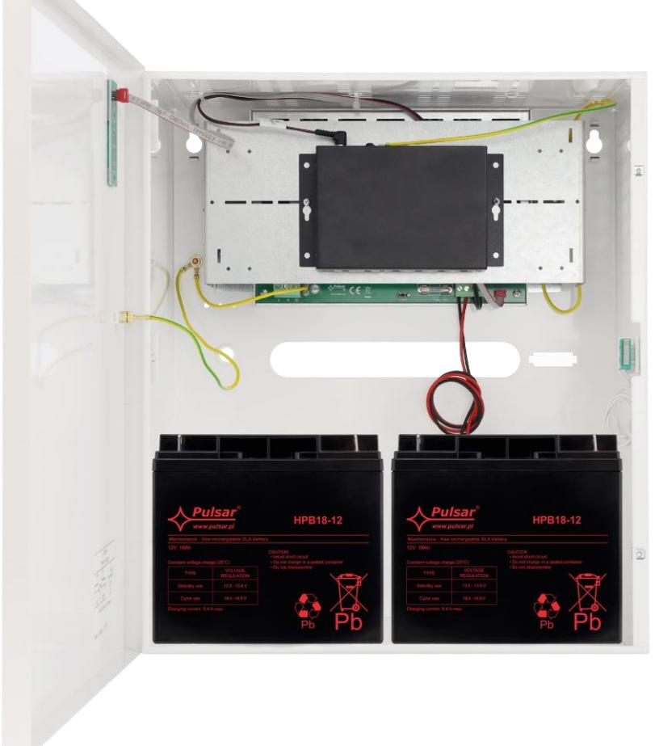
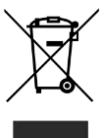

# **APS64 v.1.1 6-port switch 4x30W med reservkraft**

 **PL** Version: 2 från 16.01.2022 Ersätter version: 1 från 06.02.2020  **SV****

# **Egenskaper:**

- Avbrottsfri strömförsörjning för 4 IP-enheter (52 V DC)
- Switch med 6 portar 4 PoE-portar 10/100 Mb/s (dataöverföring och strömförsörjning) 2 portar 10/100 Mb/s (UP LINK)
- Läge med **Lång räckvidd** (upp till 250m)
- 30 W för varje PoE-port, stöder enheter som uppfyller standarden IEEE802.3af/ vid **(PoE +)**
- Metallhölje färg vit RAL 9003
- med batterifack för två 17 Ah/12 V-batterier Stöder automatisk inlärning och automatiskt åldrande av MAC-adresser (1K storlek)

- **1.3 Beskrivning av komponenter och kontakter**
- **1.4 Tekniska parametrar**
- **2. Installation.** 
	- **2.1 Krav**
	- **2.2 Läge med lång räckvidd**
	- **2.3 Installationsförfarande**
- **3. Indikation av enhetens drift** 
	- **3.1 LED-indikering av driftsstatus**
	- **3.2 Synlig indikation av switchens drift**
- **4. Drift och användning.** 
	- **4.1 Överbelastning eller kortslutning av PSU-utgången (SCP på )**
	- **4.2 Frånkoppling av urladdat batteri**
		- **4.3 Underhåll**

- 1

# **1. Teknisk beskrivning.**

# **1.1. Allmän beskrivning.**

APS64 är avsedd för oavbruten strömförsörjning av 4 IP-enheter (52 V DC-försörjning).

Systemets huvudsakliga komponenter inkluderar:

- PoE-switch med 6 portar
- 27,6 V buffertströmförsörjning med två 17 Ah / 12 V-batterier
- en omvandlare (inbyggd strömförsörjning) som ökar spänningen till 52 V DC (försörjning av PoE-switchen)

Vid strömavbrott aktiveras omedelbart ett reservbatteri.

 Automatisk upptäckt av enheter som drivs med standarden PoE/PoE+ aktiveras vid portar 1-4 på switchen. UP LINK-portarna används för anslutning till en annan nätverksenhet. Lysdioderna på frontpanelen indikerar enhetens driftsstatus (beskrivs i tabell 8).

Switchen sitter inuti ett metallhölje (färg RAL 9003) med rum för två 17 Ah/12 V-batterier. Höljet är utrustat med en mikroswitch som aktiveras om luckan öppnas (frontpanelen).

APS64 är försedd med tre Lysdioder på frontpanelen (se avsnitt 3.1).

PoE-tekniken ansluter till nätverket och minskar installationskostnaderna eftersom den inte kräver en separat strömkabel till varje enhet. Metoden gör det möjligt att försörjs andra nätverksenheter.

## **1.2 Blockschema.**

Bild 1. Blockschema.

**1.3 Beskrivning av komponenter och kontakter.** 

#### Bild 2. Höljet.

# **Tabell 1. (Se Bild. 2)**

| Komponent nr. (Bild 2) | Beskrivning                                                               |
|---------------------------|---------------------------------------------------------------------------|
| [1]                       | PoE-switch                                                                |
| [2]                       | Buffertenhet för switchläge                                               |
| [3]                       | Sabotage – mikrobrytare (terminaler) för sabotageskydd (NC)               |
| [4]                       | Strömförsörjningskontakt för PSU - L, N Skyddskontakt (elektrisk stöt) |
| [5]                       | BAT +, BAT - batteriutgång + BAT röd, - BAT svart                         |
| [6]                       | Batterifack för två 17 Ah/12 V-batterier                                  |

## Bild. 3. Switchen.

| Tabell 2. (Se bild 3) |  |  |
|-----------------------|--|--|
|-----------------------|--|--|

| Komponent nr. (Bild 3) | Beskrivning                           |
|---------------------------|---------------------------------------|
| [1]                       | 2 st UPLINK-portar                    |
| [2]                       | 4 x PoE-portar (1÷ 4)                 |
| [3]                       | 52 V DC-uttag                         |
| [4]                       | Ytterligare komponenter för montering |
| [5]                       | Växla till läget Lång räckvidd        |

## **1.4 Tekniska parametrar**

- switchens parametrar (tab.3)
- elektriska parametrar (tab.4)
- mekaniska parametrar (Tab.5)
- driftssäkerhet (tab.6)
- driftsparametrar (tab.7)

## **Tabell3. Switchens parametrar**

| Portar                  | 6 st 10/100 Mb/s-portar (4 st PoE + 2 st UP LINK) med automatisk hantering av |
|-------------------------|-------------------------------------------------------------------------------|
|                         | anslutningshastighet och MDI/MDIX Auto Cross                                  |
| PoE-strömförsörjning    | IEEE 802.3af/at (1÷4 portar), 52 V DC / 30 W i varje port *                   |
| Läge med lång räckvidd  | Lång räckvidd, VLAN                                                           |
| Protokoll, standarder   | IEEE802.3, 802.3u, 802.3x CSMA/CD, TCP/IP                                     |
| Bandbredd               | 1,6 Gbps                                                                      |
| Överföringsmetod        | Lagra-och-vidarebefordra                                                      |
| Synlig driftsindikering | Switchens strömförsörjning;                                                   |
|                         | Länk/Act;                                                                     |
|                         | PoE-status                                                                    |

*Det angivna värdet på 30 W är maximal belastning per port. Total maximal belastning 120W på samtliga portar. För maximal livslängd rekommenderas en kontinuerlig belastning på maximalt 80W.

**Tabell 4. Elektriska parametrar**

| Nätförsörjning                                      | ~200-240 V; 50 Hz                                    |  |
|-----------------------------------------------------|------------------------------------------------------|--|
| Strömstyrka upp till                                | 1,2 A                                                |  |
| Strömförsörjning                                    | 133 W                                                |  |
| PoE Utgang                                          | 52V; 120W                                            |  |
| Utgångsström vid PoE-portarna (RJ45)                | 4 st 0,6 A ΣI=2,3A max.                              |  |
| Utgångsström vid PoE-portarna (RJ45)                | 52 V DC                                              |  |
| Kortslutningsskydd SCP och överbelastningsskydd OLP | 105% ÷ 150% PSU-effekt, manuell omstart              |  |
|                                                     | (felet kräver frånkoppling av utgångskretsen för DC) |  |
| PSU-strömförbrukning                                | 80 mA/27,6 V DC                                      |  |
| Batteriets laddningsström                           | 0,5 A max. /2x 17 Ah (+/-5%)                         |  |
| Batterikretsskydd SCP och retur                     | proppsäkring                                         |  |
| polaritetsanslutning                                |                                                      |  |
| Djupurladdningsskydd UVP                            | U<19 V (± 5%) – frånkoppling av anslutningsbatteri   |  |
| Sabotageskydd:                                      |                                                      |  |
| - MANIPULERINGS-indikator när höljet öppnas         | - mikroswitch, NC-kontakter (stängt hölje),          |  |
|                                                     | 0,5 A@ 50 V DC (max.)                                |  |

#### **Tabell 5. Mekaniska parametrar**

| Mått                | W=330, H=380, D+D1=173+8 [+/- 2mm]                                    |
|---------------------|-----------------------------------------------------------------------|
|                     | W1=335, H1=385 [+/- 2mm]                                              |
| Batterifackets mått | 325 x 180 x 168mm (WxHxD) max                                         |
| Brutto- / nettovikt | 5,9 / 6,2 [kg]                                                        |
| Hölje               | Stålplatta, DC01 1,0mm färg vit RAL 9003                              |
| Förslutning         | Spårskruv x 2 (fram), (låsaggregat möjligt)                           |
| Anslutningar        | Strömförsörjning till enheterna: RJ45-uttag                           |
|                     | Ingång 230 V: Φ 0,63-2,50 (AWG 22-10)                                 |
|                     | Batteriutgång BAT: 6,3F-2,5                                           |
|                     | MANIPULERINGS-utgång: ledningar                                       |
| OBS!                | Höljet ska inte vidröra monteringsytan för att kablar ska kunna dras. |

#### **Tabell 6. Driftssäkerhet**

| Skyddsklass EN 62368-1                               | I (första)       |
|------------------------------------------------------|------------------|
| Skyddsgradering EN 60529                             | IP20             |
| Isoleringens elektriska tålighet:                    |                  |
| - mellan ingångs- och utgångskretsar på PSU          | 4000 V DC min.   |
| - mellan ingångskrets och skyddskrets                | 2500 V DC min.   |
| - mellan utgångskrets och skyddskrets                | 500 V DC min.    |
| Isoleringsresistans:                                 |                  |
| - mellan ingångs- och utgångskrets eller skyddskrets | 100 MΩ, 500 V DC |
| Förklaringar                                         | CE               |

#### **Tabell 7. Driftsparametrar**

| Driftstemperatur                            | -10ºC+40ºC            |
|---------------------------------------------|-----------------------|
| Förvaringstemperatur                        | -20ºC+60ºC            |
| Relativ luftfuktighet                       | 20%90%, utan kondens  |
| Vibrationer under drift                     | oacceptabelt          |
| Impulsvågor under drift                     | oacceptabelt          |
| Direkt isolering                            | oacceptabelt          |
| Vibrationer och impulsvågor under transport | Enligt PN-83/T-42.106 |

## **2. Installation**

## **2.1. Krav & säkerhet**

Buffertströmförsörjning är utformad för att installeras endast av kvalificerad installatör med nödvändiga tillstånd och behörigheter (krävs i installationslandet) för att ansluta (störa) med 230 V-nätet. Det krävs att i matningskretsarna installeras, förutom strömförsörjning, en strömbrytare med 6 A nominell ström.

Apparaten ska monteras i trånga utrymmen, med normal luftfuktighet (RH=90% max. utan kondens) och temperatur från -10°C till +40°C.

Switchen ska monteras vertikalt med tillräckligt konvektionsluftflöde genom ventilationshålen i höljet.

Innan du installerar switchen ska du utföra en belastningsutjämning.

# **Det angivna värdet på 30 W är maximal belastning per port**. **Total maximal belastning 120W på samtliga portar. För maximal livslängd rekommenderas en kontinuerlig belastning på maximalt 80W.**

Eftersom enheten är avsedd för löpande drift är den inte utrustad med en strömbrytare och därför måste ett lämpligt överbelastningsskydd tillämpas i strömförsörjningskretsen. Dessutom ska användaren informeras om rätt urkopplingsmetod (exempelvis med en lämplig säkring i säkringsskåpet). Det elektriska systemet ska överensstämma med gällande standarder och föreskrifter.

# **2.2. Läge med lång räckvidd**

Switchen har två diftslägen: standard och utökad räckvidd. När omkopplaren för lång räckvidd är inställd på läget STANDARD (se bild 5), erbjuder PoE-portarna 100Mb/s i upp till 100 meter. I läget EXTEND ökas räckvidden till 250 meter och hastigheten minskar till 10 Mb / s. Dessutom aktiveras VLAN-funktionen som isolerar PoE-portarna mellan varandra (kommunikation sker mellan UpLink-portarna och enskilda PoE). I båda lägena är UpLink-portarnas hastighet 100 Mb / s.

**OBS!** En omstart krävs för att ändra läge!

## **2.3. Installationsförfarande**

**Stäng av spänningen i 230 V före installationen.**

1. Montera PSU på önskad plats och anslut ledningarna.

- 2. Anslut strömkablarna (230 V) till LN-klämmorna på PSU.

**Jordskyddskretsen ska alltid kopplas in, dvs. den gula och gröna tråden på strömkabeln ska fästas på sidan av terminalen - märkt med symbolen '** ' **på PSU-höljet. Det är förbjudet att använda PSU utan en korrekt tillverkad och fullt fungerande chockskyddskrets! Det kan orsaka fel på enheten eller elektriska stötar.**

3. Anslut jordledningen till terminalen markerad med symbolen (strömförsörjningsmodulens kontakt). Anslut jordkabeln till klämman märkt med jordsymbolen . Använd en kabel med tre trådar (med en gul och grön skyddstråd) för anslutningen. Dra kablarna till klämmorna genom anslutningskortets isolerande bussningar.

- 4. Anslut strömmen (230 V).
5. Anslut batteriet (observera färgerna):

- batteriutgång (+V): BAT+ kabel / röd,

- batteriutgång (0V): BAT - kabel / GND / svart.

6. Anslut kamerans kablar till RJ45-anslutningarna (PoE-anslutningar) och anslut enheten till nätverket (UP LINKanslutningen).

7. Kontrollera synlig indikation av switchens drift

8. När installation och korrekt funktion har kontrollerats kan höljet stängas.

# **3. Indikation av enhetens drift**

# **3.1 LED-indikering av driftsstatus.**

PSU är utrustad med två ljusdioder på frontpanelen:

# Grön LED AC:

• på – PSU har en 230 strömförsörjning

- av ingen 230 V-ström, batteriassisterad drift
Grön LED AC:

- på närvaro av DC-spänning i utgången på PSU
- av ingen spänning i utgången från PSU

Röd LED CHARGE:

- av ingen batteriladdning
	- på batteriladdningsprocess

# **3.2 Synlig indikation av switchens drift (se Tabell 8).**

# **Tabell 8. Indikation av switchens drift**

| SYNLIG INDIKATION AV STRÖM TILL SWITCHEN                              |                                                                                     |  |  |  |
|-----------------------------------------------------------------------|-------------------------------------------------------------------------------------|--|--|--|
| GRÖNT LED-LJUS (Ström) Synlig indikation av ström till switchen | AV - ingen strömförsörjning till switchen PÅ - strömförsörjning på, normal drift |  |  |  |
|                                                                       |                                                                                     |  |  |  |

#### **OPTISK INDIKATION VID PoE-PORTARNA (1÷4)**

| GRÖNT LED-LJUS (PoE) Indikation av PoE strömförsörjning till RJ45- portarna                       | AV- ingen strömförsörjning till RJ45-porten (enheten är inte ansluten eller överensstämmer inte med IEEE802.3af/ som standard) PÅ - strömförsörjning till RJ45-porten Blinkar - kortslutning eller utgångsöverbelastning |
|------------------------------------------------------------------------------------------------------------|-----------------------------------------------------------------------------------------------------------------------------------------------------------------------------------------------------------------------------------|
| GULT LED-LJUS (LÄNK) Anslutningsstatus för LAN enheter, 10 Mb/s eller 100 Mb/s och dataöverföring | AV - ingen anslutning PÅ - enheten är ansluten; 10 Mb/s eller 100 Mb/s Blinkar - dataöverföring                                                                                                                             |

#### **OPTISK INDIKATION VID UP LINK-PORTARNA**

| GRÖNT LED-LJUS                                                                                             | Porten på vänster sida: Lyser inte - ingen spänning Lyser - switchen fungerar som väntat           | Porten på höger sida: Lyser inte - switchen används i normalt läge Lyser - Läget med lång räckvidd är aktivt |
|------------------------------------------------------------------------------------------------------------|----------------------------------------------------------------------------------------------------------|--------------------------------------------------------------------------------------------------------------------|
| GULT LED-LJUS (LÄNK) Anslutningsstatus för LAN enheter, 10 Mb/s eller 100 Mb/s och dataöverföring | AV - ingen dataöverföring PÅ - enheten är ansluten 10 Mb/s eller 100 Mb/s Blinkar - dataöverföring |                                                                                                                    |

Installationsexempel APS64-batteri (Batteri ingår inte).

# **4. Drift och användning.**

## **4.1 Överbelastning eller kortslutning i PSU-utgången (SCP på).**

Vid överbelastning stängs utgångsspänningen liksom LED-indikatorn av automatiskt. Spänningen återställs omedelbart när felet (överbelastningen) åtgärdas.

# **4.2 Frånkoppling av urladdat batteri**.

PSU är utrustad med ett frånkopplingssystem för urladdade batterier. Under batteridrift kopplas batteriet ur när spänningen sjunker under 19 V vid batteripolerna.

## **4.3 Underhåll**.

Allt underhåll ska utföras efter att PSU har kopplats bort från nätaggregatet. PSU kräver inte några specifika underhållsåtgärder, men om den blir mycket dammig rekommenderas inre rengöring med tryckluft. Vid byte av säkring ska den nya ha samma parametrar.

# **WEEE-MÄRKNING**

**Elektrisk och elektronisk utrustning får inte bortskaffas tillsammans med vanligt hushållsavfall. I enlighet med EU:s WEEE-direktiv ska avfall från elektrisk och elektronisk utrustning bortskaffas separat från vanligt hushållsavfall**. 

*Strömförsörjningsenheten är anpassad för användning med ett tätat blybatteri (SLA). Den får inte kasseras och måste återvinnas enligt tillämplig lag.*

| Pulsar sp. j.                        |
|--------------------------------------|
| Siedlec 150, 32-744 Łapczyca, Poland |
| Tel. (+48) 14-610-19-45              |
| e-mail: sales@pulsar.pl              |
| http:// www.pulsar.pl                |