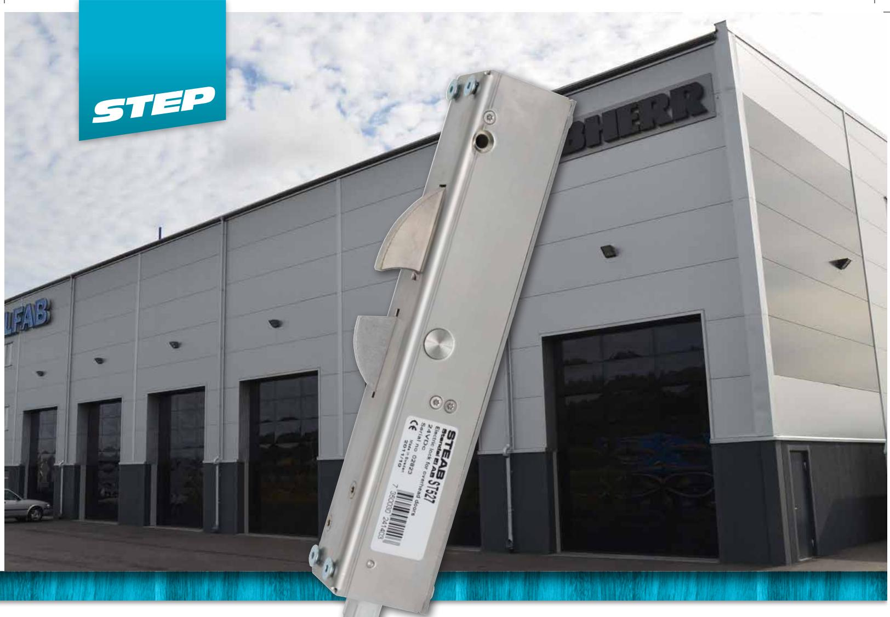
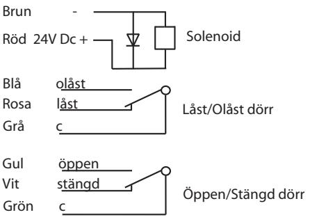
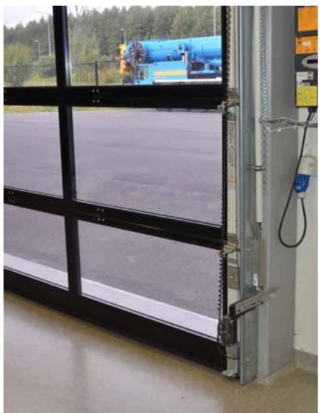
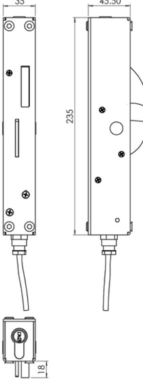

# Ellås för industriportar

Kompakt ellås för industriportar

STEP 50 är ett högkvalitativt ellås för industriportar. De elektriskt låsta portarna styrs bekvämt och säkert via ex. passersystem.

### Driftsäkerhet

Låset är speciellt utvecklat för den svåra miljö och tuffa behandling som ofta råder i samband med industriportar.

 STEP 50 är konstruerad för att kunna öppnas även då porten pressas uppåt av exempelvis gummitätningen eller snö. Låset kan öppnas elektriskt eller med nyckel trots att porten pressas uppåt med en kraft av 5kN.

#### Säkerhet

STEP 50 står emot krafter på 10 000 N

 STEP 50 använder ingen spänning vid låsningen, utan öppnas endast med spänning som kan brytas direkt då porten lämnar sitt stängda läge. Portens status låst/upplåst och öppen/stängd avkänns med två microbrytare i STEP 50 som vid koppling till larmanläggning ger larm om porten tvångsvis öppnas.

## Tekniska data

| Strömförbrukning  |  |
|-------------------|--|
| Rättvänd funktion |  |
| 24 VDC ± 10%      |  |
| 313mA olåst       |  |

#### Låsvinkel & infällningskasset beställes separat

| Artikel nr | Beskrivning                                                   |
|------------|---------------------------------------------------------------|
| ST527      | Elektriskt lås för takskjutportar inkl. 5m kabel              |
| ST527-1    | Låsvinkel avsedd för port i vertikal/höglyftsutförande        |
| ST527-2    | Låsvinkel avsedd för normal/höglyftsport                      |
| ST527-3    | Eurocylinder ink.2st nycklar                                  |
| ST527-5    | Infällningskassett avsedd för montage med ST527-2             |
| ST527-7    | Låssläde avsedd för ett enkelt montage av normal/låglyftsport |
|            |                                                               |

• Mikrobrytare enpoligt växlande

- Max. 30V Dc, 1 A
- Inbyggd indikering för avkänning att porten är stängd/öppen(kolv kontakt) och låst/olåst (spärrkontakt) för koppling till passersystem, larmanläggning etc.
- Brythållfasthet 10 kN (1000 kg) • Garanterar öppning trots listtryck på 5kN (500Kg)
- Inbyggt transientskydd
- Material: Låshus i rostfritt stål, Låshake i härdat stål.

