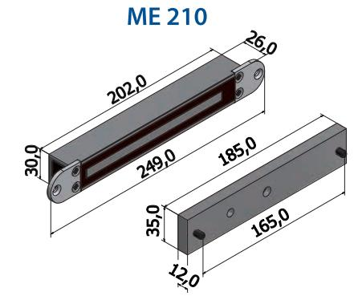
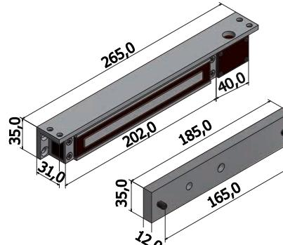
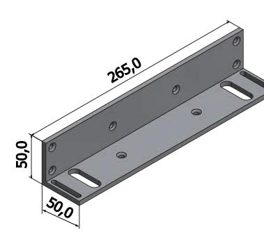
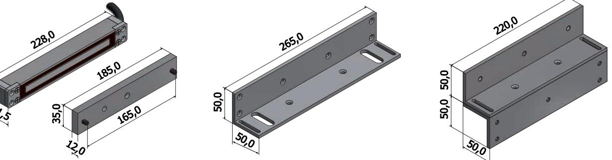
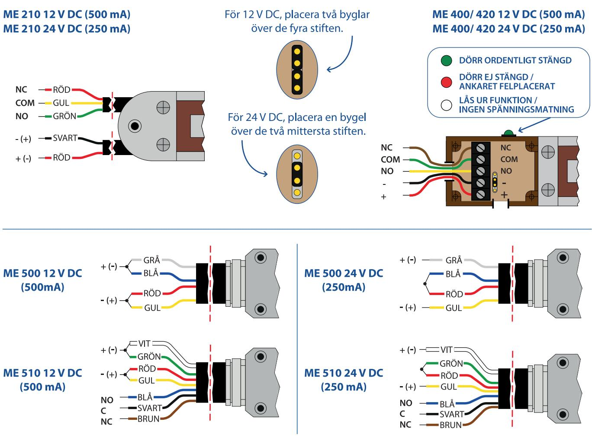
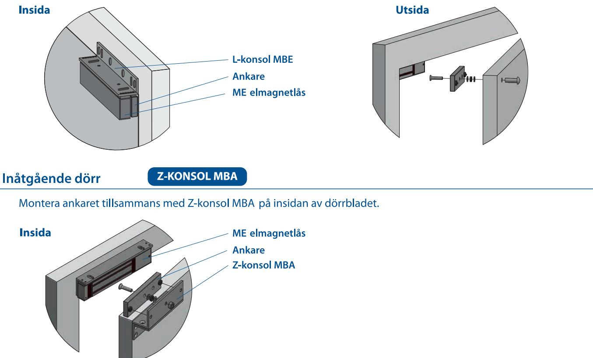

## Elmagnetlås ME-serie

Elmagnetlås i ME-serien kan med sina kompakta mått enkelt installeras i dörrkarmen tillsammans med fästkonsol MBE eller MBA .

L-konsol (MBE), används för att fästa elmagnetlåset vid utåtgående dörr.

Z-konsol (MBA) ,används för att fästa ankaret vid inåtgående dörr.

ME 500/ 510, är vattenskyddat enligt IP65 och lämpar sig väl för utomhusbruk.

| Elmag.lås   | Information  |              |         | Fästkonsoler |             |              |
|-------------|--------------|--------------|---------|--------------|-------------|--------------|
| Artikel nr. | Spänning     | Mikrobrytare | Lysdiod | Hållkraft    | Utåtg. dörr | Inåtg. dörr  |
| ME 210      | 12/24 V DC * | Ja           | Nej     | ca. 280 kg   |             |              |
| ME 400      | 12/24 V DC * | Nej          | Nej     | ca. 280 kg   | MBE 806     | MBA 801/ 802 |
| ME 420      | 12/24 V DC * | a            | Ja      | ca. 280 kq   | MBE 806     | MBA 801/ 802 |
| ME 500      | 12/24 V DC * | Nej          | Nej     | ca. 250 kg   | MBE 806     | MBA 801/ 802 |
| ME 510      | 12/24 V DC * | Ja           | Nej     | ca. 250 kg   | MBE 806     | MBA 801/ 802 |

* Ställs in manuellt.

ME 400/ 420

ME 500/ 510

MBE 806

MBE 806

MBA 801/ 802

MBA 801/ 802

2009

50,0

50,0

50,0

www.robust-se.com

## Monteringsanvisning ME-serie

Utåtgående dörr

L-KONSOL MBE

Vid utåtgående dörr monteras elmagnetlåset i dörrkarmen med L-konsol MBE. Ankaret skruvas direkt på dörrbladet. För bästa funktion och hållkraft med magneten måste ankaret vara lite rörligt.

www.robust-se.com