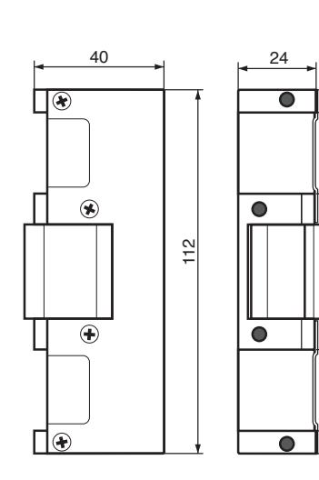
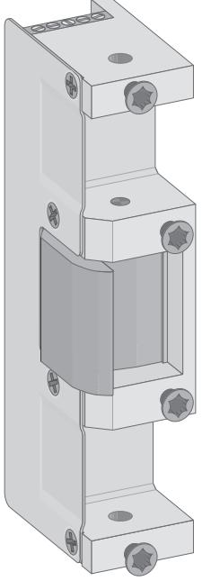
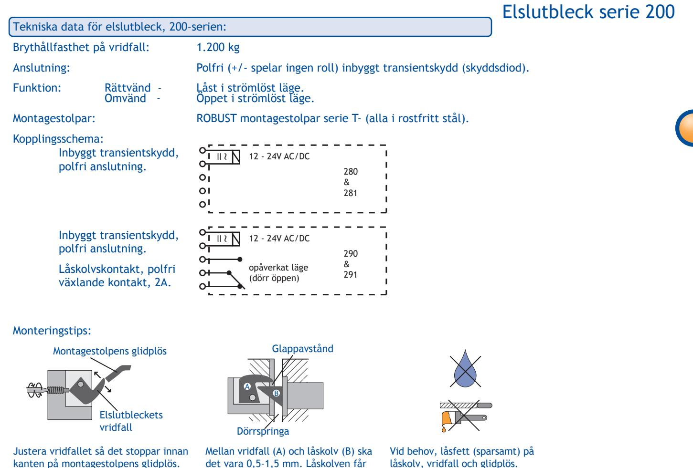

## Elslutbleck serie 200

## Elslutbleck 200-serien.

Elslutbleck för fallås som passar dörrar med normala/höga säkerhetskrav. T.ex. daglås i skalskydd och intern låsning i bostadsfastighet, kontor och industri eller i entreér m.m. Brythållfasthet på minst 1.200 kg. Med en avancerad ytbehandling av vridfallet har vi minskat friktionen och ökat slitstyrkan. Multispänning 12-24V AC/DC, polfri anslutning och inbyggt transientskydd (skyddsdiod). Startström och strömförbrukning har reducerats kraftigt med nyutvecklad elektronik. Tillsammans med dubbelfallås uppfylls BoVerkets byggregler för brandklassade dörrar.

Passar ihop med montagestolpar serie T-.

- Rättvänd funktion, 280 & 290 (låst strömlöst)
- Omvänd funktion, 281 & 291 (öppet strömlöst)
- Brythållfasthet, minst 1.200 kg
- Multispänning 12-24V AC/DC (+/- 10 %)
- Inbyggt transientskydd (skyddsdiod)
- Polfri anslutning
- För brandklassade dörrar tillsammans med dubbelfallås
- Kraftigt reducerad startström
- Låg strömförbrukning
- Nedox-ytbehandling av vrifdfall för minskad friktion

| Modell | Funktion                    | Spänning     | Strömförbrukning |
|--------|-----------------------------|--------------|------------------|
| 280    | rättvänd                    | 12-24V AC/DC | 110 - 70 mA      |
| 281    | omvänd                      | 12-24V AC/DC | 110 - 70 mA      |
| 290    | rättvänd m. låskolvskontakt | 12-24V AC/DC | 110 - 70 mA      |
| 291    | omvänd m. låskolvskontakt   | 12-24V AC/DC | 110 - 70 mA      |

29

9,5

25

7

9,5

25

7

kanten på montagestolpens glidplös. Låskolven ska glida av vridfallet och ner på montagestolpens glidplös.

det vara 0,5-1,5 mm. Låskolven får inte spänna mot vridfallet. Dörrspringan skall vara 2-5 mm.

låskolv, vridfall och glidplös. Borr- och filspån är skadligt. Elslutblecket är inte vattentätt.