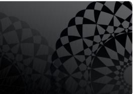
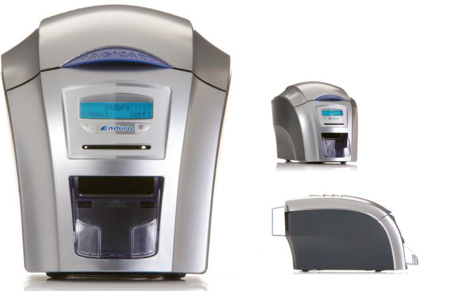
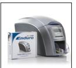
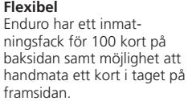
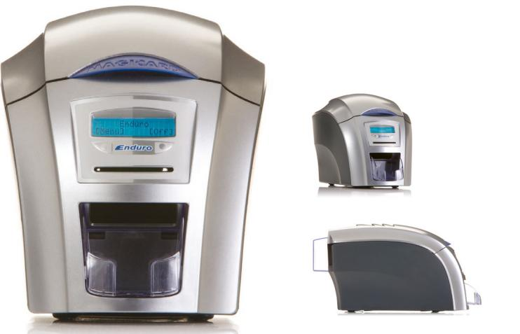
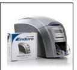
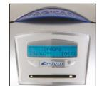
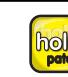
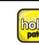

# **Enduro ID Printer**

# – Enkel- till dubbelsidig uppgraderingsbar plastkortsskrivare

# **Enduro ID Printer är en enkelsidig 4-färgsskrivare med ReWrite funktion och med möjlighet till uppgradering för dubbelsidig utskrift. Skrivaren erbjuder den patenterade HoloKote® teknologin som gör det möjligt för dig att skriva ut en säkerhetsmärkning över kortets yta.**

# **Enkel- eller dubbelsidig utskrift**

Med ett uppgraderingskit kan Enduro enkelt uppgraderas från enkel- till dubbelsidig utskrift. Enduro Duo är dubbelsidig från början. Skrivaren är utrustad med ett inmatningsfack för 100 kort på baksidan och man kan även handmata ett kort i taget på framsidan.

# **Lättanvänd med HoloKote® säkerhetsmärkning**

Enduro har den patenterade HoloKote® säkerhetsmärkningen som skrivs på kortet under den vanliga utskriftsprocessen. Enduro har en tilltalande, kompakt design och en färgstark LCD display med lätta knappmenyval.

# **VIKTIGA FAKTA**

# **Enduro ID Printer**

- • Enkel- till dubbelsidig (uppgraderingsbar)
- • ReWrite funktion
- • Möjlighet till HoloKote® säkerhetsmärkning
- • Möjlighet till RFID- och magnetkodning
- • Tilltalande och kompakt design
- • Färgstark LCD display
- • Inmatningsfack för 100 kort, utmatningsfack för 30
- • Utskriftstid fullfärg 35 sekunder
- • 3 års garanti med underhållsavtal

# **FÖRDELAR**

### **Uppgraderingsbar** Enduro kan enkelt uppgraderas från enkel- till dubbelsidig utskrift.

**Smart** Färgstark LCD display med lätta knappmenyval.

# **FUNKTIONER**

# **Enkel/dubbelsidig**

Enduro är en enkelsidig skrivare som enkelt kan uppgraderas till dubbelsidig i efterhand. Enduro Duo är förkonfigurerad som en dubbelsidig skrivare.

# **Utskriftsmöjligheter**

Både färg- och monokrom utskrift.

# **Visuell säkerhet**

Om du har krav på säkra ID-kort har du möjlighet att skriva ut en HoloKote® säkerhetsmärkning över kortets yta som ger ett visuellt och svårkopierat skydd. HoloPatch®-kort ger en extra säkerhetsnivå genom att man använder en starkt reflekterande guldfyrkant i folie som ökar synligheten av HoloKote® säkerhetsmärkning.

# **Garanti**

2 års garanti för material och fabrikationsfel på skrivaren. Med PAS Card underhållsavtal får du 3 års garanti samt besiktning av skrivaren med jämna intervall för att säkerställa funktion och prestanda.

# **Kommunikationsgränssnitt** USB ver 1.1 (USB 2.0 kompatibel).

# **Drivrutiner**

Windows 2000 Professional (SP4), XP, Vista & Win 7 (32/64 bit kompatibel), Server 2003 R2 SP2, 2008 (32/64 bit kompatibel).

## **Kortkapacitet**

100-kortsinmatning, 30-kortsutmatning.

**Vikt**  5,5 kg.

# **Strömförsörjning**  Extern kraftförsörjning 100-240V 50-60Hz.

# **Dimensioner**

453 mm L x 206 mm W x 233 mm H (17.8" L 8-1" W9.2" H) inklusive behållare.

# **Miljö**

Skyddad kontorsmiljö från 10°C till 30°C.

# **Utskriftshastighet**

35 sekunder för enkelsidig färgutskrift, 7 sekunder för monokromutskrift.

# **Enduro ID Printer**

# – Enkel- till dubbelsidig uppgraderingsbar plastkortsskrivare

# **Enduro ID Printer är en enkelsidig 4-färgsskrivare med ReWrite funktion och med möjlighet till uppgradering för dubbelsidig utskrift. Skrivaren erbjuder den patenterade HoloKote® teknologin som gör det möjligt för dig att skriva ut en säkerhetsmärkning över kortets yta.**

# **Enkel- eller dubbelsidig utskrift**

Med ett uppgraderingskit kan Enduro enkelt uppgraderas från enkel- till dubbelsidig utskrift. Enduro Duo är dubbelsidig från början. Skrivaren är utrustad med ett inmatningsfack för 100 kort på baksidan och man kan även handmata ett kort i taget på framsidan.

# **Lättanvänd med HoloKote® säkerhetsmärkning**

Enduro har den patenterade HoloKote® säkerhetsmärkningen som skrivs på kortet under den vanliga utskriftsprocessen. Enduro har en tilltalande, kompakt design och en färgstark LCD display med lätta knappmenyval.

# **VIKTIGA FAKTA**

# **Enduro ID Printer**

- • Enkel- till dubbelsidig (uppgraderingsbar)
- • ReWrite funktion
- • Möjlighet till HoloKote® säkerhetsmärkning
- • Möjlighet till RFID- och magnetkodning
- • Tilltalande och kompakt design
- • Färgstark LCD display
- • Inmatningsfack för 100 kort, utmatningsfack för 30
- • Utskriftstid fullfärg 35 sekunder
- • 3 års garanti med underhållsavtal

# **FÖRDELAR**

## **Uppgraderingsbar** Enduro kan enkelt uppgraderas från enkel- till dubbelsidig utskrift.

## **Flexibel** Enduro har ett inmatningsfack för 100 kort på baksidan samt möjlighet att handmata ett kort i taget på framsidan.

# **Smart** Färgstark LCD display med

# lätta knappmenyval.

# **FUNKTIONER**

# **Enkel/dubbelsidig**

Enduro är en enkelsidig skrivare som enkelt kan uppgraderas till dubbelsidig i efterhand. Enduro Duo är förkonfigurerad som en dubbelsidig skrivare.

# **Utskriftsmöjligheter**

Både färg- och monokrom utskrift.

# **Visuell säkerhet**

Om du har krav på säkra ID-kort har du möjlighet att skriva ut en HoloKote® säkerhetsmärkning över kortets yta som ger ett visuellt och svårkopierat skydd. HoloPatch®-kort ger en extra säkerhetsnivå genom att man använder en starkt reflekterande guldfyrkant i folie som ökar synligheten av HoloKote® säkerhetsmärkning.

# **Garanti**

2 års garanti för material och fabrikationsfel på skrivaren. Med PAS Card underhållsavtal får du 3 års garanti samt besiktning av skrivaren med jämna intervall för att säkerställa funktion och prestanda.

# **Kommunikationsgränssnitt** USB ver 1.1 (USB 2.0 kompatibel).

# **Drivrutiner**

Windows 2000 Professional (SP4), XP, Vista & Win 7 (32/64 bit kompatibel), Server 2003 R2 SP2, 2008 (32/64 bit kompatibel).

# **Kortkapacitet**

100-kortsinmatning, 30-kortsutmatning.

**Vikt**  5,5 kg.

# **Strömförsörjning**  Extern kraftförsörjning 100-240V 50-60Hz.

# **Dimensioner**

453 mm L x 206 mm W x 233 mm H (17.8" L 8-1" W9.2" H) inklusive behållare.

# **Miljö**

Skyddad kontorsmiljö från 10°C till 30°C.

# **Utskriftshastighet**

35 sekunder för enkelsidig färgutskrift, 7 sekunder för monokromutskrift.

# **HoloKote®***

HoloKote® – är en teknologi som gör det möjligt att skriva ut en unik säkerhetsmärkning på kortets yta. Genom att applicera HoloKote® till dina ID-kort höjer du säkerheten på ID-korten och försvårar för eventuella förfalskare genom att lägga till en dimension av säkerhet som är synlig, svår att kopiera, samt ger ett elegant intryck.

# **HoloPatch®****

HoloPatch®-kort ger en ytterligare säkerhetsnivå genom att man använder en starkt reflekterande guldfyrkant i folie som ökar synligheten av HoloKote® säkerhetsmönster.

**Rewritable (omskrivningsbar)** Omskrivningsbara kort har en glansig sida i PVC för utskrift i färg/monokrom och en matt, omskrivningsbar (ReWrite) sida med blått eller svart thermo cromic

# material som kan skrivas om på, upp till 500 gånger.

**Magnetkodning** Magnetkodning för spår 1, 2 och 3.

# **Smartcard/RFID kodning**

Kontaktchips- och RFID kodning (Mifare, Desfire, iClass).

(*,** Se PAS Cards broschyr för HoloKote® och HoloPatch® för mer information)

|  | SKRIVARE & TILLBEHÖR |  |
|--|----------------------|--|
|  |                      |  |

| Skrivare                                                                                       | Pris återförsäljare | Art. nr        |  |
|------------------------------------------------------------------------------------------------|---------------------|----------------|--|
| Enduro ID Card Printer- single-sided                                                           | 10 850 kr           | MC3633-0001    |  |
| Enduro ID Card Printer- single-sided with Magnetic Stripe Card Encoder                      | 13 550 kr           | MC3633-0002    |  |
| Enduro Duo ID Card Printer- double-sided                                                       | 13 550 kr           | MC3633-0021    |  |
| Enduro Duo ID Card Printer- double-sided with Magnetic Stripe Card Encoder                  | 14 925 kr           | MC3633-0022    |  |
| Enduro ID Card Printer- single-sided with Smart Card Encoder                                   | 15 116 kr           | MC3633-0005    |  |
| Enduro ID Card Printer- double-sided with Smart Card Encoder                                   | 17 240 kr           | MC3633-0025    |  |
| Enduro ID Card Printer- single-sided with Magnetic Stripe Card Encoder & Smart Card Encoder | 17 240 kr           | MC3633-0006    |  |
| Enduro ID Card Printer- double-sided with Magnetic Stripe Card Encoder & Smart Card Encoder | 19 365 kr           | MC3633-0026    |  |
| Double-sided Upgrade Kit (Rio Pro or Enduro)                                                   | 2 990 kr            | MC3633-0052    |  |
| Tillbehör                                                                                      |                     |                |  |
| Enduro Starter Pack                                                                            | 1 396 kr            | MC3633-0060    |  |
| Rio Pro & Enduro Cleaning kit (10 cards, 1 pen)                                                | 263 kr              | MC3633-0053    |  |
| Rio Pro & Enduro Cleaning Rollers Kit (5 sleeves, 1 roller bar)                                | 180 kr              | MC3633-0054    |  |
| Enduro Printhead Assembly                                                                      | 3 208 kr            | MCFG/3633-0160 |  |

| SÄKERHETSALTERNATIV, FÄRGBAND & KORT                                                 |                     |                   |  |  |
|--------------------------------------------------------------------------------------|---------------------|-------------------|--|--|
| Säkerhetsalternativ                                                                  | Pris återförsäljare | Art. nr           |  |  |
| Custom Holokote® Flex Kit (Set-up Supply) with locking                               | 4 309 kr            | MCHOLOFLEXSETL    |  |  |
| Custom Holokote® Kit (Set-up & Supply) with locking                                  | 3 121 kr            | MCHOLOSETL        |  |  |
| Färgband                                                                             |                     |                   |  |  |
| Colour ribbon (YMCKO) 300 images                                                     | 775 kr              | MCMA300YMCKO      |  |  |
| Colour ribbon (YMCKO) 100 images                                                     | 292 kr              | MCMA100YMCKO      |  |  |
| Colour front, black resin back ribbon (YMCKOK) 250 double-sided image             | 775 kr              | MCMA250YMCKOK     |  |  |
| Black resin and overcoat ribbon (KO) 600 images                                      | 458 kr              | MCMA600KO         |  |  |
| Monochrome resin ribbon 1000 images, Black, no overcoat                              | 174 kr              | MCMA1000K-BLACK   |  |  |
| Monochrome resin ribbon 1000 images, Silver, no overcoat                             | 422 kr              | MCMA1000K-SILVER  |  |  |
| Monochrome resin ribbon 1000 images, Gold, no overcoat                               | 422 kr              | MCMA1000K-GOLD    |  |  |
| Monochrome resin ribbon 1000 images, White, no overcoat                              | 174 kr              | MCMA1000K-WHITE   |  |  |
| Monochrome resin ribbon 1000 images, Green, no overcoat                              | 174 kr              | MCMA1000K-GREEN   |  |  |
| Monochrome resin ribbon 1000 images, Blue, no overcoat                               | 174 kr              | MCMA1000K-BLUE    |  |  |
| Monochrome resin ribbon 1000 images, Red, no overcoat                                | 174 kr              | MCMA1000K-RED     |  |  |
| Monochrome resin ribbon 1000 images, Grey Scratch-Off, no overcoat (MOQ 50 rolls) | 293 kr              | MCMA1000K-SCRATCH |  |  |
| Kort                                                                                 |                     |                   |  |  |
| Pack of 100 Rewritable card front & PVC back blue                                    | 1 214 kr            | MCE9323           |  |  |
| 500 HiCo Magnetic Stripe Holopatch PVC cards                                         | 1 666 kr            | MCM9006-797       |  |  |
| 500 Self Adhesive Cards                                                              | 1 111 kr            | MCM9007-011       |  |  |
| 500 Gold Holopatch PVC cards                                                         | 938 kr              | MCM9006-796       |  |  |

# **SÄKERHETSALTERNATIV**

# **HoloKote®***

HoloKote® – är en teknologi som gör det möjligt att skriva ut en unik säkerhetsmärkning på kortets yta. Genom att applicera HoloKote® till dina ID-kort höjer du säkerheten på ID-korten och försvårar för eventuella förfalskare genom att lägga till en dimension av säkerhet som är synlig, svår att kopiera, samt ger ett elegant intryck.

# **HoloPatch®****

HoloPatch®-kort ger en ytterligare säkerhetsnivå genom att man använder en starkt reflekterande guldfyrkant i folie som ökar synligheten av HoloKote® säkerhetsmönster.

**Rewritable (omskrivningsbar)** Omskrivningsbara kort har en glansig sida i PVC för utskrift i färg/monokrom och en matt, omskrivningsbar (ReWrite) sida med blått eller svart thermo cromic

# material som kan skrivas om på, upp till 500 gånger.

**Magnetkodning** Magnetkodning för spår 1, 2 och 3.

# **Smartcard/RFID kodning**

Kontaktchips- och RFID kodning (Mifare,

Desfire, iClass). (*,** Se PAS Cards broschyr för HoloKo-

te® och HoloPatch® för mer information)

| SKRIVARE & TILLBEHÖR                                                                           |                     |                |
|------------------------------------------------------------------------------------------------|---------------------|----------------|
| Skrivare                                                                                       | Pris återförsäljare | Art. nr        |
| Enduro ID Card Printer- single-sided                                                           | 10 850 kr           | MC3633-0001    |
| Enduro ID Card Printer- single-sided with Magnetic Stripe Card Encoder                      | 13 550 kr           | MC3633-0002    |
| Enduro Duo ID Card Printer- double-sided                                                       | 13 550 kr           | MC3633-0021    |
| Enduro Duo ID Card Printer- double-sided with Magnetic Stripe Card Encoder                  | 14 925 kr           | MC3633-0022    |
| Enduro ID Card Printer- single-sided with Smart Card Encoder                                   | 15 116 kr           | MC3633-0005    |
| Enduro ID Card Printer- double-sided with Smart Card Encoder                                   | 17 240 kr           | MC3633-0025    |
| Enduro ID Card Printer- single-sided with Magnetic Stripe Card Encoder & Smart Card Encoder | 17 240 kr           | MC3633-0006    |
| Enduro ID Card Printer- double-sided with Magnetic Stripe Card Encoder & Smart Card Encoder | 19 365 kr           | MC3633-0026    |
| Double-sided Upgrade Kit (Rio Pro or Enduro)                                                   | 2 990 kr            | MC3633-0052    |
| Tillbehör                                                                                      |                     |                |
| Enduro Starter Pack                                                                            | 1 396 kr            | MC3633-0060    |
| Rio Pro & Enduro Cleaning kit (10 cards, 1 pen)                                                | 263 kr              | MC3633-0053    |
| Rio Pro & Enduro Cleaning Rollers Kit (5 sleeves, 1 roller bar)                                | 180 kr              | MC3633-0054    |
| Enduro Printhead Assembly                                                                      | 3 208 kr            | MCFG/3633-0160 |

| SÄKERHETSALTERNATIV, FÄRGBAND & KORT                                                 |                     |                   |  |  |
|--------------------------------------------------------------------------------------|---------------------|-------------------|--|--|
| Säkerhetsalternativ                                                                  | Pris återförsäljare | Art. nr           |  |  |
| Custom Holokote® Flex Kit (Set-up Supply) with locking                               | 4 309 kr            | MCHOLOFLEXSETL    |  |  |
| Custom Holokote® Kit (Set-up & Supply) with locking                                  | 3 121 kr            | MCHOLOSETL        |  |  |
| Färgband                                                                             |                     |                   |  |  |
| Colour ribbon (YMCKO) 300 images                                                     | 775 kr              | MCMA300YMCKO      |  |  |
| Colour ribbon (YMCKO) 100 images                                                     | 292 kr              | MCMA100YMCKO      |  |  |
| Colour front, black resin back ribbon (YMCKOK) 250 double-sided image             | 775 kr              | MCMA250YMCKOK     |  |  |
| Black resin and overcoat ribbon (KO) 600 images                                      | 458 kr              | MCMA600KO         |  |  |
| Monochrome resin ribbon 1000 images, Black, no overcoat                              | 174 kr              | MCMA1000K-BLACK   |  |  |
| Monochrome resin ribbon 1000 images, Silver, no overcoat                             | 422 kr              | MCMA1000K-SILVER  |  |  |
| Monochrome resin ribbon 1000 images, Gold, no overcoat                               | 422 kr              | MCMA1000K-GOLD    |  |  |
| Monochrome resin ribbon 1000 images, White, no overcoat                              | 174 kr              | MCMA1000K-WHITE   |  |  |
| Monochrome resin ribbon 1000 images, Green, no overcoat                              | 174 kr              | MCMA1000K-GREEN   |  |  |
| Monochrome resin ribbon 1000 images, Blue, no overcoat                               | 174 kr              | MCMA1000K-BLUE    |  |  |
| Monochrome resin ribbon 1000 images, Red, no overcoat                                | 174 kr              | MCMA1000K-RED     |  |  |
| Monochrome resin ribbon 1000 images, Grey Scratch-Off, no overcoat (MOQ 50 rolls) | 293 kr              | MCMA1000K-SCRATCH |  |  |
| Kort                                                                                 |                     |                   |  |  |
| Pack of 100 Rewritable card front & PVC back blue                                    | 1 214 kr            | MCE9323           |  |  |
| 500 HiCo Magnetic Stripe Holopatch PVC cards                                         | 1 666 kr            | MCM9006-797       |  |  |
| 500 Self Adhesive Cards                                                              | 1 111 kr            | MCM9007-011       |  |  |
| 500 Gold Holopatch PVC cards                                                         | 938 kr              | MCM9006-796       |  |  |