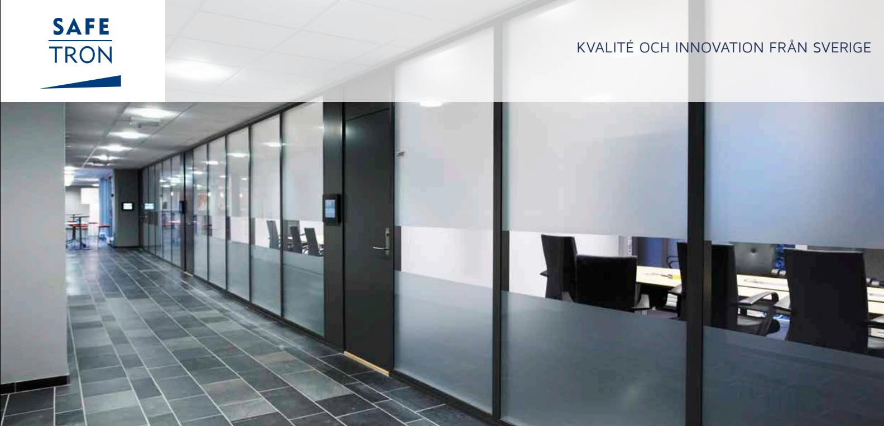
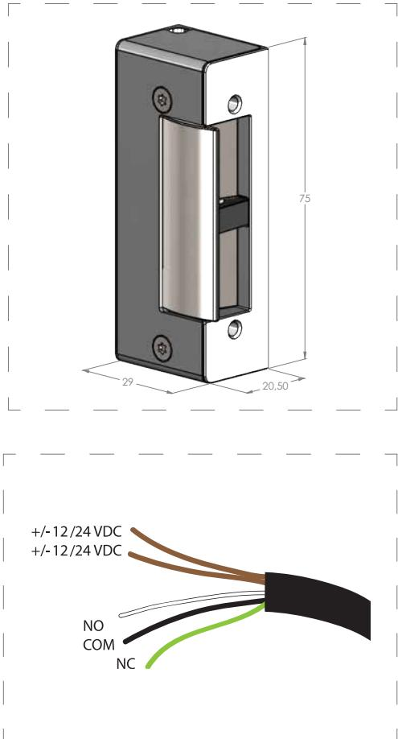

## E L S LU T B L E C K ES 10

# Enkelt elslutbleck med listtrycksteknik

Safetron ES 10 är ett enkelt elslutbleck anpassat för dörrar där inga högre säkerhetskrav ställs. Exempel på användningsområden är entrédörrar i flerbostadshus, industrier och liknande.

### Listtrycksteknik

Safetron ES 10 har också listtrycksteknik vilket innebär att låset öppnar trots att tryck mot dörren föreligger. Listtryck är ett normalt förekommande fenomen ofta orsakat av exempelvis övertryck i fastigheten, skeva dörrar eller att snö/grus hamnat i dörrspringan. ES 10 eliminerar dessa problem och förhindrar onödiga driftstopp.

### Anpassat för eftermarknaden

Infästningen för montagestolpe är identisk med ASSA/SOLID 14 elslutbleck vilket innebär att dessa kan återanvändas vid utbyte.

### Kolvkontakt och skyddsdiod

ES 10 har kolvkontakt som tillval och skyddsdiod följer alltid med vid köp.

Svensktillverkat.

## E L S LU T B L E C K ES 10

### EGENSKAPER

- Klarar 10 kg listtryck
- Hållkraft: 400 kg
- Omvänd- eller rättvänd funktion
- 12VDC eller 24VDC
- Passar låshus enligt skandinavisk standard med enkel eller dubbelfallås.

### TEKNISKA DATA

- 12VDC eller 24VDC (+/- 10%)
- Strömförbrukning:
	- 12VDC: 300mA / 24VDC: 150mA
- Mikrobrytare: 30VDC: 2A
- 120VAC: 3A

### MONTAGESTOLPAR

- Stolpar anpassade för ASSA/SOLID 14 används med detta elslutbleck

| BENÄMNING                                                                                                                                                                         | ART NR                                   |
|-----------------------------------------------------------------------------------------------------------------------------------------------------------------------------------|------------------------------------------|
| ES 10 (12VDC, rättvänd) ES 10 (24VDC, rättvänd) ES 10 (12VDC, omvänd)                                                                                                       | 202 144 202 144 202 144            |
| ES 10 (24VDC, omvänd) ES 10 (12VDC, rättvänd, kolvkontakt) ES 10 (24VDC, rättvänd, kolvkontakt) ES 10 (12VDC, omvänd, kolvkontakt) ES 10 (24VDC, omvänd, kolvkontakt) | 202 144 202 144 202 144 202 144 |
|                                                                                                                                                                                   |                                          |

#### **SAFETRON AB**

Säterivägen 18 P.O. Box 2096 65002 Karlstad Sweden

Tel: +46 54 19 02 45 Email: info@safetron.com

Du hittar alltid det senaste på safetron.com