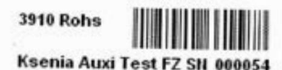
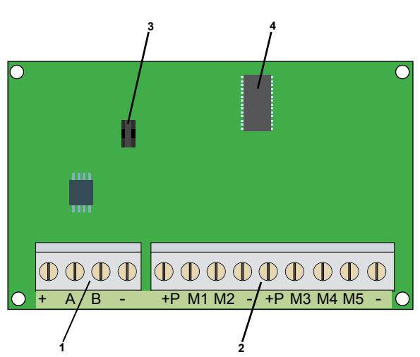

# **Expansionsmodul auxi -12157**

Installationsanvisning

### **Introduktion**

**auxi** är ett expansionskort som ökar antalet in- eller utgångar hos larmsändaren **gemino** eller centralapparaten **lares**.

**auxi** ansluts till **gemino** eller **lares** via den fyrtrådiga bussledningen KS-BUS. Den har fem plintar som individuellt kan programmeras som ingångar med ett programmerbart ändmotstånd eller som transistorutgångar (500 mA). Vid användning i **lares** kan en av de fem plintarna (M1) programmeras som analog ingång 0 - 10 VDC och en (M5) som analog utgång 0 - 10 VDC.

**auxi** har ett fast minne för plintarnas programmering och som är begränsat till 1000 omprogrammeringar för att en korrekt funktion ska kunna garanteras. Programmeringen av plintfunktionen (in- eller utgång) sker vid programmeringen av **gemino** eller **lares**.

Det är mycket enkelt att anpassa **auxi** till systemet, inga dipomkopplare behöver ställas in. **auxi** anpassar sig automatiskt till **gemino** och **lares** och identifierar sig med det unika serienummer som finns tryckt på en etikett på kretskortet.

Alla Ksenias kapslingar har hål för montering av expansionskortet **auxi**.

## **Serienummeretikett**

På kretskortet sitter en etikett med det unika sexsiffriga serienumret som identifierar enheten när flera expansionsmoduler ansluts i samma system.

Ovan visas ett exempel på en etikett med serienummer.

- 1. Anslutning för KS-bussledning.
- 2. Anslutningsplintar, in eller utgångar.
- 3. Anslutning av sabotagebrytare.
- 4. Mikroprocessor.

## **Plintar**

- **+, A, B, :** Plintar för anslutning till bussledningen **KS-BUSS.**
- **+P:** Plint för anslutning av strömförsörjning, skyddad av en 1,5 A självåterställande säkring.
- **(minus)**: Jordplint, gemensam minus.
- **M1**: Programmerbar transistor-in- eller utgång. I **lares** kan den programmeras som analog ingång, 0 - 10 V.
- **M2,M3,M4**:Programmerbara transistor-in- eller utgångar.
- **M5:** Programmerbar transistor-in- eller utgång. I **lares** kan den programmeras som analog utgång, 0 - 10 V, 20 mA.

### **Teknisk specifikation**

| Spänning:         | 13,8 VDC.                                                                                      |
|-------------------|------------------------------------------------------------------------------------------------|
| Strömförbrukning: | 20 mA (utom plint P och utgångar).                                                             |
| Ingångar.         | En analog ingång 0 - 10 VDC. Upp till fem ingångar med programmer bara ändmotstånd.      |
| Utgångar.         | En analog utgång 0 - 10 VDC, 20 mA. Upp till fem transistorutgångar, max 500 mA vardera. |
| Strömmatning:     | 1,5 A automatisk termosäkring.                                                                 |
| Kretskortsmått:   | 75 × 60 × 15 mm.                                                                               |