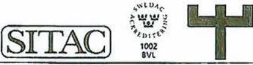
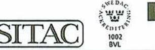
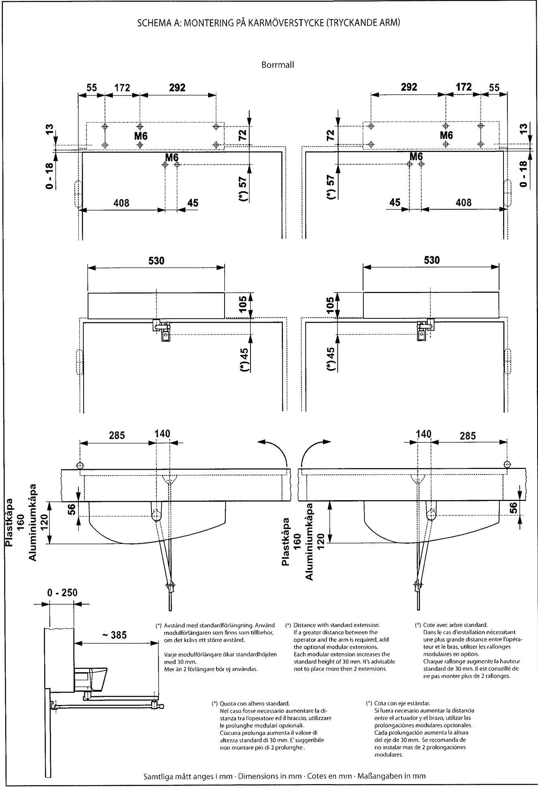
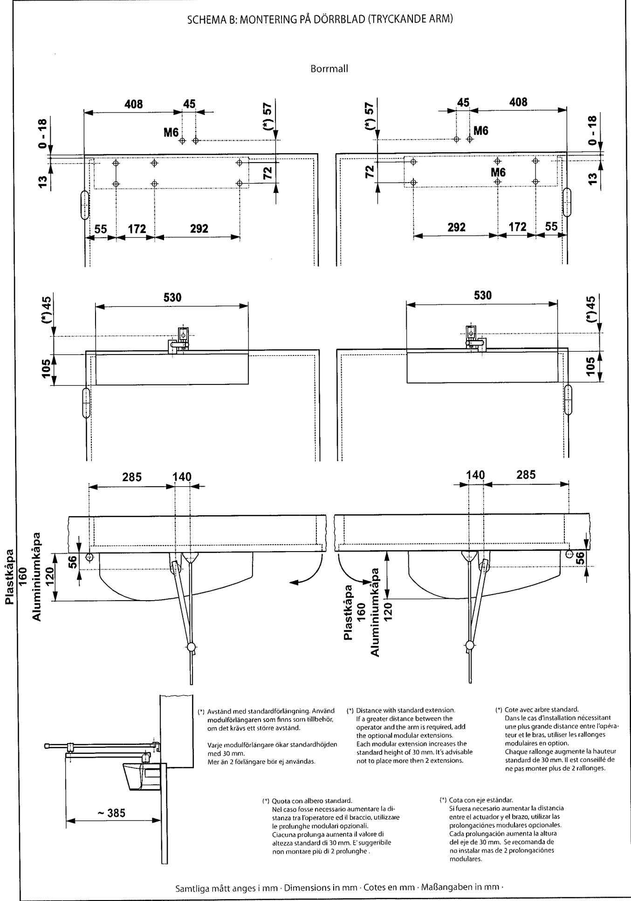
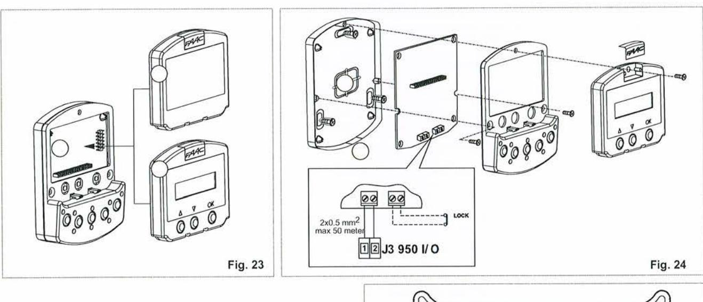
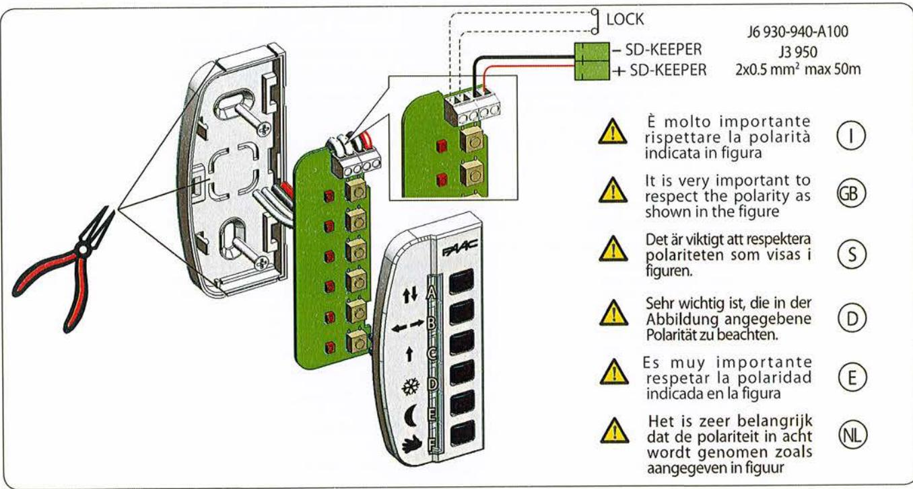
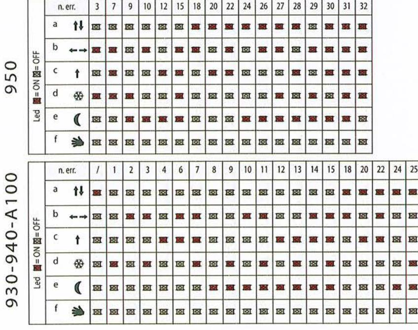
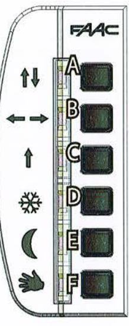
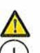

Faac Nordic AB Fabriksvägen 8 564 35 Bankeryd Tel: 036 376860 Fax: 036 370780 www.faac.se

| CE DECLARATION OF CONFORMITY FOR MACHINES |                                                                                                                                                                                                                                                              |  |  |  |
|-------------------------------------------|--------------------------------------------------------------------------------------------------------------------------------------------------------------------------------------------------------------------------------------------------------------|--|--|--|
|                                           | (DIRECTIVE 2006/42/EC)                                                                                                                                                                                                                                       |  |  |  |
|                                           |                                                                                                                                                                                                                                                              |  |  |  |
|                                           | Manufacturer: FAAC S.p.A.                                                                                                                                                                                                                                    |  |  |  |
| Address:                                  | Via Calari, 10 40069 - Zola Predosa BOLOGNA-ITALY                                                                                                                                                                                                      |  |  |  |
|                                           | Declares that:  950 BM automated system,                                                                                                                                                                                                                     |  |  |  |
|                                           | • is built to be integrated into a machine or to be assembled with other machinery to create amachine under the provisions of Directive 2006/42/EC;                                                                                                       |  |  |  |
|                                           | · conforms to the essential safety requirements of the following EEC directives:                                                                                                                                                                             |  |  |  |
|                                           | 2006/95/EC Low Voltage directive. 2004/108/EC Electromagnetic Compatibility directive                                                                                                                                                                     |  |  |  |
|                                           | and also declares that the machinery must not be put into service until the machine in which it will be integrated or of which it will become a component has been identified and declared as conforming to the provisions of Directive 2006/42/EC. |  |  |  |
| Bologna, 22-03-2011                       |                                                                                                                                                                                                                                                              |  |  |  |
|                                           | The Managing Director A.Marcellan                                                                                                                                                                                                                      |  |  |  |

| CE DECLARATION OF CONFORMITY FOR MACHINES |                                                                                                                                                                                                                                                              |  |  |
|-------------------------------------------|--------------------------------------------------------------------------------------------------------------------------------------------------------------------------------------------------------------------------------------------------------------|--|--|
| (DIRECTIVE 2006/42/EC)                    |                                                                                                                                                                                                                                                              |  |  |
|                                           |                                                                                                                                                                                                                                                              |  |  |
|                                           | Manufacturer: FAAC S.p.A.                                                                                                                                                                                                                                    |  |  |
| Address:                                  | Via Calari, 10 40069 - Zola Predosa BOLOGNA-ITALY                                                                                                                                                                                                      |  |  |
|                                           | Declares that: 950 BSM automated system,                                                                                                                                                                                                                     |  |  |
|                                           | • is built to be integrated into a machine or to be assembled with other machinery to create a machine under the provisions of Directive 2006/42/EC;                                                                                                      |  |  |
|                                           | · conforms to the essential safety requirements of the following EEC directives:                                                                                                                                                                             |  |  |
|                                           | 2006/95/EC Low Voltage directive. 2004/108/EC Electromagnetic Compatibility directive                                                                                                                                                                     |  |  |
|                                           | and also declares that the machinery must not be put into service until the machine in which it will be integrated or of which it will become a component has been identified and declared as conforming to the provisions of Directive 2006/42/EC. |  |  |
| Bologna, 22-03-2011                       |                                                                                                                                                                                                                                                              |  |  |
| The Managing Director A.Marcellan   |                                                                                                                                                                                                                                                              |  |  |

2011-04-21

# TYPGODKÄNNANDEBEVIS 0306/04

med beslut om tillverkningskontroll enligt 18-20 § lagen (1994:847) om tekniska egenskapskrav på byggnadsverk, m.m., BVL

# Slagdörröppnare, FAAC 950 BM

| Innehavare                | FAAC Nordic AB, Box 125, 284 22 Perstorp Tel: 0435-77 95 00, Fax: 0435-77 95 00, Hemsida: www.faac.se, Organisationsnr: 556160-1021                                                                                                                                                                                   |  |  |
|---------------------------|-----------------------------------------------------------------------------------------------------------------------------------------------------------------------------------------------------------------------------------------------------------------------------------------------------------------------------|--|--|
| Produkt                   | Slagdörröppnare FAAC 950 BM, med armsystem artikelnummer 008240/360693 eller 008458/90100 och kåpa av aluminium. Dörrautomatik, manövrerad med kontakt eller impulsgivare, se vidare under Kommentarer.                                                                                                               |  |  |
| Avsedd användning      | Kvarhålla dörrblad i stängt läge vid brand. Alternativ till lås med fallkolv för typgod- kända dörrar i högst klass E 30, A 30 och EI 30 som är provade utan lås med fallkolv.                                                                                                                                           |  |  |
| Handelsnamn               | FAAC 950 BM                                                                                                                                                                                                                                                                                                                 |  |  |
| Godkännande               | Produkten uppfyller kraven i 2 § 2 BVL i de avseenden och under de förutsättningar som anges i detta bevis och godkänns därför enligt bestämmelserna i följande avsnitt i Boverkets Byggregler (BBR):                                                                                                                 |  |  |
|                           | Skydd mot brandspridning mellan brandceller 5:6214 Dörr i utrymningsväg 5:342                                                                                                                                                                                                                                      |  |  |
| Tillhörande handlingar | - Installationsmanual "CE Declaration of Conformity for Machines", daterad 2003-01-01 (21 sidor) "Tilläggsblad Typgodkännande Bevis 0306/04", daterat 2011-04-04 (1 sida) - "950 AUTOMATISKA SYSTEM Slutanvändarguide", daterad 2003-01-01 (1 sida), - Monteringsritning "950BM", daterad 2003-01-01 (7 sidor). |  |  |
| Kontroll                  | Tillverkningskontrollen skall utföras enligt kontrollanvisningar daterade 2011-04-06, med diarienummer 210-11-0107 och övervakas av ett oberoende kontrollorgan, SP Sveriges Tekniska Forskningsinstitut.                                                                                                             |  |  |
|                           | Vid byggherrens kontroll på byggplatsen skall genom identifiering med hjälp av märkningen tillses att rätt produkter levererats och att de används enligt förutsätt- ningarna givna i godkännande och tillhörande handlingar.                                                                                         |  |  |

Sida 1 (3), Bevis nr 0306/04, projektnummer PX02486

SP Sveriges Tekniska Forskningsinstitut, SP SITAC 1 ) -Postadress Besöksadress Telelon/Fax Bastionsgatan 6 +46 (0)10-516 63 00 Box 553 1... SE-371 23 KARLSKRONA Stumholmen +46 (0)455-206 88

Org. nummer 556464-6874

E-post/Internet info@sitac.se www.sitac.se www.sp.se Detta dokument får endast återges i sin helhet, om inte SP SITAC i förväg skriftligen godkänt annat.

2011-04-21

| Kontroll (forts) | Dessutom skall tillses att tillhållarkraften vid dörrbladets framkant är minst 62 N och högst 130 N för dörr i utrymningsväg enligt BBR 5:342. Uppmätning av öppningskrafter skall göras enligt SS-EN 1154 minst fyra gånger per år vid öppningsvinkeln 0° och journalföras.                                                                                                                                                                                                                                                                                                        |                                                                                                                         |  |
|---------------------|----------------------------------------------------------------------------------------------------------------------------------------------------------------------------------------------------------------------------------------------------------------------------------------------------------------------------------------------------------------------------------------------------------------------------------------------------------------------------------------------------------------------------------------------------------------------------------------------|-------------------------------------------------------------------------------------------------------------------------|--|
|                     | Information om denna kontroll skall finnas i de anvisningar för tillsyn av räddningsvägar som enligt BBR 2:41 skall ingå i de skriftliga instruktionerna för hur provning, skötsel och underhåll skall utföras.                                                                                                                                                                                                                                                                                                                                                                        |                                                                                                                         |  |
|                     | Vidare skall kontrolleras att produkten åtföljs av en tillverkarförsäkran som intygar att tillverkning skett i enlighet med de handlingar som legat till grund för detta bevis.                                                                                                                                                                                                                                                                                                                                                                                                           |                                                                                                                         |  |
|                     | Om automatiska impulsgivare används skall tillses att dessa fungerar på det sätt som anges under rubriken Kommentarer.                                                                                                                                                                                                                                                                                                                                                                                                                                                                    |                                                                                                                         |  |
| Tillverkare         | Tillverkningskontrollen omfattar följande tillverkningsställe: FAAC Nordic AB, Perstorp                                                                                                                                                                                                                                                                                                                                                                                                                                                                                                   |                                                                                                                         |  |
| Märkning            | Produkten skall vid fabrik förses med märkning. Märkningen utgörs av skylt på varje levererad produkt och omfattar:                                                                                                                                                                                                                                                                                                                                                                                                                                                                       |                                                                                                                         |  |
|                     | Innehavare/Distributör Tillverkarens namn och tillverkningsort Boverkets inregistrerade varumärke Certifieringsorgan och ackrediteringsnummer                                                                                                                                                                                                                                                                                                                                                                                                                                       | FAAC Nordic AB FAACS.pA, Zola Predosa, Italy H SITAC 1002                                                      |  |
|                     | Produktens typbeteckning Typgodkännandets nummer Godkännandets omfattning                                                                                                                                                                                                                                                                                                                                                                                                                                                                                                              | 950 BM 0306/04 Ersätter lås med fallkolv till typgod- kända slagdörrar som är provade utan lås med fallkolv |  |
|                     | Löpande tillverkningsnummer eller datum Kontrollorgan                                                                                                                                                                                                                                                                                                                                                                                                                                                                                                                                     | nr/datum SP                                                                                                          |  |
| Bedömnings-         | Rapport nr P403726 från SP.                                                                                                                                                                                                                                                                                                                                                                                                                                                                                                                                                                  |                                                                                                                         |  |
| underlag            | Ritningar enligt ritningsförteckning "Ritningsförteckning för slagdörröppnare 950 BM", daterad 2005-03-30 samt ritning nr M43501, daterad 2011-03-01.                                                                                                                                                                                                                                                                                                                                                                                                                                     |                                                                                                                         |  |
| Kommentarer         | För att undvika att dörren oavsiktligt öppnas vid brand förutsätts att något av följande villkor uppfylls: Att endast armbågskontakt eller tryckknapp används som impulsorgan för dörrens öppningsfunktion. Om automatiska impulsgivare används förutsätts att dessa sätts ur funktion " genom impuls från centralt brandlarmsystem eller separata rökdetektorer samt vid strömavbrott. Rökdetektorer skall vara så anordnade att de bryter impuls- ledningen från den automatiska impulsgivaren till dörrautomatiken, både om de aktiveras eller blir strömlösa. |                                                                                                                         |  |

Sida 2 (3), Bevis nr 0306/04, projektnummer PX02486

110-

Vir

SP Sveriges Tekniska Forskningsinstitut, SP SITAC Telefon/Fax Besõksadress Postadress +46 (0)10-516 63 00 Box 553 Bastionsgalan 6 SE-371 23 KARLSKRONA Stumholmen

Org. nummer
556464-6874 +46 (0)455-206 88

E-post/Internet info@sitac.se www.sitac.se www.sp.se  Detta dokument får endast återges i sin helhet,
 om inte SP SITAC i förväg skriftligen godkänt annat.

2011-04-21

#### Vid fastställandet (enligt BBR 2:42) av att brandskyddstekniska installationer är i Kommentarer (forts) driftklart skick, skall eventuella rökdetektorer funktionsprovas.

Erforderlig förstärkning av dörrbladen framgår av typgodkännandebevisen för respektive dörr.

Detta bevis ersätter tidigare bevis med samma nummer daterat 2005-03-30, med giltighetstid t o m 2010-03-30 och projektnummer T400306.

Giltighetstid Godkännandet gäller t o m 2016-04-20

> Ett typgodkännande upphör formellt att gälla efter övergångstiden för den harmoniserade tekniska specifikationen som produkten kan CE-märkas mot. Den tekniska bedömningen att produkten uppfyller Boverkets regler berörs inte av detta.

Johan Åkesson

olfsson

Sida 3 (3), Bevis nr 0306/04, projektnummer PX02486

SP Sveriges Tekniska Forskningsinstitut, SP SITAC Postadress Besöksadress Bastionsgatan 6 Box 553 SE-371 23 KARLSKRONA Stumholmen

10-

Telefon/Fax +46 (0)10-516 63 00 +46 (0)455-206 88

E-postinternet info@sitac.se www.sitac.se www.sp.se

Detta dokument får endast återges i sin helhet, om inte SP SITAC i förväg skriftligen godkänt annat.

ZERTIFIKAT CERTIFICATE GS-0803-104092-000

Seite / Page 1 / 2

19.03.2013 Gültigkeit Expiry Date Der Inhaber der Genehmigung ist berechtigt Genehmigungsinhaber FAAC S.p.A. Nemko GS-Zeichen auf dem hier das Licence Holder Via Benini, 1 beschriebenen Produkt für die Gültigkeitsdauer 40069 Zola Predosa (BO) des Zertifikats anzubringen. Italy Weitere Hinweise siehe unten. The holder of this certificate is entitled to use OFFICINA MECCANICA BALBONI Fertigungsstätte the Nemko GS-mark on the product described Manufacturing Plant Via Fornace, 51 below. The Nemko GS-mark is only to be used the validity this certificate. of within 41013 Castelfranco Emilia (MO) For further notice, see below. Italy EN 60335-1:2002; prEN 12650-1:2002; prEN 12650-2:2002; EN 294:1992; Geprüft nach DIN EN ISO 12100-2:2004 teilweise I partially Tested according to Antrieb für Automatikdrehtüren / Drive for powered Swing Doors Zertifiziertes Produkt Certified Product Bezeichnung 950. Type Designation 100 W; 230 V AC, 50 Hz, 18 Nm, IP 23, -20 bis +55° C, Klasse I Zusätzliche Informationen siehe Seite 2. Handelsname: FAAC 100 W, 230 V AC, 50 Hz, 18 Nm, IP 23, -20 to +55°C , Class I Additional information see page 2. Trade mark: FAAC 00024-1/04 und / and 00024-2/04 vom / dated 2004-01-12 Test Report Nr .: Test Report No .:

Das Baumuster entspricht der Ausstellung dieser Bescheinigung gelenden sicherheilstechnischen Anforderungen gemäß §4 und §7 GPSG. Dem Zertifikat liegen die Geschäftsbedingungen und die Prüf- und Zertifizierungsordnung der Prüfstelle zugunde. Das Produkt entspricht den oben genannten Anforderungen, die Herstellung wird überwacht (§7 Abs.2 GPSG).

Der Hersteller hält die Voraussetzungen ein, die für eine vorschriltsmäßige Fertigung erforderlich sind und verbundenen Kontrollmaßnahmen zur Überwachung der Fertigung (§7 Abs.3 GPSG).

Bei Nichteinhaltung der Vorschriften kann die Zeichengenehmigung zurückgezogen werden (§7 Abs. 2 GPSG).

The tested model described above complied with the safely requirements according to §4 and §7 in the of certification. This certificate is issued based on the regulations of the certification body.

In accordance to the rules of GS certification, production surveillance is performed (§7, Ch. 2 GPSG). The manufacturer must meet the requirements for production, and accept any control measures related to production surveillance (§7, Ch. 3 GPSG).

In case of any irregularities or non-compliances, this certificate can be withdrawn with immediate effect (§7, Ch. 2 GPSG).

Ausstellungsdatum: Date of Issue

20.03.2008

signature

Zertifizierungsstelle Certification Department

Nemko GmbH & Co. KG P.O. Box 1250 D-76318 Pfinztal, Germany 104092CERTGS.doc

Office address Reetzstr. 58 D-76327 Pfinztal, Germany Telephone +49 (0) 7240 63 0 www.nemko.com

Fax +49 (0) 7240 63 36 www.nemko.de

# ZERTIFIKAT CERTIFICATE GS-0803-104092-000

Seite / Page 2 / 2

950 .:

Der Punkt in der Modellbezeichnung steht für "BM", "BM AL" oder "BSM AL" und beschreibt Unterschiede in der Ausführung, siehe Tabelle.

The dot in the model name can be "BM", "BSM", BM AL" or "BSM AL" denotes differences, see table.

| 950BM                                                                                                           | System mit Federdrucksystem im Kunststoffgehäuse / System with spring helping closing movement (plastic enclosure)  |  |
|-----------------------------------------------------------------------------------------------------------------|------------------------------------------------------------------------------------------------------------------------|--|
| 950BSM                                                                                                          | System ohne Federdrucksystem; im Kunststoffgehäuse & System without spring (plastic enclosure)                      |  |
| 950BM AL                                                                                                        | System mit Federdrucksystem im Aluminiumgehäuse l System with spring helping closing movement (Aluminium enclosure) |  |
| System ohne Federdrucksystem; im Aluminiumgehäuse / 950BSM AL System without spring (Aluminium enclosure) |                                                                                                                        |  |

Ausstellungsdatum: Date of Issue

20.03.2008

signature

Zerlifizierungsstelle Certification Department

Nemko GmbH & Co. KG P.O. Box 1250 D-76318 Pfinztal, Germany 10-1092CERTGS.doc

Office address Reetzstr. 58 D-76327 Pfinztal, Germany Telephone +49 (0) 7240 63 0 www.nemko.com

Fax +49 (0) 7240 63 36 www.nemko.de

# FAAC 950 BM

Det automatiska systemet för slagdörrar, 950 BM, är en komplett dörröppnare bestående av en elektromekanisk enhet som gör att dörren öppnas med hjälp av en arm. Dörren stängs därefter med en returfjäder. Dörröppnaren kan installeras antingen på karmöverstycket eller på själva dörren.

Täckkåpan i ABS-plast rymmer den elektroniska kontrollenheten som används för programmering och drift av systemet. Vid strömavbrott kan dörren öppnas manuellt genom att tryckas eller dras upp.

### 1. BESKRIVNING OCH TEKNISKA EGENSKAPER

| Strömförsörining                    | 230 Vac (+6 -10%) - 50 (60) Hz                                                                            |  |
|-------------------------------------|-----------------------------------------------------------------------------------------------------------|--|
| Effektförbrukning                   | 100 W                                                                                                     |  |
| Strömförbrukning                    | 0.5 A                                                                                                     |  |
| Elektrisk motor                     | 24 Vdc med omvandlare                                                                                     |  |
| Dimensioner                         | 530x105x160/120 mm (längd x höjd x djup)                                                                  |  |
| Vikt                                | 10 kg                                                                                                     |  |
| Arbetstemperatur                    | - 20 + 55 °C                                                                                              |  |
| Skyddsklass                         | IP 23 (användning endast inomhus)                                                                         |  |
| Dimensioner och dörrbladets maxvikt | se Tabell 3 (punkt 1.1)                                                                                   |  |
| Användningsfrekvens                 | kontinuerlig                                                                                              |  |
| Driftsfunktion vid strömavbrott     | manuell oppning tryck/drag                                                                                |  |
| Val av arm                          | · tryckande arm (för karmdjup 0-250 mm) · glidarm (armlängd 430 mm) · glidarm (armlängd 330 mm ) |  |
| Klämskydd                           | standard                                                                                                  |  |
| Öppningsvinkel                      | se Tabell 5-6                                                                                             |  |
| Oppningshastighet                   | 4-10 s (justerbar)                                                                                        |  |
| Stängningshastighet                 | 4-10 s (justerbar)                                                                                        |  |

| Tabell 2: |  |
|-----------|--|
|-----------|--|

Tekniska specifikationer för nätdelskort 950 I/O och styrkort 950 MPS

| Strömförsörining                          | 230 Vac (+6 -10%) - 50 (60) Hz                                                                                                                                                                                                                     |
|-------------------------------------------|----------------------------------------------------------------------------------------------------------------------------------------------------------------------------------------------------------------------------------------------------|
| Strömförsörining tillbehör                | 24 Vdc / 500 mA max                                                                                                                                                                                                                                |
| Strömförsörjning elektriskt lås (N.O/N.C) | 24 Vdc / 500 mA max                                                                                                                                                                                                                                |
| Driftläge standard (omkopplare)           | Oppen / Automatisk / Manuell (Natt)                                                                                                                                                                                                             |
| Justerbara funktioner (trimskruv)         | Oppnings-, stängningshastighet Halltid                                                                                                                                                                                                          |
| Valbara funktioner (mikroswitchar)        | Stängningsanslag - Standard/tryckinitiering "Push and Go"-funktion (omkopplare position 2) STOPP säkerhetsfunktion - RS232-port                                                                                                           |
| Kopplingsplint utgångar                   | Larmfunktion för driftstörning - Strömförsörjning elektriskt las (N.O/N.C) - 24 Vdc strömförsörjning tillbehör - Signaldörrstatus Omkopplingsrelä som kontrolleras av kortläsare - Signal för tvåbladig dörr eller sammankoppla dörrar |
| Kopplingsplint ingångar                   | Internalexterna kommandon - Nödkommando - Nyckelkommando - Kommando kortläsare - Kommando brandlarm STOPP säkerhetsanordning - STÄNGNING säkerhetsanordning                                                                               |
| Snabbanslutningar                         | KP-CONTROLLER (extrautrustning) Minidec-, Decoder- eller RP kort-anslutning - Anslutning funktionsomkopplare                                                                                                                                 |

### 1.1 BEGRÄNSNINGAR I ANVÄNDNING

Viktigt: För att FAAC 950 BM ska fungera optimalt får inte dörrens vikt överstiga det värde som anges i Tabell 3, baserat på dörrbladets bredd. Dörrbladets bredd får vara högst 1400 mm. Den maximala vikten varierar, beroende på vilken typ av arm som används.

För varje arm finns ett maxvärde angivet för maximalt karmdjup (Tabell 4). Om karmdjupet överstiger detta kan systemet inte installeras korrekt.

### Tabell 3: Användningsbegränsningar för 950 BM

|   | Dörrbladets bredd (mm) | Dörrens maxvikt (kg) Tryckande arm | Dörrens maxvikt (kg) Glidarm L=330mm | Dörrens maxvikt (kg) Glidarm L=430mm |
|---|---------------------------|---------------------------------------|--------------------------------------------|--------------------------------------------|
|   | 700                       | 367                                   | 286                                        |                                            |
|   | 750                       | 320                                   | 249                                        |                                            |
|   | 800                       | 281                                   | 219                                        |                                            |
|   | 850                       | 249                                   |                                            | 194                                        |
|   | 900                       | 222                                   |                                            | 173                                        |
|   | 950                       | 199                                   |                                            | 155                                        |
| D | 1000                      | 180                                   | 1                                          | 140                                        |
|   | 1050                      | 163                                   | 1                                          | 127                                        |
|   | 1100                      | 149                                   | :                                          | 116                                        |
|   | 1150                      | 136                                   |                                            | 106                                        |
|   | 1200                      | 125                                   | 19                                         | 97                                         |
|   | 1250                      | 115                                   | 11:5                                       | 0                                          |
|   | 1300                      | 107                                   |                                            | 83                                         |
|   | 1350                      | ਰੇਰੇ                                  |                                            | 17                                         |
|   | 1400                      | 92                                    |                                            | 11                                         |

### Tabell 4: Maximalt karmdjup

| Tryckande arm | Glidarm L=330mm | Glidarm L=430mm |
|---------------|--------------------|--------------------|
| 0 - 250       | 0 - 160            | 0 - 160            |

### 3.3.2. MONTERING AV GLIDARM (fig. 6)

- Montera armen (1) i dörröppnarens axelkoppling med hjälp 1) av standardaxeln (5) och skruven (2) som ingår (fig. 6). Armen måste passas in så att den är i 45 graders vinkel utåt, enligt figur 6 (a).
Notera: Använd axelförlängaren, som finns som tillbehör, om det krävs ett större avstånd mellan dörröppnaren och armen, till dess att önskat avstånd har uppnåtts (se Schema C/D).

Varning: Montera armen (1) i axelkopplingen innan dörröppnaren monteras på karmöverstycket (fig. 6).

- För in teflonklossen (3) i glidskenan (4) (fig. 6). 2)
- Dra manuellt armen (1) inåt enligt figur 6 (b) och fäst glidske-3) nan (4) på den stängda dörren med de två M6-skruvarna, enligt Schema C/D.
- 4) Kontrollera manuellt att dörren fritt kan öppnas, att den kan stängas helt och att den vilar mot de mekaniska stopparna. Justera returfjädern om inte dörren inte stängs korrekt, enligt punkt 9.

### 4. IGANGSÄTTNING

- Gör de elektriska anslutningarna för den elektroniska kontroll-1) enheten 950 1/0 enligt punkt 6 och anslut nätkabeln till kopplingsplinten (fig. 1, ref. 10). Fäst jordkabeln till jord-anslutningen (fig. 1, ref. 12) som sitter fast i stödprofilen (fig. 1, ref. 2). Dra därefter fast nätkabeln (fig.1, ref.13). Dra kablarna genom det speciella kabelhålet (fig.1, ref.1) för att nå kontroll-enheten, eller ta hål i sidostyckena på täckkåpan (fig. 4, ref. 6).
Viktigt: När glidarmen monteras, eller vid öppningsvinklar som är större än 90°, ska brytare 2 slås på till PÅ innan strömmen kopplas på till systemet.

- 2) Stäng dörren.
- Anslut ström till dörröppnaren. 3)
- Kontrollera att de gröna lysdioderna LD1 och LD3 på styrkort 4) 950 MPS Ivser
- Kontrollera att lysdioderna på styrkort 950 I/0 står i standardlä-5) ge enligt tabell 7.

# Tabell 7: Driftstatus för lysdioderna för styrkort 950 I/O

Obs! Lysdiodernas standardläge då dörren är stängd visas i fet stil.. ﺔ ﺍﻟﻤﺴﺘﻨﻘﻞ ﺍﻟﻤﺴﺘﻮﻯ ﺍﻟﻤﺴﺘﻮﻯ ﺍﻟﻤﺴﺘﻮﻯ ﺍﻟﻤﺴﺘﻮﻯ ﺍﻟﻤﺴﺘﻮﻯ ﺍﻟﻤﺴﺘﻮﻯ ﺍﻟﻤﺴﺘﻮﻯ ﺍﻟﻤﺴﺘﻮﻯ ﺍﻟﻤﺴﺘﻮﻯ ﺍﻟﻤﺴﺘﻮﻯ ﺍﻟﻤﺴﺘﻮﻯ ﺍﻟﻤﺴﺘﻮﻯ ﺍﻟﻤﺴﺘﻮﻯ ﺍﻟﻤﺴﺘﻮﻯ ﺍﻟﻤﺴﺘﻮﻯ ﺍﻟﻤﺴﺘﻮﻯ ﺍﻟﻤﺴﺘﻮﻯ ﺍﻟﻤﺴﺘﻮﻯ ﺍﻟﻤﺴﺘﻮﻯ ﺍﻟﻤﺴﺘﻮﻯ ﺍﻟ ------------------

| LYSDIODI | PA                                  | AV                                |
|----------|-------------------------------------|-----------------------------------|
| LD1      | Ström till tillbehör finns          | Ingen ström till tillbehör        |
| LD2      | Kortläsare aktiv                    | Kortläsare inaktiv                |
| LD3      | Internsensor aktiv                  | Internsensor inaktiv              |
| LD4      | Externsensor aktiv                  | Externsensor inaktiv              |
| I D5     | Nödkommando inaktivt                | Nödkommando aktivt                |
| LD6      | STOPP säkerhetsanordning inaktiv | STOPP säkerhetsanordning aktiv |
| LD7      | Nödstopp inaktiv                    | Nödstopp aktiv                    |
| LD8      | Nvckel aktiv                        | Nyckel inaktiv                    |
| LD9      | Brandlarm aktivt                    | Brandlarm aktivt                  |

#### Kör SET-UP enligt punkt 4.1. 6)

### 4.1 SET-UP

Håll in knapp SW1 i minst 5 sekunder efter att systemet är strömsatt tills den röda lysdioden LD2 lyser på styrkort 950MPS. Lysdioden börjar blinka då SET-UP-processen pågår. Under denna process kontrolleras följande parametrar:

- mätning av dörrens massa;

- bestämning av stopparnas läge;
Dörren öppnas med låg hastighet, stängs därefter halvvägs innan den återgår till öppet läge. Stängning sker därefter med returfiädern.

Processen kan hindras av någon av följande förhållanden:

- funktionsväljare i position 2 (MANUELL/NATT) eller KP-CON-TROLLER kontrollenhet i position MANUELL eller NATT,
- felaktig anslutning av tillbehör (elektriskt lås, kontroll-/säkerhetsanordningar).
- felaktigt läge av programmeringsenhetens mikroswitchar.

Notera: Håll in knapp SW1 i minst 5 sekunder för att upprepa initialiseringsprocessen.

OBS! Om ingen säkerhetsfunktion används ska plint nr 8-12-13-14 byglas.

### 5. ELEKTRONISKT NÄTDELSKORT 950 MPS

# SVENSKA

Kontrollera att dörren kan öppnas och stängas korrekt genom att skicka ett öppningskommando till en av följande ingångar: Intern-, Externsensor eller Nyckelkommando. Ställ in trimskruvarna (punkt 5.2) och programmera mikroswitcharna (punkt 5.4) efter behov.

# 5.2 INSTÄLLNING AV TRIMSKRUVAR

Programmeringsenheten har trimskruvar (fig. 8) som reglerar följande parametrar:

Trimskruv TR1 för inställning av öppningshastighet. Inställning 4 till 10 sekunder. Trimskruv TR2 för inställning av stängningshastighet. Inställning 4 till 10 sekunder. Trimskruv TR3 för inställning av hålltid. Inställning 0 till 30 sekunder.

## 5.3 SIGNALLAMPOR

LD1 = Grön lysdiod- strömförsörjning elektrisk motor.

- LD2 = Rod lysdiod anger SET-UP/Larm.
- LD3 = Grön lysdiod- 5V strömförsörining.

### 5.4 PROGRAMMERING AV MIKROSWITCHAR (fig. 9)

Programmeringsenheten har ett antal mikroswitchar för val av visade funktioner. Systemet är utrustat med samtliga mikroswitchar i läge AV

# 5.4.1. MIKROSWITCH nr 1 - STÄNGNINGSANSLAG

Denna funktion gör att trycket på armen kan ökas då dörren har nått sitt mekaniska ändläge vid stängning. Kraften bibehålls vid stängd dörr.

AV = Funktion URKOPPLAD PÅ = Funktion INKOPPLAD

### 5.4.2. MIKROSWITCH nr 2 - SET-UP

Denna mikroswitch måste slås av när glidarmen monteras eller vid öppningsvinklar som är större än 90°.

> AV = Funktion URKOPPLAD PÅ = Funktion INKOPPLAD

# 5.4.3. MIKROSWITCH nr 3 - VÄLJARFUNKTION (POSITION 2)

Denna funktion tillåter att driftsfunktion väljs då väljaren är i position 2.

> AV = MANUELL funktion PÅ = NATT-funktion

# 5.4.4. MIKROSWITCH nr 4 - "PUSH AND GO"

Vid aktivering tillåter denna funktion att öppningskommandot ges genom manuellt tryck på dörren. Det räcker med ett inledande tryck/drag i öppningriktningen.

AV = Funktion URKOPPLAD PÅ = Funktion INKOPPLAD

VARNING: Funktionen bör inte kopplas in om dörren utsätts för stark vind, då detta kan sätta igång spontan öppning eller rörelsereversering.

### 5.4.5. MIKROSWITCHAR nr 5/6/9 - INAKTIVA

# 5.4.6. MIKROSWITCH nr 7 - STOPP SÄKERHETSANORDNING

Det är möjligt att upptäcka aktivering av STOPP säkerhetsanordning under dörrens gång (FULLSTÄÑDIG), eller inaktivera denna funktion vid mer än 70 graders öppning (REDUCERAD). AV = FULLSTÄNDIG funktion

PÅ = REDUCERAD funktion

Om man aktiverar den reducerade funktionen när säkerhetskontrollen STOPP sköts av en aktiv sensor på dörrbladet, förhindras avkänningen av föremål (t.ex. en sidovägg). Detta kan annars orsaka störningar på driftscykeln.

### 5.4.7. MIKROSWITCH nr 10 - RS232-PORT

Möjliggör koppling av RS232-porten till en PC för uppgradering av mjukvara. Vid normal användning är dipswitchen inställd på AV. AV = Port URKOPPLAD

PÅ = Port INKOPPLAD

### 5.4.8. MIKROSWITCH nr 8 - Stängningstillslag

Ökad kraft vid stängning AV = Funktion URKOPPLAD

PA = Funktion INKOPPLAD

5

# 6. ELEKTRONISK KONTROLLENHET 950 1/0

# SVENSKA

# SVENSKA

Varning: Koppla alltid från strömmen på kontrollenheten innan något arbete utförs (t.ex. anslutning, underhåll).

1. DS1

Nr 2: Fördröining av låsaktivering AV = URKOPPLAD PÅ = INKOPPLAD Dörrens rörelse fördröjs med 0,5 s om denna dipswitch är

inkopplad med hänsyn till det elektriska lås-kommandot. Om den är urkopplad är fördröjningen 0,2 s. Nr 1: Förlängd "Push and go" tid

SW1 Tryckknapp SET-UP 2. Håll in knappen SET-UP i 5 sekunder för att starta set-up.

- SÄKRING F1 1AT/230 Vac 5x20 3.
- ANSLUTNING J1 Sekundär lindning på transformator- fig. 4.
- 10

ANSLUTNING J2 5.

Snabbanslutning Manuell/Natt, Öppen, automatisk funktionsväljare

#### ANSLUTNING J3 Anslutning KP-Controller 6.

1- 2 Anslutning för KP-Controller kontrollenhet (tillbehör) enligt figur 24. Anslut med en 2x0,5 mm² skärmad kabel (datakommunikation). Ta hänsyn till anslutningens polaritet enligt figur 24.

Viktigt: Anslutningskablens längd får vara högst 50 m. För att förhindra drift av KP-Controller, bygla mellan låsbrytarens anslutningar (fig. 24).

#### KOPPLINGSTERMINAL J4 7.

Ingångar för anslutningar (fig. 11,12,16) 7-8 Jord (ov)

Jordanslutning strömförsörjning för tillbehör (-)

- 9 +24 Vdc
+24 Vdc strömförsörjning för tillbehör

Internkommando - N.O.-kontakt 10

Samtliga pulsgeneratorer (tryckknapp, sensor osv.) som genom slutning av kontakt ger kommandot dörröppning.

Anslut parallellt till N.O.-kontakterna för installation av flera pulsgeneratorer med internkommando.

### 11 Exernkommando - N.O.-kontakt

Samtliga pulsgeneratorer (tryckknapp, sensor osv.) som genom slutning av kontakt ger kommandot dörröppning.

- Anslut parallellt till N.O.-kontakterna för installation av flera pulsgeneratorer med externkommando.
### 12 Nödkommando - N.O. Kontakt

Samtliga pulsgeneratorer (oftast en tryckknapp) som genom öppning av kontakt ger kommandot dörrstängning. Alternativt kan denna ingång användas för nödöppning om systemet vid programmering med KP-CONTROLLER programmeringsenhet (tillbehör).

Anslut N.C.-kontakterna i serie för installation av flera anordningar med nödkommando.

Obs! Om inga anordningar med nödkommando ansluts, bygla då ingång 7 och 12.

Obs! Med KP-CONTROLLER programmeringsenhet kan typen av kontakt ändras från N.C .- till N.O.-kontakt.

### 13 STÄNGNING Säkerhetskommando - N.C.-kontakt

Samtliga anordningar (säkerhetssensor, fotocell osv.) som genom öppning av kontakt har en säkerhetsfunktion på dörrens stängningsrörelse. Säkerhetsanordningen orsakar en omedelbar reversering av dörrens stängningsrörelse, men påverkar inte dörrens öppningsrörelse.

Anslut N.C.-kontakterna i serie för installation av flera säkerhetsanordningar för stängning.

Obs! Om inga anordningar med säkerhetsanordningar för stängning ansluts, bygla då ingång 7 och 14.

### 14 STOPP Säkerhetskommando - N.C.-kontakt

Samtliga anordningar (säkerhetssensor, fotocell osv.) som genom öppning av kontakt har en säkerhetsfunktion på driftscykeln. Denna säkerhetsanordning avbryter dörrens öppnings-/stängningsrörelse. När säkerhetsanordningen är bortkopplad, återupptar dörren sin öppnings-/stängningsrörelse och fortsätter till cykelns slut.

Anslut N.C.-kontakterna i serie för installation av flera nödstoppar.

Obs! Om inga nödstoppar ansluts, bygla då ingång 7 och 13.

#### Nyckelkommando - N.O.-kontakt 15

Samtliga pulsgeneratorer (tryckknapp, sensor osv.) som genom slutning av kontakt ger kommandot dörröppning.

Anslut N.O.-kontakterna parallellt för installation av flera pulsgeneratorer som internkommando.

#### 16 Kommando brandlarm - N.O.-kontakt

Samtliga anordningar (sensor, brandlarm osv.) som genom slutning av kontakt ger kommandot dörrstängning. Varaktigt stängd kontakt spärrar drift av samtliga pulsgeneratorer.

Anslut N.O.-kontakterna parallellt vid installation av flera anordningar för brandlarmskommando.

#### Kommando kortläsare - N.O.-kontakt 17

Samtliga anordningar (kortläsare, digitala knappsatser osv.) som genom en 24 Vdc-puls ger kommandot dörröppning och aktiverar omkopplingsreläet (anslutning 20/21/22, terminal J6). Hålltiden i öppet läge är inställd på 10 sekunder.

18 - 19 Jord

Jordanslutning strömförsörjning för tillbehör (-)

- TERMINAL J5 Anslutning till reläutgångar (fig. 13,14, 15)
### Beskrivning av terminal

- Elektriskt lås Common 1
#### Elektriskt lås- N.O.-kontakt (max. kapacitet 0.5 A/24 V) 2 (fig.13).

 Om ingen strömförsörjning sker till det elektriska låset är det aktivt och garanterar därför att det mekaniska låset stängs. I nattläge är det elektriska låset aktivt även då ingen strömförsörjning finns. Vid eventuellt öppningskommando (nyckel- eller nödkommando) sker en temporär strömförsörjning så att dörren kan öppnas. Då ges även kommando om reversering så att systemet frigörs mekaniskt.

8.

3 Elektriskt lås - N.C.-kontakt (max. kapacitet 0.5 A/24 V) (fin 14).

Utgången är lämplig för styrning av ett magnetiskt stängningssystem. Om ingen strömförsörining sker till det elektriska låset är det inte aktivt. I nattläge strömmatas det elektriska låset och är därmed aktivt. Vid eventuellt öppningskommando (intern- eller nödöppnings-kommando) sker en temporär strömbrytning till det elektriska låset så att dörren kan öppnas.

## 4 Dörrstatus STÄNGD - N.O.-kontakt

### (max.kapacitet 0.5 A/24 V).

När dörrens stängningsposition har nåtts stängs kontakten.

### 5 Dörrstatus - Common

### 6 Dörrstatus ÖPPEN - N.O.-kontakt

# (max.kapacitet 0.5 A/24 V).

När dörrens öppningsposition har nåtts stängs kontakten.

- 9. Terminal J6 Reläutgångar och specialfunktioner (fig. 17, 18, 19)
Beskrivning av terminal

### 20 Omkopplingsrelä - Common

### 21 Omkopplingsrelä - N.O.-kontakt

Denna utgång aktiveras (N.C.) av ingången för kortläsaren i 2 sekunder.

Obs! Utgången är olämplig för elektriska lås.

### 22 Omkopplingsrelä - N.C.-kontakt

Denna utgång aktiveras (N.O.) av ingången för kortläsaren i 2 sekunder.

Obs! Utgången är olämplig för elektriska lås.

### 23 Larmutgång

### 24 Larmutgång - N.O.-kontakt

Denna utgång aktiveras (N.C) om det finns ett larm. Samtidigt lyser LED2 på styrkort 950 I/0 för att visa larmstatus.

#### 25 +24 Vdc

+24 Vdc strömförsörjning tillbehör

### 26 Jord

Jordanslutning strömförsörjning för tillbehör (-)

### 27 "Interlock"-utgång

Anslutningen används för kommunikation mellan de automatiska 950 BM-systemen då dessa är programmerade i "interlock" -funktion, se punkt 11.1.

# 28 "Dubbelblads"-utgång

Anslutningen används för kommunikation mellan de två automatiska 950 BM-systemen då dessa är programmerade i "dubbelblads"-funktion, se punkt 11.2.

- J7 Anslutning Snabbanslutning för anslutning av RP-mottagare 10. eller Minidec/Decoder kortavläsare (fig. 10).
- J9 KOPPLINGSPLINT NOT AUS stopp kopplingsplint 11. (fig. 10) Beskrivning av kopplingsplint N.C.-kontakt för nödstopp. Om det inte finns någon kontakt mellan

anslutningarna låses det automatiska systemet och ingen elektrisk

rörelse kan utföras.

- J10 Anslutning Snabbanslutning för strömförsörjning 40 Vdc 12. till styrkort 950 MPS (fig. 10)
### 7. MONTERING AV KÅPA

Skyddskåpan är utformad så att utseendet är detsamma oavsett om dörröppnaren monteras på dörren eller karmöverstycket. Montera funktionsbrytarens anslutningskabel (fig. 4, ref. 2) till den elektroniska enheten 950 1/0 med hjälp av snabbkopplingen. Se till att kabeln är korrekt anlagd, enligt installationstyp. Se figur 4a och 4b. Skiut in stängningsbrickan (fig. 4, ref. 4) i spåret på kåpan. Se till att skruvarna (fig. 4, ref. 3) inte är helt fastdragna på kåpans fästen. Placera de svarta plastdörrarna (fig. 4, ref. 1) på plats på kåpans sidstycken. Passa in höljet enligt figur 4. Dra fast skruvarna (fig. 4. ref. 3) för att fästa höljet på plats och stänga dörrarna (fig. 4, ref. 1). Knäpp fast stängningspluggarna i öppningarna på kåpan (fig. 4, ref. 5).

### 8. BRYTARE FUNKTIONSVÄLJARE

Dörröppnare 950 BM har en 3-stegs furktionsbrytare (0-1-2) som sitter på ena sidan av täckkåpan (fig 4, ref. 2). Brytarens funktion är förin-Delloppnare oov Birnland on of v etego tunktionerslycke) måste anslutningskabeln till erhet 950/0 placeras enligt fig. 4a/b. Brytaren kan lätt inspekteras genom att öppna skyddskåpan (fig.4, ref. 1). De driftsfunktioner som kan väljas syns i figur 20.

### POSITION 1. ÖPPEN

Dörren öppnas och hålls öppen med denna funktion. POSITION 0. AUTOMATISK Med denna funktion öppnas dörren och stängs efter hålltid, när ett internt/externt kommando ges. POSITION 2. MANUELL/NATT Position 2 kan användas för att välja två olika öppningsfunktioner enligt programmeringen som görs med 950 MPS programmeringsenhet (se punkt 5.4.3). De två funktionerna är: MANUELL: Dörren kan öppnas manuellt.

NATT: Externkommandot är inaktivt. Dörren kan öppnas endast genom aktivering av nyckelkommando (fig. 1 1 ).

# 9. Justering av fjäder

### 9.1 FÖRBELASTNING AV FJÄDER

Om dörrörelsen inte är likformig (t.ex. om dörren inte stängs helt, eller stängs för hårt) fortsätt som följande för att justera förbelastningen av fjädern.

- 1) Bryt strömmen till det automatiska systemet och frigör armen, som sitter fast i axelkopplingen, från dörren;
- 2) Rotera armen tills ändlägesskruven (fig. 21, ref. D) är i linje med inspektionshålet (fig. 21, ref. C);
- 3) Ta bort skruven och håll samtidigt armen i rätt läge;
- 4) För att öka förbelastningen: rotera armen i öppningsriktningen tills nästa fixeringsläge för ändlägesskruven ( fig. 21, ref. E) är i linje med inspektionshålet och fäst därefter åter skruven. För att minska förbelastningen: rotera armen i stängningsriktningen tills nästa fixeringsläge för ändlägesskruven ( fig. 21, ref. E) är i linje med inspektionshålet och fäst därefter åter skruven.
- 5) Återinstallera armen korrekt (se punkt 3.3);
- 6) Kör en ny SET-UP.

### 9.2 Kontroll av Fjäderns verkningsgrad

Ett råd är att med jämna mellanrum kontrollera fjäderns verkningsgrad enligt följande:

1) Väli manuell drift;

- 2) Ta bort skyddskåpan från systemet (fig. 1, ref. 6);
- 1) Dra en lodrät linje på fjädern (fig. 22, ref. 1) med dörren stängd;
- 2) Öppna dörren helt;
- 3) Kontrollera linjen.
	- Om förskjutningen inte är likformig längs hela höjden på fjädern (fig. 22, ref. 2), utan oregelbunden (fig. 22, ref. 3), ska fjädern smörjas med speciellt smörjfett.

SVENSKA

### 10. KP-CONTROLLER PROGRAMMERINGSENHET

KP-Controllern används för att välja driftfunktioner samt för justering och programmering av 950-serien för automatiska dörrar. Den består av två delar: en fast del för val av driftsfunktioner genom aktivering av tryckknappar och lysdioder (fig. 23, ref. A), samt en löstagbar del med LCD-display och manöverknappar för programmering ( fig. 23, ref. B).

KP-Controllerns displayenhet kan användas som en tillfällig programmeringsenhet om "Spara inställningar" i den avancerade menyn är inställd på PÅ. Efter att programmering och justeringar har utförts kan KP-Controllern helt tas bort eftersom inställningarna är sparade på styrkortet 950 MPS.

Om KP-Controllern installeras utan display bör det bifogade täcklocket monteras (fig. 23, ref. C). KP-Controllern kan stängas av med nyckelbrytare (se låsfunktioner) eller genom att bygla i kopplingsplinten (fig. 24, ref. LOCK).

### 10.1. INSTALLATION

Montera enligt sprängskissen, figur 24. Områdena A och B kan knackas ut för att ge plats för anslutningskabel.

### 10.2 . ANSLUTNINGAR

Anslut KP-Controller till styrkort 950 1/0 med en kabel på 2x0.5 mm2 som är max 50 meter lång (fig. 24). Om kopplingsplinten är byglad enligt figur 24, är alla tryckknappar spärrade.

### 10.3 . DIAGNOSTIK

KP-Controllern (finns även utan display) används för diagnostik. I händelse av larm bryts den normala funktionen i displayen varannan sekund då felindikering visas i en sekund med blinkande lysdioder.

Se figur 25 och Tabell 8 för att identifiera feltypen.

Vid flera fel visar lysdioderna det först upptäckta felet.

|    | 1 | 1,     |  |
|----|---|--------|--|
| a  |   |        |  |
|    |   |        |  |
| 10 |   |        |  |
|    | l | g 1 |  |

|                | Tabell 8 DIAGNOSTIK                                                | 1 =on O |   |   |   |   |   |    |   |
|----------------|--------------------------------------------------------------------|---------|---|---|---|---|---|----|---|
| BESKRIVNING    | FORKLARING                                                         | a       | b |   | d | e |   |    |   |
| FORCED OPEN    | Tvångsöppning av dörren pågår                                      | 0       | 0 | ● | 0 | 0 |   |    | 0 |
| EMERG. ON      | Nödöppning aktiverad                                               | 0       | 0 | 0 | 6 | 0 |   |    | 0 |
| OBST. IN CLOS. | Hinder vid stängning upptäckt 3 ggr. Reset nödvändig.              | 0       | 0 | 0 | 0 | 0 |   |    |   |
|                | Låst i stängt läge                                                 | 0       | 0 | @ | 0 | 0 |   | 0  |   |
|                | Felaktig strömförsörjning till tillbehör (24 Vdc ej tillgänglig)   | 0       | 0 | 0 | ● | O | 0 | () | 3 |
| 15 V        | Setup ej möjlig                                                    | 0       | 0 | 6 | 3 | 0 | 0 |    | 9 |
| 18             | Initialiseringsprocess ej möjlig för motor: slaglängd för lång     | 0       |   | C | 0 | 0 | O |    | O |
|                | Initialiseringsprocess ej möjlig för motor: otillräcklig slaglängd | 0       |   | O | 9 | 0 | 0 |    | 0 |
| 22 V        | För tungt dörrblad                                                 | O       |   |   | 9 | 0 | 0 |    | O |
| 24 V           | Motorhaveri                                                        | O       |   | 0 | 0 | O | O | O  | 9 |
| 26 V        | 950 MPS styrkortsfel                                               | 0       | ● | ● | 0 | 0 | 0 | 0  | 9 |
| 27 V           | Ingen strömförsörjning                                             | O       | 9 | ● | 0 | O | 0 | ●  |   |
| 28 V        | Setup kravs                                                        | 0       | 0 | 0 | ● | O | 0 | C  |   |
| 29 V        | Fel på omkopplare                                                  | O       | 0 | 3 | O | 0 | 0 |    | ● |
| 30 V        | Motorhaveri                                                        | 0       | @ | @ |   | 0 |   | C  | 9 |
| V              | EEPROM-fel                                                         | 0       |   | 0 |   | 0 |   |    | ● |
|                | Master/Slav kommunikationsfel                                      | 0       | 0 | 0 | 0 | 0 | O | 01 |   |

| A | NN                                                                                                                                                                            | MANUELL       |
|---|-------------------------------------------------------------------------------------------------------------------------------------------------------------------------------|---------------|
| B | ﺗــــــــــــــــــــــــــــــــــــــــــــــــــــــــــــــــــــــــــــــــــــــــــــــــــــــــــــــــــــــــــــــــــــــــــــــــــــــــــــــــــــــــــــ | DUBBEL-RIKTAD |
|   | コイニコ                                                                                                                                                                          | ENKEL-RIKTAD  |
| C |                                                                                                                                                                               | DELÖPPNING    |
|   | 0 1 08                                                                                                                                                                        | FULL ÖPPNING  |
| D |                                                                                                                                                                               | AUTOMATISK    |
|   |                                                                                                                                                                               | öppen dörr    |
| E |                                                                                                                                                                               | NATT/LÅS      |

### DRIFTSFUNKTIONER

### Val av driftsfunktioner utförs med knapparna på programmeringsen hetens

fasta del - funktionen visas med motsvarande lysdiod. Obs! Efter val av Natt- eller Manuell funktion måste motsvarande knapp hållas in för att lämna funktionen.

### MANUELL

Dörren är fri och kan öppnas manuellt.

### DUBBELRIKTAD

Fotgängare kan röra sig i båda riktningar. Såväl invändiga som utvändiga radar är aktiverade.

### ENKELRIKTAD

Fotgängare kan röra sig endast i en riktning. Den utvändiga radarn är urkopplad.

### DELÖPPNING

 Dörren öppnas delvis (standard: 80%) Delöppning kan justeras från 60 till 90 % av full öppning.

# FULL ÖPPNING

Dörren öppnas helt.

### AUTOMATISK

Dörren öppnas (delvis eller helt) och stängs därefter efter hålltid (standard: 2 sek.). Justering av hålltid: 0 till 30 sek.

ÖPPEN DÖRR

Dörren öppnas helt och hålls öppen.

### NATT

Dörren stängs och låset (om monterat) aktiveras. Invändiga och utvändiga radarsensorer är urkopplade. Ett nyckelkommando aktiverar dörröppning och stänger efter natthålltid (standard: 7 sek.), Justeringsintervall för hålltid natt: 0 till 30 sek. Aktivera kommandot delöppning, innan nattfunktion väljs för att få delöppning med denna funktion.

### SPECIALFUNKTIONER

### SETUP

Setup-funktionen genomförs när automatiken kör ett inlärningsprogram. Håll samtidigt in A och E i 5 sekunder för aktivering.

### RESET

Reset-funktionen återställer standardvärden efter att fel har uppstått. Håll samtidigt in B och C för att aktivera detta.

### ા પૂર્ટ

l aktivt läge kopplar låsfunktionen ur KP-Controllern. Håll samtidigt in C och D i 5 sekunder för att aktivera/inaktivera detta.

# INSÄTTANDE OCH BYTE AV BATTERI

För att systemklockan ska gå även vid strömavbrott fi nns ett 3 V lithiumbatteri monterat av modell CR1216. Sätt batteriet i hållaren på kretskortet (fi g. 5). Sätt batteriet rätt väg.

- L'SDK-Light è utilizzato per selezionare le funzioni operative delle porte automatiche FAAC scorrevoli o battenti e 1 visualizzarne lo stato. Il led attivo corrisponde alla funzione operativa selezionata.
- SDK-Light is used to select the operational functions of FAAC sliding or swing-leaf automatic doors and to display their GB status. The active LED corresponds to the selected operational function.
- SDK-Light används för att välja styrfunktion på FAACs slag- och skjutdörrar och visa deras status. Den aktiva LED stämmer överrens med ડ den valda styrfunktionen.
- SDK-Light dient zur Auswahl der Betriebsfunktionen der Flügel- oder Schiebe-Automatiktore der Firma FAAC und zur (D Anzeige des Zustandes. Die aktive LED entspricht der ausgewählten Betriebsfunktion.
- SDK-Light se utiliza para seleccionar las funciones operativas de las puertas automáticas FAAC correderas o batientes, (E así como para visualizar el estado de las mismas. El diodo activo corresponde a la función operativa seleccionada.
- De SDK-Light wordt gebruikt om de bedrijfsfuncties van automatische schuif- of vleugelpoorten van FAAC te kiezen, en (NL) de status ervan weer te geven. De actieve led komt overeen met de geselecteerde bedrijfsfunctie.

|     | AUTOMATICO TOTALE BIDIREZIONALE   |                                                                                                                                                                                                                                                                                                           |   | AUTOMATICO PARZIALE BIDIREZIONALE        |                                  |
|-----|-----------------------------------|-----------------------------------------------------------------------------------------------------------------------------------------------------------------------------------------------------------------------------------------------------------------------------------------------------------|---|------------------------------------------|----------------------------------|
|     | TOTAL AUTOMATIC TWO-WAY           | ರ                                                                                                                                                                                                                                                                                                         |   | DELVIS AUTOMATISK TVÅVÄGS                |                                  |
|     | AUTOMATISK TVAVÅGS                |                                                                                                                                                                                                                                                                                                           |   | AUTOMATIQUE PARTIEL BIDIRECTIONNEL       |                                  |
| 114 |                                   |                                                                                                                                                                                                                                                                                                           |   | TEILWEISE AUTOMATIKBETRIEBZWEIRICHTUNGEN |                                  |
|     |                                   |                                                                                                                                                                                                                                                                                                           |   |                                          | AUTOMATICO PARCIAL BIDIRECCIONAL |
|     |                                   |                                                                                                                                                                                                                                                                                                           |   | GEDEELTELIJK AUTOMATISCH TWEE RICHTINGEN |                                  |
|     |                                   | e                                                                                                                                                                                                                                                                                                         |   | NOTTE                                    |                                  |
|     |                                   |                                                                                                                                                                                                                                                                                                           |   | NIGHT                                    |                                  |
|     |                                   |                                                                                                                                                                                                                                                                                                           |   | NATT                                     |                                  |
|     |                                   |                                                                                                                                                                                                                                                                                                           |   | NACHT                                    |                                  |
|     | PUERTA ABIERTA                    |                                                                                                                                                                                                                                                                                                           |   |                                          | NOCHE                            |
|     | POORT OPEN                        |                                                                                                                                                                                                                                                                                                           |   | NACHT                                    |                                  |
|     |                                   |                                                                                                                                                                                                                                                                                                           |   | MANUALE                                  |                                  |
|     |                                   |                                                                                                                                                                                                                                                                                                           |   | MANUAL                                   |                                  |
|     |                                   |                                                                                                                                                                                                                                                                                                           |   | MANUELL                                  |                                  |
|     |                                   |                                                                                                                                                                                                                                                                                                           |   | HANDBETRIEB                              |                                  |
|     | AUTOMATICO TOTAL MONODIRECCIONAL  |                                                                                                                                                                                                                                                                                                           |   |                                          |                                  |
|     | VOLLEDIG AUTOMATISCH ÉÉN RICHTING |                                                                                                                                                                                                                                                                                                           |   | HANDMATIG                                |                                  |
|     | 0                                 | VOLLSTÄNDIG AUTOMATIKBETRIEB ZWEI RICHTUNGEN AUTOMATICO TOTAL BIDIRECCIONAL VOLLEDIG AUTOMATISCH TWEE RICHTINGEN PORTA APERTA DOOR OPEN DORR OPPEN TOR AUF AUTOMATICO TOTALE MONODIREZIONALE TOTAL AUTOMATIC ONE-WAY AUTOMATISK ENVÄGS VOLLSTÄNDIG AUTOMATIKBETRIEB EINBAHN | f |                                          |                                  |

# DIAGNOSTICA - DIAGNOSTICS -DIAGNOSTIK -DIAGNOSE -DIAGNÓSTICO -DIAGNOSTIEK

- In caso di allarme la normale visualizzazione della funzione viene interrotta per 5 sec. da una combinazione di led lampeggianti a indicare l'anomalia, vedi tabelle sottostanti.
In the event of an alarm, a combination of flashing LEDs interrupts the normal display of the function for 5 sec. in GB order to indicate the fault. See tables below.

l händelse av ett larm kommer en kombination av blinkande LEDs avbryta den normala funktionsvisningen på displayen i 5 5 s. för att indikera felet. Se tabellen nedan.

Im Falle eines Alarms wird die normale Anzeige der Funktion 5 Sekunden lang durch eine Kombination von blinkenden D LED unterbrochen, die die Störung anzeigen. Siehe die unten aufgeführten Tabellen.

En caso de alarma, una combinación de diodos destellantes interrumpe la visualización de la función durante 5 E segundos para indicar la anomalía (véanse las tablas inferiores).

In geval van alarm wordt de normale weergaven van de functie 5 sec. onderbroken door een combinatie van (NL knipperende leds om de storing aan te geven, zie de tabellen hieronder.

per la descrizione degli errori riferirsi esclusivamente al numero riportato nella prima riga e consultare le istruzioni della porta automatica utilizzata.

Please refer to the number indicated on the first line for the description of the errors and consult the instructions of the automatic door being used.

Referera till numret som indikeras på den första raden för beskrivningen av felet och se instruktionsboken för den aktuella modellen av dörrautomatiken.

Zur Beschreibung der Fehler, ausschließlich auf die Nummer Bezug zu nehmen, die auf der ersten Zeile angegeben ist und die Anweisungen des verwendeten Automatiktors konsultieren.

Para la descripción de los errores remitase exclusivamente al número indicado en la primera línea y consulte las instrucciones de la puerta automática utilizada.

zie voor de beschrijving van de fouten uitsluitend het nummer dat in de eerste regel is aangegeven, en raadpleeg de instructies van de gebruikte automatische poort.

FUNZIONI SPECIALI - SPECIAL FUNCTIONS - SPECIALEUNKTIONER - SONDERFUNKTIONEN - FUNCIONES ESPECIALES - SPECIALE FUNCTIES

| SETUP         | 5 sec, a +f |
|---------------|----------------|
| LOCK / UNLOCK | b + e 5 sec,   |
| RESET         | c+d            |

# 950 AUTOMATISKA SYSTEM Slutanvändarquide

Läs slutanvändarguiden noggrant innan produkten används och förvara den säkert för framtida referenser.

### ALLMÄNNA SÄKERHETSFÖRESKRIFTER

Vid korrekt installation och användning har dörröppnaren 950 BM en hög säkerhetsnivå. Några enkla regler bör följas för att förhindra att problem uppstår:

- Stå inte, och tillåt inte barn eller vuxna att stå, inom dörrens räckvidd, speciellt inte under drift och lämna inte heller föremål i närheten.
- Låt inte barn leka med dörren.
- Förhindra inte dörrens rörelse.
- Skyltar märkta "Automatisk dörr" ska placeras ändamålsenligt och väl synliga.
- Vid eventuell fel, välj MANUELL DRIFT och invänta behörig tekniker som kan utföra erforderliga reparationer.
- Modifiera inte komponenterna i enheten.
- Försök inte reparera enheten eller göra någon inverkan på den. Ring genast behöriga FAAC-tekniker.
- Behörig personal bör minst var sjätte månad kontrollera att enheten, säkerhetsanordningar och jordning fungerar som de ska.

### BESKRIVNING

Det automatiska systemet för slagdörrar, 950 BM, är en komplett dörröppnare bestående av en elektromekanisk enhet som gör att dörren öppnas med hjälp av en arm. Dörren stängs därefter med ett fiädrande system.

Dörröppnaren kan installeras antingen på karmöverstycket eller på själva dörren. Täckkåpan i ABS-plast rymmer den elektroniska kontrollenheten som används för programmering och drift av systemet. Dörröppnaren 950 BM har en väljare som kan användas för att välja funktionslogik enligt figur 1. KP-Controller programmeringsenhet (fig. 2) kan installeras som ett alternativ till funktionsväljaren, om driftfunktionerna i Tabell 1 är tillgängliga.

### DRIFTSFUNKTIONER

Val av driftsfunktioner utförs med knapparna på programmeringsenhetens fasta del - funktionen visas av motsvarande lysdiod. Obs! Efter val av Natt- eller Manuell funktion måste motsvarande knapp tryckas ner för att lämna funktionen.

### MANUELL/NATT

| SM   | MANUELL      |
|------|--------------|
| 누비-  | DUBBELRIKTAD |
| il " | ENKELRIKTAD  |
| ﺮ ﺍ  | DELÖPPNING   |
| ្រី  | FULL ÖPPNING |
| 14   | AUTOMATISK   |
|      | ÖPPEN DÖRR   |
|      | NATT         |

Tabell 1

Gör detta om dörren måste aktiveras manuellt på grund av fel på strömförsöriningen eller fel på den automatiska enheten.

### Funktionsväljare

- Vrid väljaren till läge "2" MANUELL/NATT (fig. 1).
- Öppna eller stäng dörren manuellt.

### KP-Controller

- Håll in knapp (A) för att ställa in driftsfunktionen till manuell (fig. 2, tab. 1). Motsvarande lysdiod lyser med ett stadigt sken.
### ÅTERGÅ TILL NORMALDRIFT

### Funktionsväljare

- Vrid väljaren till läge "0" AUTOMATISK (fig. 1).
### KP-CONTROLLER

- Håll in knapp (A) för att lämna gällande driftsfunktion och välj den nya driftsfunktionen (Tabell 1) med respektive knapp (fig. 2). Funktionen visas med lysdioder med fast sken.

### POSITION "1". ÖPPEN

När denna funktion är vald öppnas dörren och hålls öppen. Dörrstängningen kan kontrolleras qenom aktivering av Nödkommando.

### POSITION "0". AUTOMATISK

När denna funktion är vald och ett internt/externt eller nyckelkommando ges, öppnas dörren och stängs igen efter hålltid.

### POSITION "2". MANUELL/NATT

Position "2" kan användas för att välja två olika öppningsfunktioner enligt programmeringen som görs med 950 MPS programmeringsenhet. De två funktionerna är:

MANUELL: Dörren kan öppnas manuellt. NATT: Externkommandot är inaktivt. Dörren kan öppnas endast genom aktivering av nyckelkommando.

### Fig. 1

