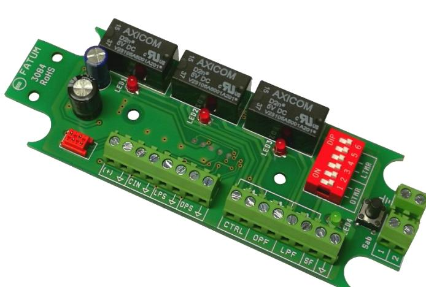
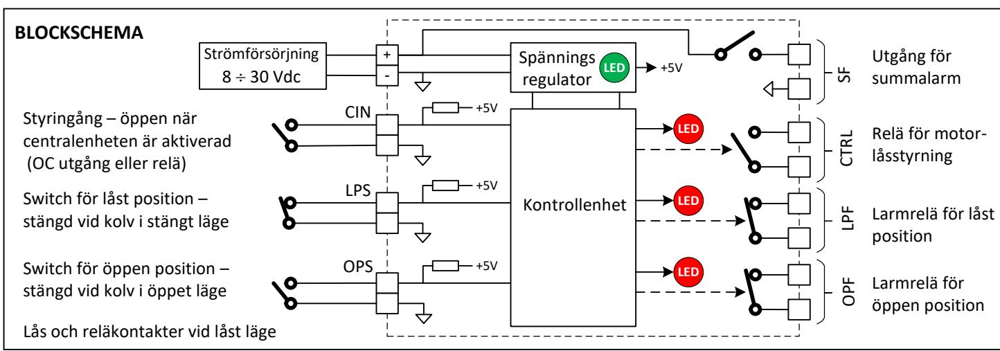
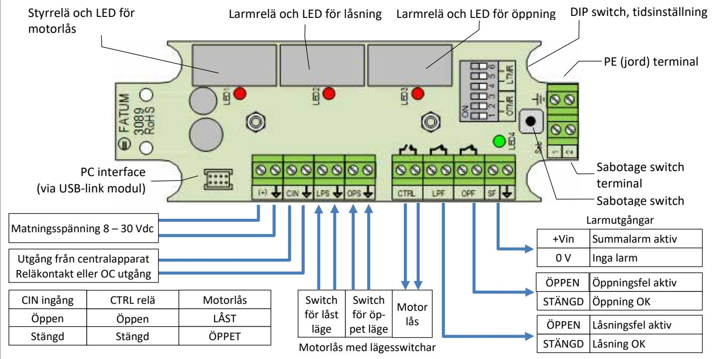

# **FATUM FATUM Motorlåslarm**

# **Datablad och monteringsinstruktion 3089**

| DIP1 – DIP3: Tidsfördröjning efter upplåsning (OTMR) |      |      |      |           |  |  |  |
|------------------------------------------------------|------|------|------|-----------|--|--|--|
| #                                                    | DIP1 | DIP2 | DIP3 | Timer [s] |  |  |  |
| 0                                                    | OFF  | OFF  | OFF  | 1         |  |  |  |
| 1                                                    | ON   | OFF  | OFF  | 3         |  |  |  |
| 2                                                    | OFF  | ON   | OFF  | 5         |  |  |  |
| 3                                                    | ON   | ON   | OFF  | 7         |  |  |  |

# **DIP4 – DIP6: Tidsfördröjning efter låsning (LTMR)**

 OFF OFF ON 10 ON OFF ON 15 OFF ON ON 30 ON ON ON 60

| # | DIP4 | DIP5 | DIP6 | Timer [s] |
|---|------|------|------|-----------|
| 0 | OFF  | OFF  | OFF  | 1         |
| 1 | ON   | OFF  | OFF  | 3         |
| 2 | OFF  | ON   | OFF  | 5         |
| 3 | ON   | ON   | OFF  | 7         |
| 4 | OFF  | OFF  | ON   | 10        |
| 5 | ON   | OFF  | ON   | 15        |
| 6 | OFF  | ON   | ON   | 30        |
| 7 | ON   | ON   | ON   | 60        |

### **TEKNISKA SPECIFIKATIONER**

| Matningsspänning                                    | Vin = 8 ÷ 30 V DC                                                                                                           |  |  |  |  |  |  |
|-----------------------------------------------------|-----------------------------------------------------------------------------------------------------------------------------|--|--|--|--|--|--|
| Max strömförbrukn.                                  | 45 mA @ 12 Vdc, 22 mA @ 24 Vdc                                                                                              |  |  |  |  |  |  |
| Larm för låg spänning                               | Vin <= 7 V, OPF och LPF öppna, summalarm                                                                                    |  |  |  |  |  |  |
|                                                     | INGÅNGAR                                                                                                                    |  |  |  |  |  |  |
| Styringång                                          | NC/NO, => intern +5 V genom 2.2 kohm                                                                                        |  |  |  |  |  |  |
| Låst position                                       | NC/NO, => intern +5 V genom 2.2 kohm                                                                                        |  |  |  |  |  |  |
| Öppen position                                      | NC/NO, => intern +5 V genom 2.2 kohm                                                                                        |  |  |  |  |  |  |
|                                                     | UTGÅNGAR                                                                                                                    |  |  |  |  |  |  |
| Styrutgång NO relä, kontaktdata: max 30 Vdc, 2 A |                                                                                                                             |  |  |  |  |  |  |
| Öppningsfel                                         | NC relä, kontaktdata: max 30 Vdc, 2 A                                                                                       |  |  |  |  |  |  |
| Låsningsfel                                         | NC relä, kontaktdata: max 30 Vdc, 2 A                                                                                       |  |  |  |  |  |  |
| Summalarm                                           | Signaleras av Vin, 2 A max last                                                                                             |  |  |  |  |  |  |
| INSTÄLLNING AV TIDSFÖRDRÖJNING                      |                                                                                                                             |  |  |  |  |  |  |
|                                                     |                                                                                                                             |  |  |  |  |  |  |
| Tidsfördröjning                                     | Tiden ställs in med en 3+3 pin DIP-switch för låsnings-/upplåsningsfördröjning från 1 till 60 s MILJÖ OCH DIMENSIONER |  |  |  |  |  |  |
|                                                     |                                                                                                                             |  |  |  |  |  |  |
| Miljöklass                                          | EN 50130-5, Class II                                                                                                        |  |  |  |  |  |  |
| Dimensioner                                         | 116 x 40 x 16 mm                                                                                                            |  |  |  |  |  |  |
| Vikt                                                | 46 g                                                                                                                        |  |  |  |  |  |  |
| Driftstemperatur                                    | -20 °C till +55 °C                                                                                                          |  |  |  |  |  |  |
| Överrensstämmelse                                   |                                                                                                                             |  |  |  |  |  |  |

#### **BESKRIVNING**

Motorlåslarm används för att styra låsbultens läge i ett motorlås och säkerställa att motorlåset är aktiverat respektive avaktiverat. Motorlåslarmet kopplar ihop inbrottslarmet med motorlåset så att motorlåset låser bulten när larmet slås PÅ och låser upp bulten när larmet stängs AV. För säker drift finns det två justerbara timers som ger kolven tid för att gå ut och låsa respektive tillbaka och låsa upp. Tiderna är inställbara från 1-60 sekunder vardera. Om låset inte fungerar korrekt indikeras det med separata reläer. Kan användas för både 12V och 24V motorlås. Lämpligt för accesskontrollsystem för entrédörrar, nödutgångar, lagerdörrar etc.

#### **BESKRIVNING**

Enheten har två separata timers för individuell inställning av tiderna för låsning/upplåsning. Tiderna ställs med hjälp av DIP switchar:

- DIP1 DIP3: Tidsfördröjning efter upplåsning (OTMR)
	- o 8 val
	- o 1, 3, 5, 7, 10, 15, 30, 60 s
- DIP4 DIP6: Tidsfördröjning efter låsning (LTMR)
	- o 8 val
	- o 1, 3, 5, 7, 10, 15, 30, 60 s

## **IN-/UTGÅNGAR**

| Ingångar          |                       |                         | Utgångar          |                 |                          |      |
|-------------------|-----------------------|-------------------------|-------------------|-----------------|--------------------------|------|
| Märkning Funktion |                       |                         | Märkning Funktion |                 |                          | LED  |
| (+)               | Matning Vin=8–30 V    | Matningsspänning, sig-  |                   | Relä, öppet när | Styrrelä för motorlås,   |      |
|                  | Jord                  | naleras av LED4         | CTRL              | CIN är öppen    | följer CIN               | LED1 |
| CIN               | Styringång            | Öppen ingång skickar    |                   | Reläkontakt     | Larmrelä, signalerar fel |      |
|                  | Jord                  | låssignal till motorlås | LPF               | Normalt stängd  | vid låsning              | LED2 |
| LPS               | Switch för låst läge  | Switchen stängd när     |                   | Reläkontakt     | Larmrelä, signalerar fel |      |
|                  | Jord                  | låskolven är ute        | OPF               | Normalt stängd  | vid öppning              | LED3 |
| OPS               | Switch för öppet läge | Switchen stängd när     | SF                | Summalarm       | Något larm aktivt,       | LED2 |
|                  | Jord                  | låskolven är inne       |                  | Jord            | signaleras av Vin        | LED3 |

### **LAYOUT OCH KOPPLINGSSCHEMA**

### **TILLSTÅNDSDIAGRAM**

|                          |                 | Öppning/låsning, inga fel |       |      |      | Öppningsfel | Låsningsfel |      |  |
|--------------------------|-----------------|---------------------------|-------|------|------|-------------|-------------|------|--|
| Låsläge                  |                 | Låst                      | Öppet | Låst | Låst | Öppet       | Öppet       | Låst |  |
| Styringång               | Öppen Stängd |                           |       |      |      |             |             |      |  |
| Switch för låst läge     | Öppen Stängd |                           |       |      |      |             |             |      |  |
| Switch för öppet läge | Öppen Stängd |                           |       |      |      |             |             |      |  |
| Öppningstimer            | Aktiv Passiv |                           | OTMR  |      |      | OTMR        |             |      |  |
| Låsningstimer            | Aktiv Passiv |                           |       | LTMR |      |             |             | LTMR |  |
| Låsstyrningsrelä         | Öppen Stängd |                           |       |      |      |             |             |      |  |
| LED1                     | ON OFF       |                           |       |      |      |             |             |      |  |
| Larmrelä, låsning        | Öppen Stängd |                           |       |      |      |             |             |      |  |
| LED2                     | ON OFF       |                           |       |      |      |             |             |      |  |
| Larmrelä, öppning        | Öppen Stängd |                           |       |      |      |             |             |      |  |
| LED3                     | ON OFF       |                           |       |      |      |             |             |      |  |
| Summalarm                | +Vin 0 V     |                           |       |      |      |             |             |      |  |