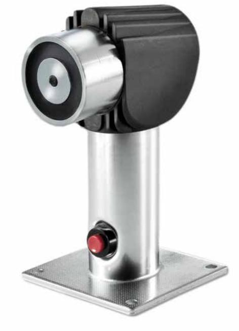

# FE260-175

**Dörrhållarmagnet 400N hållkraft som är monterad på ett 175 mm rörfäste där magneten sitter, med frisläppningknapp. IP42 (HxBxD) 90x80x150 i 90°, 90x80x175 i 180°. Inkl ankaplatta**

#### **Allmänt**

FE260-175 är en ställbar dörrhållarmagnet för golv-/väggmontage monterad på ett rörfäste. Vid dörrhållarmagnet ställd i 180° erhålls 175 mm längd och vid dörrhållarmagnet ställd i 90° erhålls 150 mm längd. Enheten ger en hållkraft på 400N och är försedd med en dörrstängningsknapp.

#### **Magnetkonstruktion**

Magneten är konstruerad med en pressad spole och antiremanensstift. Kapslingsklass IP54. Skyddsdiod är integrerad i konstruktionen.

#### **Ställbarhet**

FE260-175 medger två monteringsalternativ. Ställd i 180°, vilket normalt används vid väggmontage, är dörrhållarmagneten ställd i rörets riktning. Ställd i 90°, vilket normalt används vid golvmontage, är dörrhållarmagneten ställd i vinkel mot röret, se bilden.

För ytterligare flexibilitet kan röret kapas för att anpassa avståndet.

#### **Installationsvänlig**

- För praktisk enkel installation levereras dörrhållarmagneten komplett med elektriska skruvplintar.

- Kapslingen är förborrad i ett praktiskt standardformat för snabb montering.

- Dörrhållarmagneten levereras komplett med en ledad ankarplatta för inställning i olika vinklar.

#### **Godkännanden**

FE260-175 är fullt godkänd enligt EN1155.

### **Details**

- Låg effekt 1,6 W
- 400 N hållkraft
- Anti-remanensstift
- Skyddsdiod och skydd för omvänd polaritet
- Dörrstängningsknapp
- EN1155 godkänd
- Ställbar
- Ankarplatta ingår

## FE260-175

**Dörrhållarmagnet 400N hållkraft som är monterad på ett 175 mm rörfäste där magneten sitter, med frisläppningknapp. IP42 (HxBxD) 90x80x150 i 90°, 90x80x175 i 180°. Inkl ankaplatta**

| Technical specifications             |               |
|--------------------------------------|---------------|
|                                      |               |
| Spänning                             |               |
| Power supply type                    | 24 VDC        |
| Power                                |               |
|                                      | 1.6 W         |
| Holding force (N)                    |               |
|                                      | 400           |
| IP rating                            |               |
| Magnet                               | IP54          |
| Connection                           | IP42          |
| Dimensions (mm)                      |               |
| (H x W x D) 90° setup                | 90 x 80 x 150 |
| (H x W x D) 180° setup 90 x 80 x 175 |               |
| Release button                       |               |
|                                      | Yes           |
| Spark suppression diode              |               |
|                                      | Yes           |
| Reverse polarity protection          |               |
|                                      | Yes           |
| EN1155                               |               |
|                                      | Yes           |
| Duty cycle                           |               |
|                                      | 100%          |

As a company of innovation, UTC Fire & Security reserves the right to change product specifications without notice. For the latest product specifications, visit UTC Fire & Security online or contact your sales representative.

Powered by TCPDF (www.tcpdf.org)