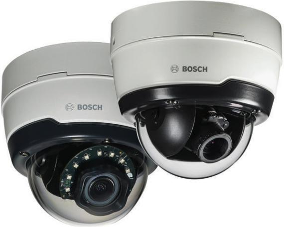
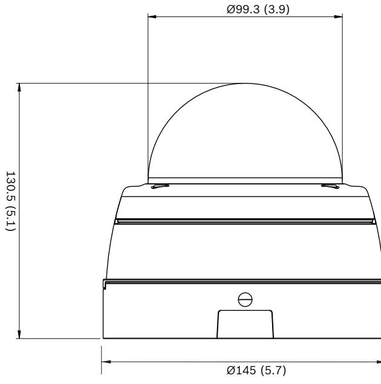

# FLEXIDOME IP outdoor 5000i

www.boschsecurity.com

The 5MP outdoor dome cameras from Bosch are professional surveillance cameras that provide high quality images for demanding security and surveillance network requirements. These robust domes are true day/night cameras offering excellent performance day or night.

There is a version with a built-in active infrared illuminator that provides high performance in extreme low-light environments.

#### **System overview**

**Vandal resistant outdoor dome with varifocal lens** Ideal for outdoor use, the IK10-rated design is suitable for installations where a vandal resistance is important. The camera is protected against water and dust to IP66 standards. The varifocal lens allows you to choose the coverage area to best suit your application. Mounting options are numerous, including surface, wall, and suspended-ceiling mounting. The automatic zoom/focus lens wizard makes it easy for an installer to accurately zoom and focus the camera for both day and night operation. The wizard is activated from the PC or from the on-board camera push button making it easy to choose the workflow that suits best.

- u Easy to install with auto zoom/focus lens, wizard and pre-configured modes
- u Fully configurable H.265 multi-streaming
- u 5MP resolution with image quality up to 30 fps for highly detailed images
- u Built-in Essential Video Analytics to trigger relevant alerts and quickly retrieve data
- u High Dynamic Range to see every detail in both bright and dark areas of the scene

The AVF (Automatic Varifocal) feature means that the zoom can be changed without opening the camera. The automatic motorized zoom/focus adjustment with 1:1 pixel mapping ensures the camera is always accurately focused.

#### **Functions**

#### **Essential Video Analytics**

The built-in video analysis reinforces the Intelligenceat-the-Edge concept and now delivers even more powerful features. Essential Video Analytics is ideal for use in controlled environments with limited detection ranges.

The system reliably detects, tracks, and analyzes objects, and alerts you when predefined alarms are triggered. A smart set of alarm rules makes complex tasks easy and reduces false alarms to a minimum. Metadata is attached to your video to add sense and structure. This enables you to quickly retrieve the relevant images from hours of stored video. Metadata can also be used to deliver irrefutable forensic evidence or to optimize business processes based on people counting or crowd density information.

Calibration is quick and easy – just enter the height of the camera. The internal gyro/accelerometer sensor provides the rest of the information to precisely calibrate the video analytics.

#### **High Dynamic Range**

The camera has High Dynamic Range. This is based on a multiple-exposure process that captures more details in the highlights and in the shadows even in the same scene. The result is that you can easily distinguish objects and features, for example, faces with bright backlight.

The actual dynamic range of the camera is measured using Opto-Electronic Conversion Function (OECF) analysis according to IEC 62676 Part 5. This method is used to provide a standard result which can be used to compare different cameras.

#### **Content Based Imaging Technology**

Content Based Imaging Technology (CBIT) is used to radically improve image quality in all lighting conditions and to identify areas for enhanced processing. The camera examines the scene using Essential Video Analytics and provides feedback to retune the image processing. This provides better detail in the areas that matter and better all-round performance. Intelligent Auto Exposure technology, for example, allows you to view moving objects in bright and dark areas of a scene.

#### **Intelligent streaming reduces bandwidth and storage requirements**

The low-noise image and the efficient H.265 compression technology provide clear images while reducing bandwidth and storage by up to 80% compared to standard H.264 cameras. With this new generation of cameras an extra level of intelligence is added with Intelligent Streaming. The camera provides the most usable image possible by cleverly optimizing the detail-to-bandwidth ratio. The smart encoder continuously scans the complete scene as well as regions of the scene and dynamically adjust compression based on relevant information like movement. Together with Intelligent Dynamic Noise Reduction, which actively analyzes the contents of a scene and reduces noise artifacts accordingly, bitrates are reduced by up to 80%. Because noise is reduced at the source during image capture, the lower bitrate does not compromise image quality. This results in substantially lower storage costs and network strain and still retain a high image quality and smooth motion.

#### **Bitrate optimized profile**

The average typical optimized bitrate in kbits/s for various frame rates when in H.265 mode is shown in the table:

| fps | 5MP  | 4MP  | 3MP | 1080p |
|-----|------|------|-----|-------|
| 30  | 1597 | 1210 | 864 | 600   |
| 12  | 1205 | 913  | 652 | 438   |

| fps | 5MP | 4MP | 3MP | 1080p |
|-----|-----|-----|-----|-------|
| 5   | 799 | 605 | 432 | 284   |
| 2   | 344 | 261 | 186 | 122   |

#### **Multiple streams**

The innovative multi-streaming feature delivers various H.264 or H.265 streams together with an M‑JPEG stream. These streams facilitate bandwidth-efficient viewing and recording as well as integration with thirdparty video management systems.

The camera can run multiple independent streams that allows to set a different resolution and frame rate on the first and second stream. The user can also choose to use a copy of the first stream.

The third stream uses the I-frames of the first stream for recording; the fourth stream shows a JPEG image at a maximum of 10 Mbit/s.

#### **Two-way audio and audio alarm**

Two-way audio allows the operator to communicate with visitors or intruders via an external audio line input and output. Audio detection can be used to generate an alarm if needed.

#### **Tamper and motion detection**

A wide range of configuration options is available for alarms signaling camera tampering. A built-in algorithm for detecting movement in the video can also be used for alarm signaling.

#### **Storage management**

Recording management can be controlled by the Bosch Video Recording Manager (Video Recording Manager) or the camera can use iSCSI targets directly without any recording software.

#### **Edge recording**

The MicroSD card slot supports up to 2 TB of storage capacity. A microSD card can be used for local alarm recording. Pre-alarm recording in RAM reduces recording bandwidth on the network, or — if microSD card recording is used — extends the effective life of the storage medium.

#### **Cloud-based services**

The camera supports time-based or alarm-based JPEG posting to four different accounts. These accounts can address FTP servers or cloud-based storage facilities (for example, Dropbox). Video clips or JPEG images can also be exported to these accounts. Alarms can be set up to trigger an e-mail or SMS notification so you are always aware of abnormal events.

#### **Easy installation**

Power for the camera can be supplied via a Powerover-Ethernet compliant network cable connection. With this configuration, only a single cable connection is required to view, power, and control the camera. Using PoE makes installation easier and more costeffective, as cameras do not require a local power source.

The camera can also be supplied with power from +12 VDC/24 VAC power supplies. To increase system reliability, the camera can be simultaneously connected to both PoE and +12 VDC/24 VAC supplies. Additionally, uninterruptible power supplies (UPS) can be used, which will allow continuous operation, even during a power failure.

#### **Automatic image rotation**

The integrated gyro/accelerometer sensor automatically corrects the image orientation in steps of 90° if the camera is mounted at right angles or upside down. The sensor image can also be rotated manually through steps of 90°.

To efficiently capture details in long hallways without loss of resolution, mount the camera at right angles. The image is displayed upright at full resolution on your monitor.

For trouble-free network cabling, the camera supports Auto-MDIX which allows the use of straight or crossover cables.

#### **True day/night switching**

The camera incorporates mechanical filter technology for vivid daytime color and exceptional night-time imaging while maintaining sharp focus under all lighting conditions.

#### **Hybrid mode**

An analog video output enables the camera to operate in hybrid mode. This mode provides simultaneous high resolution HD video streaming and an analog video output via an SMB connector. The hybrid functionality offers an easy migration path from legacy CCTV to a modern IP-based system.

#### **Data security**

Special measures have been put in place to ensure the highest level of security for device access and data transport. The three-level password protection with security recommendations allows users to customize device access. Web browser access can be protected using HTTPS and firmware updates can also be protected with authenticated secure uploads. The on-board Trusted Platform Module (TPM) and Public Key Infrastructure (PKI) support, guarantee superior protection from malicious attacks. The 802.1x network authentication with EAP/TLS, supports TLS 1.2 with updated cipher suites including AES 256 encryption.

The advanced certificate handling offers:

- Self-signed unique certificates automatically created when required
- Client and server certificates for authentication
- Client certificates for proof of authenticity
- Certificates with encrypted private keys

#### **Complete viewing software**

There are many ways to access the camera's features: using a web browser, with the Bosch Video Management System, with the free-of-charge Bosch Video Client or Video Security Client, with the video security mobile app, or via third-party software.

#### **Video security app**

The Bosch video security mobile app has been developed to enable Anywhere access to HD surveillance images allowing you to view live images from any location. The app is designed to give you complete control of all your cameras, from panning and tilting to zoom and focus functions. It's like taking your control room with you.

This app, together with the integrated Bosch Dynamic Transcoding on the DIVAR IP recorders, will allow you to fully utilize our dynamic transcoding features so you can play back images even over low-bandwidth connections.

#### **System integration**

The camera conforms to the ONVIF Profile S and Profile G specifications. This guarantees interoperability between network video products regardless of manufacturer.

Third-party integrators can easily access the internal feature set of the camera for integration into large projects. Visit the Bosch Integration Partner Program (IPP) website (ipp.boschsecurity.com) for more information.

#### **DORI coverage**

DORI (Detect, Observe, Recognize, Identify) is a standard system (EN-62676-4) for defining the ability of a camera to distinguish persons or objects within a covered area. The maximum distance at which a camera/lens combination can meet these criteria is shown below:

#### **5MP Camera with 3-10 lens**

| DORI      | DORI       | Distance        | Horizontal |
|-----------|------------|-----------------|------------|
|           | definition | 3mm / 10mm      | width      |
| Detect    | 25 px/m    | 59 m / 238 m    | 123 m      |
|           | 8 px/ft    | 195 ft / 780 ft | 403 ft     |
| Observe   | 63 px/m    | 24 m / 94 m     | 49 m       |
|           | 19 px/ft   | 77 ft / 309 ft  | 160 ft     |
| Recognize | 125 px/m   | 12 m / 48 m     | 25 m       |
|           | 38 px/ft   | 39 ft / 156 ft  | 81 ft      |
| Identify  | 250 px/m   | 6 m / 24 m      | 12 m       |
|           | 76 px/ft   | 19 ft / 78 ft   | 40 ft      |

#### **Certifications and approvals**

| Standards | IEC 62471 (IR version) |
|-----------|------------------------|
|           | EN 60950-1             |
|           | UL 60950-1             |

|                           |    | UL 60950-22                          |
|---------------------------|----|--------------------------------------|
|                           |    | CAN/CSA-C22.2 NO. 60950-1-03         |
|                           |    | CAN/CSA-C22.2 NO. 60950-22           |
|                           |    | EN 50130-4                           |
|                           |    | EN 50130-5                           |
|                           |    | FCC Part15 Subpart B, Class B        |
|                           |    | EMC directive 2014/30/EU             |
|                           |    | EN 55032 class B                     |
|                           |    | EN 55024                             |
|                           |    | AS/NZS CISPR 32 (equal to CISPR 32)  |
|                           |    | ICES-003 Class B                     |
|                           |    | VCCI J55022 V2/V3                    |
|                           |    | EN 50121-4                           |
|                           |    | EN 60950-22                          |
| ONVIF compliance       |    | EN 50132-5-2; IEC 62676-2-3          |
| Product certifications |    | CE, FCC, UL, cUL, RCM, CB, VCCI, EAC |
| Region                    |    | Regulatory compliance/quality marks  |
| Europe                    | CE | FLEXIDOME IP outdoor 4/5000i         |
| USA                       | UL | outdoor 4/5000i                      |

#### **Installation/configuration notes**

## **Technical specifications Power** Input voltage +12 VDC ±5%, 24 VAC ±10% or Power-over-Ethernet (48 VDC nominal) Power consumption (DC) 7.15 W max. Power consumption (AC) 6.15 W max. Power consumption (PoE) 7 W max. PoE IEEE standard IEEE 802.3af (802.3at Type 1) Power level: Class 3 **Power (IR version)** Input voltage +12 VDC ±5%, 24 VAC ±10% or Power-over-Ethernet (48 VDC nominal) Power consumption (DC) 10.8 W max. Power consumption (AC) 8.75 W max. Power consumption (PoE) 9.2 W max. PoE IEEE standard IEEE 802.3af (802.3at Type 1) Power level: Class 3 **Sensor** Type 1/2.9‑inch CMOS Effective pixels 3072 (H) x 1944 (V) **Video performance - Sensitivity** Sensitivity – (3100K, reflectivity 89%, 1/25, F1.3, 30IRE) • Color 0.24 lx • Mono 0.03 lx • With IR 0.0 lx **Video performance - Dynamic range** High Dynamic Range 120 dB WDR Measured according 107 dB WDR

to IEC 62676 Part 5

IAE +16 dB WDR

#### **5** | FLEXIDOME IP outdoor 5000i

| Video streaming                |                                                                                                                                        |
|--------------------------------|----------------------------------------------------------------------------------------------------------------------------------------|
| Video compression              | H.265; H.264; M- JPEG                                                                                                                  |
| Streaming                      | Multiple configurable streams in H.264 or H. 265 and M-JPEG, configurable frame rate and bandwidth. Regions of Interest (ROI) |
| Camera processing latency   | <120 ms (max. average at 5MP30)                                                                                                        |
| GOP structure                  | IP                                                                                                                                     |
| Encoding interval              | 1 to 25 [30] fps                                                                                                                       |
| Encoding regions               | Up to 8 areas with encoder quality settings per area                                                                                |
| Video resolution               |                                                                                                                                        |
| 5MP (16:9)                     | 3072 x 1728                                                                                                                            |
| Upright mode 5MP               | 1728 x 3072                                                                                                                            |
| 4MP (16:9)                     | 2688 x 1512                                                                                                                            |
| Upright mode 4MP               | 1512 x 2688                                                                                                                            |
| 3MP (16:9)                     | 2304 x 1296                                                                                                                            |
| Upright mode 3MP               | 1296 x 2304                                                                                                                            |
| 1080p HD                       | 1920 x 1080                                                                                                                            |
| Upright mode 1080p             | 1080 x 1920                                                                                                                            |
| 1.3MP (5:4)                    | 1280 x 1024                                                                                                                            |
| 720p                           | 1280 x 720                                                                                                                             |
| 480p SD                        | 640 x 480                                                                                                                              |
| 240p SD                        | 320 x 240                                                                                                                              |
| Video functions                |                                                                                                                                        |
| Day/Night                      | Color, Monochrome, Auto (adjustable switch points)                                                                                  |
| Adjustable picture settings | Contrast, Saturation, Brightness                                                                                                       |
| White Balance                  | 2500 to 10000K, 4 automatic modes (Basic, Standard, Sodium vapor, Dominant color), Manual mode and Hold mode                     |
| Shutter                        | Automatic Electronic Shutter (AES); Fixed (1/25[30] to 1/15000) selectable; Default shutter                                      |
| Backlight compensation      | On/off/Intelligent Auto Exposure (BLC)                                                                                                 |
| Contrast enhancement        | On/off                                                                                                                                 |
| Signal-to-noise ratio (SNR) | >55 dB                                                                                                                                 |

| Video functions                |                                                                                                                                                                                           |  |
|--------------------------------|-------------------------------------------------------------------------------------------------------------------------------------------------------------------------------------------|--|
| Noise reduction                | Intelligent Dynamic Noise Reduction with separate temporal and spatial adjustments                                                                                                     |  |
| Sharpness                      | Sharpness enhancement level selectable                                                                                                                                                    |  |
| Intelligent defog              | Intelligent Defog automatically adjusts parameters for best picture in foggy or misty scenes (switchable)                                                                           |  |
| Privacy Masking                | Eight independent areas, fully programmable                                                                                                                                               |  |
| Video Analysis                 | Essential Video Analytics                                                                                                                                                                 |  |
| Scene modes                    | Standard, Sodium Lighting, Traffic, Intelligent AE, Vibrant, Low bitrate, Sports & Gaming, Retail                                                                                   |  |
| Other functions                | Image mirror, Image flip, Pixel counter, Video watermarking, Display stamping, Location                                                                                                |  |
| Camera rotation                | Automatic detection with manual override (0° / 90°/ 180°/ 270°)                                                                                                                        |  |
| Video content analysis         |                                                                                                                                                                                           |  |
| Analysis type                  | Essential Video Analytics                                                                                                                                                                 |  |
| Features                       | Rule based alarms and tracking Line crossing Enter /leave field Follow route Loitering Idle / removed object People counting Crowd density estimation 3D tracking |  |
| Audio detection                | Detection of audio to generate an alarm                                                                                                                                                   |  |
| Night vision (IR version only) |                                                                                                                                                                                           |  |
| Distance                       | 30 m (98 ft)                                                                                                                                                                              |  |
| LED                            | 10 LED high efficiency array, 850 nm                                                                                                                                                      |  |
| IR intensity                   | Adjustable                                                                                                                                                                                |  |
| Optical                        |                                                                                                                                                                                           |  |
| Lens type                      | 3 to 10 mm Automatic Varifocal (AVF) lens, IR corrected DC Iris F1.3 – 360                                                                                                          |  |
| Lens mount                     | Board mounted                                                                                                                                                                             |  |
| Adjustment                     | Motorized zoom/focus                                                                                                                                                                      |  |
| Iris control                   | Automatic iris control                                                                                                                                                                    |  |
| Day/Night                      | Switched mechanical IR filter                                                                                                                                                             |  |
| Horizontal field of view    | 29° - 92°                                                                                                                                                                                 |  |
| Vertical field of view         | 18° - 50°                                                                                                                                                                                 |  |

| Input/output                    |                                                                                                                                                   |  |
|---------------------------------|---------------------------------------------------------------------------------------------------------------------------------------------------|--|
| Analog video out                | SMB connector, CVBS (NTSC), 1 Vpp, 75 Ohm, approx. 500 TVL                                                                                     |  |
| Audio line in                   | 0.707 Vrms max, 10 kOhm typical                                                                                                                   |  |
| Audio line out                  | 0.707 Vrms at 16 Ohm typical                                                                                                                      |  |
| Alarm input                     | 1 input                                                                                                                                           |  |
| Alarm input activation       | Short or DC 5V activation                                                                                                                         |  |
| Alarm output                    | 1 output                                                                                                                                          |  |
| Alarm output voltage            | 30 VDC, max. load 0.5 A                                                                                                                           |  |
| Ethernet                        | RJ45                                                                                                                                              |  |
| Audio streaming                 |                                                                                                                                                   |  |
| Standard                        | G.711, 8 kHz sampling rate L16, 16 kHz sampling rate AAC-LC, 48 kbps at 16 kHz sampling rate AAC-LC, 80 kbps at 16 kHz sampling rate     |  |
| Signal-to-Noise Ratio           | >50 dB                                                                                                                                            |  |
| Audio Streaming                 | Full-duplex / half duplex                                                                                                                         |  |
|                                 |                                                                                                                                                   |  |
| Local storage                   |                                                                                                                                                   |  |
| Internal RAM                    | 60 s pre-alarm recording                                                                                                                          |  |
| Memory card slot                | Supports up to 32 GB microSDHC / 2 TB microSDXC card. (A memory card of Class 6 or higher is recommended for HD recording)                  |  |
| Recording                       | Continuous recording, ring recording. alarm/ events/schedule recording                                                                         |  |
| Software                        |                                                                                                                                                   |  |
| Unit discovery                  | IP Helper                                                                                                                                         |  |
| Unit configuration              | Via web browser or Configuration Manager                                                                                                          |  |
| Firmware update                 | Remotely programmable                                                                                                                             |  |
| Software viewing                | Web browser; Video Security Client; Video Security App; Bosch Video Management System; Bosch Video Client; or third party software |  |
| Latest firmware and software | http://downloadstore.boschsecurity.com/                                                                                                           |  |

| Network   |                                                                                                                                                                                                                         |
|-----------|-------------------------------------------------------------------------------------------------------------------------------------------------------------------------------------------------------------------------|
| Protocols | IPv4, IPv6, UDP, TCP, HTTP, HTTPS, RTP/ RTCP, IGMP V2/V3, ICMP, ICMPv6, RTSP, FTP, ARP, DHCP, APIPA (Auto-IP, link local address), NTP (SNTP), SNMP (V1, V3, MIB-II), 802.1x, DNS, DNSv6, DDNS (DynDNS.org, |

| Network                                  |                                                                                                                                                                                               |
|------------------------------------------|-----------------------------------------------------------------------------------------------------------------------------------------------------------------------------------------------|
|                                          | selfHOST.de, no-ip.com), SMTP, iSCSI, UPnP (SSDP), DiffServ (QoS), LLDP, SOAP, Dropbox™, CHAP, digest authentication                                                                    |
| Encryption                               | TLS1.0/1.2, AES128, AES256                                                                                                                                                                    |
| Ethernet                                 | 10/100 Base-T, auto-sensing, half/full duplex                                                                                                                                                 |
| Connectivity                             | Auto-MDIX                                                                                                                                                                                     |
| Interoperability                         | ONVIF Profile S; ONVIF Profile G; GB/T 28181                                                                                                                                               |
| Mechanical                               |                                                                                                                                                                                               |
| 3-axis adjustment (pan/tilt/rotation) | 350º / 130º / 330º                                                                                                                                                                            |
| Dimensions (Ø x H)                       | 145 x 131 mm (5.71x 5.14 in)                                                                                                                                                                  |
| Weight                                   | 1102 g (2.43 lb)                                                                                                                                                                              |
| Color                                    | RAL 9003, RAL 9017                                                                                                                                                                            |
| Housing material                         | Aluminum                                                                                                                                                                                      |
| Dome bubble                              | Polycarbonate, clear with anti-scratch coating                                                                                                                                                |
| Environmental                            |                                                                                                                                                                                               |
| Operating temperature                 | -40 ºC to +50 ºC (-40 ºF to +122 ºF) for continuous operation; -34 ºC to +74 ºC (-30 ºF to +165 ºF) according to NEMA TS 2-2003 (R2008), para 2.1.5.1 using fig. 2.1 test profile |
| Storage temperature                      | -40 ºC to +70 ºC (-40 ºF to +158 ºF)                                                                                                                                                          |
| Operating humidity                       | 5% to 93% RH non condensing 5% to 100% RH condensing                                                                                                                                       |
| Ingress protection                       | IP66 and NEMA 4X                                                                                                                                                                              |
| Impact protection                        | IK10                                                                                                                                                                                          |

#### **Ordering information**

**NDE-5503-A Fixed dome 5MP HDR 3-10mm auto IP66** Vandal-resistant IP dome cameras for outdoor MP surveillance with H.265 and Essential Video Analytics. Fixed dome 5MP HDR 3-10mm auto IP66. Order number **NDE-5503-A**

#### **EWE-FD5IDI-IW 12mths wrty ext Flexidome 5000i ID** 12 months warranty extension

Order number **EWE-FD5IDI-IW**

#### **NDE-5503-AL Fixed dome 5MP HDR 3-10mm auto IP66**

Vandal-resistant IP dome camera for outdoor MP surveillance with H.265, Essential Video Analytics and integrated infrared. Fixed dome 5MP HDR 3-10mm auto IP66. Order number **NDE-5503-AL**

#### **EWE-FD5IDI-IW 12mths wrty ext Flexidome 5000i ID** 12 months warranty extension

Order number **EWE-FD5IDI-IW**

#### **Accessories**

#### **BUB-TIN-FDO Bubble, tinted, outdoor**

Tinted polycarbonate bubble for dome camera. Outdoor Order number **BUB-TIN-FDO**

#### **BUB-CLR-FDO Bubble, clear, outdoor**

Clear polycarbonate bubble for dome camera Outdoor Order number **BUB-CLR-FDO**

#### **NDA-5030-PIP Pendant interface plate NDE-4/5000**

Pendant interface plate for outdoor FLEXIDOME 4000i / 5000i.

Order number **NDA-5030-PIP**

#### **NDA-U-WMT Pendant wall mount**

Universal wall mount for dome cameras, white Order number **NDA-U-WMT**

#### **NDA-U-PMT Pendant pipe mount, 12" (31cm)**

Universal pipe mount for dome cameras, 31 cm, white Order number **NDA-U-PMT**

#### **NDA-U-PMAS Pole mount adapter small**

Pole mount adapter small Universal pole mount adapter, white; small. Order number **NDA-U-PMAS**

**NDA-U-PMTE Pendant pipe extension, 20" (50cm)** Extension for universal pipe mount, 50 cm, white Order number **NDA-U-PMTE**

**NDA-U-PSMB Pendant wall/ceiling mount SMB** Surface mount box (SMB) for wall mount or pipe mount. Order number **NDA-U-PSMB**

#### **NBN-MCSMB-03M Cable, SMB to BNC, camera-cable, 0.3m**

0.3 m (1 ft) analog cable, SMB (female) to BNC (female) to connect camera to coaxial cable Order number **NBN-MCSMB-03M**

#### **NBN-MCSMB-30M Cable, SMB to BNC, camera-monitor/DVR**

3 m (9 ft) analog cable, SMB (female) to BNC (male) to connect camera to monitor or DVR Order number **NBN-MCSMB-30M**

**NDN-IOC-30M Cable, IP66 certified, waterproof** An IP66 certified cable for easy waterproof installation Order number **NDN-IOC-30M**

#### **NDA-LWMT-DOME Wall mount, L-shpaed, for dome camera**

Sturdy wall L-shaped bracket for dome cameras Order number **NDA-LWMT-DOME**

#### **NDA-ADT4S-MINDOME Surface mount box for dome camera**

Surface mount box (Ø145 mm / Ø5.71 in) for dome cameras (use together with the appropriate dome adapter bracket).

Order number **NDA-ADT4S-MINDOME**

#### **NDA-FMT-DOME Inceiling flush mount for dome camera**

In-ceiling flush mounting kit for dome cameras (Ø157 mm)

Order number **NDA-FMT-DOME**

#### **UPA-1220-60 Power supply, 120VAC 60Hz,12VDC 1A out**

Power supply for camera. 100-240 VAC, 50/60 Hz In; 12 VDC, 1 A Out; regulated. Input connector: 2-prong, North American standard (non-polarized). Order number **UPA-1220-60**

**NPD-5001-POE Power over ethernet , 15.4W, 1-port**

Power-over-Ethernet midspan injector for use with PoE enabled cameras; 15.4 W, 1-port Weight: 200 g (0.44 lb) Order number **NPD-5001-POE**

#### **NPD-5004-POE Power over ethernet, 15.4W, 4-port**

Power-over-Ethernet midspan injectors for use with PoE enabled cameras; 15.4 W, 4-ports Weight: 620 g (1.4 lb) Order number **NPD-5004-POE**

#### **NDA-U-CMT Corner mount adapter**

Universal corner mount, white Order number **NDA-U-CMT**

#### **NDA-U-PA0 Surveillance cabinet 24VAC**

Surveillance cabinet, 24 VAC input, 24 VAC output, IP66

Order number **NDA-U-PA0**

#### **NDA-U-WMT Pendant wall mount**

Universal wall mount for dome cameras, white Order number **NDA-U-WMT**

#### **NDA-U-PMAL Pole mount adapter large** Universal pole mount adapter, white; large

Order number **NDA-U-PMAL**

### **NDA-U-RMT Pendant parapet mount**

Universal roof mount for dome cameras, white Order number **NDA-U-RMT**

#### **NDA-U-WMP Wall mount plate**

Back plate for universal wall mount, corner mount and pole mount, white, IP66 Order number **NDA-U-WMP**

#### **NDA-U-PA1 Surveillance cabinet 120VAC**

Surveillance cabinet, 100 - 120 VAC 50/60 Hz input, 24 VAC output, IP66 Order number **NDA-U-PA1**

#### **NDA-U-PA2 Surveillance cabinet 230VAC**

Surveillance cabinet, 230 VAC input, 24 VAC output, IP66 Order number **NDA-U-PA2**

#### **VDA-WMT-AODOME Wall mount, outdoor, for dome, 166mm**

Sturdy outdoor wall mount bracket for dome cameras (Ø166 mm)

Order number **VDA-WMT-AODOME**

#### **VDA-PMT-AODOME Pipe mount for AUTODOME, outdoor**

Sturdy outdoor pipe mount bracket for dome cameras (Ø166 mm)

Order number **VDA-PMT-AODOME**

#### **Services**

**EWE-FD5IDI-IW 12mths wrty ext Flexidome 5000i ID** 12 months warranty extension Order number **EWE-FD5IDI-IW**

#### **Represented by:**

**Europe, Middle East, Africa: Germany: North America: Asia-Pacific:** Bosch Security Systems B.V. P.O. Box 80002 5600 JB Eindhoven, The Netherlands Phone: + 31 40 2577 284 emea.securitysystems@bosch.com emea.boschsecurity.com

Bosch Sicherheitssysteme GmbH Robert-Bosch-Ring 5 85630 Grasbrunn Germany www.boschsecurity.com

Bosch Security Systems, Inc. 130 Perinton Parkway Fairport, New York, 14450, USA Phone: +1 800 289 0096 Fax: +1 585 223 9180 onlinehelp@us.bosch.com www.boschsecurity.us

Robert Bosch (SEA) Pte Ltd, Security Systems 11 Bishan Street 21 Singapore 573943 Phone: +65 6571 2808 Fax: +65 6571 2699 apr.securitysystems@bosch.com www.boschsecurity.asia

© Bosch Security Systems 2020 | Data subject to change without notice 23676883979 | en, V11, 10. Feb 2020