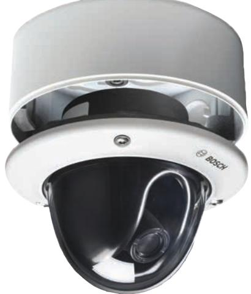
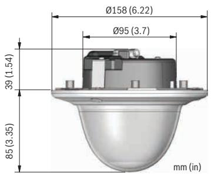
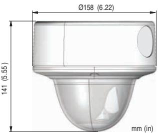

# FLEXIDOME VR Dummy Camera

www.boschsecurity.com

The FLEXIDOME VR Dummy camera is a life-like imitation of the FLEXIDOME Vandal Resistant (VR) camera family. The dummy camera can be flush mounted, or surface mounted using the separately available surface mount box (VDA-455-SMB-IP).

| Certifications and approvals |               |             |  |
|------------------------------|---------------|-------------|--|
| Region                       | Certification |             |  |
| Europe                       | CE            | accessories |  |

## **Installation/configuration notes**

*Flush-mount dimensions*

- u Identical look-and-feel to FLEXIDOME Vandal Resistant camera family
- u For indoor and outdoor installations in all weather conditions

- u Fits same mounting accessories as FLEXIDOME camera family

*Surface-mount dimensions (with separately available VDA-455SMB-IP)*

# **Technical specifications**

## **Construction**

| Dimensions (D x H) | 158 x 124 mm (6.22 x 4.89 in)                       |
|--------------------|-----------------------------------------------------|
| Weight             | 0.565 kg (1.25 lb)                                  |
| Mounting           | Flush mount or surface mount (with optional SMB) |
| Color              | White (RAL9010) trim ring with black inner liner |

| Dome bubble         | Polycarbonate, clear with UV blocking anti scratch coating |
|---------------------|---------------------------------------------------------------|
| Trim ring           | Aluminum                                                      |
| Environmental       |                                                               |
| Storage temperature | -50 ºC to +70 ºC (-58 ºF to +158 ºF)                          |
| Storage humidity    | Up to 98% relative humidity                                   |

Impact protection EN 50102, IK10 Water/dust protection IP 66 and NEMA Type 4X

### **Ordering information**

#### **NIN-DMY Dummy Camera**

FLEXIDOME VR family dummy camera Order number **NIN-DMY**

#### **Accessories**

#### **Surface Mount Box FLEXIDOME VR**

Surface Mount Box for FLEXIDOME VR Cameras Order number **VDA-455SMB-IP**

#### **VDA-WMT-DOME Wall Pendant Mount Bracket**

Wall pendant mount bracket for FlexiDome cameras Order number **VDA-WMT-DOME**

#### **VDA-CMT-DOME Corner Mount Bracket**

Corner mount bracket for FlexiDome cameras Order number **VDA-CMT-DOME**

### **VDA-PMT-DOME Pendant Pipe Mount Bracket**

Pendant pipe mount bracket for FlexiDome cameras Order number **VDA-PMT-DOME**

#### **VDA-PLEN-DOME In-ceiling Housing for Plenums Kit**

FLEXIDOME in-ceiling housing installation kit (plenumrated) for various FLEXIDOME cameras Order number **VDA-PLEN-DOME**

#### **VDA-455TBL Tinted bubble**

Tinted bubble for FlexiDome series Order number **VDA-455TBL**

### **VDA-455CBL Clear bubble**

Clear Bubble for FlexiDome series Order number **VDA-455CBL** 

#### **Represented by:**

Bosch Security Systems, Inc. 130 Perinton Parkway Fairport, New York, 14450, USA Phone: +1 800 289 0096 Fax: +1 585 223 9180 security.sales@us.bosch.com www.boschsecurity.us

**Americas: Europe, Middle East, Africa: Asia-Pacific: China: America Latina:** Bosch Security Systems B.V. P.O. Box 80002 5617 BA Eindhoven, The Netherlands Phone: + 31 40 2577 284 Fax: +31 40 2577 330

www.boschsecurity.com

#### emea.securitysystems@bosch.com Robert Bosch (SEA) Pte Ltd, Security Systems 11 Bishan Street 21 Singapore 573943 Phone: +65 6571 2808 Fax: +65 6571 2699 apr.securitysystems@bosch.com

www.boschsecurity.asia

Bosch (Shanghai) Security Systems Ltd. 201 Building, No. 333 Fuquan Road North IBP Changning District, Shanghai 200335 China Phone +86 21 22181111 Fax: +86 21 22182398 www.boschsecurity.com.cn

Robert Bosch Ltda Security Systems Division Via Anhanguera, Km 98 CEP 13065-900 Campinas, Sao Paulo, Brazil Phone: +55 19 2103 2860 Fax: +55 19 2103 2862 latam.boschsecurity@bosch.com www.boschsecurity.com

© Bosch Security Systems 2013 | Data subject to change without notice 12497804555 | en, V1, 13. Dec 2013