# FireProtect 2 RB (Heat/CO) Jeweller User manual

Updated May 22, 2023

**FireProtect 2 RB (Heat/CO) Jeweller** is a wireless fire detector with a built-in siren. Designed for indoor installation. Detects temperature rise, and dangerous CO (carbon monoxide) level. The detector also can work without a hub.

A list of compatible hubs and range extenders is . FireProtect 2 (Heat/CO) detector is compatible only with hubs on OS Malevich 2.15.0 and higher. available here

The detector operates as part of the Ajax system, communicating with the hub via the secure radio protocol. The hub communication range is up to 1,700 meters without obstacles. Jeweller

Buy FireProtect 2 RB (Heat/CO)

# Functional elements

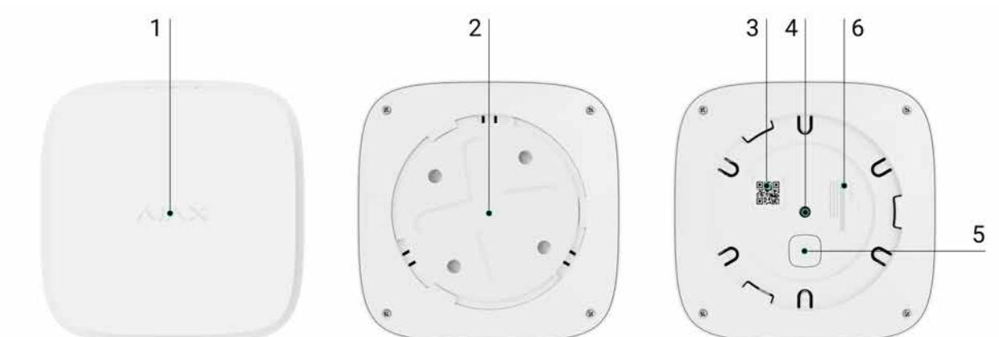

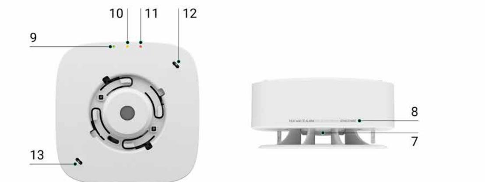

- **1.** Detector front panel with . To activate the button, press the center of the panel. Test/Mute button
- **2.** SmartBracket mounting panel. To remove the panel, turn it counterclockwise.
- **3.** Device QR code and ID (serial number). It is used to add the detector to the Ajax system.
- **4.** . Triggers when an attempt is made to detach the detector from the surface or remove it from the mounting panel. Tamper button
- **5.** Power button.
- **6.** Detector certification information.

**7.** Siren.

- **8.** Information about the detector's end of life date.
- **9.** Green LED indicator.
- **10.** Yellow LED indicator.
- **11.** Red LED indicator.
- **12.** First thermistor. Detects dangerous temperatures.
- **13.** Second thermistor. Detects dangerous temperatures.

# Operating principle

FireProtect 2 RB (Heat/CO) is a wireless fire detector designed for indoor installation. Operates for up to 7 years on pre-installed batteries. When the batteries are discharged, they can be replaced with new ones.

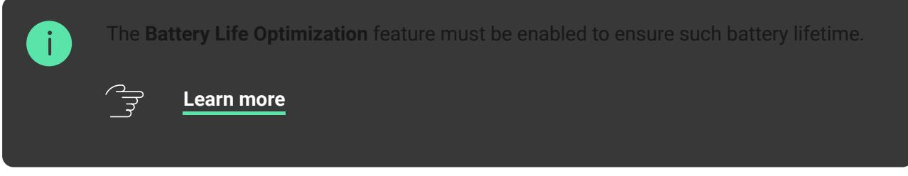

#### How to replace FireProtect 2 RB (Heat/CO) batteries

The detector is equipped with a siren (piezoelectric buzzer) for audible notification of alarms and events with a volume of up to 85 dB (at a distance of 3 m from the detector). The detector is always actives and reacts to a fire 24/7, regardless of the system's security mode.

A temperature rise alarm can be easily distinguished from a high CO level alarm due to different sound and LED indications. You can learn more about the alarm indication types and the detector events in the description section. indication

FireProtect 2 is protected by . The tamper controls the removal of the detector from the SmartBracket mounting panel: the detector reacts with LED indication and sends notifications to users in Ajax apps and the CMS. tamper

 respond to FireProtect 2 alarms and perform userdefined actions using . For example, the relay can turn off the ventilation system and turn on emergency lighting when an alarm occurs. Ajax automation devices automation scenarios WallSwitch

### Heat sensor

Two built-in class A1 thermistors detect a rapid rise and exceeding the temperature threshold in FireProtect 2. Such thermistors notify alarms when a rapid temperature rise or static temperature is detected in the range of +54°C to +65°C.

FireProtect 2 reports that the temperature threshold has been exceeded as soon as its value exceeds +64°C. The detector reports a rapid temperature rise if the indicator increases by 10°C within one minute. If the temperature indicator rises sharply by 20°C or more, the detector alerts immediately.

# CO (carbon monoxide) sensor

FireProtect 2 has a chemical sensor which detects dangerous levels of carbon monoxide. The operation principle of the sensor is based on the detection of carbon monoxide through a chemical reaction. There is an electrolyte bath inside the sensor. When a specific level of carbon monoxide is reached, a chemical reaction is triggered. The detector reads this event and transforms it into an alarm.

The detector raises an alarm if the CO level reaches:

- 50 ppm (0.005%) and above in no more than 90 minutes.
- 100 ppm (0.01%) and above in no more than 40 minutes.
- 300 ppm (0.03%) and above in no more than 3 minutes.

A CO concentration of 400 ppm (0.04%) for three hours is life-threatening. The detector stops warning of a dangerous carbon monoxide level as soon as the concentration drops to 40 ppm (0.004%).

# Test/Mute button

Тo activate the **Test/Mute** button, press lightly on the centre of the front panel with your hand. Use a suitable item (mop handle) if you can't reach up the detector with your hand. **Test/Mute** is a mechanical button placed under the front panel of the detector.

The button performs several functions:

- In normal mode, it starts the device self-test.
- In case of an alarm, it mutes the detector alarm or of all fire detectors in the system for 10 minutes. Interconnected Alarm

Use any remote silencing feature only in the line of sight of the CO sensor.

## Interconnected Fire Detectors Alarms*

All fire detectors of the FireProtect 2 product line support the Interconnected Alarm feature. This feature activates the built-in sirens of all fire detectors in the system as soon as at least one of the fire detectors detects an alarm. Sirens of FireProtect 2 detectors are activated within 20 seconds after an alarm is detected. The sirens of and are activated over a detector ping interval set in the **Jeweller** (or **Jeweller/Fibra**) settings, but no later than 60 seconds after. FireProtect FireProtect Plus

FireProtect 2 detectors have different sound and LED indications of alarm types to make it easier for users to distinguish between them. In case of interconnected alarm, all FireProtect 2 detectors indicate exactly the alarm type

detected by the initiating detector. The initiating detector additionally indacates the alarm by LED. Instead, and detectors notify all types of alarms with the same sound. FireProtect FireProtect Plus

*The Interconnected Fire Detectors Alarm function is not certified according to EN 14604 and EN 50291.

How to mute Interconnected Fire Detectors Alarms

## Sending events to the CMS

The Ajax system can transmit events and alarms to the monitoring app as well as the Central Monitoring Station (CMS) via **SurGard (Contact ID)**, **SIA DC-09 (ADM-CID), ADEMCO 685**, and other protocols. The list of supported protocols is . PRO Desktop available here

Which CMSs Ajax connects to

Addressability of Ajax devices allows you to send not only events but also the type of the device, the name, virtual room, and security group assigned to it to the PRO Desktop and to the CMS. The list of transmitted parameters may differ depending on the type of the CMS and the selected communication protocol.

# Adding to the system

# Before adding a device

- **1.** Install the Ajax app.
- **2.** Create an account if you don't have one.
- **3.** Add a to your app. Set the required settings and create at least one . hub compatible with the detector virtual room
- **4.** Make sure that the hub is on and has Internet access via Ethernet, Wi-Fi, and/or mobile network. You can do this in the Ajax app or by looking at the LED indicator of the hub: it should light up white or green.
- **5.** Make sure that the hub does not start updates and that it is disarmed by checking the status in the Ajax app.

To connect to the hub, the detector should be within the coverage area of the hub radio network. To operate via a , first connect the detector to the hub and then to the range extender. You can do this in the range extender settings in Ajax apps. radio signal range extender

## How to connect FireProtect 2 to a hub

- **1.** Open the Ajax app.
- **2.** Select the hub if you have several of them or if you are using the . Ajax PRO app
- **3.** Go to the **Devices** tab. Press **Add Device**.
- **4.** Enter the name of the device.
- **5.** Scan the QR code or enter the ID manually. QR code is located on the rear part of the enclosure (under the mounting panel) and on the device packaging. The device ID can be found below the QR code.
- **6.** Select the virtual room and security group (if the group mode is enabled).
- **7.** Click **Add**; the countdown will begin.

If the maximum number of devices is added to the hub, when you add the device, you will get a notification of exceeding the device limit. The number of devices that you can connect to the hub depends on the central unit model.

- **8.** Turn on the detector by holding the power button for 3 seconds. The hub connection request is sent only if the detector is enabled. If the detector fails to connect to the hub, try again in 5 seconds.
The detector cannot connect to the hub if they operate on different radio frequencies. The radio frequency range of the devices depends on the region of sale. Please contact for information on the operating frequency range of your devices. technical support

Once connected, FireProtect 2 will appear in the hub device list in the Ajax app. Device status update depends on the ping interval set in the **Jeweller** or **Jeweller/Fibra** settings. The default value is 36 seconds.

FireProtect 2 works with only one hub. When connected to a new hub, the detector stops transmitting data to the old hub. Once added to a new hub, FireProtect 2 is not removed from the list of devices of the old hub. This must be done manually in the Ajax app.

#### Autonomous operation mode

FireProtect 2 detectors can be used autonomously without connecting to an Ajax hub. In this case, the detector notifies of fire or dangerous CO level with only a built-in siren and LED . Users don't receive notifications on any , including , or . The feature is also unavailable for this operation mode. **indication** Ajax apps Ajax Translator PRO Desktop **Interconnected Fire Detectors Alarms**

To use the detector autonomously, follow these steps:

- **1.** Select the optimal location of the detector using the recommendations in the Selection of installation place section.
- **2.** Mount the detector on the SmartBracket panel as described in the Installation section.
- **3.** Press the **power button** to switch on the detector.
- **4.** Start a with the . Press the centre of the front panel and hold it for 1.5 seconds. self-test **Test/Mute button**

During a self-test FireProtect 2 notifies about each step with a built-in siren and LED indication. Once a self-test is completed, the LED **indication** turns off, and the detector works autonomously.

In case of an alarm, press the **Test/Mute button** or eliminate the cause of the alarm to mute the siren.

### Indication

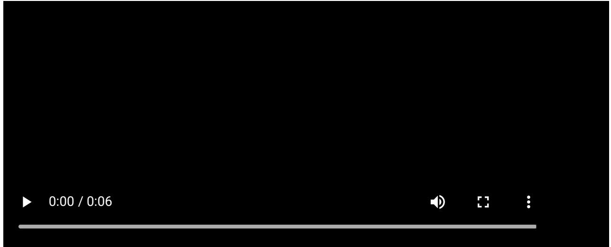

LEDs and the built-in siren of the detector can report alarms as well as certain states of the detector.

| LED indication                          | Sound indication                                           | Event                                                                       | Notes                                                                                                                                                                                                                                                                                                                      |
|-----------------------------------------|---------------------------------------------------------------|-----------------------------------------------------------------------------|----------------------------------------------------------------------------------------------------------------------------------------------------------------------------------------------------------------------------------------------------------------------------------------------------------------------------|
| The red LED flashes continuously. | The siren sounds in time with the LED indication. | Alarm by: rapid temperature rise; temperature threshold exceeding. | The detector stops alarming as soon as its sources are eliminated. Also, you can mute the alarm by Test/Mute pressing the button or in the Ajax app. The LED and sound indications resume if the source of the alarm is still present after the muting timer (10 minutes) has expired. |
| The red LED flashes 3 times          | The siren beeps 3                                          | Alarm by dangerous CO (carbon monoxide) level.                           | The detector will stop alarming as soon as the CO level drops                                                                                                                                                                                                                                                           |

| every 3 seconds.                                                 | times every 3 seconds in time with the LED indication. |                                                                                      | below 50 ppm. You can also mute the alarm by Test/Mute pressing the button or in the Ajax app. The alarm cannot be muted if the CO level exceeds 300 ppm. The LED and sound indications resume if the source of the alarm is still present after the muting timer (10 minutes) has expired. |
|---------------------------------------------------------------------|--------------------------------------------------------------------|--------------------------------------------------------------------------------------|---------------------------------------------------------------------------------------------------------------------------------------------------------------------------------------------------------------------------------------------------------------------------------------------------------------------------------|
| No.                                                                 | Short, low tone beep.                                           | Prohibition on alarm muting.                                                      | The sound is played after Test/Mute pressing the button The alarm cannot be muted if the CO level exceeds 300 ppm.                                                                                                                                                                                               |
| The red LED flashes every 4 seconds.                          | No.                                                                | Muted alarm.                                                                         | The detector stops alarming as soon as its source is eliminated.                                                                                                                                                                                                                                                             |
| The red LED flashes 2 times in a row.                         | No.                                                                | Restore after alarm.                                                                 | If the source of the alarm is removed, the detector is restored automatically.                                                                                                                                                                                                                                            |
| The yellow LED lights up for 1 second.                        | No.                                                                | Tamper alarm. The detector is removed from the SmartBracket mounting panel. |                                                                                                                                                                                                                                                                                                                                 |
| The green LED lights up for 1 second.                         | No.                                                                | The detector is installed on the SmartBracket mounting panel.                  | Turns on when the tamper is triggered.                                                                                                                                                                                                                                                                                       |
| Green, yellow, and red LEDs light up in turn, then go out. | No.                                                                | Turning the detector on.                                                             | To turn the detector on, hold the power button for 1 second.                                                                                                                                                                                                                                                                 |
| Green, yellow, and red LEDs light up at the same time,     | No.                                                                | Turning the detector off.                                                            | To turn the detector off, hold the power button for 2 seconds.                                                                                                                                                                                                                                                               |

| then go out in reverse order.                                              |                                                                                         |                                                |                                                                                                                                                                                                                                                                       |
|-------------------------------------------------------------------------------|-----------------------------------------------------------------------------------------|------------------------------------------------|-----------------------------------------------------------------------------------------------------------------------------------------------------------------------------------------------------------------------------------------------------------------------|
| The green LED is permanently on.                                        | No.                                                                                     | Connection to the hub in progress.          | The indication turns off after the detector is connected to the hub.                                                                                                                                                                                            |
| The green LED flashes 6 times in a row.                                 | No.                                                                                     | The detector has been removed from the hub. | The indication turns on when the detector receives information that it has been removed from the hub.                                                                                                                                                        |
| The green LED flashes once per minute.                                  | No.                                                                                     | Detector power is OK.                          | The indication is present when the detector is on and the tamper status is OK (the detector is installed on the SmartBracket mounting panel). There is no indication when the detector switches to the Jeweller Signal Strength Test mode. |
| The yellow LED flashes 2 times in a row every minute.                | The siren beeps 2 times in time with the LED indication every minute. | Malfunction detected.                          | All malfunctions are displayed states in the detector in Ajax apps. Fields with malfunctions are highlighted in red. If the detector needs to be repaired, contact our Technical Support                                                      |
| The yellow LED flashes once per minute.                                 | The siren beeps in time with the LED indication once per minute.      | Low battery charge level.                      | How to replace batteries in FireProtect 2 RB (Heat/CO)                                                                                                                                                                                                          |
| The yellow LED constantly flashes.                                      | No.                                                                                     | The battery is completely discharged.       | How to replace batteries in FireProtect 2 RB (Heat/CO)                                                                                                                                                                                                          |
| The red LED blinks 5 times, then flashes 3 more times but slower. | The siren beeps 5 times, then makes 3 longer beeps.                      | Performing a self-test.                        | The test can be started by Test/Mute pressing the button or in the detector settings in the Ajax app.                                                                                                                                                  |

| The yellow LED flashes 3 times in a row every | The siren beeps 3 times every | The device service life has expired. | The device has been operated for more than 10 years. The sensitivity of its sensors may have decreased. |
|-----------------------------------------------------|-------------------------------------|-----------------------------------------|------------------------------------------------------------------------------------------------------------------|
| minute.                                             | minute.                             |                                         | We recommend replacing this detector with a new one.                                                          |

If an alarm by temperature occurs at the same time as a dangerous CO level alarm, the detector starts the indication of the first alarm.

# Detector testing

# Functionality testing

The test allows you to check the status of the detector's sensors. You can run it in two ways: by pressing the Test/Mute or in Ajax apps.

**To run the test using the Test/Mute button**, press the center of the front panel and hold it for 1.5 seconds.

#### **To run the test in the Ajax app**

- **1.** Open the Ajax app.
- **2.** Select the hub if you have several of them or if you are using the . Ajax PRO app
- **3.** Go to the **Devices** menu.
- **4.** Select **FireProtect 2 RB (Heat/CO)**.
- **5.** Go to the settings by clicking on the gear icon .

- **6.** Click on the **Device Self-test** field.
After starting the test, the red LED of the detector flashes 5 times in a row and then flashes 3 more times. In time with the LED indication, the detector siren beeps five times, then beeps three more times but longer. When the test is over, users receive a notification of detector state in Ajax apps.

The detector also notifies of the test result with sound and LED indications. If the test is failed and a malfunction is detected, the detector starts **to indicate a malfunction** 3 seconds after the test is begun: the yellow LED flashes twice, and the siren beeps in time with the LED indication.

The self-test does not start immediately, but no later than 30 seconds after pressing the Test/Mute button or running from the Ajax app.

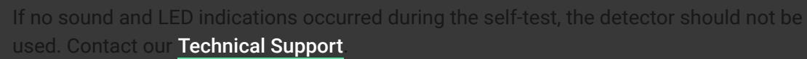

# Testing at the place of installation

Ajax system provides several tests to select the correct installation place of devices. **Jeweller Signal Strength Test** is available for FireProtect 2. The test determines the strength and stability of the signal at the intended location of the device.

#### **To run the test in the Ajax app:**

- **1.** Select the hub if you have several of them or if you are using the . Ajax PRO app
- **2.** Go to the **Devices** menu.
- **3.** Select **FireProtect 2 RB (Heat/CO)**.
- **4.** Go to the settings by clicking on the gear icon .
- **5.** Select **Jeweller Signal Strength Test**.
- **6.** Perform the test following the tips in the app.

The test does not start immediately, but the waiting time does not exceed the duration of one detector ping interval. The default value is 36 seconds. You can change the detector ping interval in the **Jeweller** (or **Jeweller/Fibra**) menu in the hub settings.

#### Icons

The icons show some of the device states. You can view them in Ajax apps in the **Devices** tab.

| Icon | Meaning                                                                                                                                                                                                          |
|------|------------------------------------------------------------------------------------------------------------------------------------------------------------------------------------------------------------------|
|      | Jeweller signal strength between the detector and the hub or radio signal range extender. The recommended value is two or three bars. Learn more                                                        |
|      | Battery charge level of the device. Learn more                                                                                                                                                                |
|      | The Interconnected Fire Detectors Alarms feature is activated. Learn more                                                                                                                                     |
|      | The detector operates in the Always Active mode. The icon is displayed permanently. FireProtect 2 is always active and responds to a fire 24/7, regardless of the system's security mode. Learn more |
|      | radio signal range The detector operates through a extender                                                                                                                                                |
|      | The detector is permanently deactivated. Learn more                                                                                                                                                           |
|      | The detector has detected a rapid temperature rise.                                                                                                                                                              |

| The detector has detected that the temperature threshold has been exceeded.                                                                                                                               |
|--------------------------------------------------------------------------------------------------------------------------------------------------------------------------------------------------------------|
| The detector has detected a dangerous CO (carbon monoxide) level.                                                                                                                                         |
| The detector was removed from the SmartBracket mounting panel, or the enclosure integrity was violated in another way. Check the mounting of the detector.                                             |
| The detector's siren plays an alarm sound.                                                                                                                                                                   |
| The detector service life has expired. The device has been operated for more than 10 years. The sensitivity of its sensors may have decreased. We recommend replacing this detector with a new one. |
| Malfunction detected. A list of malfunctions is available in the States detector                                                                                                                       |
| The detector has tamper triggering events deactivated. Learn more                                                                                                                                         |

## States

The states include information about the device and its operating parameters. You can see FireProtect 2 (Heat/CO) states in Ajax apps. To access them:

- **1.** Open the Ajax app.
- **2.** Select a hub if you have several of them or if you are using the Ajax PRO app.
- **3.** Go to the **Devices** tab.
- **4.** Select the device from the list.

Ajax apps display three FireProtect 2 temperature parameters. The first one shows the air temperature in the room where the detector is installed. The other two (Temperature Threshold Exceeded and Rapid Temperature Rise) show

whether fire-related temperature changes are detected. These values may differ from the temperature in the room.

| Parameter                | Meaning                                                                                                                                              |
|--------------------------|------------------------------------------------------------------------------------------------------------------------------------------------------|
| Temperature              | Air temperature in the premise where FireProtect 2 is installed. Measured in Celsius or Fahrenheit degrees depending on the app settings.      |
|                          | In the normal state, the temperature value is displayed in black.                                                                                 |
|                          | When the temperature rises, the field is highlighted with red.                                                                                    |
|                          | Jeweller signal strength between FireProtect 2 and the hub or radio signal range extender.                                                        |
| Jeweller Signal Strength | The recommended value is two or three bars.                                                                                                          |
|                          | Jeweller is a protocol for transmitting FireProtect 2 events and alarms.                                                                          |
| Connection via Jeweller  | Connection status between FireProtect 2 and the hub or radio signal range extender via Jeweller:                                                  |
|                          | Online — the detector is connected to the hub or radio signal range extender. Normal state.                                                       |
|                          | Offl ine — no connection between the detector and the hub or radio signal range extender. Check the detector connection.                    |
| Battery Charge           | The battery charge level of the device:                                                                                                              |
|                          | OK — detector batteries have sufficient charge. Normal state.                                                                                     |
|                          | Battery low — detector batteries are discharged.                                                                                                  |
|                          | When the batteries are discharged, users and the CMS receive a notification.                                                                      |
|                          | After the low battery charge notification, the detector is able to operate for another month under normal conditions. In case of an alarm, the |

|                                | battery charge is enough to ensure 4 minutes of the sound and LED indication operation.                                                                                  |
|--------------------------------|-----------------------------------------------------------------------------------------------------------------------------------------------------------------------------|
|                                | How the battery charge is displayed                                                                                                                                         |
|                                | Battery life calculator                                                                                                                                                     |
| Lid                            | The status of the detector's tamper that responds to detachment of the device from the surface or opening of the enclosure:                                           |
|                                | Open — the detector is removed from the SmartBracket mounting panel or the enclosure integrity is violated in another way. Check the mounting of the detector.     |
|                                | Closed — the detector is installed on the SmartBracket mounting panel. The integrity of the device enclosure and the mounting panel is not violated. Normal state. |
|                                | Learn more                                                                                                                                                                  |
| Temperature Threshold Exceeded | Alarm state if temperature threshold is exceeded:                                                                                                                        |
|                                | No — normal state, the detector does not detect a temperature threshold exceeding.                                                                                       |
|                                | Alarm — the detector has detected a temperature threshold exceeding.                                                                                                     |
|                                | If a temperature threshold exceeding is detected, the text field highlights red.                                                                                         |
|                                | Learn more                                                                                                                                                                  |
| Rapid Temperature Rise         | Alarm by rapid temperature rise:                                                                                                                                            |
|                                | No — normal state, the detector does not detect a rapid temperature rise.                                                                                                |
|                                | Alarm — the detector has detected a rapid temperature rise.                                                                                                              |
|                                | If a rapid temperature rise is detected, the text field highlights red.                                                                                                  |

|                        | Learn more                                                                                                                                                                                                                                                                                                                                         |
|------------------------|----------------------------------------------------------------------------------------------------------------------------------------------------------------------------------------------------------------------------------------------------------------------------------------------------------------------------------------------------|
| High CO Level          | CO (carbon monoxide) level in the room where FireProtect 2 is installed:                                                                                                                                                                                                                                                                        |
|                        | No — the CO level is normal.                                                                                                                                                                                                                                                                                                                       |
|                        | Alarm — the detector has detected a dangerous CO level.                                                                                                                                                                                                                                                                                         |
|                        | If a dangerous CO level is detected by the detector, the text field highlights red.                                                                                                                                                                                                                                                             |
|                        | Learn more                                                                                                                                                                                                                                                                                                                                         |
| Permanent Deactivation | Shows the status of the device permanent deactivation function:                                                                                                                                                                                                                                                                                 |
|                        | No — the device operates in normal mode.                                                                                                                                                                                                                                                                                                           |
|                        | Lid only — detector's tamper triggering notifications are disabled.                                                                                                                                                                                                                                                                             |
|                        | Entirely — the detector does not execute system commands, does not participate in automation scenarios, and does not send notifications of alarms, malfunctions, and other events to the CMS and system users. In this case, the detector will continue to operate autonomously and indicate alarms using the built-in siren. |
|                        | Learn more                                                                                                                                                                                                                                                                                                                                         |
| Firmware               | FireProtect 2 firmware version.                                                                                                                                                                                                                                                                                                                    |
| Device ID              | ID (serial number) of FireProtect 2. Also available on the detector's enclosure (under the mounting panel) below the QR code and on the packaging box.                                                                                                                                                                                    |
| Device No.             | The number of FireProtect 2 loop (zone). Events are sent to the CMS with this number.                                                                                                                                                                                                                                                           |

# Settings

To change FireProtect 2 RB (Heat/CO) settings in the Ajax app:

- **1.** Open the Ajax app.
- **2.** Select the hub if you have several of them or if you are using the . Ajax PRO app
- **3.** Go to the **Devices** tab.
- **4.** Select the device from the list.
- **5.** Go to **Settings** by clicking on the gear icon .
- **6.** Set the required settings.
- **7.** Click **Back** to save the new settings.

| Settings                           | Meaning                                                                                                                                                     |
|------------------------------------|-------------------------------------------------------------------------------------------------------------------------------------------------------------|
| Name                               | Detector name. Displayed in the list of hub devices, text of SMS and notifications in the events feed.                                                |
|                                    | To change the name, click on the text field.                                                                                                                |
|                                    | The name can contain up to 12 Cyrillic characters or up to 24 Latin characters.                                                                          |
| Room                               | Selecting the virtual room to which FireProtect 2 is assigned.                                                                                           |
|                                    | The room name is displayed in the text of SMS and notifications in the events feed.                                                                      |
|                                    | To change the room, click on the field.                                                                                                                     |
| Alert with a siren                 |                                                                                                                                                             |
| If temperature threshold exceeded  | Ajax sirens When this option is enabled, the connected to the system are activated when the detector detects a temperature threshold exceeding. |
| If rapid temperature rise detected | Ajax sirens When this option is enabled, the connected to the system are activated when the detector detects a rapid temperature rise.             |

| If CO detected                | Ajax sirens When this option is enabled, the connected to the system are activated when the detector registers a dangerous CO level.                                                                                                                                                                                                                                                                                                                                                                                                                                                  |
|-------------------------------|------------------------------------------------------------------------------------------------------------------------------------------------------------------------------------------------------------------------------------------------------------------------------------------------------------------------------------------------------------------------------------------------------------------------------------------------------------------------------------------------------------------------------------------------------------------------------------------------|
| Jeweller Signal Strength Test | Switches the detector to the Jeweller signal strength test mode. The test helps determine the optimal place for installing FireProtect 2. The test shows the signal strength between the detector and the hub or radio signal range extender via the Jeweller wireless data transfer protocol. The recommended value is two or three bars. Learn more                                                                                                                                                                                                                  |
| Device Self-test              | Runs a detector self-test. Learn more                                                                                                                                                                                                                                                                                                                                                                                                                                                                                                                                                       |
| User Guide                    | Opens FireProtect 2 User Manual in the Ajax app.                                                                                                                                                                                                                                                                                                                                                                                                                                                                                                                                               |
| Permanent Deactivation        | Allows to deactivate the device without removing it from the system. Three options are available: No — the device operates in normal mode. Lid only — detector's tamper triggering notifications are disabled. Entirely — the detector does not execute system commands, does not participate in automation scenarios, and does not send notifications of alarms, malfunctions, and other events to the CMS and system users. In this case, the detector will continue to operate autonomously and indicate alarms using the built-in siren. Learn more |
| Unpair Device                 | Unpairs FireProtect 2 from the hub and deletes its settings.                                                                                                                                                                                                                                                                                                                                                                                                                                                                                                                                |

# Battery life optimization setting

The **Battery Life Optimization** feature is provided to save the detectors' battery charge. It is available only for hubs on or higher with FireProtect 2 detectors connected. This feature is enabled by default. OS Malevich 2.14

When the **Battery Life Optimization** feature is enabled, the hub increases the ping interval for FireProtect 2 detectors.

This feature doesn't affect alarm notification delivery time.

To disable the **Battery Life Optimization** feature:

- Open the Ajax app.
- Select the hub with FireProtect 2 detectors connected.
- Go to: **Hub** → **Settings** → **Service** → **Fire Detectors Settings.**
- Disable the **Battery Life Optimization** toggle**.**
- Click **Back** to save the settings.

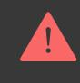

If the **Battery Life Optimization** feature is disabled **FireProtect 2 RB (Heat/CO)** battery life is 3.5 years (instead of 7).

# Selection of installation place

The detector is designed for indoor installation only.

The coverage area of one FireProtect 2 RB (Heat/CO) is 50 to 60 m², depending on the type of premises.

The detector is suitable for installation in premises where the generation of gases/vapours/smoke is part of the operating process. For example, in a garage, kitchen, or boiler room. The detector is placed in the center of the ceiling at a distance of 30 cm from light fixtures, chandeliers, or any other decorative objects that may interfere with alarm detection.

If there are beams on the ceiling protruding 30 cm or more, the detector should be installed between every two beams. If the beams protrude by less than 30 cm, installation on a beam in the central part of the ceiling is allowed.

In halls or narrow corridors, detectors should be installed at a distance of no more than 7.5 m from each other.

If the ceiling is sloping, the detector is installed at a distance of 60 cm from the top point of the ceiling. To select an installation place, draw a straight line down from the top of the ceiling. Then, draw a perpendicular from this line to the sloping part of the ceiling. The detector is installed at this point.

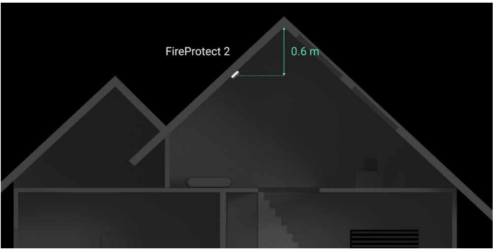

We do not recommend mounting the detector on a wall. This installation is acceptable if closely spaced beams or other obstacles interfere with the installation of the detector. Wall mounting is possible only if the detector is placed at a distance of 15–30 cm below the ceiling but above the doorways.

When choosing the location of the detector, consider the parameters that affect its operation:

- Jeweller signal strength.
- Distance between the detector and the hub.
- Presence of barriers for radio signal passage between devices: walls, interfloor ceilings, large objects located in the premise.

Consider the placement recommendations when designing your Ajax system for the object. The security system must be designed and installed by specialists. The list of recommended Ajax partners is . available here

# Signal strength

The Jeweller signal strength is determined by the ratio of the number of undelivered/corrupted data packets that are exchanged between the hub and the detector to expected ones within a certain period of time. Signal strength is indicated by the icon on the **Devices** tab:

- **Three bars** excellent signal strength.
- **Two bars** good signal strength.
- **One bar** low signal strength; stable operation is not guaranteed.
- **Crossed out icon** no signal; stable operation is not guaranteed.

Check the Jeweller signal strength at the installation site. If the signal strength is as low as one or zero bars, we cannot guarantee stable operation of the device. In this case, move the device. Repositioning even by 20 cm can significantly improve the signal reception.

If, after relocation, the detector still has a low or unstable signal strength, use a . radio signal range extender

#### Do not install the detector

- Outdoors. This can lead to the detector failure.
- In places with low or unstable Jeweller signal strength. This can result in connection loss.
- Inside premises with temperature and humidity outside the permissible limits. This can lead to the detector failure.
- In places with fast air circulation. For example, near fans, vents, open windows, or doors. This may interfere with fire detection.
- Opposite any objects with rapidly changing temperature. For example, electric and gas heaters. This can lead to false alarms.
- In the corners of the room. This may interfere with fire detection.
- In bathrooms, showers, or other premises where the temperature changes rapidly. This can lead to false alarms.
- Near lighting fixtures, decorations, and other interior items that may interfere with the circulation of air in the room. This may interfere with fire detection.
- On surfaces that are usually warmer or colder than the rest of the premise. For example, roof traps. Temperature fluctuations can interfere with fire detection.
- In high or inconvenient places. Access to the Test/Mute button is required to mute the alarm and test the detector if it's used without connection to a hub.

# Installation

Make sure that you have selected the optimal installation place and it complies with the requirements of this manual.

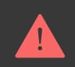

#### **To install the detector:**

- **1.** Remove the SmartBracket mounting panel from the detector. To remove the panel, turn it counterclockwise.
- **2.** Fix the SmartBracket panel to a surface using double-sided adhesive tape or other temporary fasteners. The mounting panel has an UP sign, which indicates the correct position.

Use double-sided adhesive tape for temporary fixation only. The device fixed by the adhesive tape can peel off the surface at any time, which can lead to damage if the device is dropped.

- **3.** Run the Signal Strength Test. The recommended value is two or three bars. Jeweller
If the signal strength is a single bar or lower, we cannot guarantee the stable operation of the detector. Consider to relocate the device as repositioning even by 20 cm can significantly improve the signal strength. If there is still low or unstable signal after the relocation, use a . radio signal range extender

- **4.** Remove the detector from the mounting panel.
- **5.** Attach the SmartBracket mounting panel with the bundled screws using all fixation points. When using other fasteners, make sure they do not damage or deform the mounting panel.
- **6.** Place the detector on the SmartBracket mounting panel.
- **7.** Adjust the position of detector, if necessary.

# Actions to take in case of Fire alarm (Heat)

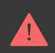

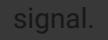

- **1.** Don't open the doors if you feel heat or smoke behind them. Check other entries and use an alternative way to escape. Close all doors behind you as you leave.
If heavy smoke enters a room, stay close to the floor and crawl out. If possible, breathe through a wet cloth or hold your breath. Please note that more people die because of smoke inhalation than fire.

- **2.** Evacuate as quickly as you can, don't panic. Save time, and don't pack your things. Arrange a meeting place outside for everybody in the building. Check if everyone got out safely.
- **3.** Call the fire department immediately by yourself or ask someone nearby. Remember, even the smallest fire can spread quickly, so do not hesitate to call the fire department. Call the fire department even if the alarm is automatically transmitted to a monitoring station.

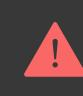

**NEVER** come back to the house on fire.

## Actions to take in case of CO alarm

- **1.** Immediately open all the doors and windows to ventilate the premises if it is safe.
**NEVER IGNORE THE ALARM!** When you open the doors and windows for ventilation, the CO level can drop to acceptable, and the alarm may have stopped by the time help arrives. The solution to the problem may be temporary. You have to determine the CO source and make a repair.

- **2.** Stop using and turn off all fuel devices where it is possible.
- **3.** Evacuate from the premises leaving the doors and windows open.

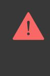

**WARNING:** If you hear the CO alarm, it has detected dangerous levels of carbon monoxide. Always evacuate from the premises, even if you are unsure about the cause of a CO alarm.

- **4.** If you have a headache and nausea, get medical help immediately. These could be the result of carbon monoxide poisoning, so tell your doctor about it.
- **5.** Call your gas or other fuel supplier's hotline. Keep the number in a noticeable place.
- **6.** Avoid re-entering the premises until the alarm stops.

If the alarm was silenced by the **Test/Mute button** (for CO level under 300 ppm), check the CO level at the Ajax app. If it is safe to enter the premises, press the Test/Mute button again to check the CO level.

Any remote silencing feature (e.g., via Ajax app) shall only be used in the line of sight of the CO siren.

- **7.** Do not use the fuel or gas appliances again until registered installers or experts have checked them.
## Carbon monoxide impact

Carbon monoxide poisoning occurs regularly: many people are killed each year, and many more suffer ill health. CO is an invisible, odorless, tasteless, and extremely toxic gas. CO is produced by burning such fuels as petrol, diesel, coal, oil, natural/bottled gas, paraffin, wood, charcoal, etc. The heart and brain are rapidly damaged by oxygen starvation because red blood cells in the lungs absorb CO faster than oxygen.

The most common reasons for high levels of CO in premises:

- Engines of cars, generators, etc., are left running in confined spaces (for example, a garage).
- Incorrectly or poorly installed fuel-burning appliances.
- Blocked or damaged vents or chimneys/flues.
- The tightness of rooms where appliances for burning fuel or fireplaces are installed.
- Bad ventilation in rooms with portable gas/paraffin heaters.

**IMPORTANT:** A CO alarm should not be used as a substitute for proper installation, use, and maintenance of fuel-burning appliances, including appropriate ventilation and exhaust systems.

The CO exposure period is also important. A low level for a long period (e.g., 150 ppm for 90 minutes) can cause the same symptoms as a high level of CO for a short period (e.g., 300 ppm CO for 30 minutes). The table below shows how different concentrations of CO affect people.

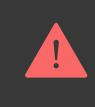

FireProtect 2 may not prevent the chronic effects of carbon monoxide exposure and will not fully protect people from the high-risk group.

| CO concentration in the air, ppm | Approximate inhalation time and consequences                                                                                                         |
|----------------------------------------|------------------------------------------------------------------------------------------------------------------------------------------------------|
| 35                                     | The maximum allowable concentration for continuous exposure in any 8-hour period (according to Occupational Safety and Health Association; OSHA). |
| 150                                    | Slight headache after 1.5 hours.                                                                                                                     |
| 200                                    | Slight headache, fatigue, dizziness, and nausea after 2–3 hours.                                                                                     |
| 400                                    | Frontal headaches within 1-2 hours, life-threatening after 3 hours.                                                                                  |
| 800                                    | Dizziness, nausea, and convulsions within 45 minutes. Unconsciousness within 2 hours. Death within 2–3 hours.                                     |
| 1,600                                  | Headache, dizziness, and nausea within 20 minutes. Death within 1 hour.                                                                              |

| 3,200  | Headache, dizziness, and nausea within 5–10 minutes. Death within 25-30 minutes. |
|--------|-------------------------------------------------------------------------------------|
| 6,400  | Headache, dizziness, and nausea within 1–2 minutes. Death within 10–15 minutes.  |
| 12,800 | Death within 1–3 minutes.                                                           |

Even if people realize they are not well, they become so disoriented by the carbon monoxide that they cannot call for help or get out of the room to save their lives. Numerous cases of carbon monoxide poisoning show that children and household pets are affected first.

# Malfunctions

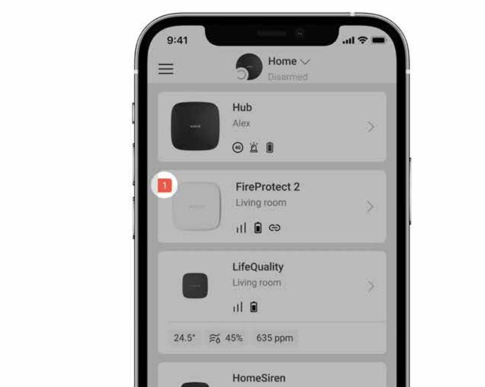

If FireProtect 2 malfunction is detected (for example, there is no connection with the hub), the malfunction counter is displayed in the device field in the Ajax apps.

All malfunctions are displayed in the detector . Fields with malfunctions are highlighted in red. States

The device can report malfunctions to the security company, as well as to users through push notifications and SMS.

#### **FireProtect 2 RB (Heat/CO) malfunctions**

- No connection with the hub or radio signal range extender.
- The detector's enclosure is open.
- Low battery charge level.
- The device service life has expired.
- Hardware malfunction (failure of one or more sensors of the detector).

# Maintenance

weekly).

The detector has a self-test system and does not require user or installer intervention. We recommend to periodically run a to familiarize people with the alarm sound and LED indication. self-test

FireProtect 2 devices connected to the Ajax hubs generally do not require routine testing. All connected devices are constantly monitored for possible Faults, Low battery, and EOL signals. However, we encourage all users to test FireProtect 2 devices periodically (monthly)* to allow residents of the building to become familiar with the fire alarm signals of the system. *Please be aware that your local regulation might require more frequent testing (e.g.,

Clean the detector enclosure of dust, cobwebs, and other contaminants as they emerge. Use a soft dry cloth suitable for equipment care. Do not use substances that contain alcohol, acetone, gasoline, and other active solvents to clean the device.

The service life of the detector is 10 years. After this period, the sensitivity of the sensors decreases. We recommend replacing the detector with a new one to ensure uninterrupted fire protection at the premises.

The detector operates for up to 7 years with pre-installed batteries. When the batteries are discharged, replace them with new ones.

How to replace batteries in FireProtect 2 RB (Heat/CO)

Ensure the batteries are installed with the correct polarity. The polarity is marked inside the enclosure. Please run a with Ajax apps or by pressing the after the batteries are replaced to check the correct operation of the detector. self-test Test/Mute button

# Cautions

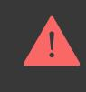

Avoid the situations listed in the tables below. They may affect the reliability of the CO sensor in the short or long term.

# Situations that must be avoided

| Situation                                                       | Possible consequences                                                                                                                                                                               |  |
|-----------------------------------------------------------------|-----------------------------------------------------------------------------------------------------------------------------------------------------------------------------------------------------|--|
| Contamination by alkaline metals                                | Significant changes to the sensor characteristics when the sensor is contaminated by alkaline metals, especially salt water spray.                                                         |  |
| Exposure to high concentrations of common (non-acidic) gases | Exposure to high concentrations of common gases such as ammonia may cause irreversible changes. Avoid long-term exposure to or use of packing materials that may generate common gases. |  |
| Impact of volatile organic compounds (VOCs)                     | Prolonged off-gassing from such VOCs may cause irreversible changes to: styrene (commonly used in blister packs and packing trays);                                                        |  |
|                                                                 | α-pinene (found in some kinds of printing inks).                                                                                                                                                 |  |
|                                                                 | Avoid packing the FireProtect 2 in a tightly closed container where VOC gases may be                                                                                                             |  |

|                    | present.                                                                                             |
|--------------------|------------------------------------------------------------------------------------------------------|
|                    | Excessive exposure to alcohol or acetone vapors the sensor may cause its temporary disability. |
| Contact with water | Soaking or splashing the sensor with water may change its characteristics.                        |

# Situations to avoid whenever possible

| Situation                                            | Possible consequences                                                                                                                                                                |  |
|------------------------------------------------------|--------------------------------------------------------------------------------------------------------------------------------------------------------------------------------------|--|
| Exposure to silicone vapors                          | Sensor failure because of the exposure to silicone adhesives, hair grooming materials, or silicone rubber/putty.                                                               |  |
| Dew condensation                                     | The clog of gas diffusion route or deterioration of the sensing membrane. Avoid severe dew condensation that occurs for an extended period inside or on the sensor surface. |  |
| Exposure to hydrogen sulfide or sulfuric acid gas | Sensor components corrosion, resulting in sensor damage.                                                                                                                          |  |
| Presence of dust and oil mist                        | Clogging of the sensor's internal structure caused by extremely high dust or oil mist concentrations.                                                                          |  |

# Additional cautions for installation

The sensor requires oxygen to function properly and have the characteristics described in this manual. The sensor will not operate properly in a zero-oxygen environment.

# Technical specifications

All technical specifications of FireProtect 2 RB (Heat/CO)

## Complete set

- **1.** FireProtect 2 RB (Heat/CO) Jeweller.
- **2.** SmartBracket mounting panel.
- **3.** Installation kit.
- **4.** 2 × CR123A batteries (pre-installed).
- **5.** Quick start guide.

# Warranty

Warranty for the Limited Liability Company "Ajax Systems Manufacturing" products is valid for 2 years after purchase.

If the device does not function correctly, please contact the Ajax Technical Support first. In most cases, technical issues can be resolved remotely.

|  | Warranty obligations |
|--|----------------------|
|  |                      |

User Agreement

#### **Contact Technical Support**

- email
- Telegram

# Subscribe to the newsletter about safe life. No spam Email Subscribe