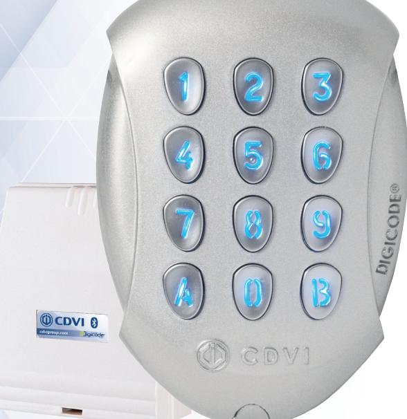

# **GALEO BT**

# *Keypad GALEO Bluetooth*

1

### **1] GENERAL INFORMATION**

- *Construction: Zamak® cast alloy*
- *Remote electronics*
- *Surface mount*
- *Capacity of 100 user codes of 4 or 5 digits*
- *Stored in EEPROM memory*
- *Buzzer audible signal*
- *Backlit keys*
- *Bluetooth connection*
- *3 dry contact relay outputs*
- Adjustable time output: 1 to 99 seconds and toggle mode
- Operating voltage: 12-24Vac and 12-48Vdc
- Consumption: 54 to 195mA
- Mounting with Torx® screws
- Dimensions (L x W x D): 110 x 75 x 15 mm
- User modification of codes

### **2] NOTES & RECOMMENDATIONS**

### **Recommended power supplies.**

- ADC324 (24Vdc).
- Separate power supply for the control elements.

#### **Wiring**

- The distance between the keypad and the remote electronic can not exceed more than 50 meters.
- Make sure that the cable is not near by a high voltage cables (ex: 230V ac).
- Recommended cable between the keypad and the remote electronics: 2 twisted pairs (4 wires) SYT1 0.8MM.

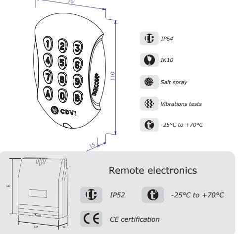

### **Mounting recommendations**

Mount the keypad on a flat surface to avoid any vandalism and to insure the best mounting.

#### **Security advice**

- For security advice reasons, change the factory default master code.
- When selecting a master code and user code avoid simple codes (example : **3 4 5 6 7**).

### **Back EMF protection**

To secure the system from back electromagnetic fields do not forget to mount the varistor in parallel on the lock.

|                      | Varistor | (M4x10) Torx® screw | T20 Torx® Spanner | Caps | (M4x30) mounting screws | Plastic anchors | Wiring sealed cap | Wiring sealed cap | Mounting plate for remote electronic box |
|----------------------|----------|---------------------------|----------------------|------|-------------------------------|--------------------|-------------------------|-------------------------|------------------------------------------------------|
| GALEO                | -        | 1                         | 1                    | 1    | 2                             | 2                  | -                       | -                       | -                                                    |
| Remote Controller | 1        | -                         | -                    | -    | 2                             | 2                  | 2                       | 2                       | 1                                                    |

### **3] MOUNTING KIT**

**(x4)**

**(x4)**

**(x4)**

### **4] MOUNTING**

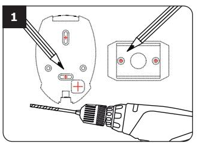

*Verify the distance between the GALEO keypad and its remote electronic (Refer to page 3 «Notes and Recommendations»). Place the back plate of the GALEO on the wall and the bracket of the remote electronic then mark with a pen the hole location then drill the 2 mounting holes (drill bit Ø 5 mm and 35 mm hole depth) and the hole wiring access.*

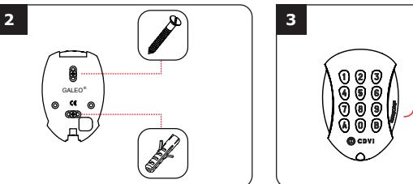

*Insert the 2 plastic anchors in the holes. Place the back plate of the GALEO and screw on the wall using the supplied (M4x30) mounting screws.*

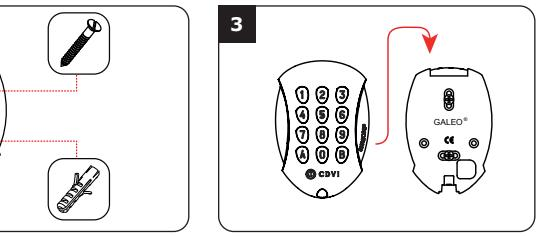

*Insert the cable in the hole access area of the back plate. Then mount the keypad on the back plate, placing first the top in the hooks and then the bottom.*

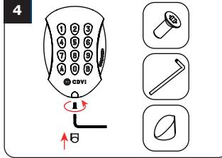

GALEO GALEO ® ®

GALEO GALEO ® ®

GALEO GALEO ® ®

*Fasten the GALEO keypad to the back plate by using the supplied (M4x10) Torx® screw and T20 Trox spanner hardware. Place the screw cap at the bottom of the keypad.*

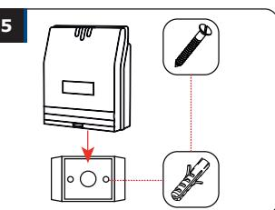

*Insert the 2 plastic anchors in the holes. Place the bracket of the electronic and screw on the wall using the supplied M4x30 screws. Slide the box from up to down on the bracket.*

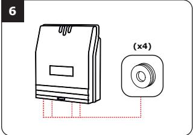

*Insert the cable in the remote electronic and wire the cable to the terminals. Do not forget to install the varistor on the lock (Refer to page 3 «Notes and Recommendations»).*

### **5] WIRING DIAGRAM**

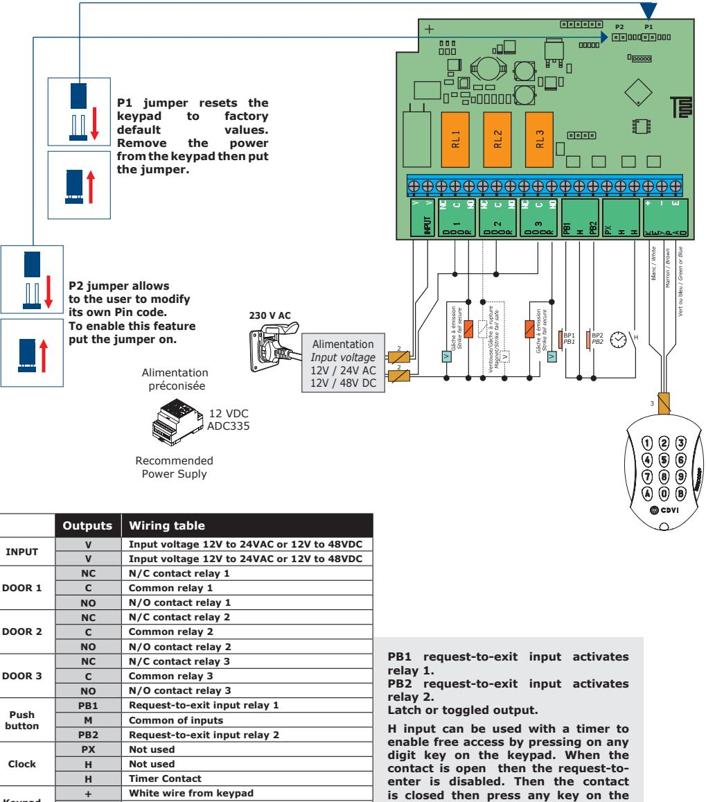

**keypad to enter.**

**- Brown wire from keypad E Green or Blue wire (illumination)**

**Keypad TMGALEO**

### **A. First use after reset**

#### **1. Power up the system**

#### **On the remote electronics:**

- Green LED lights on
- Then the Red LED lights on
- Then the Red and Green LED flash

#### **On the keypad:**

- 1 beep is emitted
- The keypad lights on and flashes

#### **2. Enter a new code twice for the master code (only 5 terms).**

### **The 12345 code is forbidden in master code.**

- The keypad stop flashing
- After the first entry of the master code, the keypad flashes 1 time
- Enter the second entry of the master code
- If both entry of the master code are the same, 2 beeps are emitted. Otherwise, wait until the keypad flashes again to enter the new master code twice (about 10 seconds)
- Entry in programming mode

### **3. Configure the system with the**

**programming chart on the next page.**

- Press B to exit from programming mode.

### **B. Reset memory**

#### **1. Cut off the power and put the jumper on P1.**

- Refer to page 4 for the jumper P1 on the remote electronics
#### **2. Put the power back :**

#### **On the remote electronics:**

- Red LED lights on during reset
- After the reset, Red and Green LEDs still flashing while waiting new master code

#### **On the Keypad:**

- 6 short beeps are emitted during reset and at the end 1 long beep is emitted
- The keypad still flashing while waiting new master code

### **3. Pull out the jumper on P1**

- Master code and user codes are cleared and set to default value
#### **4. Start again from part A**

### **C. Reset master code**

**On stand-by operating mode, put a jumper on P1. Wait until the keypad flashes to enter new master code.** 

#### **On the remote electronics:**

- Red LED lights on during the reset of the master code
- Then Green LED lights on

#### **On the keypad:**

- 3 short beeps are emitting during the reset of the master code and after that 1 long beep is emitted
- The keypad flashes while waiting the entry of a new master code

### **D. Changing the code by user**

**To authorize a user to modify its own user code, put a jumper on P2 (to disable the feature, remove the jumper)**

#### **1. Enter the current user code**

- The relay is activated and a beep is emitted
#### **2. Enter the 2 digits sub master code**

- Relay 1, default sub master code: A and B
- Relay 2, default sub master code: 1 and 3
- Relay 3, default sub master code: 4 and 6
- A beep is emitted to authorize the modification

#### **3. Enter the new user code**

- 2 beeps are emitted to confirm the new code
#### **4. Check the new user code to be sure of the modification**

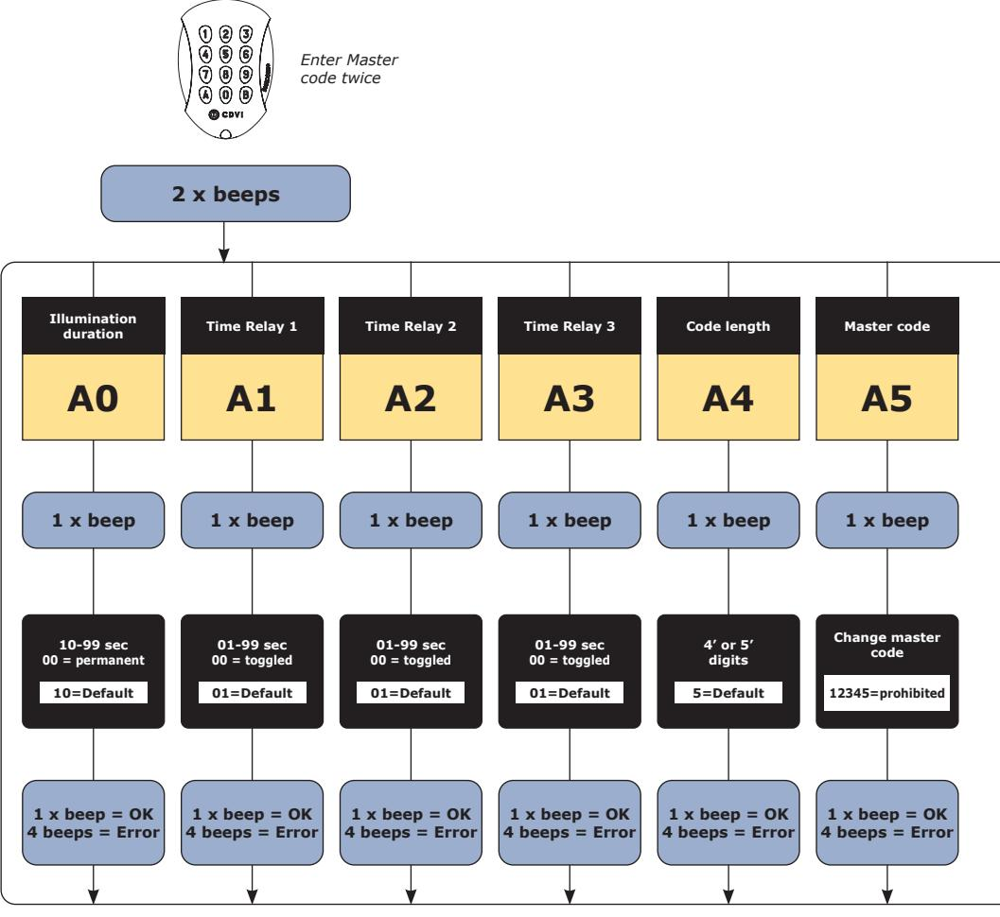

**REMINDER**

*GALEO Relays 3 (3 outputs)* **Relay 1 : From 00 to 59, Relay 2 : From 60 to 79, Relay 3 : From 80 to 99.**

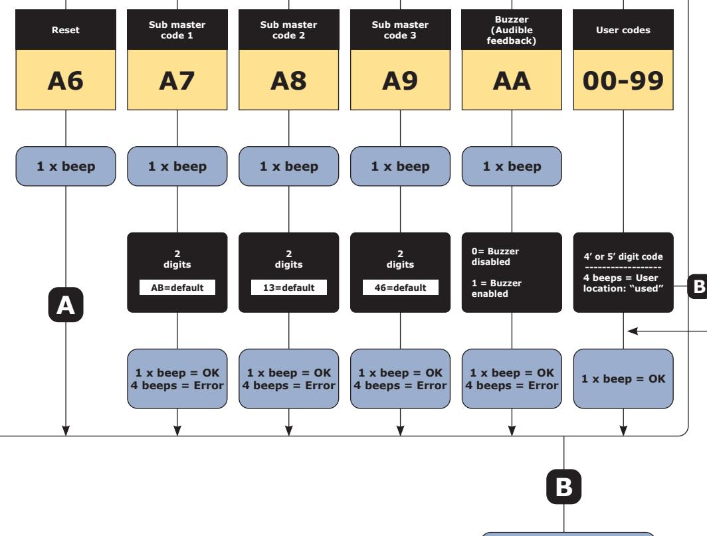

**2 x beeps**

Download MyDigicode® app.

Open the app and get familiare with the menus.

Press Add a new Digicode, the application will now look for unknown Digicodes, the one with the lowest RSSI value is normally the one closest to you.

Configure Digicode as a new keypad and follow the steps in the app

Codes that are shared will be stored in « contacts »

Share your user codes with your friends

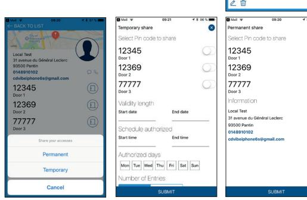

Don't want to read? Check out the video!

### *This spread sheet will help you keep track of the user codes programmed in the keypad*

| User location   | Code |  |  | Name | User location                                                                                               | Code |  |  | Name |  | User location | Code |    |  |  |  | Name |  |  |
|--------------------|------|--|--|------|----------------------------------------------------------------------------------------------------------------|------|--|--|------|--|------------------|------|----|--|--|--|------|--|--|
| 00                 |      |  |  |      |                                                                                                                | 34   |  |  |      |  |                  |      | 68 |  |  |  |      |  |  |
| 01                 |      |  |  |      |                                                                                                                | 35   |  |  |      |  |                  |      | 69 |  |  |  |      |  |  |
| 02                 |      |  |  |      |                                                                                                                | 36   |  |  |      |  |                  |      | 70 |  |  |  |      |  |  |
| 03                 |      |  |  |      |                                                                                                                | 37   |  |  |      |  |                  |      | 71 |  |  |  |      |  |  |
| 04                 |      |  |  |      |                                                                                                                | 38   |  |  |      |  |                  |      | 72 |  |  |  |      |  |  |
| 05                 |      |  |  |      |                                                                                                                | 39   |  |  |      |  |                  |      | 73 |  |  |  |      |  |  |
| 06                 |      |  |  |      |                                                                                                                | 40   |  |  |      |  |                  |      | 74 |  |  |  |      |  |  |
| 07                 |      |  |  |      |                                                                                                                | 41   |  |  |      |  |                  |      | 75 |  |  |  |      |  |  |
| 08                 |      |  |  |      |                                                                                                                | 42   |  |  |      |  |                  |      | 76 |  |  |  |      |  |  |
| 09                 |      |  |  |      |                                                                                                                | 43   |  |  |      |  |                  |      | 77 |  |  |  |      |  |  |
| 10                 |      |  |  |      |                                                                                                                | 44   |  |  |      |  |                  |      | 78 |  |  |  |      |  |  |
| 11                 |      |  |  |      |                                                                                                                | 45   |  |  |      |  |                  |      | 79 |  |  |  |      |  |  |
| 12                 |      |  |  |      |                                                                                                                | 46   |  |  |      |  |                  |      | 80 |  |  |  |      |  |  |
| 13                 |      |  |  |      |                                                                                                                | 47   |  |  |      |  |                  |      | 81 |  |  |  |      |  |  |
| 14                 |      |  |  |      |                                                                                                                | 48   |  |  |      |  |                  |      | 82 |  |  |  |      |  |  |
| 15                 |      |  |  |      |                                                                                                                | 49   |  |  |      |  |                  |      | 83 |  |  |  |      |  |  |
| 16                 |      |  |  |      |                                                                                                                | 50   |  |  |      |  |                  |      | 84 |  |  |  |      |  |  |
| 17                 |      |  |  |      |                                                                                                                | 51   |  |  |      |  |                  |      | 85 |  |  |  |      |  |  |
| 18                 |      |  |  |      |                                                                                                                | 52   |  |  |      |  |                  |      | 86 |  |  |  |      |  |  |
| 19                 |      |  |  |      |                                                                                                                | 53   |  |  |      |  |                  |      | 87 |  |  |  |      |  |  |
| 20                 |      |  |  |      |                                                                                                                | 54   |  |  |      |  |                  |      | 88 |  |  |  |      |  |  |
| 21                 |      |  |  |      |                                                                                                                | 55   |  |  |      |  |                  |      | 89 |  |  |  |      |  |  |
| 22                 |      |  |  |      |                                                                                                                | 56   |  |  |      |  |                  |      | 90 |  |  |  |      |  |  |
| 23                 |      |  |  |      |                                                                                                                | 57   |  |  |      |  |                  |      | 91 |  |  |  |      |  |  |
| 24                 |      |  |  |      |                                                                                                                | 58   |  |  |      |  |                  |      | 92 |  |  |  |      |  |  |
| 25                 |      |  |  |      |                                                                                                                | 59   |  |  |      |  |                  |      | 93 |  |  |  |      |  |  |
| 26                 |      |  |  |      |                                                                                                                | 60   |  |  |      |  |                  |      | 94 |  |  |  |      |  |  |
| 27                 |      |  |  |      |                                                                                                                | 61   |  |  |      |  |                  |      | 95 |  |  |  |      |  |  |
| 28                 |      |  |  |      |                                                                                                                | 62   |  |  |      |  |                  |      | 96 |  |  |  |      |  |  |
| 29                 |      |  |  |      |                                                                                                                | 63   |  |  |      |  |                  |      | 97 |  |  |  |      |  |  |
| 30                 |      |  |  |      |                                                                                                                | 64   |  |  |      |  |                  |      | 98 |  |  |  |      |  |  |
| 31                 |      |  |  |      |                                                                                                                | 65   |  |  |      |  |                  |      | 99 |  |  |  |      |  |  |
| 32                 |      |  |  |      |                                                                                                                | 66   |  |  |      |  |                  |      |    |  |  |  |      |  |  |
| 33                 |      |  |  |      |                                                                                                                | 67   |  |  |      |  |                  |      |    |  |  |  |      |  |  |
| REMINDER RAPPEL |      |  |  |      | GALEO Relays 3 (3 outputs) Relay 1 : From 00 to 59, Relay 2 : From 60 to 79, Relay 3 : From 80 to 99. |      |  |  |      |  |                  |      |    |  |  |  |      |  |  |

### **6] LIMITED LIFETIME WARRANTY [EXTRACT]***

CDVI warrants this product to be free from defects in material and workmanship, when it has been installed in accordance with the manufacturer's instructions and has not been modified or tampered with. Only product recognized by CDVI to be defective should be returned under these warranty terms if accompanied by an RMA (Return Material Authorization Number) provided by CDVI. CDVI, at its option, shall repair or replace the defective product at CDVI premises or at any CDVI approved service center. This warranty does not cover any damage due to accident, misuse, abuse or negligence. This warranty is valid only if the product is registered, within 1 month from delivery to the final costumer. To obtain full details of this warranty and to register the product to commence the "Limited Lifetime Warranty", complete the enclosed registration card and return it, either by e-mail or post, to the relevant CDVI address or completion of the on line registration at www.cdvigroup.com. Repair or replacement of the defective product is the exclusive remedy. CDVI shall not be liable for any incidental or consequential damages arising from any defect in, or malfunction of, its product. In no event the entire liability can not exceed the purchase price of the product. The CDVI local country contact details can be found on line by visiting www.cdvigroup.com or on the back cover of the installation manual.

**DISCLAIMER OF WARRANTY:** EXCEPT AS STATED ABOVE, CDVI MAKES NO WARRANTIES, EITHER EXPRESS OR IMPLIED, AS TO ANY MATTER WHATSOEVER, INCLUDING THE CONDITION OF ITS PRODUCTS, THE TRANSPORTATION, THEIR MERCHANTABILITY OR FITNESS FOR ANY PARTICULAR PURPOSE.

| 7] NOTES |  |
|----------|--|
|          |  |
|          |  |
|          |  |
|          |  |
|          |  |
|          |  |
|          |  |
|          |  |
|          |  |
|          |  |
|          |  |
|          |  |
|          |  |
|          |  |
|          |  |
|          |  |
|          |  |
|          |  |
|          |  |
|          |  |
|          |  |
|          |  |

**Refer to Limited Lifetime Warranty conditions*

# **1] PRODUKTSPECIFIKATION**

- *Material: Zamak® gjutaluminium.*
- *Delat montage*
- *Utanpåliggande montage*
- *Klarar upp till 100 koder med 4 eller 5 siffror*
- *Inbyggt EEPROM-minne*
- *Ljudindikering*
- *Bakgrundbelysta knappar*
- *Bluetooth programmering*
- *3 potentialfria reläutgångar*
- Tidinställning för reläutgång: 1 till 99 sekunder eller växlande funktion
- Spänningsmatning: 12-24Vac och 12-48Vdc
- Strömbörbrukning: 54 till 195mA
- Monteras med Torx® skruvar
- Dimensioner (L x B x H): 110 x 75 x 15 mm
- Användaren kan själv byta kod

# **2] INFORMATION OCH REKOMMENDATIONER**

### **Rekommenderade nätaggregat**

- ADC324 (24Vdc).
- Separat nätaggregat för tillkopplade enheter.

### **Kablage**

- Avståndet mellan knappsatsen och styrenheten bör inte överstiga 50 meter.
- Se till att kablarna inte dras nära
- högspänningsledningar (ex: 230 V AC).

- Rekommenderad kabel mellan knappsatsen och styrenhet : En fyrledare (4 trådar) SYT1 0,8 mm.

### **Monteringsrekommendation**

Montera kodlåset på en plan yta för att förhindra vandalism och för att få bästa möjliga montage.

### **Säkerhets tips**

- Av säkerhetsskäl bör den förinställda
- standardiserade masterkoden ändras.
- Vid val av masterkod och användarkod, undvik sekventiella koder (ex: **3 4 5 6 7**).

### **Rekommenderad installation**

För att säkra systemet mot elektromagnetiska fält, koppla in varistorn parallelt med låsenheten.

### **3] MONTERINGSSATS**

|           | Varistor | (M4x10) Torx® skruv | T20 Torx® fastnyckel | Täcklock | (M4x30) monte rings-skruv |   | Plastplugg Packningar Packningar |   | Monterings platta för styrenhet |
|-----------|----------|---------------------------|-------------------------|----------|---------------------------------|---|----------------------------------|---|---------------------------------------|
| GALEO     | -        | 1                         | 1                       | 1        | 2                               | 2 | -                                | - | -                                     |
| Styrenhet | 1        | -                         | -                       | -        | 2                               | 2 | 2                                | 2 | 1                                     |

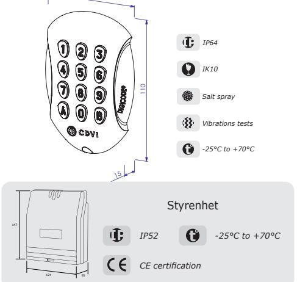

75

**(x4)**

**(x4)**

**(x4)**

### **4] MONTERING**

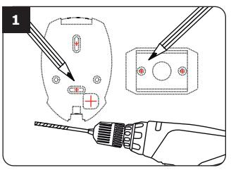

*Kontrollera avståndet mellan GALEO kodlås och styrenhet (Se sid 3 «Information och rekommendationer»). Sätt kodlåsets bakstycke och styrenhetens monteringsplatta mot väggen och markera hålens placering med en penna. Borra sedan två monteringshål och hål för kabeln (Ø 5 mm bits och min. djup 35 mm).*

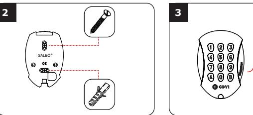

*Sätt plastpluggar i de borrade hålen. Placera kodlåsets bakstycke mot väggen och skruva fast med de bifogade monteringsskruvarna (M4x30).*

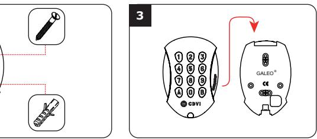

*Trä GALEO-kabeln genom kabelhålet i bakstycket. Kroka fast kodlåset på bakstycket* 

*genom att föra det uppifrån och ner.*

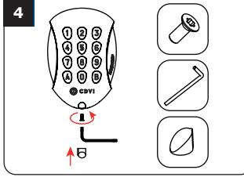

GALEO GALEO ® ®

GALEO GALEO ® ®

GALEO GALEO ® ®

*Skruva fast knappsatsen med M4x10 TORX® skruv och T20 nyckel. Sätt dit skruvens täcklock i nederkant av knappsatsen.*

*Sätt plastpluggar i de borrade hålen. Skruva fast styrenhetens monteringsplatta med M4x30 skruvar. För styrenheten uppifrån och ner för att haka fast den på monteringsplattan.*

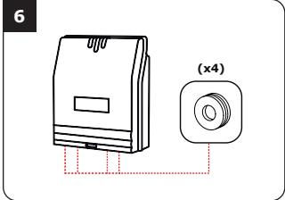

*För in kabeln i styrenheten och anslut med kopplingsplintarna. Glöm inte installera varistorn (Se sid 3 «Information och rekommendationer»).*

### **5] KOPPLINGSSCHEMA**

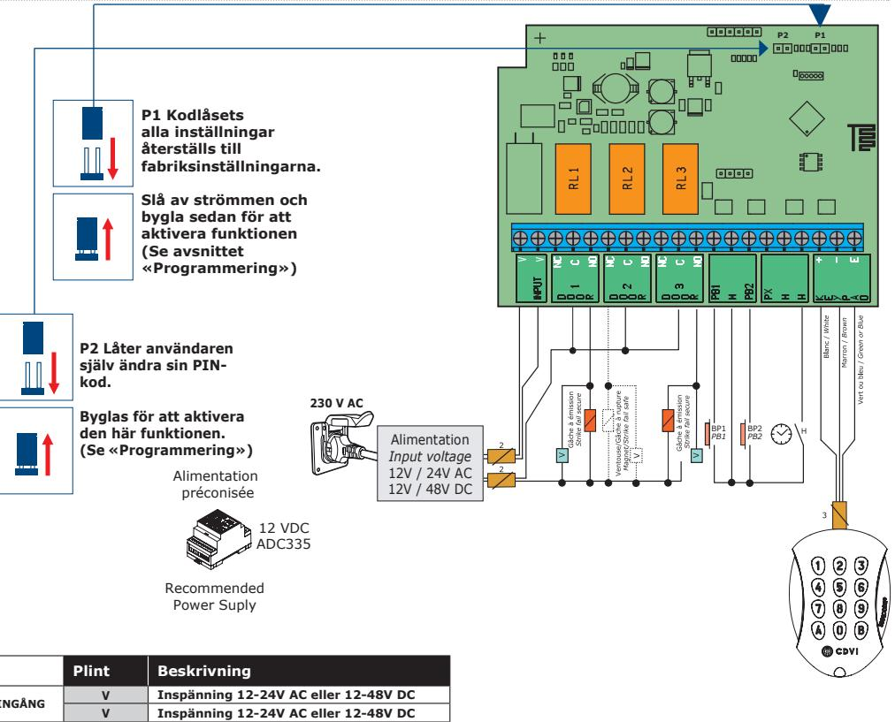

|                    | Plint                                          | Beskrivning                          |  |  |  |  |  |  |  |  |
|--------------------|------------------------------------------------|--------------------------------------|--|--|--|--|--|--|--|--|
|                    | V                                              | Inspänning 12-24V AC eller 12-48V DC |  |  |  |  |  |  |  |  |
| INGÅNG             | V                                              | Inspänning 12-24V AC eller 12-48V DC |  |  |  |  |  |  |  |  |
|                    | NC                                             | N/C kontakt relä 1                   |  |  |  |  |  |  |  |  |
| DÖRR 1             | C                                              | Gemensam relä 1                      |  |  |  |  |  |  |  |  |
|                    | NO                                             | N/O kontakt relä 1                   |  |  |  |  |  |  |  |  |
|                    | NC                                             | N/C kontakt relä 2                   |  |  |  |  |  |  |  |  |
| DÖRR 2             | C                                              | Gemensam relä 2                      |  |  |  |  |  |  |  |  |
|                    | NO                                             | N/O kontakt relä 2                   |  |  |  |  |  |  |  |  |
|                    | NC                                             | N/C kontakt relä 3                   |  |  |  |  |  |  |  |  |
| DÖRR 3             | C                                              | Gemensam relä 3                      |  |  |  |  |  |  |  |  |
|                    | NO                                             | N/O kontakt relä 3                   |  |  |  |  |  |  |  |  |
|                    | PB1                                            | Ingång för öppnarknapp relä 1        |  |  |  |  |  |  |  |  |
| Öppnar knapp    | M                                              | Gemensam ingångar                    |  |  |  |  |  |  |  |  |
|                    | PB2                                            | Ingång för öppnarknapp relä 2        |  |  |  |  |  |  |  |  |
|                    | PX                                             | Används ej                           |  |  |  |  |  |  |  |  |
| Clock              | H                                              | Används ej                           |  |  |  |  |  |  |  |  |
|                    | H                                              | Timer ingång                         |  |  |  |  |  |  |  |  |
|                    | +                                              | Vit kabel från knappsatsen           |  |  |  |  |  |  |  |  |
| Knappsats GALEO | -                                              | Brun kabel från knappsatsen          |  |  |  |  |  |  |  |  |
|                    | Grön eller Blå kabel (Bakgrundsbelysning) E |                                      |  |  |  |  |  |  |  |  |

**PB1 öppnarknappsingång aktiverar relä 1.**

**PB2 öppnarknappsingång aktiverar relä 2.** 

**H Timeringången H (om ansluten) gör det möjligt att använda alla knappar på knappsatsen öppnaknappar. Om timerkontakten är bruten är funktionen avaktiverad. Om timerkontakten är sluten är funktionen aktiverad och alla knappar på knappsatsen fungerar som öppnarknappar.**

### **A. Vid första användning eller efter återställning**

### **1. Sätt i strömmer**

### **Vid styrenheten:**

- Gröna LED lampan är på
- Sen tänds den röda LED lampan
- Sen blinkar både Röd och Grön LED lampa

### **Vid knappsatsen:**

- 1 pipsignal görs
- Knappsatsen tänds och börjar blinka

### **2. Skriv in den nya masterkoden två gånger (endast 5 siffror).**

### **Koden 12345 är förbjuden som masterkod.**

- Knappsatsen slutar blinka
- När du knappar in masterkoden första gången blinkar knappsatsen 1 gång
- Knappa in masterkoden en gång till
- Om båda inmatningarna är korrekta hörs 2 pipsignaler
- Om inte, vänta tills knappsatsen börjar blinka igen och skriv in en ny masterkod två gånger (tar ca 10 sekunder)
- Du är nu i programmeringsläge

#### **3. Gör alla inställningar i systemet enligt programmeringsschemat på kommande uppslag**

**- Tryck B för att gå ur programmeringsläget**

# **B. Återställ minnet**

### **1. Slå av strömmen och sätt en bygeln på P1.**

- Se sidan 16 för att hitta bygeln P1 på styrenheten
### **2. Slå på strömmen :**

### **På styrenheten:**

- Röd LED är tänd under återställningen
- Efter återställningen, Röd och Grön LED blinkar under tiden den väntar på en ny masterkod

### **På knappsatsen:**

- 6 korta pipsignaler hörs under återställningen och avslutas med 1 lång signal
- Knappsatsen blinkar under tiden den väntar på en ny masterkod

### **3. Ta bort bygeln från P1**

- Masterkoden och användarkoderna är nu återställda till standardinställningarna
### **4. Starta igen från steg A**

# **C. Återställ masterkoden**

**Vid stand-by läge, sätt en bygel på P1. Vänta tills knappsatsen blinkar och skriv in den nya masterkoden.**

### **På styrenheten:**

- Röd LED lampa är på under tiden återställningen av masterkoden
- Sen tänds den Gröna LED lampan

### **På knappsatsen:**

- 3 korta pipsignalen hörs under tiden återställningen av masterkoden, det avslutas med 1 lång pipsignal
- Knappsatsen blinkar under tiden den väntar på en ny masterkod

# **D. Ändra koden som användare**

#### **För att användaren skall få tillåtelse att ändra sin egen kod, sätt en bygel på P2 (för att inaktivera funktionen, ta bort bygeln)**

### **1. Skriv in din nuvarande användarkod**

- Reläet akriveras och 1 pipsignal hörs.

#### **2. Skriv in de 2 knapparna i undermasterkoden**

- Relä 1, standard undermasterkod: A och B
- Relä 2, standard undermasterkod: 1 och 3
- Relä 3, standard undermasterkod: 4 och 6
- 1 pipsignal hörs för att bekräfta tillåtelse att ändra

### **3. Skriv in din nya användarkod**

- 2 pipsignaler hörs för att bekräfta den nya koden
### **4. Testa den ny användarkoden för att försäkra dig om att den fungerar**

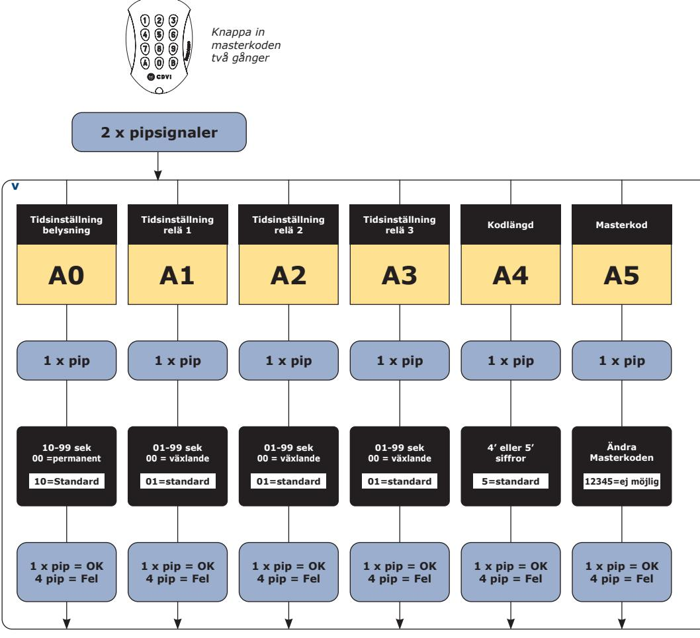

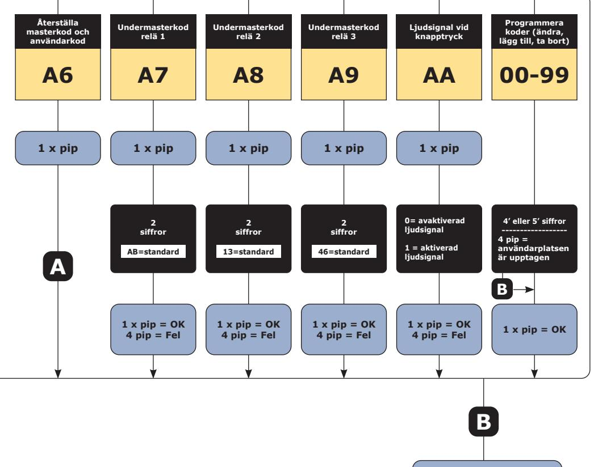

**2 x pip**

**v**

Ladda ner MyDigicode® appen där appar finns.

Öppna appen, och titta på de tre olika menyerna

Tryck på + Lägg till en Digicode, nu söker appen efter okända Digicodes i närheten, välj kodlåset som du vill programmera, den med lägst RSSI värde är generellt den som är närmast.

Konfigurera Digicoden som ett nytt kodlås och följ stegen i appen.

Koder som delas till dig hittar du under menyn Kontakter

Dela dina användarkoder permanent eller tillfälligt med dina kontakter

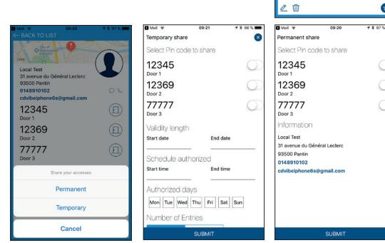

Orkar du inte läsa? Kolla video istället!

### *Anteckningar - Lista över användarkoder*

| Plats |          | Kod |  |  | Namn                                                                                                                     | Plats | Kod |  |  | Namn | Plats | Kod |    |  |  |  | Namn |  |  |
|-------|----------|-----|--|--|--------------------------------------------------------------------------------------------------------------------------|-------|-----|--|--|------|-------|-----|----|--|--|--|------|--|--|
| 00    |          |     |  |  |                                                                                                                          | 34    |     |  |  |      |       |     | 68 |  |  |  |      |  |  |
| 01    |          |     |  |  |                                                                                                                          | 35    |     |  |  |      |       |     | 69 |  |  |  |      |  |  |
| 02    |          |     |  |  |                                                                                                                          | 36    |     |  |  |      |       |     | 70 |  |  |  |      |  |  |
| 03    |          |     |  |  |                                                                                                                          | 37    |     |  |  |      |       |     | 71 |  |  |  |      |  |  |
| 04    |          |     |  |  |                                                                                                                          | 38    |     |  |  |      |       |     | 72 |  |  |  |      |  |  |
| 05    |          |     |  |  |                                                                                                                          | 39    |     |  |  |      |       |     | 73 |  |  |  |      |  |  |
| 06    |          |     |  |  |                                                                                                                          | 40    |     |  |  |      |       |     | 74 |  |  |  |      |  |  |
| 07    |          |     |  |  |                                                                                                                          | 41    |     |  |  |      |       |     | 75 |  |  |  |      |  |  |
| 08    |          |     |  |  |                                                                                                                          | 42    |     |  |  |      |       |     | 76 |  |  |  |      |  |  |
| 09    |          |     |  |  |                                                                                                                          | 43    |     |  |  |      |       |     | 77 |  |  |  |      |  |  |
| 10    |          |     |  |  |                                                                                                                          | 44    |     |  |  |      |       |     | 78 |  |  |  |      |  |  |
| 11    |          |     |  |  |                                                                                                                          | 45    |     |  |  |      |       |     | 79 |  |  |  |      |  |  |
| 12    |          |     |  |  |                                                                                                                          | 46    |     |  |  |      |       |     | 80 |  |  |  |      |  |  |
| 13    |          |     |  |  |                                                                                                                          | 47    |     |  |  |      |       |     | 81 |  |  |  |      |  |  |
| 14    |          |     |  |  |                                                                                                                          | 48    |     |  |  |      |       |     | 82 |  |  |  |      |  |  |
| 15    |          |     |  |  |                                                                                                                          | 49    |     |  |  |      |       |     | 83 |  |  |  |      |  |  |
| 16    |          |     |  |  |                                                                                                                          | 50    |     |  |  |      |       |     | 84 |  |  |  |      |  |  |
| 17    |          |     |  |  |                                                                                                                          | 51    |     |  |  |      |       |     | 85 |  |  |  |      |  |  |
| 18    |          |     |  |  |                                                                                                                          | 52    |     |  |  |      |       |     | 86 |  |  |  |      |  |  |
| 19    |          |     |  |  |                                                                                                                          | 53    |     |  |  |      |       |     | 87 |  |  |  |      |  |  |
| 20    |          |     |  |  |                                                                                                                          | 54    |     |  |  |      |       |     | 88 |  |  |  |      |  |  |
| 21    |          |     |  |  |                                                                                                                          | 55    |     |  |  |      |       |     | 89 |  |  |  |      |  |  |
| 22    |          |     |  |  |                                                                                                                          | 56    |     |  |  |      |       |     | 90 |  |  |  |      |  |  |
| 23    |          |     |  |  |                                                                                                                          | 57    |     |  |  |      |       |     | 91 |  |  |  |      |  |  |
| 24    |          |     |  |  |                                                                                                                          | 58    |     |  |  |      |       |     | 92 |  |  |  |      |  |  |
| 25    |          |     |  |  |                                                                                                                          | 59    |     |  |  |      |       |     | 93 |  |  |  |      |  |  |
| 26    |          |     |  |  |                                                                                                                          | 60    |     |  |  |      |       |     | 94 |  |  |  |      |  |  |
| 27    |          |     |  |  |                                                                                                                          | 61    |     |  |  |      |       |     | 95 |  |  |  |      |  |  |
| 28    |          |     |  |  |                                                                                                                          | 62    |     |  |  |      |       |     | 96 |  |  |  |      |  |  |
| 29    |          |     |  |  |                                                                                                                          | 63    |     |  |  |      |       |     | 97 |  |  |  |      |  |  |
| 30    |          |     |  |  |                                                                                                                          | 64    |     |  |  |      |       |     | 98 |  |  |  |      |  |  |
| 31    |          |     |  |  |                                                                                                                          | 65    |     |  |  |      |       |     | 99 |  |  |  |      |  |  |
| 32    |          |     |  |  |                                                                                                                          | 66    |     |  |  |      |       |     |    |  |  |  |      |  |  |
| 33    |          |     |  |  |                                                                                                                          | 67    |     |  |  |      |       |     |    |  |  |  |      |  |  |
|       | Kodplats |     |  |  | GALEO 3 Relä Relä 1 : Plats 00 till plats 59, Relä 2 : Plats 60 till plats 79, Relä 3 : Plats 80 till plats 99. |       |     |  |  |      |       |     |    |  |  |  |      |  |  |

### **6] BEGRÄNSAD LIVSTIDSGARANTI [UTDRAG]***

CDVI garanterar att denna produkt är fri från fel i material och utförande, när den är installerad i enlighet med tillverkarens anvisningar och inte har ändrats eller manipulerats. Endast produkter godkända från CDVI som är deffekta, kan returneras enligt dessa villkor. Produkten skall skickas med ett RMA nummer (returnummer) som tillhandahålls av CDVI. CDVI skall efter eget val, reparera eller ersätta den defekta produkten på CDVI egen fabrik, eller enligt CDVI auktoriserat servicecenter. Denna garanti täcker inte skador på grund av olyckshändelse, felaktig användning, missbruk eller försummelse. Denna garanti är enbart giltigt om produkten är registrerad senast 1 månad efter leverans till slutkund. För att få fullständig information om denna garanti, och att registrera produkten för att påbörja "begränsad livstids garanti" fyll i det bifogade registreringsbeviset och återsänd detta, antingen via post eller e-mail till närmaste CDVI kontor, eller registrera online på www.cdvigroup.com. Reparation eller utbyte av den defekta produkten är de två alternativ som finns. CDVI ansvarar inte för oförutsedda skador eller följdskador. Inte under några som helst omständigheter kan skulden överstiga det totala inköpspriset för produkten. Du kan hitta ditt lokala CDVI kontor genom att besöka www.cdvigroup.se eller på baksidan av installationsmanualen.

**GARANTIFRISKRIVNING:** Med undantag från ovanstående, ger CDVI inga garantier, varken uttryckligt eller underförstått, oavsett grund, vilket inkluderar produktens skick, transport, dess säljbarhet eller lämplighet för ett särskilt ändamål.

## **7] ANTECKNINGAR**

**Se fullständiga villkoren för "limited lifetime warranty" i sin helhet på hemsidan www.cdvigroup.com. Vid tveksamheter och tvist angående tolkning har den engelska originaltexten företräde.*

### **1] PRODUKTSPECIFIKATION**

- *Materiale: Zamak® støbt legering.*
- *Delt montering*
- *Overflademontering*
- *Kapacitet: Op til 100 brugerkoder på 4 eller 5 tegn*
- *Indbygget EEPROM-hukommelse*
- *Brummer hørbart signal*
- *Baggrundsbelyste knapper*
- *Bluetooth-forbindelse*
- *3 potentialfri relæudgange*
- Tidsindstilling til relæudgang: 1 til 99 sekunder eller toggle-tilstand
- Spænding: 12-24Vac og 12-48Vdc
- Forbrug: 54 til 195mA.
- Montering med Diax® skruer
- Dimensioner (L x W x D): 110 x 75 x 15 mm
- Bruger kan selv ændre koder

### **2] INFORMATION OG ANBEFALINGER**

### **Anbefalede strømforsyninger**

- ADC324 (24Vdc).
- Separate strømforsyninger til tilkoblede enheder.

### **Kabelføring**

- Afstanden mellem tastatur og styreenhed må ikke overstige 50 meter.
- Kontroller, at kablet ikke er i nærheden af højspænding (ex: 230V AC).
- Anbefalet kabel mellem tastatur og styreenhed: 2 snoede par (4 ledninger) SYT1 0,8MM.

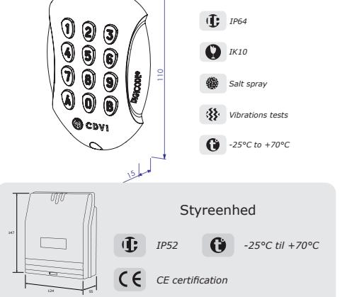

### **Monteringsanbefalinger**

75

Monter kodelåsen på en plan overflade for at undgå vandalisme og sikre den bedst mulige montering.

### **Sikkerhedstips**

- Af hensyn til sikkerheden bør masterkoden fra fabrikken ændres.
- Undgå simple master- og brugerkoder (ex: **3 4 5 6 7**).

### **Beskyttelse mod EMF-stråling**

For at sikre systemet mod elektromagnetiske felter er det vigtigt at montere varistoren parallelt med låseenheden.

|            | Varistor | Torx® skrue (M4x10) | T20 Torx® nøgle | Dæksel | Monterings skrue (M4x30) | Plastik plug | Pakning | Pakning | Monterings- plade til styre enheden |
|------------|----------|---------------------------|--------------------|--------|--------------------------------|-----------------|---------|---------|----------------------------------------------|
| GALEO      | -        | 1                         | 1                  | 1      | 2                              | 2               | -       | -       | -                                            |
| Styreenhed | 1        | -                         | -                  | -      | 2                              | 2               | 2       | 2       | 1                                            |

### **3] MONTERINGSKIT**

**(x4)**

**(x4)**

**(x4)**

### **4] MONTERING**

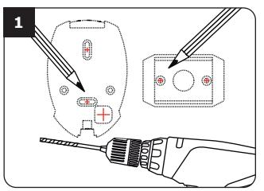

*Kontroller afstanden mellem GA-LEO-kodelåsen og styreenhed (se side 26, Information og anbefalinger). Placer låsens bagdæksel og monteringspladen til styreenheden mod væggen, og markér hullernes placering med en pen. Bor derefter to monteringshuller og hul til kablet (Ø 5 mm. bits og min. dybde 35 mm.).*

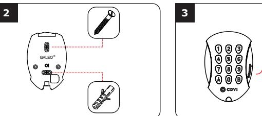

*Sæt plastikplugs i de borede huller. Placer kodelåsens bagplade mod væggen og skru det fast med de medfølgende monteringsskruer (M4x30).* 

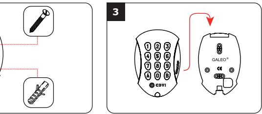

*Før GALEO-kablet gennem kabelhullet i bagdækslet. Monter tastaturet på bagdækslet, oppefra og ned.*

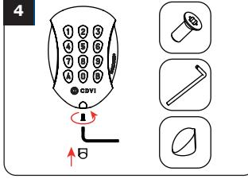

GALEO GALEO ® ®

GALEO GALEO ® ®

GALEO GALEO ® ®

*Skru tastaturet fast med M4x10 TORX- ®skruer og T20-nøgle. Fastgør dækslet til bunden af tastaturet.*

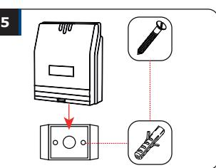

*Sæt de 2 plastikplugs i hullerne. Anbring monteringspladen til styreenheden på væggen og skru det fast med de medfølgende M4x30-skruer. Monter styreenheden på monteringspladen, oppefra og ned.* 

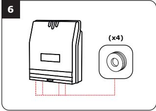

*Indsæt kablet i styreenheden og slut det til koblingsterminalerne. Glem ikke at installere varistoren på låsen. (Se side 26, Information og anbefalinger).*

### **5] KOBLINGSSKEMA**

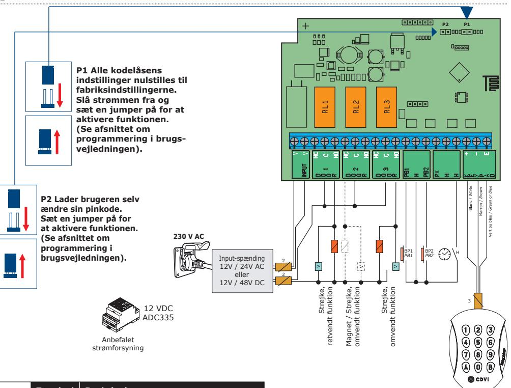

|          | Terminal | Beskrivelse                                 |  |  |  |  |  |  |  |
|----------|----------|---------------------------------------------|--|--|--|--|--|--|--|
|          | V        | Input-spænding 12-24V AC eller 12-48V DC    |  |  |  |  |  |  |  |
| Indgang  | V        | Input-spænding 12-24V AC eller 12-48V DC    |  |  |  |  |  |  |  |
|          | NC       | N/C-kontakt relæ 1                          |  |  |  |  |  |  |  |
| DØR 1    | C        | Fælles relæ 1                               |  |  |  |  |  |  |  |
|          | NO       | N/O-kontakt relæ 1                          |  |  |  |  |  |  |  |
|          | NC       | N/C-kontakt relæ 2                          |  |  |  |  |  |  |  |
| DØR 2    | C        | Fælles relæ 2                               |  |  |  |  |  |  |  |
|          | NO       | N/O-kontakt relæ 2                          |  |  |  |  |  |  |  |
| DØR 3    | NC       | N/C-kontakt relæ 3                          |  |  |  |  |  |  |  |
|          | C        | Fælles relæ 3                               |  |  |  |  |  |  |  |
|          | NO       | N/C-kontakt relæ 3                          |  |  |  |  |  |  |  |
|          | PB1      | Indgang for åbneknap relæ 1                 |  |  |  |  |  |  |  |
| Åbne     | M        | Fælles indgange                             |  |  |  |  |  |  |  |
| knap     | PB2      | Indgang for åbneknap relæ 2                 |  |  |  |  |  |  |  |
|          | PX       | Bruges ikke                                 |  |  |  |  |  |  |  |
| Timer    | H        | Bruges ikke                                 |  |  |  |  |  |  |  |
|          | H        | Timerindgang                                |  |  |  |  |  |  |  |
|          | +        | Hvidt kabel fra tastaturet                  |  |  |  |  |  |  |  |
| Tastatur | -        | Brunt kabel fra tastaturet                  |  |  |  |  |  |  |  |
| TMGALEO  | E        | Grønt eller blåt kabel (Baggrundsbelysning) |  |  |  |  |  |  |  |

**PB1 Åbneknap-indgang aktiverer relæ 1 PB2 Åbneknap-indgang aktiverer relæ 2**

**Timerindgang H (hvis tilsluttet) gør det muligt at anvende alle taster på tastaturet som åbneknapper. Hvis timerkontakten er frakoblet, er funktionen deaktiveret. Hvis timerkontakten er sluttet til, er funktionen aktiveret, og alle taster på tastaturet fungerer som åbneknapper.** 

*Styreenhed*

### **A. Første brug efter nulstilling**

#### **1. Sæt strømmen til**

#### **På styreenheden:**

- Grøn LED lyser.
- Så lyser den røde LED.
- Derefter blinker den røde og grønne LED.

#### **På tastaturet:**

- Der udsendes 1 bip.
- Tastaturet tændes og begynder at blinke.

#### **2. Indtast en ny kode 2 gange for masterkoden (kun 5 cifre).**

#### **Koden 1 2 3 4 5 er forbudt som masterkode.**

- Tastaturet holder op med at blinke.
- Efter den første indtastning af masterkoden blinker tastaturet 1 gang.
- Indtast masterkoden igen.
- Hvis begge indtastninger er korrekte, udsendes 2 bip.

 Hvis ikke, så vent til tastaturet blinker igen og indtast en ny masterkode 2 gange

(det tager ca. 10 sekunder).

- Du er nu i programmeringstilstand.
#### **3. Konfigurer alle indstillinger i henhold til programmeringsoversigten på næste side.**

- Tryk på B for at afslutte programmeringstilstand.

### **B. Nulstil hukommelsen**

#### **1. Afbryd strømmen, og sæt en jumper på P1.**

- Se side 28 for at finde P1-jumperen på styreenheden.
#### **2. Slut strømmen til igen:**

#### **På styreenheden:**

- Rød LED lyser under nulstillingen.
- Efter nulstillingen blinker rød og grøn LED, mens de venter på ny masterkode.

#### **På tastaturet:**

- Der udsendes 6 korte bip under nulstillingen efterfulgt af 1 langt signal.
- Tastaturet blinker, mens det venter på ny masterkode.

#### **3. Fjern jumperen fra P1.**

- Masterkoden og brugerkoderne er nu nulstillet til standardværdi.
#### **4. Start igen fra trin A.**

### **C. Nulstil masterkoden**

**I standby-tilstand sæt en jumper på P1. Vent til tastaturet blinker, og indtast den nye masterkode.** 

#### **På styreenheden:**

- Rød LED lyser under nulstillingen af masterkoden.
- Derefter lyser den grønne LED.

#### **På tastaturet:**

- 3 korte bip udsendes under nulstillingen af masterkoden, der afsluttes med 1 langt signal.
- Tastaturet blinker, mens det venter på ny masterkode.

### **D. Brugerændring af kode**

**For at du som bruger selv skal kunne ændre din brugerkode, skal der sættes en jumper på P2. (Funktionen deaktiveres, når jumperen fjernes).**

#### **1. Indtast din nuværende brugerkode.**

- Relæet aktiveres, og der udsendes 1 bip.
#### **2. Indtast de 2 tegn i undermasterkoden.**

- Relæ 1, standardundermasterkode: A og B.
- Relæ 2, standardundermasterkode: 1 og 3.
- Relæ 3, standardundermasterkode: 4 og 6.
- 1 bip bekræfter, at ændringen er godkendt.

#### **3. Indtast din nye brugerkode.**

- Der udsendes 2 bip for at bekræfte den nye kode.
#### **4. Afprøv din nye kode for at sikre dig, at den fungerer.**

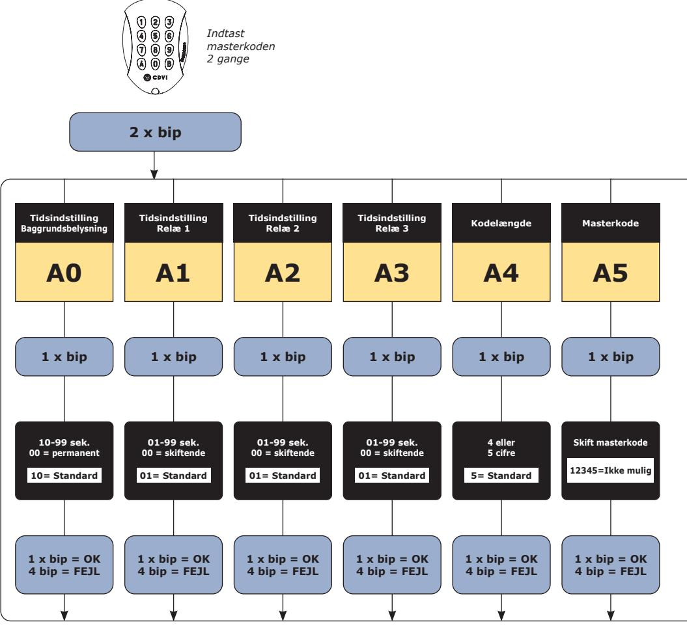

*GALEO Relæ 3* **Relæ 1 : Fra 00 til 59. Relæ 2 : Fra 60 til 79. Relæ 3 : Fra 80 til 99. BEMÆRK**

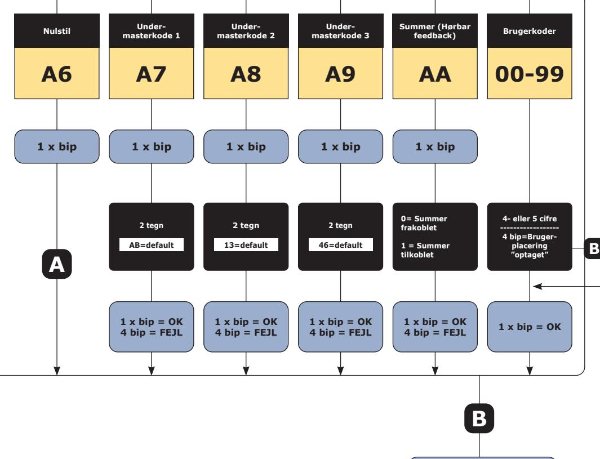

**2 x bip**

Download MyDigicode® app.

Åbn app'en og kig på de 3 forskellige menuer.

Vælg Add a new Digicode.

Brugerkoder i menuen Codes.

Filer, der er delt, vil blive gemt under My contacts.

Del dine brugerkoder permanent eller midlertidigt med dine kontakter.

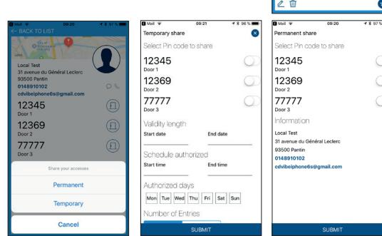

Orkar du inte läsa? Kolla video istället!

### *Med skemaet her kan du holde styr på de brugerkoder, der er programmeret på tastaturet.*

| Bruger placering |  | Kode |  | Navn                                                                                   | Bruger placering |  | Kode |  | Navn |  | Bruger placering | Kode |  | Navn |  |
|---------------------|--|------|--|----------------------------------------------------------------------------------------|---------------------|--|------|--|------|--|---------------------|------|--|------|--|
| 00                  |  |      |  |                                                                                        | 34                  |  |      |  |      |  | 68                  |      |  |      |  |
| 01                  |  |      |  |                                                                                        | 35                  |  |      |  |      |  | 69                  |      |  |      |  |
| 02                  |  |      |  |                                                                                        | 36                  |  |      |  |      |  | 70                  |      |  |      |  |
| 03                  |  |      |  |                                                                                        | 37                  |  |      |  |      |  | 71                  |      |  |      |  |
| 04                  |  |      |  |                                                                                        | 38                  |  |      |  |      |  | 72                  |      |  |      |  |
| 05                  |  |      |  |                                                                                        | 39                  |  |      |  |      |  | 73                  |      |  |      |  |
| 06                  |  |      |  |                                                                                        | 40                  |  |      |  |      |  | 74                  |      |  |      |  |
| 07                  |  |      |  |                                                                                        | 41                  |  |      |  |      |  | 75                  |      |  |      |  |
| 08                  |  |      |  |                                                                                        | 42                  |  |      |  |      |  | 76                  |      |  |      |  |
| 09                  |  |      |  |                                                                                        | 43                  |  |      |  |      |  | 77                  |      |  |      |  |
| 10                  |  |      |  |                                                                                        | 44                  |  |      |  |      |  | 78                  |      |  |      |  |
| 11                  |  |      |  |                                                                                        | 45                  |  |      |  |      |  | 79                  |      |  |      |  |
| 12                  |  |      |  |                                                                                        | 46                  |  |      |  |      |  | 80                  |      |  |      |  |
| 13                  |  |      |  |                                                                                        | 47                  |  |      |  |      |  | 81                  |      |  |      |  |
| 14                  |  |      |  |                                                                                        | 48                  |  |      |  |      |  | 82                  |      |  |      |  |
| 15                  |  |      |  |                                                                                        | 49                  |  |      |  |      |  | 83                  |      |  |      |  |
| 16                  |  |      |  |                                                                                        | 50                  |  |      |  |      |  | 84                  |      |  |      |  |
| 17                  |  |      |  |                                                                                        | 51                  |  |      |  |      |  | 85                  |      |  |      |  |
| 18                  |  |      |  |                                                                                        | 52                  |  |      |  |      |  | 86                  |      |  |      |  |
| 19                  |  |      |  |                                                                                        | 53                  |  |      |  |      |  | 87                  |      |  |      |  |
| 20                  |  |      |  |                                                                                        | 54                  |  |      |  |      |  | 88                  |      |  |      |  |
| 21                  |  |      |  |                                                                                        | 55                  |  |      |  |      |  | 89                  |      |  |      |  |
| 22                  |  |      |  |                                                                                        | 56                  |  |      |  |      |  | 90                  |      |  |      |  |
| 23                  |  |      |  |                                                                                        | 57                  |  |      |  |      |  | 91                  |      |  |      |  |
| 24                  |  |      |  |                                                                                        | 58                  |  |      |  |      |  | 92                  |      |  |      |  |
| 25                  |  |      |  |                                                                                        | 59                  |  |      |  |      |  | 93                  |      |  |      |  |
| 26                  |  |      |  |                                                                                        | 60                  |  |      |  |      |  | 94                  |      |  |      |  |
| 27                  |  |      |  |                                                                                        | 61                  |  |      |  |      |  | 95                  |      |  |      |  |
| 28                  |  |      |  |                                                                                        | 62                  |  |      |  |      |  | 96                  |      |  |      |  |
| 29                  |  |      |  |                                                                                        | 63                  |  |      |  |      |  | 97                  |      |  |      |  |
| 30                  |  |      |  |                                                                                        | 64                  |  |      |  |      |  | 98                  |      |  |      |  |
| 31                  |  |      |  |                                                                                        | 65                  |  |      |  |      |  | 99                  |      |  |      |  |
| 32                  |  |      |  |                                                                                        | 66                  |  |      |  |      |  |                     |      |  |      |  |
| 33                  |  |      |  |                                                                                        | 67                  |  |      |  |      |  |                     |      |  |      |  |
| BEMÆRK              |  |      |  | GALEO Relæ 3 Relæ 1: 00 til 59. Relæ 2: Fra 60 til 79. Relæ 3: Fra 80 til 99. |                     |  |      |  |      |  |                     |      |  |      |  |

### **6] BEGRÆNSET LEVETIDSGARANTI [UDDRAG] ***

CDVI garanterer, at dette produkt er fri for defekter i materiale og udførelse, når det er installeret i overensstemmelse med producentens instruktioner og ikke er blevet ændret eller manipuleret. Kun produkter godkendt af CDVI, som er defekte, kan returneres under disse garantibetingelser. Produktet skal sendes med et RMA-nummer (Return Material Authorization Number) leveret af CDVI. CDVI skal efter eget valg reparere eller erstatte det defekte produkt på CDVIs egen fabrik eller et CDVI-godkendt servicecenter. Denne garanti dækker ikke skader, der skyldes en ulykke, forkert brug, misbrug eller forsømmelse. Denne garanti er kun gyldig, hvis produktet er registreret senest en måned efter levering til slutkunden. For fuldstændig information om denne garanti og for at registrere produktet for at udløse den «begrænsede levetidsgaranti», skal du udfylde det vedlagte registreringsbevis og returnere det, enten via e-mail eller post, til det nærmeste CDVI-kontor eller registrere produktet online på www.cdvigroup.com. Reparation eller ombytning af det defekte produkt er de eneste to alternativer, der findes. CDVI er ikke ansvarlig for nogen skader eller følgeskader. Under ingen omstændigheder kan den samlede gæld overstige produktets købspris. Du kan finde dit lokale CDVI-kontor online ved at besøge www.cdvigroup.com eller på bagsiden af installationshåndbogen.

**GARANTI-ANSVARSFRASKRIVELSE:** Med undtagelse af det ovenfor anførte giver CDVI ingen garantier, hverken udtrykkelige eller underforståede, og uanset hvilken grund, hvad enten det drejer sig om produktets tilstand, transport, salgbarhed eller egnethed til et bestemt formål.

| 7] NOTER |  |  |
|----------|--|--|
|          |  |  |
|          |  |  |
|          |  |  |
|          |  |  |
|          |  |  |
|          |  |  |
|          |  |  |
|          |  |  |
|          |  |  |
|          |  |  |
|          |  |  |
|          |  |  |
|          |  |  |
|          |  |  |
|          |  |  |
|          |  |  |
|          |  |  |
|          |  |  |
|          |  |  |
|          |  |  |
|          |  |  |
|          |  |  |

** Se betingelser for begrænset levetidsgaranti*

**Extranet :** CDVI_IM GALEO BT CMYK A5 EN-SE-DK 02

**CDVI Group** FRANCE (Headquarters) Phone: +33 (0) 1 48 91 01 02

**CDVI FRANCE + EXPORT** +33 (0) 1 48 91 01 02 www.cdvi.com

**CDVI AMERICAS [CANADA - USA]** +1 (450) 682 7945 www.cdvi.ca

#### **CDVI BENELUX [BELGIUM - NETHERLANDS - LUXEMBOURG]**

+32 (0) 56 73 93 00 www.cdvibenelux.com

**CDVI TAIWAN** +886 (0) 42471 2188 www.cdvichina.cn

**CDVI SUISSE** +41 (0) 21 882 18 41 www.cdvi.ch

**CDVI CHINA** 

+86 (0) 10 84606132/82 www.cdvichina.cn

**CDVI IBÉRICA [SPAIN - PORTUGAL]** +34 (0) 935 390 966

**CDVI ITALIA** +39 (0) 321 90 573 - www.cdvi.it

**CDVI MAROC** +212 (0) 5 22 48 09 40 www.cdvi.ma

www.cdviberica.com

**CDVI NORDICS [SWEDEN - DENMARK - NORWAY - FINLAND]** +46 (0) 31 760 19 30

www.cdvi.se

**CDVI UK [UNITED KINGDOM - IRELAND]** +44 (0) 1628 531300 www.cdvi.co.uk

**CDVI POLSKA** +48 (0) 12 659 23 44 www.cdvi.com.pl

*All the information contained within this document (pictures, drawings, features, specifications and dimensions) could be perceptibly different and can be changed without prior notice.*

# **www.cdvigroup.com**