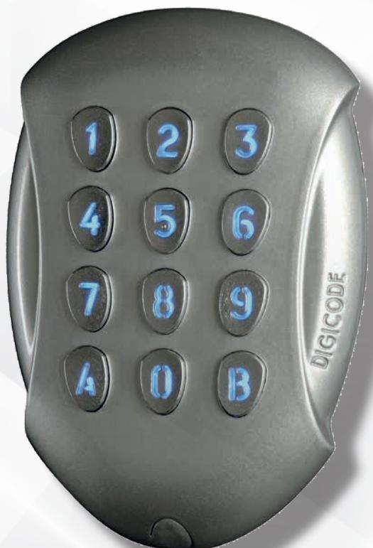
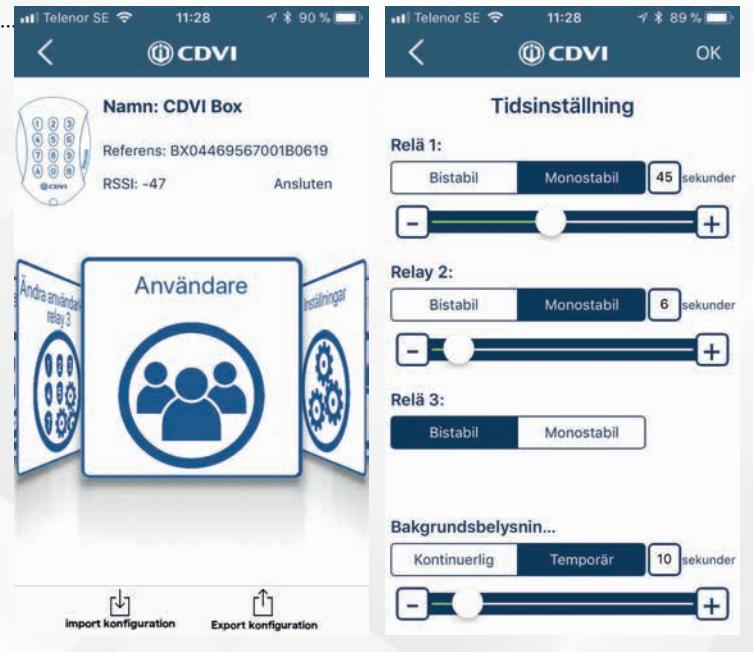
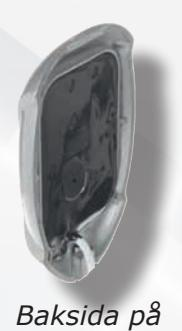
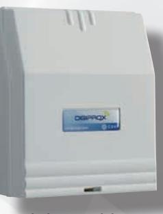
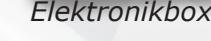
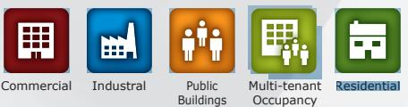

## **GALEO BT**

*MODERNT, VATTENTÄTT KODLÅS I DELAT MONTAGE MED GALEO 4.*

> *The installer's choice*  **cdvi.se**

## **VATTENTÄTT KODLÅS I DELAT MONTAGE MED GALEO 4.**

## **GALEO BT**

- *> Modernt, vattentätt kodlås i delat montage*
- *> Blå bakgrundsbelysta knappar med justerbar belysningtid*
- *> Enkel programmering via App eller knappsats*
- *> Tre reläutgångar, N/O eller N/C, max 5A/250V*
- *> Klarar 100st valfria 4- eller 5-siffriga koder*
- *> Knappsats tillverkat i Zamak, gjutaluminium*
- *> Driftspänning: 12-24VAC, 12-48VDC*
- *> Temperaturområde: -25 +70OC*
- *> Vattentät, IP64*
- *> Mått: 110x75x15mm (knappssats) 147x124x55mm (elektronikbox)*
- *> 10 års produktgaranti*

*knappsats*

**CDVI** Sweden AB Datavägen 12B 43632 ASKIM (GÖTEBORG)

Tel: +46 (0)31 760 19 30

*cdvigroup.com cdvi.se*