*Wireless keypad*

1

# **1] GENERAL INFORMATION**

- *Wireless RF keypad.*
- *Polished heavy duty Zamak® cast alloy.*
- *Backlit keys.*
- *Frequency : 433,92 Mhz.*
- *2 channels (buttons «A» and «B»).*
- *Compatible with Erone® receivers.*
- *Compact.*
- *Surface mount.*
- *Mounting with Torx® screws*
- *Partially sealed with epoxy.*
- *22 User codes 4 or 5 digits.*
- *1 Master code 5 digits.*
- Audible and visual feedback.
- Modulation: AM/ASK.
- Encoding: Keeloq® hopping code
- Dimensions (L x W x D): 112 x 77 x 27mm,
- Supply: Lithium battery 3,6V LS14500 (Supplied).
- Current consumption:
	- 28 mA in transmission,
	- 0,8uA in sleep-mode.

- *Environmental tests: vibrations*
*IP64 -25°C a +70°C*

- *Environmental test: Salt spray*
- *Certification FCC CFR 47 part 15 compliance**

#### *FCC ID : PWN1002000029 **

*The device complies with part 15 of the FCC Rules. Operation is subjected to the following 2 conditions: Firstly, this device may not cause harmful interference and, secondly, this device must accept any interference received, including interference that may cause undesired operation.*

# **2] NOTES & RECOMMENDATIONS**

### **Mounting recommendations**

Mount the keypad on a flat surface to avoid any vandalism and to insure the best mounting.

### **Security advice**

For security advice reasons, change the factory default master code. When selecting a master code and user code avoid sequencial codes (example : **3 4 5 6 7**).

### **RF exposure warning**

This EUT** is in compliance with MPE*** in accordance with procedures specified in FCC 47 CFR § 1.1310 and 2.1091.

To satisfy FCC RF exposure requirements, a separation distance of minimum 20cm must be maintained between this device and users during operation.

The antenna used for this transmitter must not be colocated in conjunction with any other antenna or transmitter.

> *** EUT "Equipment Under Test" *** MPE "Maximum Permissible Emission"*

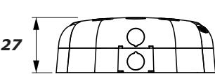

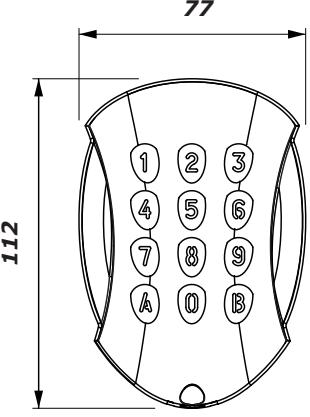

## **3] MOUNTING KIT**

|        | (M4x10) Torx® screw) | T20 Torx® Spanner | Cache vis plastique | (M4x30) mounting screws | Plastic anchors | Battery | Foam |
|--------|----------------------------|----------------------|------------------------|-------------------------------|--------------------|---------|------|
| GALEOR | 1                          | 1                    | 1                      | 2                             | 2                  | 1       | 1    |

## **4] MOUNTING**

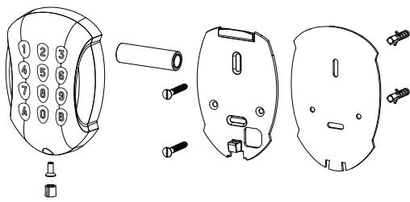

- *Drill the 2 mounting holes (drill bit Ø 5 mm and 35 MM hole depth) and the hole wiring access.*
- *Insert the 2 plastic anchors in the holes.*

Wireless keypad

- *Stick the foam to sealed The GALEOR on the back side of the base (Important).*
- *Place the back plate of the GALEOR and screw on the wall using the supplied (M4x30) mounting screws.*
- *Remove the plastic protection of the battery and then mount the keypad on the back plate, placing first the top in the hooks and then the bottom.*
- *Fasten the GALEOR keypad to the back plate by using the supplied (M4x10) Torx® screw and T20 Torx® spanner hardware.*
- *Place the screw cap at the bottom of the keypad.*

|      | Channel |   |      |  |  |  |  |      |
|------|---------|---|------|--|--|--|--|------|
| User | A       | B | Code |  |  |  |  | Name |
| 01   |         |   |      |  |  |  |  |      |
| 02   |         |   |      |  |  |  |  |      |
| 03   |         |   |      |  |  |  |  |      |
| 04   |         |   |      |  |  |  |  |      |
| 05   |         |   |      |  |  |  |  |      |
| 06   |         |   |      |  |  |  |  |      |
| 07   |         |   |      |  |  |  |  |      |
| 08   |         |   |      |  |  |  |  |      |
| 09   |         |   |      |  |  |  |  |      |
| 10   |         |   |      |  |  |  |  |      |
| 11   |         |   |      |  |  |  |  |      |

|      | Channel |   |      |  |  |  |  |      |
|------|---------|---|------|--|--|--|--|------|
| User | A       | B | Code |  |  |  |  | Name |
| 12   |         |   |      |  |  |  |  |      |
| 13   |         |   |      |  |  |  |  |      |
| 14   |         |   |      |  |  |  |  |      |
| 15   |         |   |      |  |  |  |  |      |
| 16   |         |   |      |  |  |  |  |      |
| 17   |         |   |      |  |  |  |  |      |
| 18   |         |   |      |  |  |  |  |      |
| 19   |         |   |      |  |  |  |  |      |
| 20   |         |   |      |  |  |  |  |      |
| 21   |         |   |      |  |  |  |  |      |
| 22   |         |   |      |  |  |  |  |      |

# **5] USER CODES TABLE**

## **6] PROGRAMMING**

#### **GALEOR FACTORY SETTINGS :**

- No user codes.
- Buzzer ON
- Time-out backlit : *3 Sec.*
- Transmission time-out : *25 seconds*
- Factory master code : **1 2 3 4 5.**
- Programming time-out : *10 seconds.*
- Channel choices :
- *Channel 1 = A,*
- *Channel 2 = B.*

#### **AUDIBLE FEEDBACKS :**

- 1 beep : Power-up ( battery insertion )
- 1 long beep :
- *Enter on menu,*
- *Validation of a programming choice,*
- *Exit from a menu choice.*
- 2 beeps : Confirm enter in factory recovery 3 beeps : confirm factory recovery "A+1"
- 4 beeps :
- *Confirm factory recovery "B+3",*
- *Error for wrong channel,*
- *Error for insertion of a code already Memorized.*

#### **USING RULES AND USER CODES:**

- All the buttons can be used to compose the personal access code, except A and B.
- The master code must be composed by 5 digits.
- The user codes can be composed by
- 4 or 5 digits according to initial setting
- The master code cannot be used as transmission code.

# **7] GETTING STARTED**

*The keypad comes without any setting for the user digit number. At the battery insertion the 12 leds start to blink, waiting for this setting.* 

- PRESS the **key 4** for **4 sec**. to set 4-digits user codes **--> 4 beeps**
- PRESS the **key 5** for **5 sec**. to set 5-digits user codes **--> 5 beeps**

After this setting, the keypad will accept only user codes composed by 4 or 5 digits, according to the choice made. If no change is done ( change of the master code, user code memorization, etc ) just by removing the battery the keypad comes back the factory settings and requires again to set the number of digits.

*Once set the number of digits and made any change, the data-base remains definite and cannot be changed unless a factory default procedure is carried out ( see procedure "B+3").*

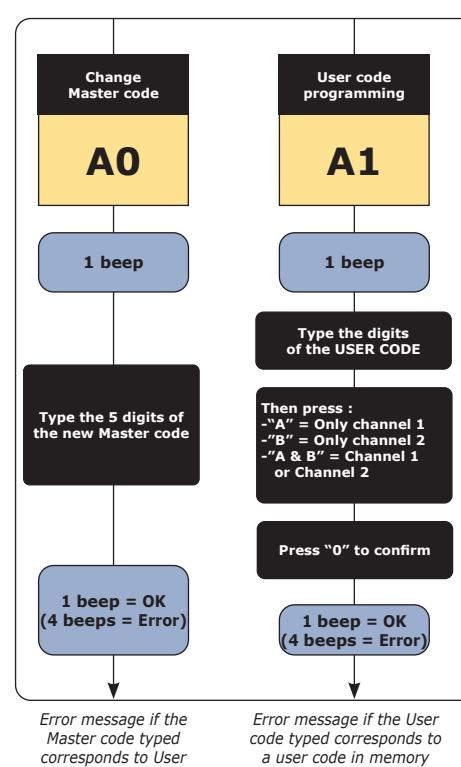

*code in memory* 

*a user code in memory -------- or ------- the memory is full -------- or ------- is 12345*

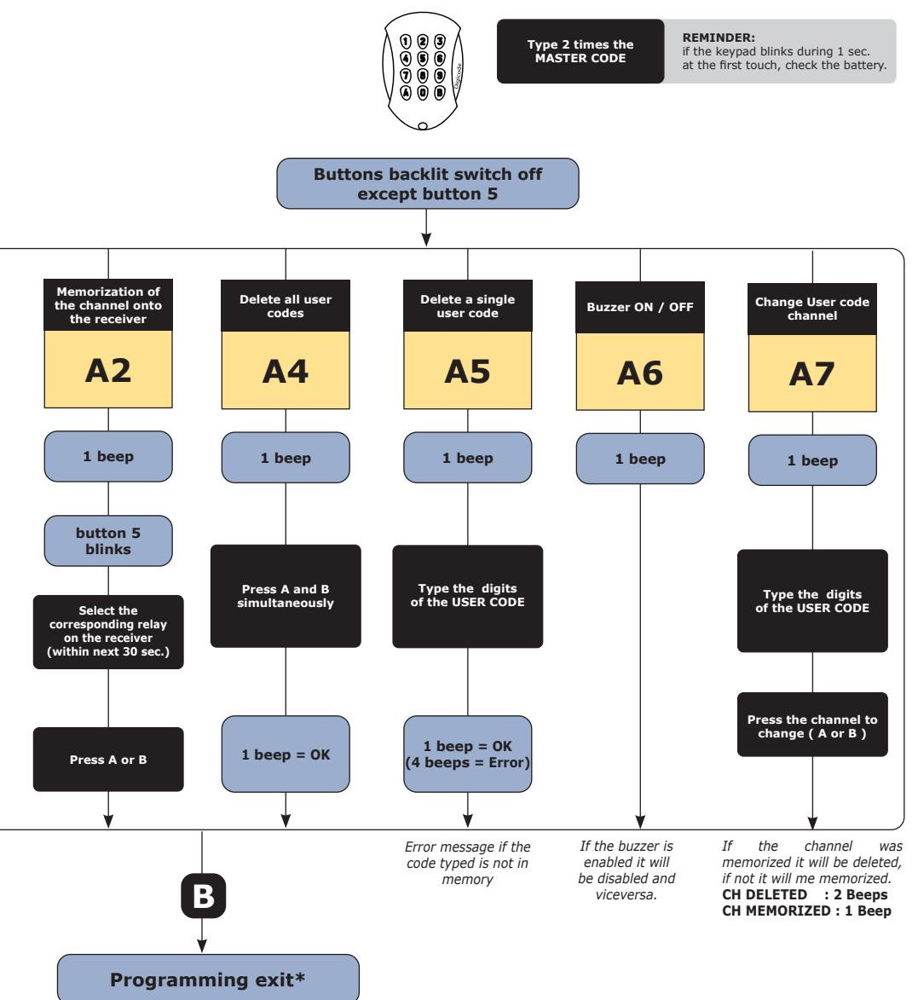

** The programming mode is limited to 10 sec. without any action on the keypad ( no buttons pressed )*

## **8] FACTORY RECOVERY**

To avoid any damage action ( intentional or not ) the factory recovery can be carried out only by the owner of the 5-digit Master code or knowing any User code memorized ( with 4 or 5 digits) . According to that and the final purpose of the recovery, follow the procedure "A+1" or "B+3".

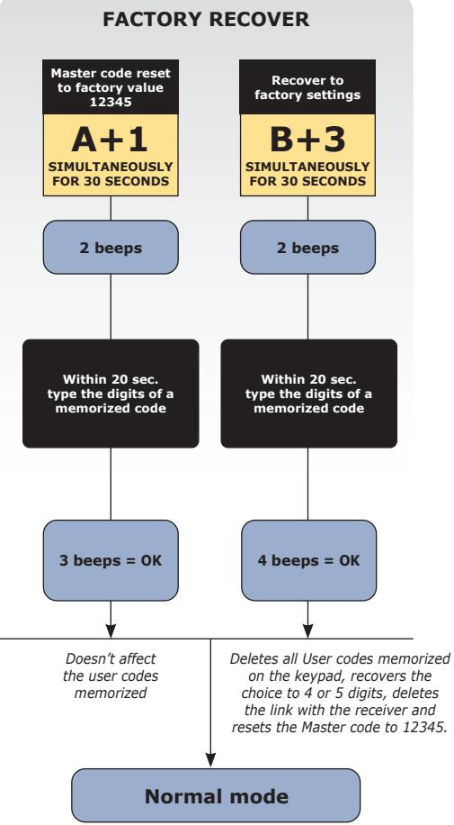

NOTE : At the end of procedure "B+3", even the user code typed within the procedure will be deleted and the keypad must be memorized again onto the corresponding receiver.

| NOTES |  |
|-------|--|
|       |  |
|       |  |
|       |  |
|       |  |
|       |  |
|       |  |
|       |  |
|       |  |
|       |  |
|       |  |
|       |  |
|       |  |
|       |  |
|       |  |
|       |  |
|       |  |
|       |  |
|       |  |
|       |  |
|       |  |
|       |  |
|       |  |
|       |  |
|       |  |
|       |  |
|       |  |
|       |  |
|       |  |
|       |  |
|       |  |
|       |  |
|       |  |
|       |  |

*Trådlös knappsats*

## **1] PRODUKTSPECIFIKATION**

Trådlöst kodlås

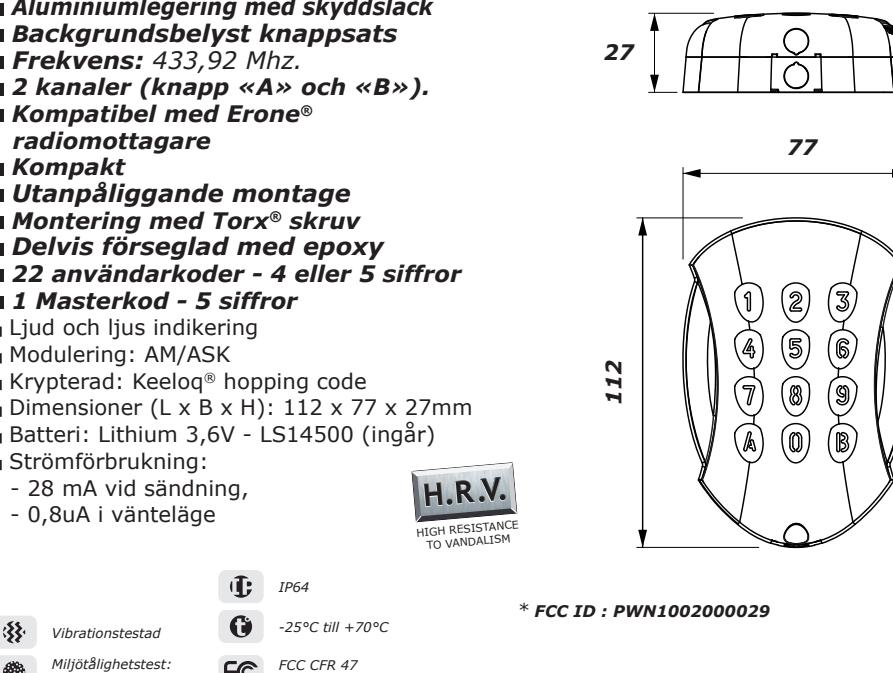

## **2] INFORMATION OCH REKOMMENDATIONER**

*part 15 certifierad**

### **Säkerhetstips**

*salttålighet*

Av säkerhetsskäl, ändra den fabriksinställda masterkoden. När du väljer en masterkod bör ni undvika efterföljande siffror såsom **3 4 5 6 7.**

### *OBS. Man måste hålla inne A eller B i minst 0,5 sekunder för att signalen skall skickas till mottagaren. OBS.*

### **Varning frekvensexponering**

Denna EUT** uppfyller MPE*** i enlighet med procedurerna i FCC 47 CFR § 1,1310 och 2,1091. För att tillfredsställa kraven för FCC RF-exponering, måste ett avstånd på minst 20 cm upprätthålls mellan denna enhet och användare under drift. Antennen som används för denna sändare får inte samlokaliseras tillsammans med någon annan antenn eller sändare.

> *** EUT "Equipment Under Test" *** MPE "Maximum Permissible Emission"*

## **3] MONTERINGSSATS**

|        | M4x10 Torx® skruv | T20 Torx® fast nyckel | Täcklock | M4x30 monterings kruv | Plastplugg | Batteri | Bakstycke med försegling |
|--------|-------------------------|--------------------------|----------|-----------------------------|------------|---------|-----------------------------|
| GALEOR | 1                       | 1                        | 1        | 2                           | 2          | 1       | 1                           |

## **4] MONTERINGS INSTRUKTIONER**

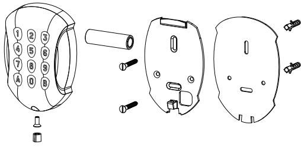

- *Borra 2 monteringshål (borr Ø 5 mm och 35mm djupt borrhål).*
- *Placera båda plastpluggen i varsitt hål.*
- *Klistra förseglingen på den bakre ytan av GALEOR:s bakstycke (VIKTIGT)*
- *Fäst bakstycket med monteringsskruvarna(M4x30)*
- *Ta bort plastskyddet på batteriet, montera kodlåset genom att fästa ovansidan på «kroken» först och därefter underdelen.*
- *Fäst kodlåset genom TORX® skruven på underdelen, ta hjälp av T20 nyckeln för att dra åt skruven.*
- *Placera täckblocket framför skruven*

|       | Kanal |   |  |     |  |      |
|-------|-------|---|--|-----|--|------|
| Plats | A     | B |  | Kod |  | Namn |
| 01    |       |   |  |     |  |      |
| 02    |       |   |  |     |  |      |
| 03    |       |   |  |     |  |      |
| 04    |       |   |  |     |  |      |
| 05    |       |   |  |     |  |      |
| 06    |       |   |  |     |  |      |
| 07    |       |   |  |     |  |      |
| 08    |       |   |  |     |  |      |
| 09    |       |   |  |     |  |      |
| 10    |       |   |  |     |  |      |
| 11    |       |   |  |     |  |      |

|       | Kanal |   |     |  |  |  |      |  |
|-------|-------|---|-----|--|--|--|------|--|
| Plats | A     | B | Kod |  |  |  | Namn |  |
| 12    |       |   |     |  |  |  |      |  |
| 13    |       |   |     |  |  |  |      |  |
| 14    |       |   |     |  |  |  |      |  |
| 15    |       |   |     |  |  |  |      |  |
| 16    |       |   |     |  |  |  |      |  |
| 17    |       |   |     |  |  |  |      |  |
| 18    |       |   |     |  |  |  |      |  |
| 19    |       |   |     |  |  |  |      |  |
| 20    |       |   |     |  |  |  |      |  |
| 21    |       |   |     |  |  |  |      |  |
| 22    |       |   |     |  |  |  |      |  |

# **5] LISTA ÖVER ANVÄNDARKODER**

# **6] PROGRAMMERING**

#### **FABRIKSINSTÄLLNINGAR FÖR GALEOR:**

- Inga koder inlagda.
- Buzzer/Summer aktiv.
- Bakgrundsbelysning : *3 sek.*
- Sändningstid till mottagare : *25 sekunder.* - Masterkod : **1 2 3 4 5.**
- Tidsangränsad programmeringsmeny: *10 sekunder.*
- Kanal valmöjligheter:
- *Kanal 1 = A,*
- *Kanal 2 = B.*

#### **LJUDSIGNALER :**

- 1 pip : Kodlåset påslaget (sätt i batteriet)
- 1 långt pip :
- *Ankomst till menyn, - Bekräftelse av ett programmeringsval,*
- *Avsluta från ett menyval.*
- 2 pip : Bekräftar ingång till
- fabriksåterställning. 3 pip : Bekräftar ändring av fabriksinställning "A+1"
- 4 pip : *Bekräftar ändring av fabriksinställning "B+3". Felsignal för fel kanal,Felsignal för felaktig inmatning av användarkod.*

### **ANVÄNDARREGLER OCH**

- **ANVÄNDARKODER:** - Alla knappar kan användas i en användarkod förutom A och B.
- Master- och användarkod måste innehålla
- samma antal siffror som inställd kodlängd
- Masterkoden kan inte styra ett relä.

**OBS. Man måste hålla inne A eller B i minst 0,5 sekunder för att signalen skall skickas till mottagaren.**

# **7] KOMMA IGÅNG**

*Knappsatsen kommer utan inlagda användarkoder. När batteriet är insatt för första gången så kommer samtliga knappar att blinka och vänta på att dessa inställningar ska göras.*

*TRYCK på knapp 4 i 4 sek. för att ställa in 4-siffriga användarkoder --> 4 pip TRYCK på knapp 5 i 5 sek. för att sälla in 5-siffriga användarkoder--> 5 pip*

 TRYCK på knapp **4** i **4 sek**. för att ställa in 4-siffriga användarkoder **--> 4 pip**

 TRYCK på knapp **5** i **5 sek**. för att ställa in 5-siffriga användarkoder **--> 5 pip**

*När inställningarna är bekräftade kommer kodlåset bara att acceptera 4 eller 5-siffriga användarkoder beroende på vilken inställning ni har valt.*

*Om ingen inställning är gjord (byte av masterkod, användarkod inlagd etc) tar man bort batteriet och sätter in det igen för att ändra inställningen.*

### *När man har valt hur många siffror användarkoderna skall ha så sparas det i minnet och kan inte ändras om man inte fabriksåterställer kodlåset (med "B+3").*

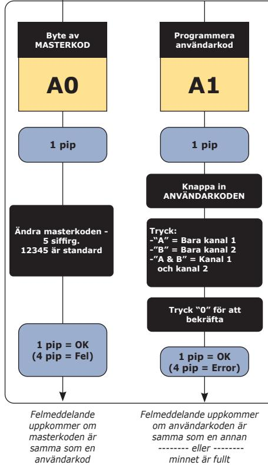

 *-------- eller ------- är samma som masterkoden*

**6] PROGRAMMERING**

** Programmeringen avbryts efter 10 sekunder om man inte rör knapparna*

# **8] FABRIKSÅTERSTÄLLNING**

För att undvika manipulering och andra skadliga åtgärder (avsiktliga eller ej) kan fabriksåterställning endast utföras om man känner till valfri inlagd användarkod.

NOTERA : Vid slutet av "B+3" raderas även användarkoderna och kodlåset måste memoreras in till mottagaren ingen.

### **ANTECKNINGAR**

### **GALEO R DK DK** Trådløs kodelås

## **1] PRODUKTSPECIFIKATION**

### *Trådløst tastatur.*

- *Aluminiumslegering med beskyttelseslak.*
- *Baggrundsoplyst tastatur.*
- *Frekvens: 433,92 Mhz.*
- *2 kanaler (knap «A» og «B»).*
- *Kompatibel med Erone®modtager.*
- *Kompakt.*
- *Overflademontering.*
- *Monteres med* **Torx®** *skruer.*
- *Delvis forseglet med epoxy.*
- *22 brugerkoder 4 eller 5 tegn.*
- *1 masterkode 5 tegn.*
- Lyd- og lysindikering.
- Modulering: AM/ASK.
- Krypteret: Keeloq®hopping code
- Dimensioner (L x W x D): 112 x 77 x 27 mm.
- Batteri: Lithium 3,6V LS14500 (medfølger).
- Strømforbrug:
	- 28 mA når der sendes.
	- 0,8uA i venteposition.

*IP64*

*Vibrationstestet* 

*Miljøholdbarhedstestet: saltresistens* 

- *FCC CFR 47 Part 15-certificeret**
*-25°C til +70°C*

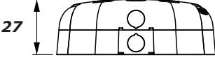

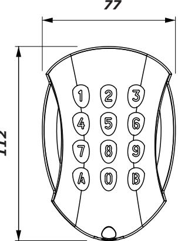

** FCC ID : PWN1002000029*

*112*

# **2] INFORMATION OG ANBEFALINGER**

### **Sikkerhedstips**

Af hensyn til sikkerheden bør den fabriksindstillede masterkode ændres. Undgå simple koder som **3 4 5 6 7.**

### *OBS. For at signalet kan sendes til modtageren, skal A eller B holdes inde i mindst et halvt sekund.*

### *Advarsel om frekvenseksponering*

Denne EUT** opfylder MPE** i overensstemmelse med procedurerne i FCC 47 CFR § 1,1310 og 2,1091.

For at opfylde kravene fra FCC om RF-eksponering skal der være en afstand på mindst 20 cm. mellem denne enhed og brugerne, når enheden er i brug. Antennen, som anvendes til denne sender, må ikke placeres sammen med nogen anden antenne eller sender.

> *** EUT "Equipment Under Test" *** MPE "Maximum Permissible Emission"*

## **3] MONTERINGSKIT**

|        | M4x10 Torx® skrue | T20 Torx® nøgle | Dæksel | M4x30 Monterings skrue | Plastikplug | Batteri | Bagstykke med forsegling |
|--------|-------------------------|--------------------|--------|------------------------------|-------------|---------|-----------------------------|
| GALEOR | 1                       | 1                  | 1      | 2                            | 2           | 1       | 1                           |

## **4] MONTERINGSVEJLEDNING**

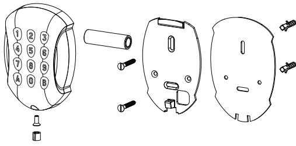

- *Bor 2 monteringshuller (Ø 5 mm. bits og min. dybde 35 mm.).*
- *Sæt en plastikplug i begge huller.*
- *Klistr forseglingen på den ydre bagside af GALEOR:s bagstykke (VIGTIGT).*
- *Anbring bagstykket mod væggen og skru det fast med monteringsskruerne (M4x30).*
- *Fjern plastikbeskyttelsen på batteriet og monter tastaturet på bagstykket, oppefra og ned.*
- *Skru tastaturet fast på bagstykket med TORX-skruen (M4x10) og T20-nøglen. Sæt dækslet fast i bunden af tastaturet.*

|  |  |  | 5] LISTE OVER BRUGERKODER |
|--|--|--|---------------------------|
|--|--|--|---------------------------|

|        |   | Kanal |      |  |  |  |      |  |
|--------|---|-------|------|--|--|--|------|--|
| Bruger | A | B     | Kode |  |  |  | Navn |  |
| 01     |   |       |      |  |  |  |      |  |
| 02     |   |       |      |  |  |  |      |  |
| 03     |   |       |      |  |  |  |      |  |
| 04     |   |       |      |  |  |  |      |  |
| 05     |   |       |      |  |  |  |      |  |
| 06     |   |       |      |  |  |  |      |  |
| 07     |   |       |      |  |  |  |      |  |
| 08     |   |       |      |  |  |  |      |  |
| 09     |   |       |      |  |  |  |      |  |
| 10     |   |       |      |  |  |  |      |  |
| 11     |   |       |      |  |  |  |      |  |

|        | Kanal |   |      |  |  |  |      |  |
|--------|-------|---|------|--|--|--|------|--|
| Bruger | A     | B | Kode |  |  |  | Navn |  |
| 12     |       |   |      |  |  |  |      |  |
| 13     |       |   |      |  |  |  |      |  |
| 14     |       |   |      |  |  |  |      |  |
| 15     |       |   |      |  |  |  |      |  |
| 16     |       |   |      |  |  |  |      |  |
| 17     |       |   |      |  |  |  |      |  |
| 18     |       |   |      |  |  |  |      |  |
| 19     |       |   |      |  |  |  |      |  |
| 20     |       |   |      |  |  |  |      |  |
| 21     |       |   |      |  |  |  |      |  |
| 22     |       |   |      |  |  |  |      |  |

#### **FABRIKSINDSTILLINGER TIL GALEOR:**

- Uden koder.
- Buzzer/summer aktiv.
- Baggrundsbelysning: 3 sek.
- Sendetid til modtagere: 25 sek.
- Masterkode : **1 2 3 4 5.** - Tidsbehandling programmeringsmenu:
- 10 sekunder.
- Kanalvalg:
- *Kanal 1 = A, Kanal 2 = B.*
- 
- **HØRBAR FEEDBACK:**  1 bip: Kodelåsen tilsluttet (isæt batteri)

- 1 langt bip::
Trådløs kodelås

- Adgang til menu
- Bekræftelse af programmeringsvalg - Forlad menu
- 2 bip : Bekræfter adgang til gendannelse af fabriksindstillinger
- 3 bip: Bekræfter gendannelse af fabriksindstillinger
- 4 bip: Bekræfter gendannelse af fabriksindstillinger "B+3". Fejlsignal for forkert kanal.

Fejlsignal for indtastning af en kode, der allerede er i brug

#### **BRUGERREGLER OG BRUGERKODER**

- Alle taster kan anvendes til brugerkode, undtagen A og B
- Masterkoden skal være på 5 cifre.
- Brugerkoden kan være på 4 eller 5 cifre afhængigt af indstillingerne.
- Masterkoden kan ikke styre et relæ.

**OBS. Man skal holde A eller B inde i mindst 0,5 sekund for at signalet sendes til modtageren** 

# **7] KOM I GANG**

*Tastaturet leveres uden forprogrammeret brugerkode. Når batteriet isættes første gang, vil samtlige 12 LED-lys lyse og blinke, mens de venter på følgende indstilling:* 

TRYK på tast **4** i **4 sek**. for at indstille til 4-cifret brugerkode **--> 4 bip**

 TRYK på tast **5** i **5 sek**. for at indstille en 5-cifret brugerkode **--> 5 bip**

*Når indstillingen er bekræftet, vil kodelåsen kun acceptere 4- eller 5-cifrede brugerkoder, afhængigt af hvilken indstilling du har valgt.*

*Hvis der ikke er foretaget nogen ændringer (ændring af masterkode, registrering af brugerkode m.m.), vil låsen blive nulstillet til fabriksindstillingerne blot ved, at man tager batteriet ud, og på ny kræve, at man vælger indstilling.* 

*Når man har valgt kodelængde, gemmes den i hukommelsen og kan IKKE ændres, med mindre man nulstiller kodelåsen til fabriksindstillingerne. (Se procedure "B+3").* 

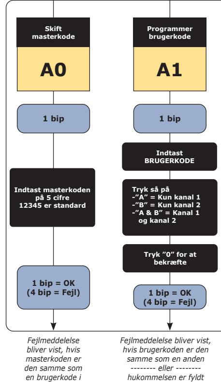

*-------- eller ------- brugerkoden er den samme som masterkoden.* 

*hukommelsen.* 

**6] PROGRAMMERING**

** Programmeringen afbrydes efter 10 sekunder, hvis der ikke er nogen berøring af tasterne.*

## **8] NULSTILLING TIL FABRIKSINDSTILLING**

For at undgå manipulering eller andre skader (forsætlige eller ej) kan nulstilling til fabriksindstillinger kun udføres, hvis man kender den 5-cifrede masterkode eller de indtastede brugerkoder. (Følg procedure "A+1" eller "B+3").

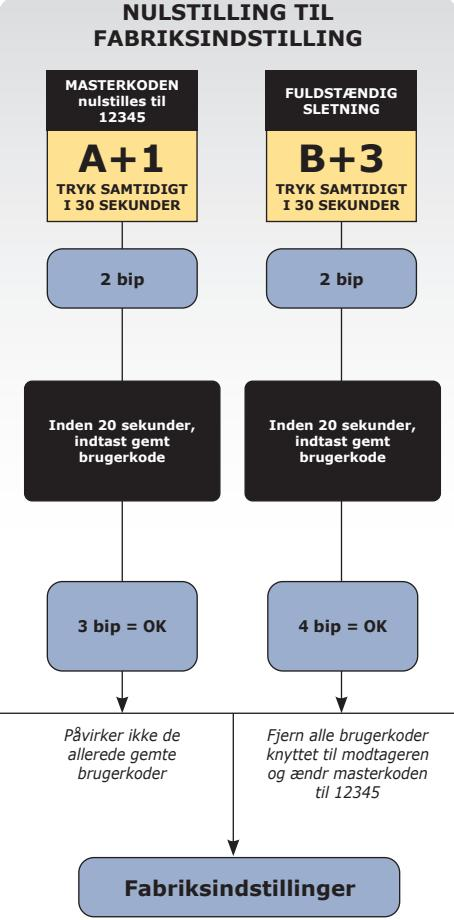

**NB.** "B+3"-proceduren sletter også den brugerkode, der er indtastet under proceduren. Tastaturet skal derfor sættes op til brugeren igen efter afsluttet procedure.

## 18 cdvigroup.com

| NOTER |  |
|-------|--|
|       |  |
|       |  |
|       |  |
|       |  |
|       |  |
|       |  |
|       |  |
|       |  |
|       |  |
|       |  |
|       |  |
|       |  |
|       |  |
|       |  |
|       |  |
|       |  |
|       |  |
|       |  |
|       |  |
|       |  |
|       |  |
|       |  |
|       |  |
|       |  |
|       |  |
|       |  |
|       |  |
|       |  |
|       |  |
|       |  |
|       |  |
|       |  |
|       |  |

**Extranet :** CDVI_IM GALEO R CMYK A5 EN-SE-DK 01

**CDVI Group** FRANCE (Headquarters) Phone: +33 (0) 1 48 91 01 02

**CDVI FRANCE + EXPORT** +33 (0) 1 48 91 01 02 www.cdvi.com

**CDVI AMERICAS [CANADA - USA]** +1 (450) 682 7945 www.cdvi.ca

### **CDVI BENELUX [BELGIUM - NETHERLANDS - LUXEMBOURG]**

+32 (0) 56 73 93 00 www.cdvibenelux.com

**CDVI TAIWAN** +886 (0) 42471 2188 www.cdvichina.cn

**CDVI SUISSE** +41 (0) 21 882 18 41 www.cdvi.ch

**CDVI CHINA** 

+86 (0) 10 84606132/82 www.cdvichina.cn

**CDVI IBÉRICA [SPAIN - PORTUGAL]** +34 (0) 935 390 966

**CDVI ITALIA** +39 (0) 321 90 573 - www.cdvi.it

**CDVI MAROC** +212 (0) 5 22 48 09 40 www.cdvi.ma

www.cdviberica.com

**CDVI NORDICS [SWEDEN - DENMARK - NORWAY - FINLAND]** +46 (0) 31 760 19 30

www.cdvi.se

**CDVI UK [UNITED KINGDOM - IRELAND]** +44 (0) 1628 531300 www.cdvi.co.uk

**CDVI POLSKA** +48 (0) 12 659 23 44 www.cdvi.com.pl

*All the information contained within this document (pictures, drawings, features, specifications and dimensions)could be perceptibly different and can be changed without prior notice.*

# **www.cdvigroup.com**