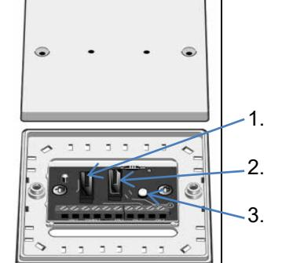
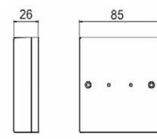
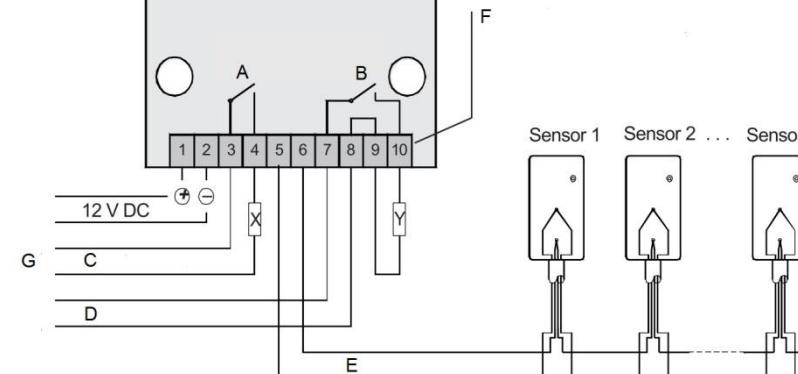
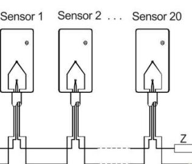

# **GB-5000-IN**

**Relais Interface Relaismodulfür GB-5300-x & GB-5700 x Glassbruchsensor**

**Relay Interface for GB-5300-x & GB-5700-x Glass Break Detectors**

**Interface relais**

**Interfaccia relè**

**Interfaz de relé**

**Reläinterface**

Issued by: Vanderbilt Clonshaugh Business and Technology Park Clonshaugh Dublin D17 KV84 Ireland www.vanderbiltindustries.com

Part No. V54550-F112-A100 Document no. A6V10422205_c Edition 03.2016 MA0001804

|   | Lesen Sie vor der Installation und Verwendung dieses Geräts die Sicherheitshinweise. |   |                       |
|---|-----------------------------------------------------------------------------------------|---|-----------------------|
|   | Übersicht                                                                               |   |                       |
|   | Beschreibung                                                                            |   | Beschreibung          |
| A | Sabotagekontakt                                                                         | 1 | Resettaster (manuell) |
| B | Alarmkontakt                                                                            | 2 | Sabotagekontakt       |
| C | Sabotageloop                                                                            | 3 | LED Zustandsanzeige   |
| D | Alarmloop                                                                               |   |                       |
| E | Sensorloop                                                                              |   |                       |
| F | Klemmblock                                                                              |   |                       |
| G | Einbruchmeldezentrale                                                                   |   |                       |
| X | Sabotageloop- Widerstand                                                                |   |                       |
| Y | Alarmloop-Widerstand                                                                    |   |                       |
|   | Sensorloop-Widerstand                                                                   |   |                       |

**Beschreibung**

2.2KΩ

**Z**

Das Relais - Interface entspricht den VdS-Richtlinien der Klasse B. Es findet Anwendung, wenn die Meldergruppen einer Einbruchmeldezentrale das Anschalten von Glasbruchsensoren nicht zulassen. Dies kann aus verschiedenen Gründen der Fall sein, z.B. bei Serien-Technik, digitaler Auswertung oder wenn die Spannung der Meldergruppe unter 3 V liegt.

Das GB-5000-IN Relaismodul dient als Schnittstelle zwischen einem Glassbruchsensor und der Einbruchmeldezentrale. Die interne Elektronik ist mit einer Plastikabdeckung geschützt, welche die Kabeleinführung von oben, von unten und von hinten ermöglicht. Das Gehäuseoberteil wird mit einem Sabotagekontakt gegen Sabotageangriffe

überwacht. Das Gehäuse kann mit den mitgelieferten VdS-Siegeln verplombt werden. Die VdS-Siegel werden hierfür auf die Gehäusedeckelschrauben geklebt, welche

sich bei unerlaubtem Öffnen zerstören. Das Relaismodul entspricht den VdS-Richtlinien der Klasse B und erfüllt die Anforderungen alle EMC Tests.

Bei anlegen der 12VDC Betriebsspannung und angeschlossenem Überwachungswiderstand (2K2 Ohm) arbeitet der Alarmkontakt des Relaismoduls als "Normal geschlossen" Falls einer dieser Kriterien nicht erfüllt sein sollte, ist der Alarmkontakt offen (Alarmstatus). Der mitgelieferte Überwachungswiderstand entspricht einem 2K2 Ohm (1% Metalfilm) Widerstand. Die Alarmauslösung (Öffnen des Alarmrelais) findet nach einer max. Änderung des Überwachungswiderstandswert von 38% statt. Die

Auslösung muss länger als 100ms sein. Die Rückseite der Platine ist mit SMT-Bauteilen bestückt. Die Platine darf daher weder gebogen noch starken Erschütterungen

ausgesetzt werden. Bei der Handhabung sind die üblichen Maßnahmen zum Schutz elektronischer CMOS-Schaltungen anzuwenden. **EG-Konformitätserklärung**

Hiermit erklärt Vanderbilt International (IRL) Ltd, dass dieses gerätetyps den Anforderungen aller relevanten EU-Richtlinien für die CE-Kennzeichnung entspricht. Ab dem 20.04.2016 entspricht er der Richtlinie 2014/30/EU (Richtlinie über elektromagnetische Verträglichkeit). Der vollständige Text der EU-Konformitätserklärung steht unter http://pcd.vanderbiltindustries.com/doc/Intrusion-accessories zur Verfügung.

# **Deutsch Installationsanleitung**

| Technische Daten        |                                                           |  |
|-------------------------|-----------------------------------------------------------|--|
| Betriebsspannung        | 10 – 15 V DC                                              |  |
| Nennspannung            | 12 V DC                                                   |  |
| Abschlusswiderstand     | 2.2 kΩ                                                    |  |
| Ruhestrom               | Ca. 5 mA                                                  |  |
| Alarmstrom              | Max. 13.5 mA                                              |  |
| Ansprechempfindlichkeit | Bei mehr als +/- 38% Änderung des Abschlusswiderstands |  |
| Schaltverzögerung       | Max. 100 ms                                               |  |
| Alarmausgang            | Elektronischer Schalter                                   |  |
| Schaltleistung          | Max. 300 mW, max. 24 V DC, max 200 mA                  |  |
| Kontaktwiderstand       | Ca. 5 Ω                                                   |  |
| Sabotagesicherung       | Deckelkontakt (Schliesser)                                |  |
| Masse Gehäuse           | 85 x 85 x 26 mm                                           |  |
| Gehäusematerial         | S-B, A-B-S                                                |  |
| Betriebstemperatur      | -30 °C bis 60 °C                                          |  |
| Umweltklasse VdS        | II                                                        |  |
| Zulassungen             | VdS Klasse B, G116503                                     |  |

### **LED für Zustandsanzeige**

Ein zusätzlicher Mikrotaster, der durch eine kleine Öffnung im Gehäusedeckel erreichbar ist, ermöglicht die Abschaltung der Spannung auf der Sensorlinie. Ausgelöste Glasbruchsensoren können durch Betätigung des Tasters gelöscht werden.

## **English Installation Instruction**

|   | Before starting to install and work with this device, please read the Safety Instructions |   |                     |  |
|---|----------------------------------------------------------------------------------------------|---|---------------------|--|
|   | Overview                                                                                     |   |                     |  |
|   | Description                                                                                  |   | Description         |  |
| A | Tamper switch                                                                                | 1 | Manual reset switch |  |
| B | Alarm contact                                                                                | 2 | Tamper switch       |  |
| C | Tamper loop                                                                                  | 3 | LED indication      |  |
| D | Alarm – loop                                                                                 |   |                     |  |
| E | Sensor – loop                                                                                |   |                     |  |
| F | Terminal block                                                                               |   |                     |  |
| G | Alarm panel                                                                                  |   |                     |  |
| X | Tamper-loop resistor                                                                         |   |                     |  |
| Y | Alarm-loop-resistor                                                                          |   |                     |  |
| Z | Sensor-loop-resistor 2.2KΩ                                                                   |   |                     |  |
|   |                                                                                              |   |                     |  |

**Description**

The Relay-Interface is required; if the alarm loop (D) doesn't allow direct connection of glass break detectors. This could happen because of several reasons; the series connection of multiple detectors, digital supervision or if the line-voltage is below 3 V.

#### The GB-5000-IN relay interface is required as a connecting link between a glass break-detector and the monitoring panel. The internal electronics are protected by a plastic enclosure. The enclosure allows the connection wires to access via the top, bottom or the rear of the enclosure. The housing-cover is monitored against unauthorized opening by a tamper-

switch. The supplied VdS-stickers make it possible to identify an unauthorized opening of the housing. After the installation the stickers should be fixed over the cover screws and then the sticker can't be removed without damage. The Relay-Interface meets the VdS-regulations according to class B and conforms to all required EMC-testing. The "alarm-contact" of the Relay-Interface is normally closed when the power-supply (12 VDC) is connected, the monitoring-resistor Z (2.2 k Ω) is connected and the connected sensors are not triggered. If any of these items are not in the normal state, then the "alarm-contact" will be open. The value of the monitoring-resistor must be 2.2 k Ω (1% metal film) and this is supplied with each device. The triggering (opening of the alarm-contacts) will happen after a change of max. 38 % of the monitoring-resistor value. The disturbance must be longer than 100 ms.

The back of the board is equipped with SMT components. The board may, therefore, not be bent or subjected to excessive vibration. When handling the usual measures to protect electronic CMOS circuits are to

#### be applied. **EC Declaration of Conformity**

Hereby, Vanderbilt International (IRL) Ltd declares that this equipment is in compliance with all relevant EU Directives for CE marking. From 20/04/2016 it is in compliance with Directive 2014/30/EU (Electromagnetic Compatibility Directive).

The full text of the EU declaration of conformity is available at: http://pcd.vanderbiltindustries.com/doc/Intrusion-accessories

#### **Technical data** Voltage 10 – 15 V DC Nominal voltage 12 V DC End-of-line resistor 2.2 kΩ Operating current Ca. 5 mA Current in alarm Max. 13.5 mA Response level About +/- 38% (End-of-line resistor) Response delay Max. 100 ms Output Electronic relay Switching performance Max. 300 mW, max. 24 V DC, max 200 mA Contact resistance Ca. 5 Ω Tamper Tamper switch Dimensions 85 x 85 x 26 mm Housing material S-B, A-B-S Operating temperature -30 °C to 60 °C Environmental class VdS II Approvals VdS Klasse B, G116503 **Led indication** Alarm – reset via panel or manual switch.

Sensor line o/c or s/c (auto-reset)

SPC panel configuration – set panel O/P as break glass to remove power on system reset.

## **Français Instructions d'installation**

200 mA max.

Pour une modification supérieure à +/- 38 % de la résistance de terminaison

|        | Lisez les consignes de sécurité avant d'installer et d'utiliser l'appareil. |   |                           |
|--------|-----------------------------------------------------------------------------|---|---------------------------|
| Aperçu |                                                                             |   |                           |
|        | Description                                                                 |   | Description               |
| A      | Switch d'autosurveillance                                                   | 1 | Switch de reset manuel |
| B      | Contact d'alarme                                                            | 2 | Switch d'autosurv.        |
| C      | Boucle d'autosurveillance                                                   | 3 | Indicateur LED            |
| D      | Boucle d'alarme                                                             |   |                           |
| E      | Détecteur – boucle                                                          |   |                           |
| F      | Borniers                                                                    |   |                           |
| G      | Centrale d'alarme                                                           |   |                           |
| X      | Résistance de la boucle d'autosurveillance                               |   |                           |
| Y      | Résistance de la boucle d'alarme                                         |   |                           |
| Z      | Résistance de terminaison 2,2KΩ                                          |   |                           |

### **Description**

**Panoramica** 

**D** Lopp Allarmi **E** Loop Sensore **F** Morsettiera **G** Centr. antintrusione **X** Res, Loop Tamper **Y** Res. Loop Allarme **Z** Res. Loop Sensore 2.2KΩ

**Descrizione**

dispositivo. **Visión general** 

**D** Línea de alarma **E** Línea de detector(es) **F** Clemas de conexión **G** Central de alarma **X** RFL del tamper **Y** RFL alarma **Z** RFL línea detector(es) **Descripción**

L'interface relais satisfait aux directives VdS de la classe B. Elle est nécessaire lorsque les entrées de détection d'un équipement de détection d'intrusion ne gèrent pas les détecteurs de bris de glace. Ceci peut être le cas pour plusieurs raisons, p. ex. pour les techniques de mise en série, l'analyse numérique ou lorsque la tension fournie par la boucle de détécteur est inférieure à 3 V.

Prima dell'installazione e dell'utilizzo dell'apparato, leggere le

**Descrizione Descrizione A** Contatto Tamper 1 Reset manuale **B** Contatto Allarme 2 Contatto Tamper **C** Loop Tamper 3 Indicatore LED

L'interfaccia relè è conforme alle norme VdS per la classe B. Trova applicazione quando i gruppi di rivelatori di una centrale antintrusione non consentono il collegamento dei sensori rottura vetro. Ciò può avvenire per varie ragioni, ad es. in caso di tecnologia in serie, analisi digitale o se la

Lea las indicaciones de seguridad antes de instalar y utilizar este

Pulsador de reset manual

**Descripción Descripción**

**B** Contacto alarma NC 2 Contact de tamper **C** Línea de tamper 3 Indicador LED

La interfaz de relé cumple con las directivas VdS de la clase B. Se utiliza cuando los grupos de detectores de una unidad de notificación de robo no permiten la conexión de los sensores de rotura del cristal. Esto puede tener lugar por diferentes motivos, p. ej. en ingeniería de producción en serie, en la evaluación digital o cuando la tensión del grupo de detectores es inferior a 3V.

tensione del gruppo di rivelatori scende sotto 3 V.

**A** Contacto tamper NC 1

avvertenze di sicurezza.

L'interface relais GB-5000-IN établit la liaison entre le détecteur de bris de vitre et la centrale d'alarme. L'électronique interne est protégée par un boitier plastique. Le boitier permet des entrées de câbles par le haut ou l'arrière et est protégé à l'ouverture par un contact d'auto surveillance. Les étiquettes VdS fournies permettent d'avertir que l'ouverture du boitier n'est pas autorisée. Après l'installation, les étiquettes doivent être collées pardessus les vis de fermeture du boitier et elles ne peuvent pas être décollées sans se déchirer. L'interface relais répond aux exigences du VdS classe B et est conforme à tous les tests CEM exigés. Le contact d'alarme de l'interface relais est normalement fermé lorsque la tension d'alimentation 12VDC est présente, que la résistance d'équilibrage de 2,2K Ω est raccordée et que le détecteur raccordé est au repos. Si une de ces conditions n'est pas respectée, le contact d'alarme sera ouvert. La valeur de la résistance d'équilibrage doit être de 2.2 k Ω (1% film métal), elle est fournie avec chaque produit. Le déclenchement de l'alarme se produit lors d'un changement de valeur de résistance de plus de 38% de la valeur nominale pendant un temps de plus de 100ms.

La face arrière du circuit imprimé est dotée de composants CMS. Le circuit imprimé ne doit donc être ni courbé ni soumis à de fortes secousses. Lors de l'utilisation, il convient d'appliquer les mesures habituelles visant à protéger les circuits CMOS électroniques.

#### **Déclaration de conformité CE**

Par la présente, Vanderbilt International (IRL) Ltd déclare que le type d'équipement considéré est en conformité avec toutes les directives UE applicables relatives au marquage CE. Il sera en conformité avec la directive 2014/30/UE (directive compatibilité électromagnétique (CEM)) à compter du 20.04.2016.

Le texte intégral de la déclaration de conformité aux directives de l'Union européenne est disponible à

Courant de repos env. 5 mA Courant d'alarme 13.5 mA max. Sensibilité de réponse Délai de commutation 100 ms max. Sortie d'alarme Commutateur électronique Puissance de commutation 300 mW max., DC 24 V max., Résistance de contact env. 5 Ω Sécurité d'autosurveillance Contact de couvercle (à fermeture) Dimensions du boîtier 85 x 85 x 26 mm Matériau du boîtier S-B, A-B-S Température d'exploitation -30 °C…+60 °C Classe d'environnement VdS II

http://pcd.vanderbiltindustries.com/doc/Intrusion-accessories

**Italiano Istruzioni per l'installazione** L'interfaccia relè GB-5000-IN è utilizzata come anello di collegamento tra un rivelatore di rottura vetro e la centrale antintrusione. I circuiti elettronici interni

sono protetti da un involucro di plastica. La custodia permette il collegamento dei fili con accesso dalla parte superiore, inferiore o posteriore della custodia. La scatola-copertura è monitorata contro l'apertura non autorizzata da un interruttore antimanomissione (tamper). Gli adesivi-VdS forniti consentono di identificare un apertura non autorizzata della custodia. Dopo l'installazione gli adesivi devono essere fissati sopra le viti del coperchio in modo che gli adesivi non possano essere rimossi senza danni.

Il relè interfaccia soddisfa le normative VdS in accordo alla classe B ed è conforme a tutti i test EMC richiesti. Il "contatto di allarme" del relè d'interfaccia è normalmente chiuso quando l'alimentazione (12 VDC) è collegata, la resistenza di monitoraggio Z (2.2 k Ω) è collegata e i sensori non sono attivati. Se una di queste condizioni non è in stato normale, allora il "Contatto di Allarme" sarà aperto. Il valore della "resistenza di monitoraggio" deve essere 2,2 k Ω (film metallico 1%) e viene fornita con ciascun dispositivo. L'attivazione (apertura dei contatti di allarme) avverrà dopo un discostamento max. del 38% dal valore della resistenza di monitoraggio. Il disturbo deve durare più di 100 ms.

Il lato posteriore del circuito stampato è dotato di componenti SMT. Il circuito stampato non può essere, pertanto, né piegato né essere sottoposto a vibrazioni. Durante la manipolazione è necessario applicare tutte la misure per la protezione di circuiti CMOS.

### **Dichiarazione di conformità CE**

Con la presente Vanderbilt International (IRL) Ltd dichiara che questo tipo di apparecchio è conforme a tutte le relative Direttive UE per la marcatura CE. Dal 20/04/2016 è conforme alla Direttiva 2014/30/UE (Direttiva sulla compatibilità elettromagnetica).

Il testo completo della dichiarazione di conformità UE è disponibile presso

http://pcd.vanderbiltindustries.com/doc/Intrusion-accessories **Español Instrucciones de instalación** El interfaz de relé GB-5000-IN es necesario para el empleo de detectores tipo GB-5300-x y GB-5700-x con cualquier central. Está montado en una caja de plástico con una tapa fijada mediante tornillos y, para su conexionado, permite el acceso de cables desde la parte superior, inferior o trasera de dicha caja. Un contacto de tamper supervisa la apertura no autorizada de la caja.

> Las pegatinas suministradas con el equipo estás previstas para cubrir los tornillos de la tapa de modo que éstos no puedan ser retirados sin dañarlas, permitiendo así cualquier manipulación no autorizada, tal y como exige VdS. El producto cumple con todos los requisitos de compatibilidad electromagnética.

El relé de alarma se encuentra cerrado (NC) con el dispositivo correctamente alimentado (12 Vcc).

La figura de cableado mostrada no representa un cableado concreto del detector con la central, debiéndose utilizar el más adecuado. Normalmente establecido mediante las 2 resistencias típicas. Una alteración del valor de la RFL en serie con el contacto de tamper de más de 100 ms generará alarma de este tipo.

- La parte trasera de la placa de circuito impreso posee componentes SMT.
Por eso, la placa de circuito impreso no debe doblarse ni someterse a fuertes sacudidas. Durante la manipulación aplique las medidas de protección habituales para los circuitos electrónicos CMOS. **Declaración de conformidad CE**

## Por la presente, Vanderbilt International (IRL) Ltd declara que este tipo de

equipo cumple con todas las directivas de la UE relevantes para el marcado CE. Desde el 20/04/2016 cumple con la directiva 2014/30/UE (directiva de compatibilidad electromagnética).

El texto completo de la declaración UE de conformidad está disponible en http://pcd.vanderbiltindustries.com/doc/Intrusion-accessories

Läs säkerhetsanvisningarna innan enheten installeras och används. **Översikt** 

|             | Beskrivning                        |   | Beskrivning           |
|-------------|------------------------------------|---|-----------------------|
| A           | Sabotage Kontakt                   | 1 | Manuell återställning |
| B           | Larm Kontakt                       | 2 | Sabotage kontakt      |
| C           | Sabotage Slinga                    | 3 | LED Indikering        |
| D           | Larm Slinga                        |   |                       |
| E           | Detektor Slinga                    |   |                       |
| F           | Kopplingsplint                     |   |                       |
| G           | Larm central                       |   |                       |
| X           | Sabotage Slingans motstånd         |   |                       |
| Y           | Larm Slingans Motstånd             |   |                       |
| Z           | Detektorslingans motstånd 2.2KΩ |   |                       |
| Beskrivning |                                    |   |                       |

Reläinterfacet uppfyller klass B i VdS-direktivet. Det används när sektionerna till en centralapparat inte tillåter anslutning av glaskrossdetektorer. Detta kan t.ex. vara fallet vid serieteknik, digitalövervakning eller när sektionernas spänning är under 3 V.

GB-5000-IN reläinterface krävs som en länk mellan glassdetektor och centralapparat. Den interna elektroniken är skyddad av plastkapsling. Kapslingen tillåter kabelinföring, uppifrån, nerifrån eller från baksidan. Själva kapslingen är skyddad med sabotagekontakt.

Medföljande Vds-klistermärken möjliggör att se om någon obehörig person har öppnat kapslingen. Efter installation bör klisterlappen täcka över skruvhålen och klistermärket kan inte tas bort utan att det går söner. Reläinterfacet uppfyller alla Vds-kraven upp till klass B och alla dess EMC tester. Larmreläet är NC (normalt stängd) när 12V strömförsörjning är inkopplad; och om resistor Z (2,2k Ω) är inkopplad och sensorerna inte är aktiva. Om något av dessa inte är i normalt tillstånd kommer "larm kontakten" växla. Motståndsvärdet för balansering av detektorslingan skall vara 2,2k Ω (1% metallfilm), medföljer alla enheter. Larm utlöses (larmkontakt öppen) sker efter max 38% avvikelse från 2,2 k Ω och om det sker under mer än 100 ms.

- Kretskortets baksida innehåller SMT-komponenter. Kretskortet får inte böjas eller utsättas för kraftiga vibrationer.
Hantera utrustningen med nödvändiga åtgärder för att skydda elektroniska CMOS-anslutningar. **EG-försäkran om överensstämmelse**

Härmed försäkrar Vanderbilt International (IRL) Ltd att denna typ av utrustning överensstämmer med alla relevanta EG-direktiv för CE-märkning. Från 20/04/2016 överensstämmer den med direktiv 2014/30/EG (Direktiv om elektromagnetisk kompatibilitet).

Den fullständiga texten för EG-försäkran om överensstämmelse finns på http://pcd.vanderbiltindustries.com/doc/Intrusion-accessories

| Specifiche tecniche       |                                                            |
|---------------------------|------------------------------------------------------------|
| Tensione di esercizio     | DC 10 – 15 V                                               |
| Tensione nominale         | DC 12 V                                                    |
| Resistenza terminale      | 2.2 kΩ                                                     |
| Corrente a riposo         | Circa 5 mA                                                 |
| Corrente d'allarme        | Max. 13.5 mA                                               |
| Sensibilità di risposta   | Con oltre +/-38 % variazione della resistenza terminale |
| Ritardo di attivazione    | Max. 100 ms                                                |
| Uscita allarme            | Interruttore elettronico                                   |
| Potere di apertura        | Max. 300 mW, max. DC 24 V, max. 200 mA                  |
| Resistenza di contatto    | Ca. 5 Ω                                                    |
| Protezione antisabotaggio | Contatto del coperchio (normalmente aperto)             |
| Dimensioni contenitore    | 85 x 85 x 26 mm                                            |
| Materiale del contenitore | S-B, A-B-S                                                 |
| Temperatura di esercizio  | -30 °C…+60 °C                                              |
| Classe ambientale VdS     | II                                                         |
| Omologazioni              | VdS Klasse B, G116503                                      |

### **LED per l'indicazione di stato**

**Caractéristiques techniques**

**LED d'indication de l'état**

touche.

Tension d'exploitation DC 10 – 15 V Tension nominale DC 12 V Résistance de terminaison 2,2 kΩ

Certifications VdS Klasse B, G116503

Une micro-touche supplémentaire, accessible par une petite ouverture dans le couvercle de boîtier, permet de couper la tension sur la ligne des capteurs. Les capteurs de bris de glace déclenchés peuvent être effacés en appuyant sur la

Un micropulsante, raggiungibile attraverso una piccola apertura nel coperchio contenitore, consente l'esclusione della tensione nella linea del sensore. I sensori rottura vetro attivati possono essere azzerati mediante l'azionamento del tasto.

| Datos técnicos            |                                                                |
|---------------------------|----------------------------------------------------------------|
| Tensión de servicio       | DC 10 – 15 V                                                   |
| Tensión nominal           | DC 12 V                                                        |
| Resistencia terminal      | 2,2 kΩ                                                         |
| Corriente en reposo       | Aprox. 5 mA                                                    |
| Corriente de alarma       | Máx. 13,5 mA                                                   |
| Sensibilidad de respuesta | Con más de +/- 38%, modificación de la resistencia terminal |
| Retardo de conmutación    | Máx. 100 ms                                                    |
| Salida de alarma          | Interruptor electrónico                                        |
| Capacidad de conmutación  | Máx. 300 mW, máx. DC 24 V, máx 200 mA                       |
| Resistencia de contacto   | Aprox. 5 Ω                                                     |
| Seguro contra sabotaje    | Contacto de tapa (N.A.)                                        |
| Dimensiones de la carcasa | 85 x 85 x 26 mm                                                |
| Material de la carcasa    | S-B, A-B-S                                                     |
| Temperatura de servicio   | -30 °C…+60 °C                                                  |
| Categoría ambiental VdS   | II                                                             |
| Certificaciones           | VdS Klasse B, G116503                                          |

### **LED para indicación del estado**

Un micro pulsador adicional, al cual se accede por una pequeña abertura de la tapa de la carcasa, aísla la tensión de la línea de sensor. Los sensores de rotura de cristal disparados pueden borrarse mediante el pulsador.

## **Svenska Installationsanvisning**

| Tekniska data            |                                                     |
|--------------------------|-----------------------------------------------------|
| Driftspänning            | DC 10–15 V                                          |
| Märkspänning             | DC 12 V                                             |
| Termineringsmotstånd     | 2,2 kΩ                                              |
| Viloström                | Ca 5 mA                                             |
| Larmström                | Max. 13,5 mA                                        |
| Utlösningskänslighet     | Om termineringsmotståndet ändras mer än +/- 38 % |
| Kopplingsfördröjning     | Max. 100 ms                                         |
| Larmutgång               | Elektroniskt relä                                   |
| Bryteffekt               | Max. 300 mW, max. DC 24 V, max 200 mA            |
| Kontaktmotstånd          | Ca 5 Ω                                              |
| Sabotageskydd            | Lockkontakt (slutande kontakt)                      |
| Kapslingsstorlek         | 85 x 85 x 26 mm                                     |
| Kapslingsmaterial        | S-B, A-B-S                                          |
| Drifttemperatur          | -30 °C+60 °C                                        |
| Kapslingsklass           | VdS-miljöklass II, G116503                          |
| LED för statusindikering |                                                     |

En kontakt, som nås genom ett hål i locket, används för att bryta spänningen till detektorslingan. Utlösta glaskrossdetektorer kan kvitteras med den här kontakten.