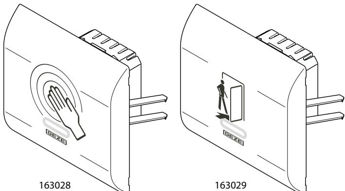
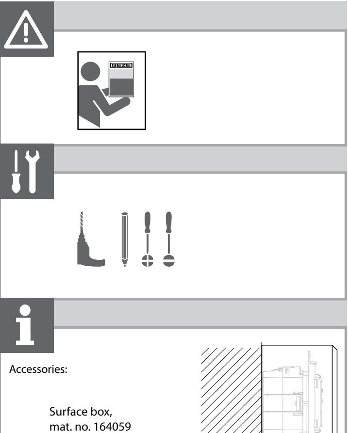
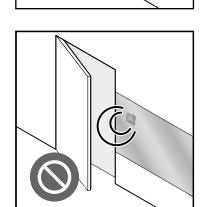
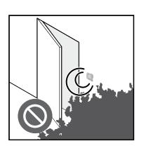
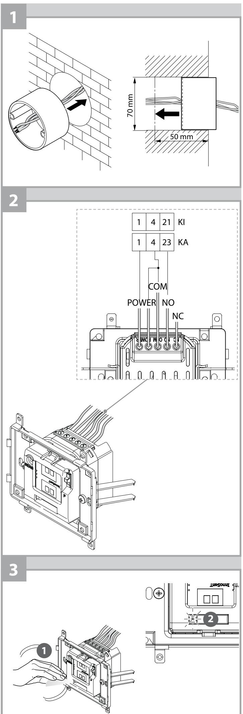
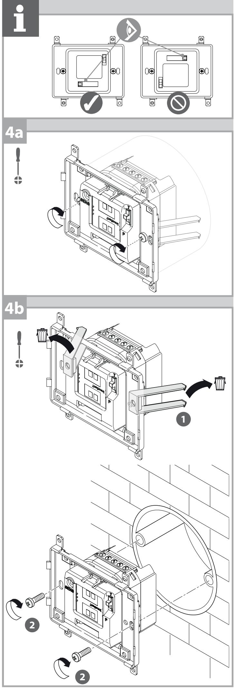
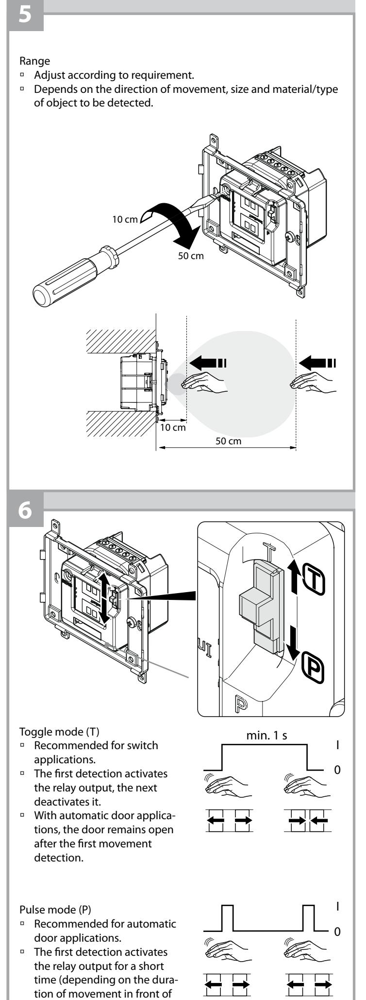
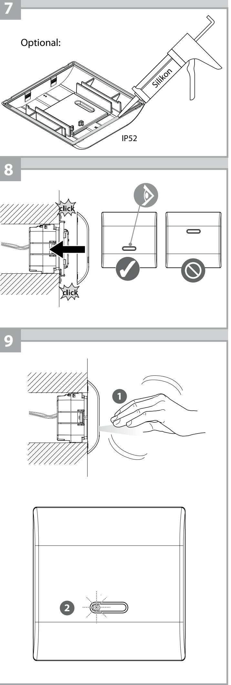

164142-00

The GC 306 can be installed behind tiles, wood, flush, plastic and glass.

Do not install the GC 306 behind metallic

surfaces.

Do not install the GC 306 in the swivelling range of doors.

Avoid moving objects near the GC 306.

| Technology                                                                                                                                 | Radar movement sensor                                                           |  |  |
|--------------------------------------------------------------------------------------------------------------------------------------------|---------------------------------------------------------------------------------|--|--|
| Frequency                                                                                                                                  | 24,150 GHz                                                                      |  |  |
| Power flux density                                                                                                                         | < 5 mW/cm2                                                                      |  |  |
| Detection range (hand)                                                                                                                     | ±10 … 50 cm (movement towards sensor, angle 90°), adjustable*                |  |  |
| Type of detection                                                                                                                          | Movement (independent of direction)                                             |  |  |
| Speed of objects for detection                                                                                                          | Min. 5 Hz or ±3 cm/s, Max. 200 Hz or ±1.2 m/s                                |  |  |
| Voltage supply                                                                                                                             | 12–24 V AC ±10 % 12–24 V DC +30 %/–10 %                                      |  |  |
| Mains frequency                                                                                                                            | 50 … 60 Hz                                                                      |  |  |
| Power consumption                                                                                                                          | <1.2 W                                                                          |  |  |
| Output                                                                                                                                     | Changeover relay (potential-free contact)                                    |  |  |
| à Max. contact voltage                                                                                                                  | 48 V AC – 60 V DC                                                               |  |  |
| à Max. switching current:                                                                                                               | 1 A (resistive)                                                                 |  |  |
| à Max. switching power                                                                                                                  | 30 W (DC) / 48 VA (AC)                                                          |  |  |
| Holding time                                                                                                                               | 0.5 s (in PULSE mode)                                                           |  |  |
| Temperature range                                                                                                                          | -20 °C … +55 °C                                                                 |  |  |
| Degree of protection                                                                                                                       | IP 30 with connected cable                                                      |  |  |
|                                                                                                                                            | IP 40 installed, without front panel                                            |  |  |
|                                                                                                                                            | IP 52 installed, with front panel and silicone seal installed in surface box |  |  |
| Conformity to standards                                                                                                                    | R&TTE: 1999/5/EC, EMC: 2004/108/EEC                                             |  |  |
| Material                                                                                                                                   | ABS / PC                                                                        |  |  |
| Colour                                                                                                                                     | White                                                                           |  |  |
| Recommended cable                                                                                                                          | Braided cable up to 16 AWG – 1.5 mm²                                            |  |  |
| * Adjustment of the detection field < 10 cm is possible, but the de tection capacity of the sensor can then no longer be guaranteed. |                                                                                 |  |  |

the sensor).

| To open the GC 306 |
|--------------------|
|                    |

## Troubleshooting

| Fault                                                | LED | Possible causes                                                         | Elimination                                                             |
|------------------------------------------------------|-----|-------------------------------------------------------------------------|-------------------------------------------------------------------------|
| The door does not open.                              |     | Faulty or no voltage supply.                                            | X Check the voltage supply.                                             |
|                                                      |     | Range is too small.                                                     | X Adjust range. X Remove metallic objects in front of the sensor. |
|                                                      |     | Wired wrong.                                                            | X Check wiring and relay connection.                                 |
| The door remains open.                               |     | The environment is influencing the functional ability of the sensor. | X Remove moving objects from near the sensor.                        |
|                                                      |     | Wired wrong.                                                            | X Check wiring and relay connection.                                 |
| The door remains open after detection/activation. |     | Wrong output mode.                                                      | X Switch the output mode to pulse mode.                              |
|                                                      |     | Wired wrong.                                                            | X Check wiring and relay connection.                                 |
| LED is lit                                           |     |                                                                         |                                                                         |
| LED is not lit                                       |     |                                                                         |                                                                         |

**GEZE GmbH Reinhold-Vöster-Straße 21–29 71229 Leonberg Germany**

**Tel.: 0049 7152 203 0 Fax: 0049 7152 203 310 www.geze.com**

