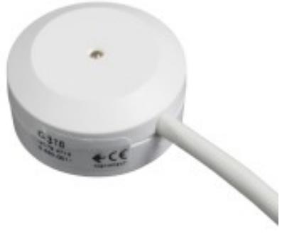
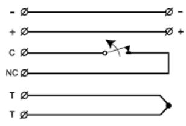
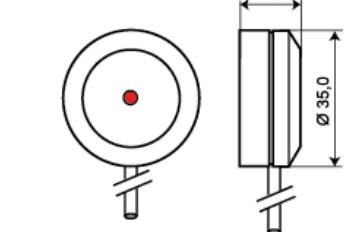
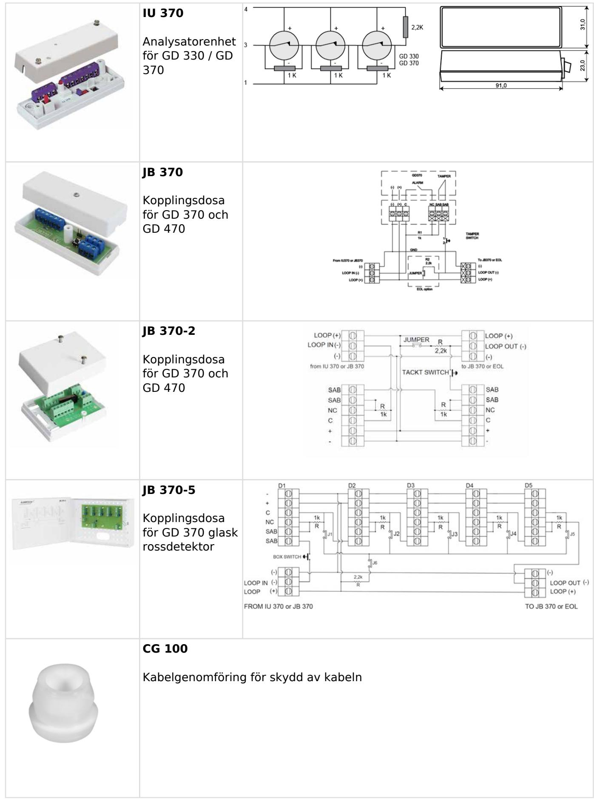

# GD 370

# Glaskrossdetektor för laminerat glas med reläutgång, limmad

### **Produktdetajler:**

| Räckvidd max      | 2 m radie (standard 3 mm glas)                     |
|-------------------|----------------------------------------------------|
| Godkännanden      | EN 50131-2-7-2:2013 Grade 2, SBSC 10-33 Klass 2 |
| Matningsspänning  | 8-15 VDC                                           |
| Strömförbrukning  | 7 mA (9 mA vid larm)                               |
| Larmutgång        | Relä, NC                                           |
| Kontaktdata       | 48 VDC / 100 mA                                    |
| Larmindikering    | LED                                                |
| Sabotageskydd     | Ja                                                 |
| Hålltid larm      | Kvarstående                                        |
| Larmåterställning | Brytning av spänningen                             |
| Anslutning        | Kabel                                              |
| Kapsling          | ABS Plast                                          |
| Arbetstemperatur  | –25 – +55°C                                        |
| Kapslingsklass    | IP 67                                              |
| Mått (H x Ø) mm   | 16 x 35                                            |

GD 370 är en glaskrossdetektor med reläutgång som kan anslutas direkt på en ingång i centralapparaten. Den är speciellt framtagen för övervakning av glaspartier gjorda av laminerat glas men passar även till trådat- och vanligt fönsterglas.

Den har en piezoelektrisk sensor som ger en elektrisk signal med en amplitud proportionell mot storleken på vibrationen. Signalen digitaliseras och behandlas därefter i en mikroprocessor. Med en förträfflig detektoralgoritm i mikroprocessorn så har detektorn en mycket hög tålighet mot störande signaler som kan orsaka obefogade larm.

Designen på detektorn är rund, vilket gör att den alltid sitter rakt.

GD 370 skall limmas på glaspartiet och till varje detektor medlevereras en schablon, paddel för limmet och kabelavlastning för snabb och enkel installation.

#### **BESTÄLLINGSINFORMATION**

| Typ       | E-nr    | Beskrivning                                                            |
|-----------|---------|------------------------------------------------------------------------|
| GD 370    | 6332530 | Glaskrossdetektor för laminerat glas med reläutgång, limmad, 3 m kabel |
| GD 370-6  | 6332531 | Glaskrossdetektor för laminerat glas med reläutgång,limmad, 6 m kabel  |
| GD 370-10 | 6332532 | Glaskrossdetektor för laminerat glas med reläutgång,limmad, 10 m kabel |

## **Relaterade produkter och tillbehör:**

### **Relaterade produkter och tillbehör:**

| GDK 100 Limsats för GD glaskrossdetektorer               |
|-------------------------------------------------------------|
| GVT 500 Testenhet för GD 300/GD 400 glaskrossdetektorer  |
| GVT 5000 Testenhet för glaskrossoch vibrationsdetektorer |

Powered by TCPDF (www.tcpdf.org)