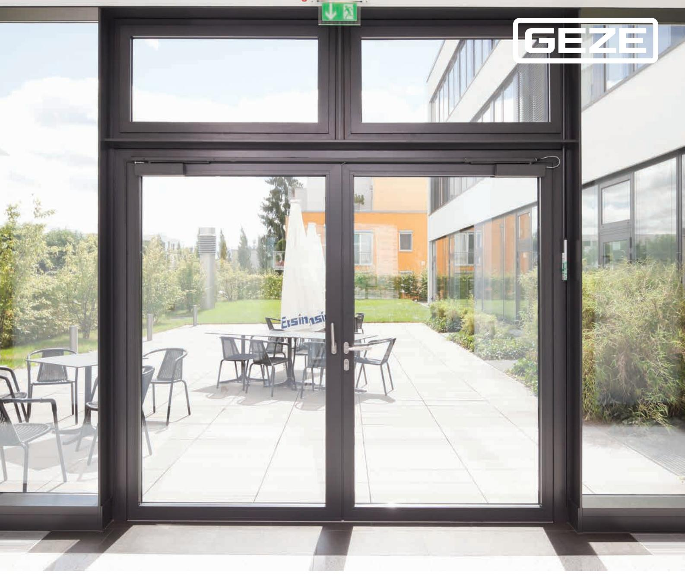
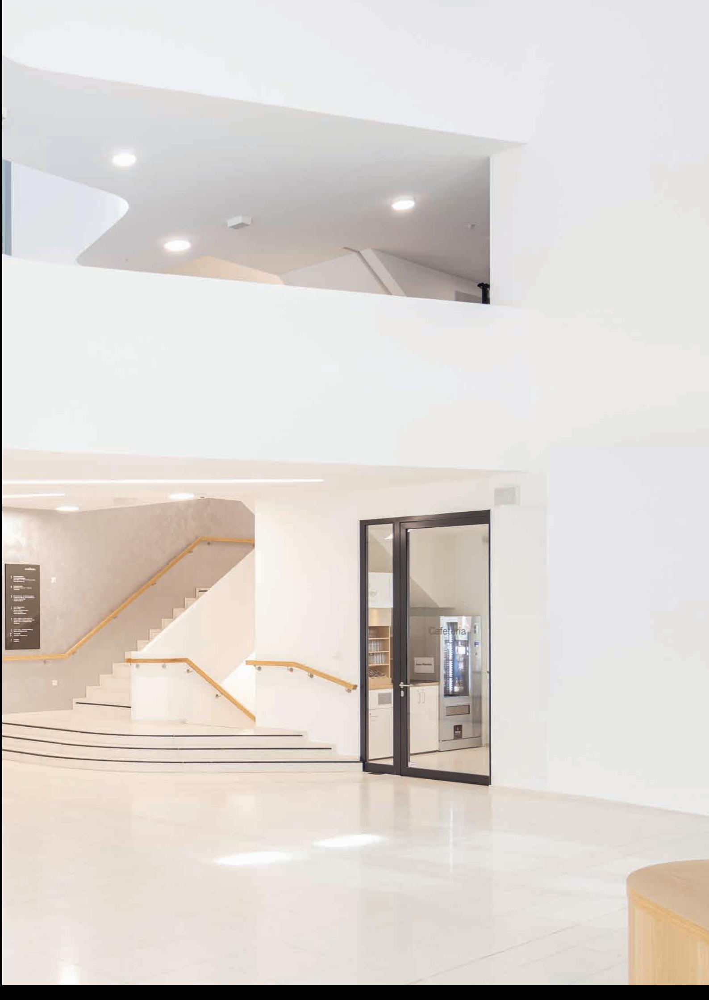
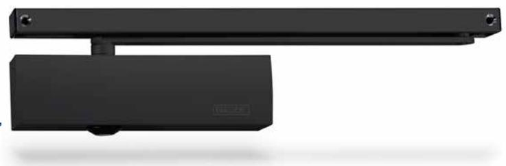
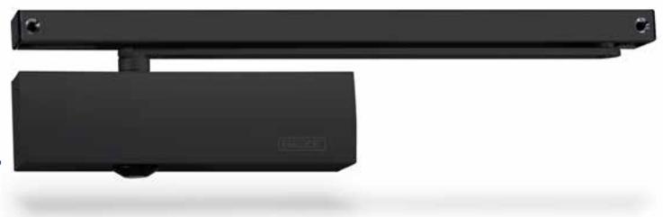
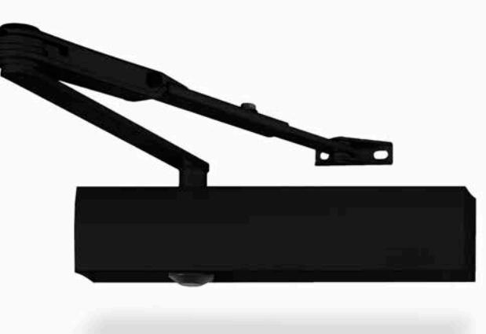
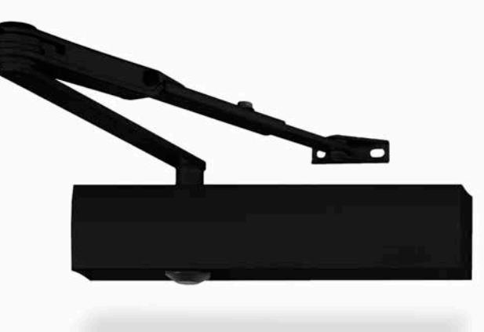
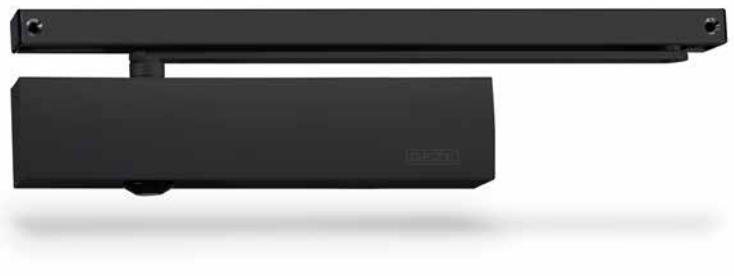
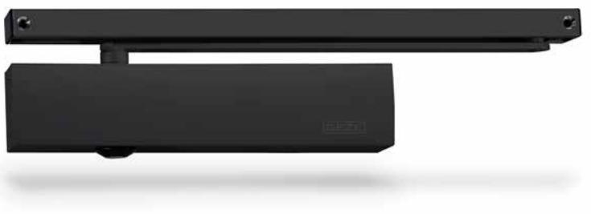
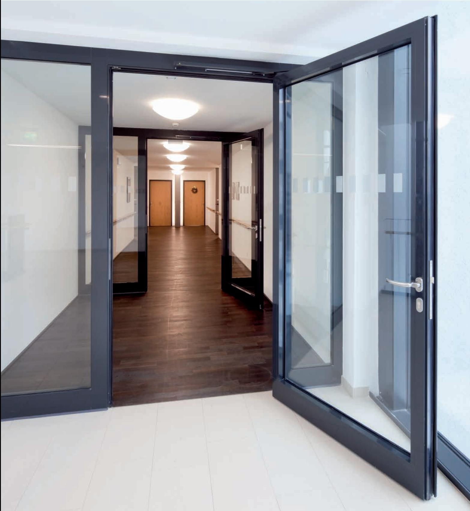

**DÖRRTEKNIK**

GEZE Dörrstängare - Black Edition

### **DÖRRTEKNIK**

**2 GEZE DÖRRTEKNIK |** Dörrstängare - Black Edition

## Dörrstängare Black Edition

Våra dörrstängare TS 3000, TS 4000 och TS 5000 finns nu även i svart som standard.

Även om svart just nu är en trend, kan arkitekter ibland kämpar för att hitta lämpliga produkter. GEZEs dörrstängare TS 3000, TS 4000 och TS 5000 serien finns nu i en elegant svart finish som standard.

# TS 3000 V

Dörrstängare med glidskena för enkeldörrar med dörrbladsbredd upp till 1100 mm

### **ANVÄNDNINGSOMRÅDE**

- Brand- och rökskyddsdörrar
- Höger- och vänsterhängda dörrar
- Enkeldörrar med dörrbladsbredd upp till 1100 mm
- Dörrbladsmontage på gångjärns- och anslagssidan, eller karmmontage på gångjärns- och anslagssidan

## **TEKNISKA DATA FÖR DÖRRSTÄNGARE**

#### **PRODUKTEGENSKAPER**

| Stängningskraft enl. EN 1154                     | 1-4                    |  |
|--------------------------------------------------|------------------------|--|
| Dörrbladsbredd (max)                             | 1100 mm                |  |
| Identisk design för DIN vänster och DIN höger    | ●                      |  |
| Produkt testad enligt                            | EN 1154                |  |
| Lämplig för brandskyddsdörrar                    | ●                      |  |
| Längd/bredd/höjd                                 | 226 mm x 46 mm x 60 mm |  |
|                                                  |                        |  |
| FUNKTIONER                                       |                        |  |
| Justerbar stängningskraft                        | Ja, steglös            |  |
| Justerbar stängningshastighet                    | ●                      |  |
| Justerbar ändslagsfunktion                       | Ja, med ventil         |  |
| Integrerad bromsfunktion                         | -                      |  |
| Justering av stängningskraft                     | På sidan               |  |
| Säkerhetsventil till skydd mot avsiktliga skador | ●                      |  |
|                                                  |                        |  |

Termostabila ventilskruvar ●

## TS 3000 V BC

Dörrstängare med glidskena för enkeldörrar med dörrbladsbredd upp till 1100 mm

#### **ANVÄNDNINGSOMRÅDE**

- Brand- och rökskyddsdörrar
- Höger- och vänsterhängda dörrar
- Enkeldörrar med dörrbladsbredd upp till 1100 mm
- Dörrbladsmontage på gångjärns- och anslagssidan, eller karmmontage på gångjärns- och anslagssidan

### **TEKNISKA DATA FÖR DÖRRSTÄNGARE**

#### **P R O D U K T EG E N S K A P E R**

| Stängningskraft enl. EN 1154                     | 1-4                       |
|--------------------------------------------------|---------------------------|
| Dörrbladsbredd (max)                             | 1100 mm                   |
| Identisk design för DIN vänster och DIN höger    | ●                         |
| Produkt testad enligt                            | EN 1154                   |
| Lämplig för brandskyddsdörrar                    | ●                         |
| Längd/bredd/höjd                                 | 226 mm x 46 mm x 60 mm    |
|                                                  |                           |
| FUNKTIONER                                       |                           |
| Justerbar stängningskraft                        | Ja, steglös               |
| Justerbar stängningshastighet                    | ●                         |
| Justerbar ändslagsfunktion                       | Ja, med ventil            |
| Integrerad bromsfunktion                         | Ja, hydrauliskt justerbar |
| Justering av stängningskraft                     | På sidan                  |
| Säkerhetsventil till skydd mot avsiktliga skador | ●                         |
| Termostabila ventilskruvar                       | ●                         |

## TS 4000 EN 1-6

Dörrstängare med arm för enkeldörrar med dörrbladsbredd upp till 1400 mm

### **ANVÄNDNINGSOMRÅDE**

- Brand- och rökskyddsdörrar
- Höger- och vänsterhängda dörrar
- Enkeldörrar med dörrbladsbredd upp till 1400 mm
- Dörrbladsmontage på gångjärnssidan eller karmmontage på anslagssidan
- Dörrbladsmontage möjligt på karmsidan med monterad parallellarm

## **TEKNISKA DATA FÖR DÖRRSTÄNGARE**

#### **P R O D U K T EG E N S K A P E R**

| Stängningskraft enl. EN 1154                  | 1-6                    |  |
|-----------------------------------------------|------------------------|--|
| Dörrbladsbredd (max)                          | 1400 mm                |  |
| Identisk design för DIN vänster och DIN höger | ●                      |  |
| Produkt testad enligt                         | EN 1154                |  |
| Lämplig för brandskyddsdörrar                 | ●                      |  |
| Längd/bredd/höjd                              | 287 mm x 46 mm x 60 mm |  |

| Justerbar stängningskraft                        | Ja, steglös               |
|--------------------------------------------------|---------------------------|
| Justerbar stängningshastighet                    | ●                         |
| Justerbar ändslagsfunktion                       | Ja, via standardarmen     |
| Integrerad bromsfunktion                         | Ja, hydrauliskt justerbar |
| Justering av stängningskraft                     | Framifrån                 |
| Display som visar stängningskraft                | ●                         |
| Säkerhetsventil till skydd mot avsiktliga skador | ●                         |
| Termostabila ventilskruvar                       | ●                         |
| Alla funktioner kan justeras från fronten        | ●                         |

## TS 4000 EN 5-7

Dörrstängare med arm för enkeldörrar med dörrbladsbredd upp till 1600 mm

### **ANVÄNDNINGSOMRÅDE**

- Brand- och rökskyddsdörrar
- Höger- och vänsterhängda dörrar
- Enkeldörrar med dörrbladsbredd upp till 1600 mm
- Dörrbladsmontage på gångjärnssidan eller karmmontage på anslagssidan
- Dörrbladsmontage möjligt på karmsidan med monterad parallellarm

## **TEKNISKA DATA FÖR DÖRRSTÄNGARE**

#### **P R O D U K T EG E N S K A P E R**

| Stängningskraft enl. EN 1154                  | 5-7                    |  |
|-----------------------------------------------|------------------------|--|
| Dörrbladsbredd (max)                          | 1600 mm                |  |
| Identisk design för DIN vänster och DIN höger | ●                      |  |
| Produkt testad enligt                         | EN 1154                |  |
| Lämplig för brandskyddsdörrar                 | ●                      |  |
| Längd/bredd/höjd                              | 287 mm x 46 mm x 60 mm |  |

| Justerbar stängningskraft                        | Ja, steglös               |
|--------------------------------------------------|---------------------------|
| Justerbar stängningshastighet                    | ●                         |
| Justerbar ändslagsfunktion                       | Ja, via standardarmen     |
| Integrerad bromsfunktion                         | Ja, hydrauliskt justerbar |
| Justering av stängningskraft                     | Framifrån                 |
| Display som visar stängningskraft                | ●                         |
| Säkerhetsventil till skydd mot avsiktliga skador | ●                         |
| Termostabila ventilskruvar                       | ●                         |
| Alla funktioner kan justeras från fronten        | ●                         |

# TS 5000

Dörrstängare med glidskena för montering på dörrblad gångjärnsida eller karm anslagsida.

### **ANVÄNDNINGSOMRÅDE**

- Brand- och rökskyddsdörrar
- Höger- och vänsterhängda dörrar
- Enkeldörrar med dörrbladsbredd upp till 1400 mm
- Montering på dörrbladets gångjärnssida, montering på motsatt sida från gångjärnen

## **TEKNISKA DATA FÖR DÖRRSTÄNGARE**

#### **P R O D U K T EG E N S K A P E R**

| Stängningskraft enl. EN 1154                  | 2-6                    |  |
|-----------------------------------------------|------------------------|--|
| Dörrbladsbredd (max)                          | 1400 mm                |  |
| Identisk design för DIN vänster och DIN höger | ●                      |  |
| Produkt testad enligt                         | EN 1154                |  |
| Lämplig för brandskyddsdörrar                 | ●                      |  |
| Längd/bredd/höjd                              | 287 mm x 47 mm x 60 mm |  |

| Justerbar stängningskraft                        | Ja, steglös               |  |
|--------------------------------------------------|---------------------------|--|
| Justerbar stängningshastighet                    | ●                         |  |
| Justerbar ändslagsfunktion                       | Ja, med ventil            |  |
| Integrerad bromsfunktion                         | Ja, hydrauliskt justerbar |  |
| Justering av stängningskraft                     | Framifrån                 |  |
| Display som visar stängningskraft                | ●                         |  |
| Säkerhetsventil till skydd mot avsiktliga skador | ●                         |  |
| Termostabila ventilskruvar                       | ●                         |  |
| Alla funktioner kan justeras från fronten        | ●                         |  |

## TS 5000 L

Dörrstängare med glidskena för montering på dörrblad anslagssida eller karm gångjärnsida

### **ANVÄNDNINGSOMRÅDE**

- Brand- och rökskyddsdörrar
- Höger- och vänsterhängda dörrar
- Enkeldörrar med dörrbladsbredd upp till 1400 mm
- Montering på dörrbladets gångjärnssida, montering på motsatt sida från gångjärnen

### **TEKNISKA DATA FÖR DÖRRSTÄNGARE**

#### **P R O D U K T EG E N S K A P E R**

| Stängningskraft enl. EN 1154                  | 2-6                    |  |
|-----------------------------------------------|------------------------|--|
| Dörrbladsbredd (max)                          | 1400 mm                |  |
| Identisk design för DIN vänster och DIN höger | ●                      |  |
| Produkt testad enligt                         | EN 1154                |  |
| Lämplig för brandskyddsdörrar                 | ●                      |  |
| Längd/bredd/höjd                              | 287 mm x 47 mm x 60 mm |  |

| Justerbar stängningskraft                        | Ja, steglös               |  |
|--------------------------------------------------|---------------------------|--|
| Justerbar stängningshastighet                    | ●                         |  |
| Justerbar ändslagsfunktion                       | Ja, med ventil            |  |
| Integrerad bromsfunktion                         | Ja, hydrauliskt justerbar |  |
| Justering av stängningskraft                     | Framifrån                 |  |
| Display som visar stängningskraft                | ●                         |  |
| Säkerhetsventil till skydd mot avsiktliga skador | ●                         |  |
| Termostabila ventilskruvar                       | ●                         |  |
| Alla funktioner kan justeras från fronten        | ●                         |  |

## Beställningsinformation

| BETECKNING                              | UTFÖRANDE        | ID NR  |
|-----------------------------------------|------------------|--------|
| TS 3000 / 5000                          |                  |        |
| TS 3000 - Dörrstängare utan glidskena   | RAL 9005         | 119583 |
| TS 5000 - Dörrstängare utan glidskena   | RAL 9005         | 076489 |
| TS 5000 L - Dörrstängare utan glidskena | RAL 9005 GC30%   | 119579 |
| TS 5000/TS 3000 - glidskena             | Svart matt       | 119580 |
| TS 5000 L - glidskena BG                | Svart matt       | 198812 |
| TS 3000/5000 ISM - glidskena            | Svart matt       | 198813 |
| TS 5000 L ISM - glidskena BG            | Svart matt       | 198814 |
| TS 4000                                 |                  |        |
| TS 4000 V - Dörrstängare utan arm       | Svart K          | 109542 |
| TS 4000 S - Dörrstängare utan arm       | RAL 9005 GG30% K | 119562 |
| TS 4000 - Standard arm                  | Svart-matt K     | 109544 |
| Uppställningsarm - i och urkopplingsbar | Svart-matt K     | 109545 |
| Uppställningsarm - Uppställningsbar     | Svart-matt K     | 152365 |
| TILLBEHÖR                               |                  |        |
| Montageplatta - TS 4/5000               | RAL 9005 GG30%   | 076508 |
| Montageplatta - TS 3000 V               | RAL 9005 GG30%   | 135237 |

**WWW.GEZE.COM**

**GEZE Sverige AB |** Mallslingan 10 **|** SE-187 66 Täby **| TEL.** +46 (0) 8 732 34 00 **| E-POST** sverige.se@geze.com **|** www.geze.se

**WWW.GEZE.COM**

**WWW.GEZE.COM**

**GEZE Sverige AB |** Mallslingan 10 **|** SE-187 66 Täby **| TEL.** +46 (0) 8 732 34 00 **| E-POST** sverige.se@geze.com **|** www.geze.se

**WWW.GEZE.COM**