**GEZE** DÖRRTEKNIK

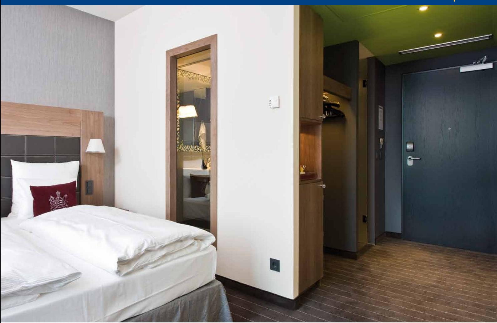

# G E Z E T S 4000 Dörrstä nga re med arm

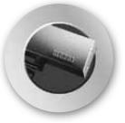

**DØRTEKNIK AUTOMATISKE** 

**Dörrteknik Automatiska**

Dørteknik

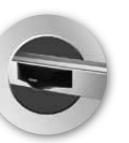

**DØRSYSTEMER**

**dörrsystem**

Dørsystemer

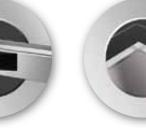

logoer 1 09/03/10 14.29

**Glassystemer**

> Røgventilation

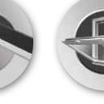

Sikkerhedsteknik

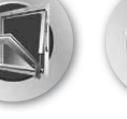

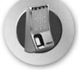

**VENTILATION OG RØGVENTILATION Komfort- och rökventilation**

**GLASSYSTEMER SIKKERHEDSTEKNIK Glassystem Säkerhetsteknik**

Glassystemer

Bewegu ng mit System

## DÖRRTEKNIK GEZE TS 4000 Dörrst ängare med arm

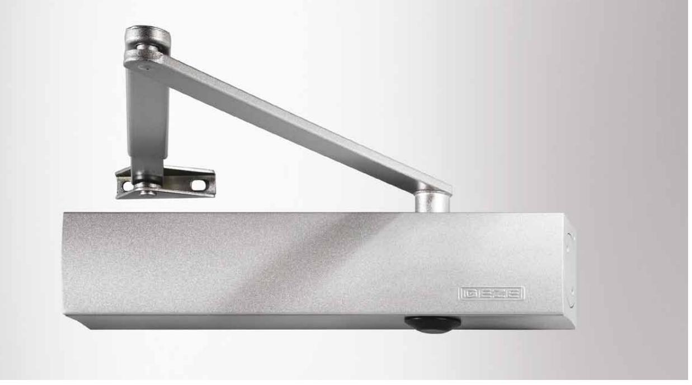

#### **GEZE TS 4000**

TS 4000, en av GEZE's standardmodeller är anpassad för brand-, ytter- och innerdörrar, där det ställs höga krav på funktionalitet och kraft. All justering av funktioner sker framifrån med termostabila säkerhetsskruvar som har stopp i öppet läge för att undvika oljeläckage. Storleken och kraften justeras framifrån och kan lätt avläsas på den optiska storleksindikeringen. Dessa funktioner möjliggör snabbt och enkelt montage. TS 4000 uppfyller alla normer och krav som marknaden ställer på en dörrstängare. Innovation, design och funktion är krav vi ställer på alla våra dörrstängare. Det finns alltid en GEZE produkt som passar just din dörrmiljö.

#### **Användningsområde:**

- j För invändiga och utvändiga slagdörrar
- j För både höger- och vänsterhängd dörr
- j Dörrbladsmontage på gångjärnssidan eller karmmontage på anslagssidan
- j För brandklassad dörr
- j För användning på branddörr behövs en montageplatta

#### **Produktegenskaper:**

- j Stilren design
- j Alla funktioner justeras framifrån
- j Optisk storleksindikator
- j Termostabila säkerhetsventiler i öppet och stängt läge
- j Justerbar stängningskraft, storlek 1-6
- j Justerbar stängningshastighet 180-0°
- j För dörrbladsbredder enligt nedan Storleksklass Dörrbladsbredd 1* 750 mm 2* 750 - 850 mm 3 850 - 950 mm 4 950 -1100 mm 5 1100 -1250 mm 6 1250 -1400 mm * Denna storleksklass får enligt EN inte ställas in på brandklassade dörrar.
- j Justerbar öppningsbroms från 75°
- j Inställning av tillslagskraft via armsystem 10-0°
- j Kan monteras på dörr eller karm på upp till 1400 mm dörrbladsbredd
- j Standardkulör är silver, brun och vitlackerad RAL 9016
- j Specialkulör enligt RAL eller NCS skala

| ID nr. | Beteckning                             | Egenskap     | ID nr. |  |
|--------|----------------------------------------|--------------|--------|--|
|        | GEZE Dörrstängare TS 4000 storlek 1-6, | Silver       | 102789 |  |
|        | utan armsystem                         | Vit RAL 9016 | 102791 |  |
|        |                                        | Silver       | 102421 |  |
|        | Standardarm                            | Vit RAL 9016 | 102423 |  |

## DÖRRTEKNIK

44 38

98

## GEZE TS 4000 Dörrst ängare med arm

#### **mått Ts 4000**

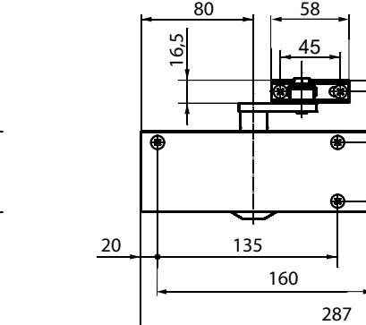

### **MONTAGEMÖJLIGHETER**

Montage på gångjärnssidan

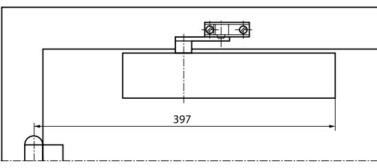

46

60

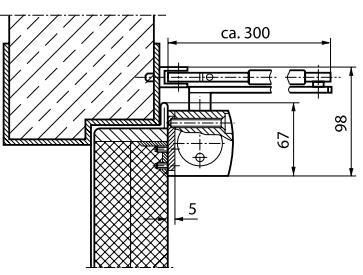

#### Med montageplatta

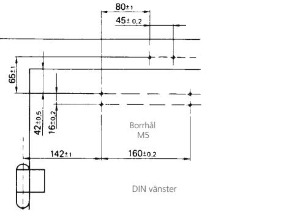

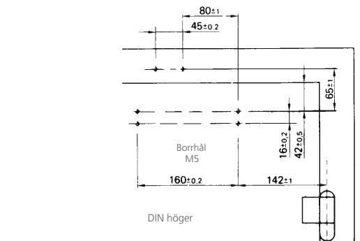

Borrhål M5

Borrhål M5

DIN vänster DIN höger

Borrhål M5

Borrhål M5

DIN vänster DIN höger

Borrhål M5

Borrhål M5

Borrhål M5

Borrhål M5

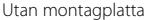

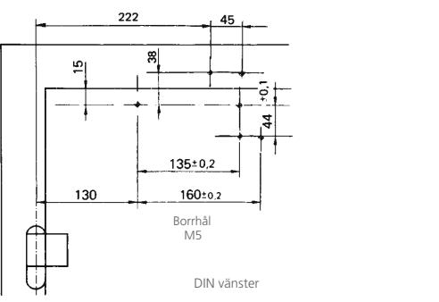

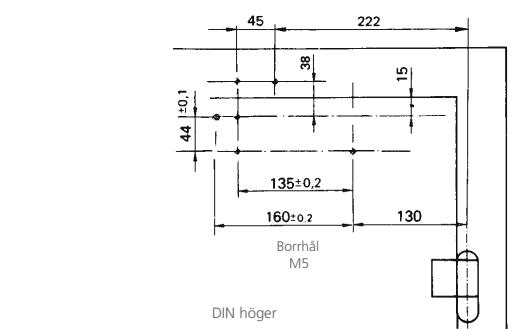

### **Tillbehör:**

- j Montageplatta till dörrstängarhus och arm
- j Universalplatta till dörrstängarhus
- j Klämplatta till helglasdörr
- j Parallellarmsfäste
- j Axelförlängare
- **TS 4000 varianter:**
- j TS 4000, storlek 5-7
- j TS 4000 S, med stängningsfördröjning
- j TS 4000 E, med elektrohydraulisk uppställning
- j TS 4000 R, med elektrohydraulisk uppställning och inbyggd rökdetektor
- j Förlängd standardarm
- j Uppställningsarm utan frånkopplingsmöjlighet upp till 150°
- j Uppställningsarm i- och ur- kopplingsbar upp till 150°
- j Täckkåpa i rostfritt- och mässing
- j TS 4000 EFS, med elektrohydraulisk uppställning och freeswing funktion
- j TS 4000 RFS, med elektrohydraulisk uppställning, freeswing funktion och inbyggd rökdetektor

| OM | GEZE |
|----|------|

GEZE Scandinavia AB är ett helägt dotterbolag till GEZE GmbH. GEZE är en världsledande tillverkare av manuella och automatiska dörr- och fönsterteknologisystem med dotterbolag och produktion runt om i världen. Sedan starten 1863 har design, funktion och innovation varit det centrala i GEZE´s filosofi. För marknaden betyder det den senaste tekniken, kvalitet, funktionalitet och formskön design.

Vi arbetar i nära samarbete med marknadens aktörer, tillsammans utvecklar vi lösningar som förvandlar ambitiösa visioner till verklighet.

#### **GEZE Scandinavia**

**GEZE Sverige**

Mallsingan 10 Box 7060 S-187 11 Täby Tel. +46 (0) 8-732 34 00 Fax +46 (0) 8-732 34 99 E-mail: sverige.se@geze.com www.geze.se

#### **GEZE Danmark**

Mårkærvej 13 J-K DK-2630 Taastrup Tel. +45 46 32 33 24 Fax +45 46 32 33 26 E-mail: danmark.se@geze.com www.geze.dk

#### **GEZE Norge**

Industrivegen 34B NO-2072 Dal Tel. +47 63 95 72 00 Fax +47 63 95 71 73 E-mail: norge.se@geze.com www.geze.no

Bewegu ng mit System