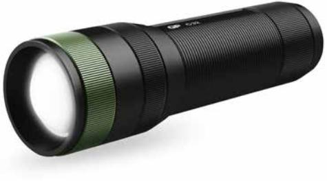
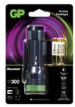
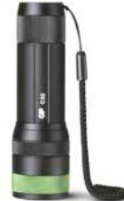
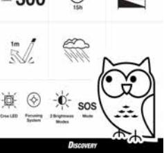
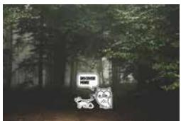
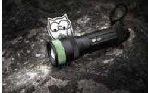

## GP Discovery ficklampa, C32

Stark, liten och robust. En räddare i nöden. Vrid på lamphuvudet och ändra ljusbilden. Två ljuslägen och SOS-läge. Handledsrem. 

- Storlek: S
- Räckvidd: 100 m
- Styrka: 300 lumen
- Batteritid: 15 h
- Ljuslägen: Hög, låg, SOS
- Variabel ljusbild
- Striltät (IPX4)

### **ARTICLE INFORMATION:** Art.no: 450052

EAN: 4891199183874 E-nummer: 9451708

**Page 1/2**

# GP Discovery ficklampa, C32

#### **Technical specifikation**

| Ljusflöde (Lumen)  | 300        |  |
|--------------------|------------|--|
| Batteri medföljer  | 3x AAA     |  |
| Tillverkningsland  | Kina       |  |
| Statistiskt nummer | 8513100000 |  |
| E-nummer           | 9451708    |  |

### **Packaging information**

|                 | EXKRT          | 1-P           | ST      |
|-----------------|----------------|---------------|---------|
| EAN kod         | 04891199183836 | 4891199183874 |         |
| Längd (mm)      | 230.000        | 110.000       | 32.000  |
| Höjd (mm)       | 180.000        | 162.000       | 108.000 |
| Bredd (mm)      | 180.000        | 34.000        | 0.000   |
| Bruttovikt (kg) | 2.20000        | 0.18333       | 0.18300 |
| Net Weight (kg) | 1.35000        | 0.11250       | 0.11250 |
| Gross Volume    | 0.00745        | 0.00000       | 0.00062 |
| Net Volume      | 0.00000        | 0.00000       | 0.00000 |
| Antal ST        | 12             | 1             | 1       |

