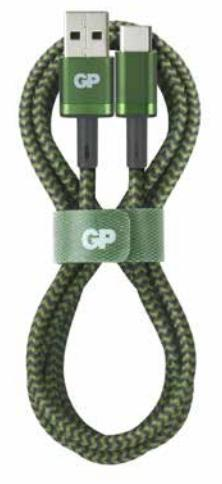
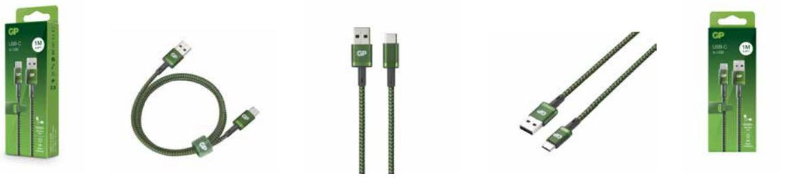

## GP USB-kabel CC1A, USB-C till USB-A, 1m

Ladda din enhet hemma eller i farten med denna snabbladdande USB-A till USB-C-kabel från GP. USB-C möjliggör snabbare och effektivare laddning än tidigare USB-portar, så som USB-A och Micro-USB. Porten är vändbar, vilket gör det enklare att ansluta till din enhet. 

- 1 meter
- Inget sladdtrassel med nylonbeklädd kabel
- Output: 5V/3A, 9V/2A, 12V/1.5A (Max. 18W)
- Stödjer QC (Quick Charge) 3.0

#### **ARTICLE INFORMATION:**

Art.no: 405170 EAN: 4891199190889 E-nummer: 5720717

# GP USB-kabel CC1A, USB-C till USB-A, 1m

### **Technical specifikation**

| Verde      |
|------------|
| 0.000      |
| Kina       |
| 8504405590 |
| 5720717    |
| 56673521   |
| On the go  |
|            |

### **Packaging information**

|                 | EXKRT          | INKRT          | 1-P           | ST       |
|-----------------|----------------|----------------|---------------|----------|
| EAN kod         | 04891199190902 | 04891199190896 | 4891199190889 |          |
| Längd (mm)      | 225.000        | 210.000        | 20.000        | 1000.000 |
| Höjd (mm)       | 156.000        | 68.000         | 150.000       | 0.000    |
| Bredd (mm)      | 190.000        | 178.000        | 57.000        | 0.000    |
| Bruttovikt (kg) | 1.95000        | 0.97500        | 0.09750       | 0.09750  |
| Net Weight (kg) | 1.26000        | 0.63000        | 0.06300       | 0.06300  |
| Gross Volume    | 0.00667        | 0.02500        | 0.00000       | 0.00033  |
| Net Volume      | 0.00000        | 0.00000        | 0.00000       | 0.00000  |
| Antal ST        | 20             | 10             | 1             | 1        |

**Page 2/2**