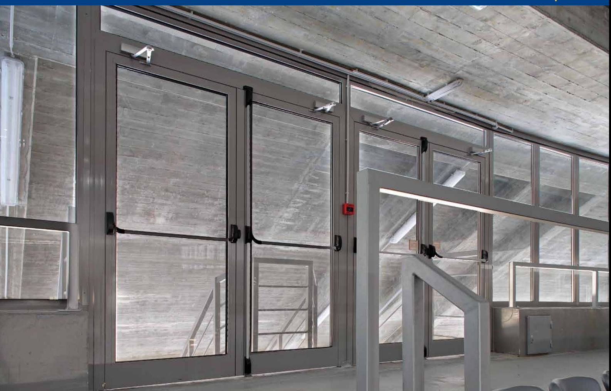

# GEZE TS 1500 Dörrstä nga re med arm

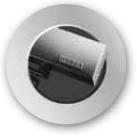

Dørteknik

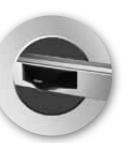

**DØRSYSTEMER**

**dörrsystem**

Dørsystemer

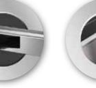

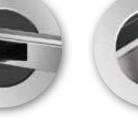

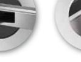

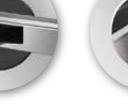

logoer 1 09/03/10 14.29

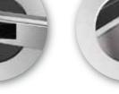

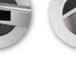

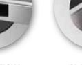

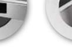

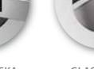

**Glassystemer**

> Røgventilation

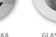

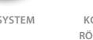

Sikkerhedsteknik

**VENTILATION OG RØGVENTILATION Komfort- och rökventilation**

**GLASSYSTEMER SIKKERHEDSTEKNIK Glassystem Säkerhetsteknik**

Glassystemer

Bewegu ng mit System

### DÖRRTEKNIK GEZE TS 1500 Dörrst äng are med st and ard armsyste m

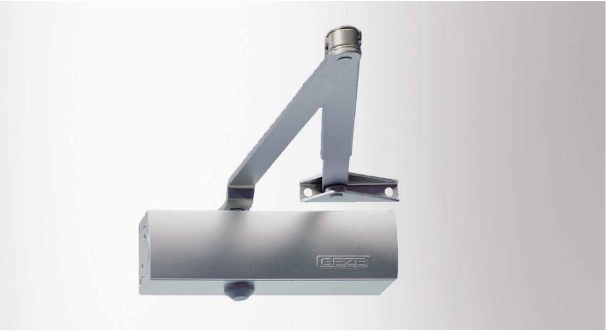

#### **GEZE ts 1500**

TS 1500 är en liten och kompakt dörrstängare till ett konkurrenskraftigt pris och finns med standardarm eller uppställningsarm. 1500 är avsedd för invändiga dörrar och är natrurligtvis godkänd för branddörrar. Alla funktioner justeras från dörrstängarens sida.

Hög kvalitet, enkel installation och stilren design är krav vi ställer på alla våra dörrstängare.

#### **Användningsområde:**

- j Till invändiga slagdörrar
- j Kan användas till höger- och vänsterdörrar
- j Dörrbladsmontage på gångjärnssidan, eller karmmontage på anslagssidan.
- j Godkänd för branddörrar enl EN 1154

#### **Produktegenskaper:**

#### j Stilren design

- j Termostabila ventilskruvar i öppet och stängt läge
- j Justerbar stängningskraft storlek 3/4
- j Justerbar stängningshastighet 180-0°
- j Justerbar tillslagskraft 10-0°
- j Dörrbredd upptill 1100 mm
- j Standardfärg: Silver och vit RAL 9016

| ID nr. | Beteckning                          | Utförande    | ID nr. |  |
|--------|-------------------------------------|--------------|--------|--|
|        | GEZE Dörrstängarhus                 | Silver       | 101792 |  |
|        | TS 1500 storlek 3/4, utan armsystem | Vit RAL 9016 | 101794 |  |
|        | Standardarm                         | Silver       | 101878 |  |
|        |                                     | Vit RAL 9016 | 101881 |  |

Dörrteknik

#### DÖRRTEKNIK

## GEZE TS 1500 Dörrst äng are med st and ard armsyste m

#### **Mått TS 1500**

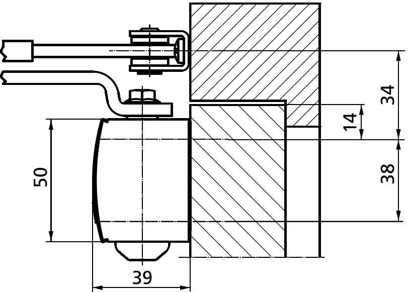

Montage på gångjärnssidan

34

38

14

50

39

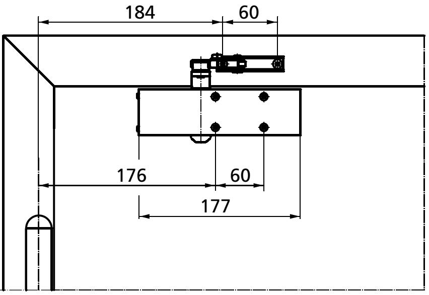

Dörrteknik

176

177

60

60

184

#### DÖRRTEKNIK

### GEZE TS 1500 Dörrst äng are med st and ard armsyste m

#### **Tillbehör:**

- j Arm
- j Uppställningsarm

| TS 1500    | j TS 1500 | Med arm |
|------------|-----------|---------|
| varianter: |           |         |

- 
- j TS 1500 G Med glidskena

- j Montageplatta dörrstängarhus
#### **OM GEZE**

GEZE Scandinavia AB är ett helägt dotterbolag till GEZE GmbH. GEZE är en världsledande tillverkare av manuella och automatiska dörr- och fönsterteknologisystem med dotterbolag och produktion runt om i världen. Sedan starten 1863 har design, funktion och innovation varit det centrala i GEZE´s filosofi. För marknaden betyder det den senaste tekniken, kvalitet, funktionalitet och formskön design.

Vi arbetar i nära samarbete med marknadens aktörer, tillsammans utvecklar vi lösningar som förvandlar ambitiösa visioner till verklighet.

#### **GEZE Scandinavia**

**GEZE Sverige**

Mallsingan 10 Box 7060 S-187 11 Täby Tel. +46 (0) 8-732 34 00 Fax +46 (0) 8-732 34 99 E-mail: sverige.se@geze.com www.geze.se

#### **GEZE Danmark**

Mårkærvej 13 J-K DK-2630 Taastrup Tel. +45 46 32 33 24 Fax +45 46 32 33 26 E-mail: danmark.se@geze.com www.geze.dk

#### **GEZE Norge**

Industrivegen 34B NO-2072 Dal Tel. +47 63 95 72 00 Fax +47 63 95 71 73 E-mail: norge.se@geze.com www.geze.no

### Bewegu ng mit System