**GEZE** DÖRRTEKNIK

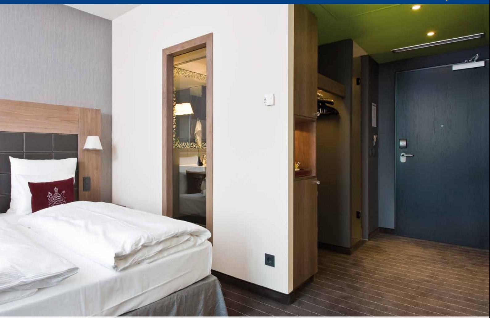

## G E Z E T S 4000 E D Ö R R S T Ä N G A R E M E D E L E K T R O H Y D R A U L I S K UPPSTÄLLNING OCH STANDARDARM **ssys**

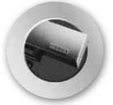

Dørteknik

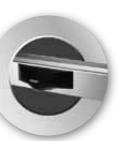

**DØRSYSTEMER**

**dörrsystem**

Dørsystemer

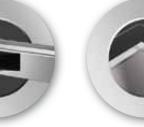

logoer 1 09/03/10 14.29

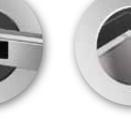

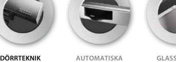

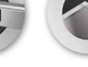

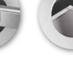

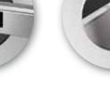

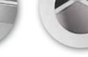

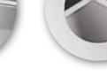

**Gla** **temer**

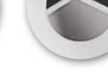

Røgventilation

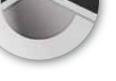

Sikkerhedsteknik

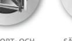

Glassystemer

**RØGVENTILATION rökventilation**

**GLASSYSTEMER SIKKERHEDSTEKNIK Glassystem Säkerhetsteknik**

Bewegung mit System

# Dörrteknik GEZE TS 4000 E

Dörrteknik

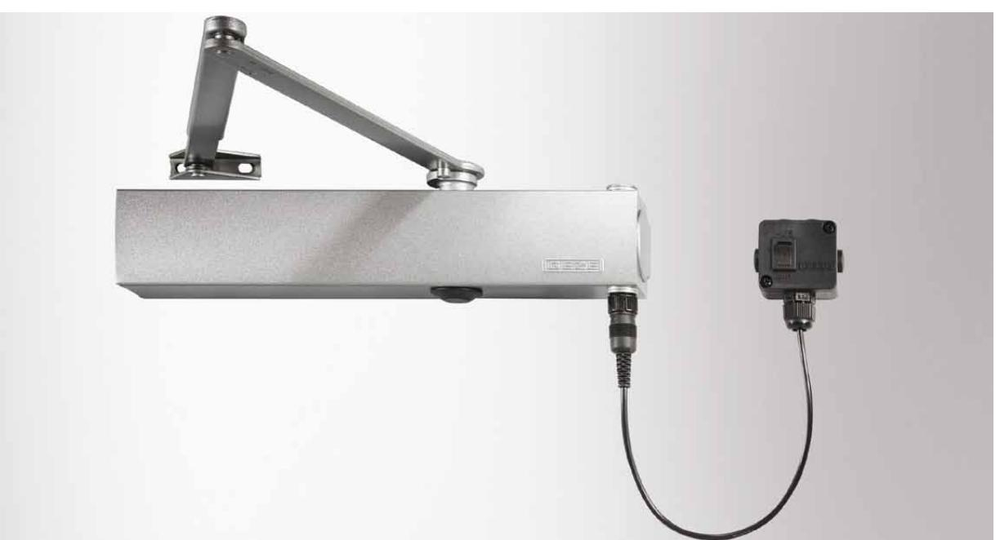

#### **GEZE TS 4000 E**

TS 4000, en av GEZE's standardmodeller är anpassad för brand-, ytter- och innerdörrar. Alla funktioner justeras framifrån med termostabila säkerhetsskruvar som har stopp i öppet läger för att undvika oljeläckage. Till TS 4000-serien finns en omfattande tillbehörsprogram och den uppfyller alla normer och krav som marknaden ställer på en dörrstängare. Hög kvalitet, enkel montering och stilren design är krav vi ställer på alla våra dörrstängare.

TS 4000 E har inbyggd elektrohydraulisk uppställning.

## **Användningsområde:**

j Invändiga och utvändiga slagdörrar

- j Kan användas till höger- och vänsterhängda dörrar
- j Normalmontage på gångjärnssidan eller karmmontage på anslagssidan
- j Godkänd för brandklassade dörrar
- j Vid användning på branddörr behövs en montageplatta

#### **Produktegenskaber:**

#### j Stilren design

- j Alla funktioner justeras framifrån
- j Optisk storleksindikator
- j Termostabila säkerhetsventiler i öppet och stängt läge
- j Justerbar stängningskraft, storlek 1-6
- j Justerbar stängningshastighet 180-0°
- j Justerbar öppningsbroms från 75°
- j För dörrbladsbredder enligt nedan Storleksklass Dörrbladsbredd 1* - 750 mm 2* 750 - 850 mm 3 850 - 950 mm 4 950 - 1100 mm 5 1100 - 1250 mm 6 1250 - 1400 mm 7 1400 - 1600 mm
- * Denna storleksklass får enligt EN inte ställas in på brandklassade dörrar.
- j Inställning av tillslagskraft via armsystem 10-0°
- j Elektrohydraulisk uppställning av dörren mellan 80-175°
- j Driftspänning 24 V DC, spänningstolerans +/- 10%
- j Kan monteras på dörrblad gångjärnssida eller karm anslagssida på upp till 1400 mm dörrblad
- j Levereras som standard i silver
- j Specialkulör enligt RAL eller NCS skala

| ID | NR. |
|----|-----|
|----|-----|

| ID nr. | Beteckning                                            | Egenskap | ID nr. |
|--------|-------------------------------------------------------|----------|--------|
|        | GEZE Dörrstängare TS 4000 E Storlek 1-6 normalmontage | Silver   | 105211 |
|        | GEZE Dörrstängare TS 4000 E Storlek 1-6 karmmontage   | Silver   | 105213 |
|        | Standardarm                                           | Silver   | 102421 |

## **MÅTT Ts 4000 E**

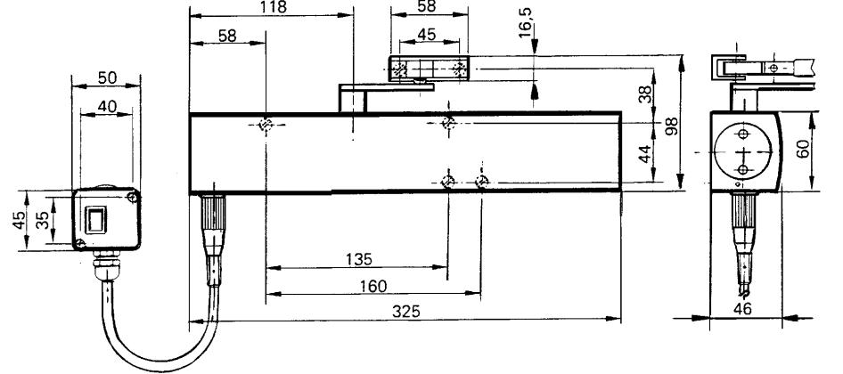

#### **Montage**

på gångjärnssida

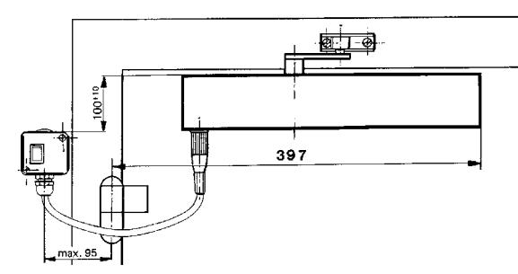

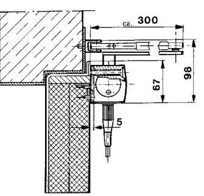

#### Direktmontage

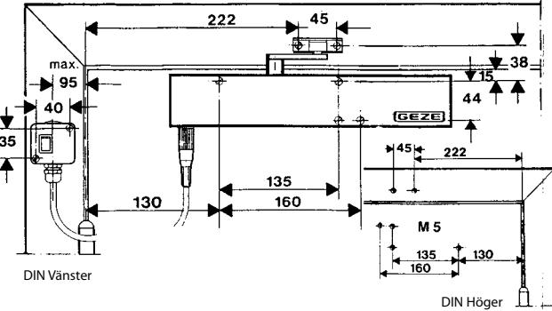

DIN Vänster

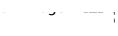

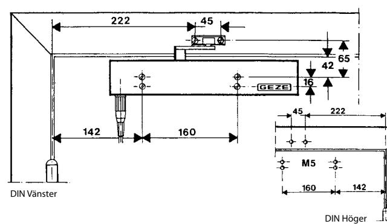

Montage med montageplatta (extra tillbehör) Dörrteknik

## Dörrteknik

GEZE TS 4000 E

#### **Tillbehör:**

- j Montageplatta till hus och arm
- j Klämplatta till helglasdörr
- j Parallellarmsfäste
- j Axelförlängare

## **TS 4000 varianter:**

- j TS 4000
- j TS 4000, storlek 5-7
- j TS 4000 S, med stängningsfördröjning
- j TS 4000 E, med elektrohydraulisk uppställning
- j TS 4000 R, med elektrohydraulisk uppställning och inbyggd rökdetektor
- j Förlängd standardarm
- j Anslutningsdosa med DIN-kontakt
- j Free-swingarm
- j TS 4000 EFS, med elektrohydraulisk uppställning och freeswing funktion
- j TS 4000 RFS, med elektrohydraulisk uppställning, freeswing funktion och inbyggd rökdetektor

## **OM GEZE**

GEZE Scandinavia AB är ett helägt dotterbolag till GEZE GmbH. GEZE är en världsledande tillverkare av manuella och automatiska dörr- och fönsterteknologisystem med dotterbolag och produktion runt om i världen. Sedan starten 1863 har design, funktion och innovation varit det centrala i GEZE´s filosofi. För marknaden betyder det den senaste tekniken, kvalitet, funktionalitet och formskön design.

Vi arbetar i nära samarbete med marknadens aktörer, tillsammans utvecklar vi lösningar som förvandlar ambitiösa visioner till verklighet.

#### **GEZE Scandinavia**

**GEZE Sverige**

Mallsingan 10 Box 7060 S-187 11 Täby Tel. +46 (0) 8-732 34 00 Fax +46 (0) 8-732 34 99 E-mail: sverige.se@geze.com www.geze.se

#### **GEZE Danmark**

Mårkærvej 13 J-K DK-2630 Taastrup Tel. +45 46 32 33 24 Fax +45 46 32 33 26 E-mail: danmark.se@geze.com www.geze.dk

## **GEZE Norge**

Industrivegen 34B NO-2072 Dal Tel. +47 63 95 72 00 Fax +47 63 95 71 73 E-mail: norge.se@geze.com www.geze.no

## Bewegung mit System