**GEZE** DÖRRTEKNIK

# G E Z E T s 5000 L Dörrstä nga re med gl idarmsystem

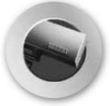

**DØRTEKNIK AUTOMATISKE** 

**Dörrteknik Automatiska**

Dørteknik

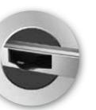

**DØRSYSTEMER**

**dörrsystem**

logoer 1 09/03/10 14.29

Dørsystemer

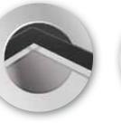

**Glassystemer**

> Røgventilation

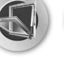

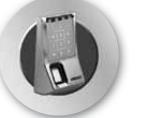

**VENTILATION OG RØGVENTILATION Komfort- och rökventilation**

Sikkerhedsteknik

**GLASSYSTEMER SIKKERHEDSTEKNIK Glassystem Säkerhetsteknik**

Glassystemer

Bewegu ng mit Sy stem

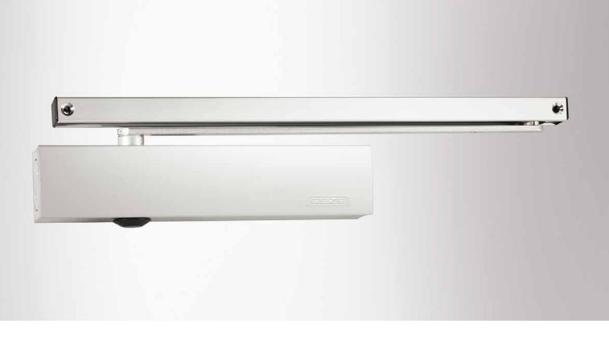

## **GEZE TS 5000 L**

TS 5000 serien är en komplett serie av dörrstängare med glidskenesystem till enkel- och dubbeldörrar. TS 5000 serien kan användas på in- och utvändiga dörrar och är naturligvis godkända för branddörrar. Det excentriska kuggdrevet garanterar ett lågt öppningsmotstånd. Alla funktioner kan justeras framifrån på dörrstängaren som också är utrustad med en optisk indikator som visar den aktuella fjäderstyrkan. Hög kvalitet, enkel montering och stilren design är krav vi ställer på alla våra dörrstängare.

## **Användningsområde:**

- j Invändiga och utvändiga slagdörrar
- j Kan användas till höger- och vänsterhängda dörrar
- j Godkänd för brandklassade dörrar
- j Dörrbladsmontage på anslagssidan eller karmmontage på gångjärnssidan.
- j Vid användning på branddörr behövs en montageplatta

## **Produktegenskaper:**

- j Stilren design j Alla funktioner justeras framifrån
- 
- j Optisk storleksindikator
- j Termostabila säkerhetsventiler i öppet och stängt läge
- j Justerbar stängningskraft, storlek 2-6
- j Justerbar stängningshastighet 180-0°
- j För dörrbladsbredder enligt nedan Storleksklass Dörrbladsbredd 2* 750 - 850 mm 3 850 - 950 mm 4 950 - 1100 mm 5 1100 - 1250 mm 6 1250 - 1400 mm 7 1400 - 1600 mm * Denna storleksklass får enligt EN inte ställas in på brandklassade dörrar.
- j Justerbar öppningsbroms från 70°
- j Justerbar tillslagskraft via ventil 7-0°
- j Kan monteras på dörr eller karm på upp till 1400 mm dörrbladsbredd
- j Standardkulör är silver, brun och vit lackerad RAL 9016
- j Specialkulör enligt RAL eller NCS skala

| ID nr. |                                         |              |        |  |  |
|--------|-----------------------------------------|--------------|--------|--|--|
|        | Beteckning                              | Utförande    | ID nr. |  |  |
|        | GEZE Dörrstängare TS 5000 L storlek 2-6 | Silver       | 027351 |  |  |
|        |                                         | Vit RAL 9016 | 029400 |  |  |
|        | Glidskena BG med arm,                   | Silver       | 025655 |  |  |
|        | för montage på anslagssidan             | Vit RAL 9016 | 029410 |  |  |

## **Mått Ts 5000 L**

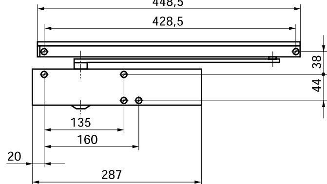

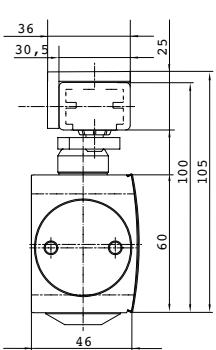

GEZE

TS 5000 L

Dörrteknik

(med vinkelkonsol)

## **Montage**

på dörrblad, anslagssida

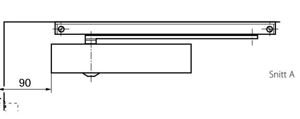

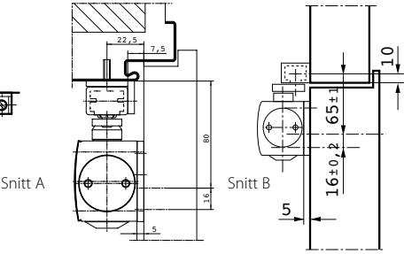

Med montageplatta

Utan montageplatta

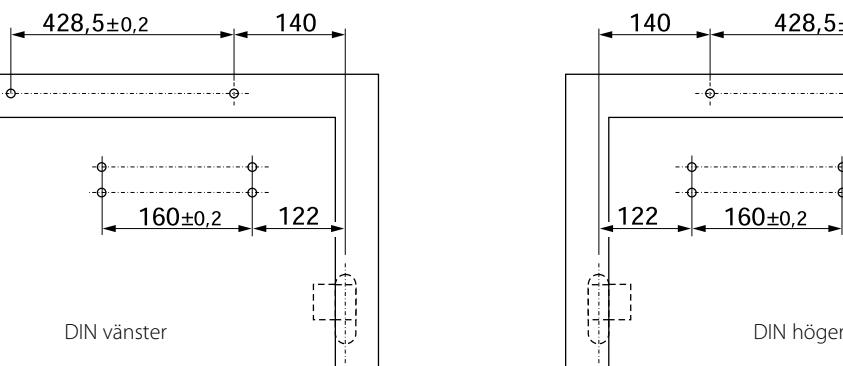

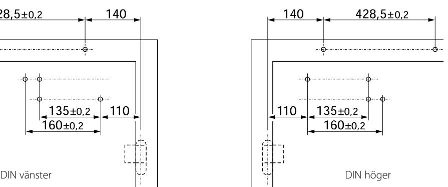

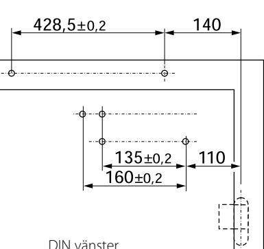

**3**

## Dörrteknik GEZE TS 5000 L

## **Tillbehör:**

- j Montageplatta till hus och arm
- j Universalplatta till hus
- j Klämplatta till helglasdörr
- j Glidskena med fast glidkloss
- j Mekaniskt uppställningsbeslag 80-120°
- j Mekanisk öppningsbegränsare
- j Täckkåpa i rostfritt- och mässing

| TS 5000 varianter: | j TS 5000     | Standardmontage på gång järnssida                                            | j TS 5000 RFS     | Elektrohydrauliskuppställning, "freeswingsarm" och integrerad                                                                 |
|-----------------------|---------------|---------------------------------------------------------------------------------|-------------------|----------------------------------------------------------------------------------------------------------------------------------|
|                       | j TS 5000 S   | Standardmontage på gång järnssida med stängningsför dröjning              | j TS 5000 ISM     | rökdetektor Glidskena med koordinator                                                                                         |
|                       | j TS 5000 L   | Montage anslagssida (BG)                                                        | j TS 5000 L ISM   | Glidskena med koordinator, anslagssida (BG)                                                                                   |
|                       | j TS 5000 E   | Elektromekanisk uppställning                                                    | j TS 5000 E-ISM   | Glidskena med elektromekanisk uppställning och koordinator                                                                    |
|                       | j TS 5000 L E | Elektromekanisk uppställning, montage anslagssidan (BG)                      | j TS 5000 L E-ISM | Glidskena med elektromekanisk                                                                                                    |
|                       | j TS 5000 R   | Elektromekanisk uppställning och integrerad rökdetektor                      |                   | uppställning, koordinato ranslagssida (BG)                                                                                    |
|                       | j TS 5000 L R | Elektromekanisk uppställning och integrerad rökdetektor anslagssidan (BG) | j TS 5000 R-ISM   | Glidskena med elektromekanisk uppställning, koordinator och integrerad rökdetektor                                         |
|                       | j TS 5000 EFS | Elektrohydraulisk uppställning och "freeswingsarm"                           |                   | j TS 5000 L R-ISM Glidskena med elektromekanisk uppställning, koordinator och integrerad rökdetektor, anslags sida (BG) |
|                       |               |                                                                                 |                   |                                                                                                                                  |

### **OM GEZE**

GEZE Scandinavia AB är ett helägt dotterbolag till GEZE GmbH. GEZE är en världsledande tillverkare av manuella och automatiska dörr- och fönsterteknologisystem med dotterbolag och produktion runt om i världen. Sedan starten 1863 har design, funktion och innovation varit det centrala i GEZE´s filosofi. För marknaden betyder det den senaste tekniken, kvalitet, funktionalitet och formskön design.

Vi arbetar i nära samarbete med marknadens aktörer, tillsammans utvecklar vi lösningar som förvandlar ambitiösa visioner till verklighet.

### **GEZE Scandinavia**

**GEZE Sverige** Mallsingan 10

Box 7060 S-187 11 Täby Tel. +46 (0) 8-732 34 00 Fax +46 (0) 8-732 34 99 E-mail: sverige.se@geze.com www.geze.se

## **GEZE Danmark**

Mårkærvej 13 J-K DK-2630 Taastrup Tel. +45 46 32 33 24 Fax +45 46 32 33 26 E-mail: danmark.se@geze.com www.geze.dk

## **GEZE Norge**

Industrivegen 34B NO-2072 Dal Tel. +47 63 95 72 00 Fax +47 63 95 71 73 E-mail: norge.se@geze.com www.geze.no

## Bewegu ng mit Sy stem