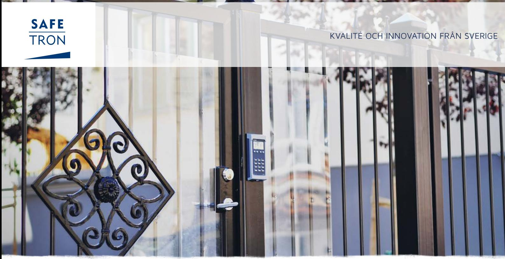
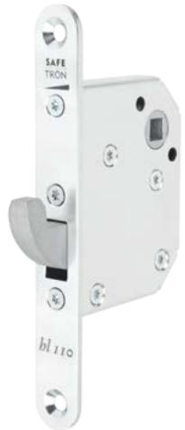
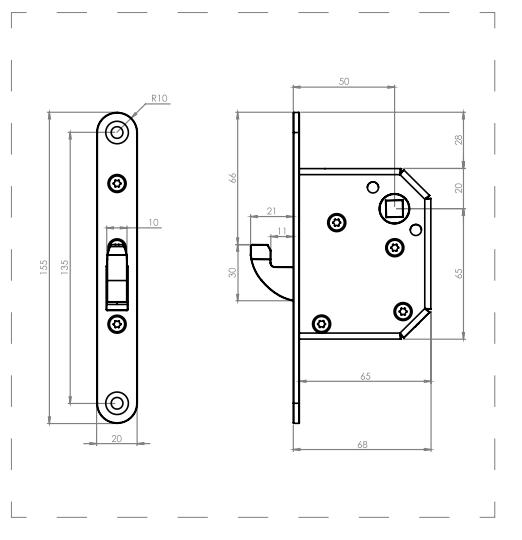

## S P E C I A L L Å S HL 110

# Tätningslås för dagis, skolor och äldrevården

HL 110 är mekaniskt tätningslås för användning i fritidshem, skolor, dagis och äldreboende där man önskar en extra manuell låsning.

Safetron HL 111 är samma typ av lås men försedd med en mikrobrytare för indikation att låsning skett.

Typiska användningsområden för HL 111 är kassaräkningsrum där låset möjliggör särskild frånlåsning samt frånkoppling av passagesystem.

Låsen har ett 8 mm fyrkanthål för tryckesroddare. Hakregelkolven har ett kolvutsprång på 21 mm och har distinkta lägen för öppen och stängt.

#### Tyst gång

Låset har inbyggd ljuddämpning på kolven vid öppning och stängning.

## S P E C I A L L Å S HL 110

#### EGENSKAPER

- Distinkta lägen för öppen och stängt
- Ljuddämpad kolvrörelse
- Mikrobrytare finns som tillval (HL 111)

#### TEKNISKA DATA

- Dorndjup: 50 mm
- Kolvutsprång: 21 mm
- Fyrkanthål: 8 mm

| BENÄMNING | ART NR |
|-----------|--------|
|           |        |

| HL 110 tätningslås               | 202 144 644 |
|----------------------------------|-------------|
| HL 111 tätningslås, mikrobrytare | 202 144 645 |

# Rätt till ändringar av katalogens innehåll och sortiment förbehålls. Vi reserverar oss för eventuella tryckfel. SAFETRON™ är ett registrerat varumärke.

#### **SAFETRON AB**

Säterivägen 18 P.O. Box 2096 65002 Karlstad Sweden

Tel: +46 54 19 02 45 Email: info@safetron.com

Du hittar alltid det senaste på safetron.com