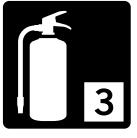
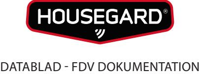
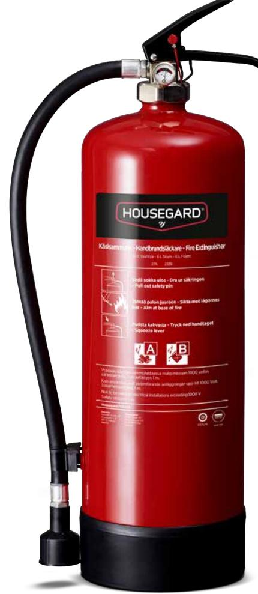

## HOUSEGARD FE6TGA

6 liter skumsläckare Effektivitetsklass 27A-233B

Skumsläckare är lämpliga för släckning av bränder i brännbara vätskor som bensin, olja etc. Kan även användas mot klass A bränder. Housegard skumsläckare är tillverkade av kvalitetsstål och är invändigt behandlade med PPA665 beläggning. Ventilen är tillverkad av förkromad mässing. Som drivgas används kväve.

## FUNKTION

Skummet kväver elden genom att förhindra tillförsel av syre. Skummet ändrar också ytspänningen hos släckvattnet så att det lättare kommer in till det brinnande materialet. Skummet lägger sig som ett lager över branden och förhindrar brandgaserna att tränga igenom. Skum ger en ren släckning med en liten omfattning av släckningsskador.

ANVÄNDNINGSOMRÅDEN Industri, offentlig verksamhet, verkstad, petrokemisk industri, jordbruk, sjöfart, bostäder.

Bränder i organiska material t.ex trä, papper, textilier.

Bränder i brandfarliga vätskor t.ex bensin, motorolja, lack, färg.

Gasbränder med t.ex metan, propan, butan.

## Teknisk data Godkännanden

| Modell:             | FE6TGA        | Kastlängd:                                   | 3-7 m                |
|---------------------|---------------|----------------------------------------------|----------------------|
| Licensnummer:       | 126.1060.3-01 | Arbetstryck:                                 | 12 BAR               |
| Brandklass:         | AB            | Cylindermaterial:                            | Stål                 |
| Effektivitetsklass: | 27A 233B      | Vikt:                                        | 10 kg                |
| Temperaturområde:   | +5/+60C       | Mått dia/höjd (mm):                          | 162 x 576            |
| Drivgas:            | Kväve         | Certifiering:                                | EN3-7, CE, Wheelmark |
| Släckmedel:         | EXT Ultra     |                                              |                      |
| Mängd:              | 6 liter       | Service/Kontroll skall utföras enligt Svensk |                      |
| Tömningstid:        | 23 sek        | Standard SS-3656.                            |                      |
|                     |               |                                              |                      |

HOUSEGARD SWEDISH FIRE SAFETY SINCE 1991