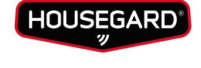
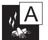
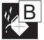
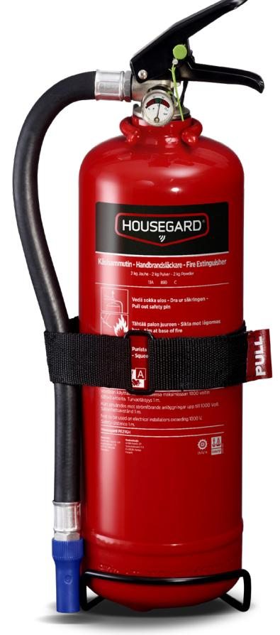
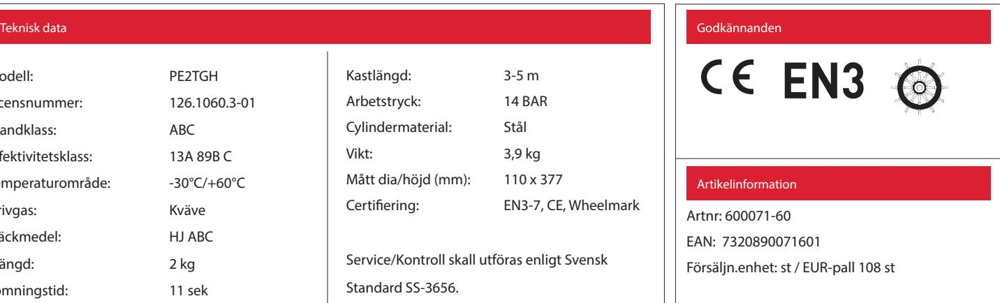

DATABLAD - FDV DOKUMENTATION

## HOUSEGARD PE2TGH

2 kg pulversläckare Effektivitetsklass 13A-89B-C

Pulversläckare är en allroundsläckare och är lämplig för släckning av de flesta typer av bränder. Housegard pulversläckare är tillverkad av kvalitetsstål. Ventilen är tillverkad av förkromad mässing. Släckarna har ett effektivt pulver som garanterar maximal släckeffekt. Som drivgas används kväve.

## FUNKTION

Vid påläggning kommer elden använda mycket av sin värmeenergi för att bryta ned pulvret. Det nedbrutna pulvret övergår till ånga och tränger bort syretillförseln. Pulvret påverkar också kemiskt på förbränningsprocessen. ABC pulver består huvudsakligen av monoammoniumfosfat och är inte klassificerat som miljö- eller hälsofarligt.

ANVÄNDNINGSOMRÅDEN

Industri, offentlig verksamhet, verkstad, jordbruk, transport, fordon, bostad, fritidshus.

Bränder i organiska material t.ex trä, papper, textilier.

Bränder i brandfarliga vätskor t.ex bensin, motorolja, lack, färg.

Gasbränder med t.ex metan, propan, butan.

| Modell:             | PE2TGH        |  |
|---------------------|---------------|--|
| Licensnummer:       | 126.1060.3-01 |  |
| Brandklass:         | ABC           |  |
| Effektivitetsklass: | 13A 89B C     |  |
| Temperaturområde:   | -30°C/+60°C   |  |
| Drivgas:            | Kväve         |  |
| Släckmedel:         | HJ ABC        |  |
| Mängd:              | 2 kg          |  |
| Tömningstid:        | 11 sek        |  |
|                     |               |  |

| Kastlängd:                                   | 3-5 m                |  |
|----------------------------------------------|----------------------|--|
| Arbetstryck:                                 | 14 BAR               |  |
| Cylindermaterial:                            | Stål                 |  |
| Vikt:                                        | 3,9 kg               |  |
| Mått dia/höjd (mm):                          | 110 x 377            |  |
| Certifiering:                                | EN3-7, CE, Wheelmark |  |
|                                              |                      |  |
| Service/Kontroll skall utföras enligt Svensk |                      |  |

HOUSEGARD SWEDISH FIRE SAFETY SINCE 1991

Standard SS-3656.