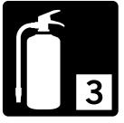
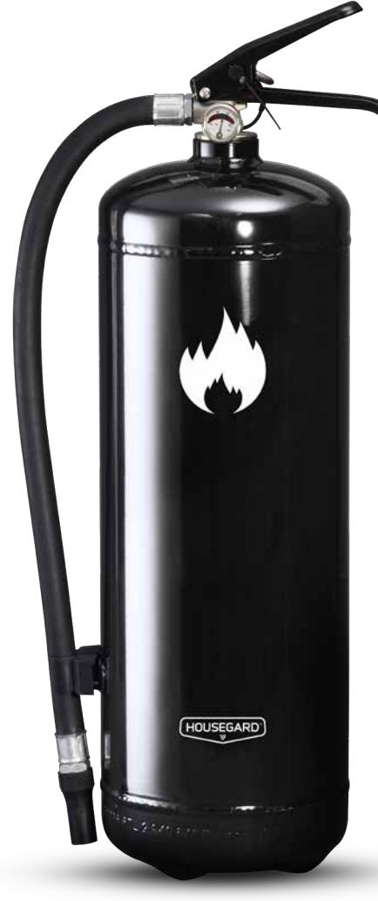

DATABLAD - FDV DOKUMENTATION

# HOUSEGARD PE6TEA BLACK 6 kg pulversläckare Effektivitetsklass 55A-233B-C

Pulversläckare är en allroundsläckare och är lämplig för släckning av de flesta typer av bränder. Housegard pulversläckare är tillverkad av kvalitetsstål. Ventilen är tillverkad av förkromad mässing. Släckarna har ett effektivt pulver som garanterar maximal släckeffekt. Som drivgas används kväve.

## FUNKTION

Vid påläggning kommer elden använda mycket av sin värmeenergi för att bryta ned pulvret. Det nedbrutna pulvret övergår till ånga och tränger bort syretillförseln. Pulvret påverkar också kemiskt på förbränningsprocessen. ABC pulver består huvudsakligen av monoammoniumfosfat och är inte klassificerat som miljö- eller hälsofarligt.

ANVÄNDNINGSOMRÅDEN Industri, offentlig verksamhet, verkstad, jordbruk, transport, fordon, bostad, fritidshus.

Bränder i organiska material t.ex trä, papper, textilier.

Bränder i brandfarliga vätskor t.ex bensin, motorolja, lack, färg.

Gasbränder med t.ex metan, propan, butan.

| Modell:             | PE6TEA      | Kastlängd:                                   | 5-8 m     |  |
|---------------------|-------------|----------------------------------------------|-----------|--|
| CE nummer:          | 0036        | Arbetstryck:                                 | 14 BAR    |  |
| Brandklass:         | ABC         | Cylindermaterial:                            | Stål      |  |
| Effektivitetsklass: | 55A 233B C  | Vikt:                                        | 9 kg      |  |
| Temperaturområde:   | -30°C/+60°C | Mått dia/höjd (mm):                          | 150 x 519 |  |
| Drivgas:            | Kväve       | Certifiering:                                | CE        |  |
| Släckmedel:         | HJ ABC      |                                              |           |  |
| Mängd:              | 6 kg        | Service/Kontroll skall utföras enligt Svensk |           |  |
| Tömningstid:        | 17 sek      | Standard SS-3656.                            |           |  |
|                     |             |                                              |           |  |

# Teknisk data Godkännanden

# Artikelinformation

Artnr: 600068 EAN: 7320896000681 Försäljn.enhet: st / EUR-pall 54 st

> HOUSEGARD SWEDISH FIRE SAFETY SINCE 1991