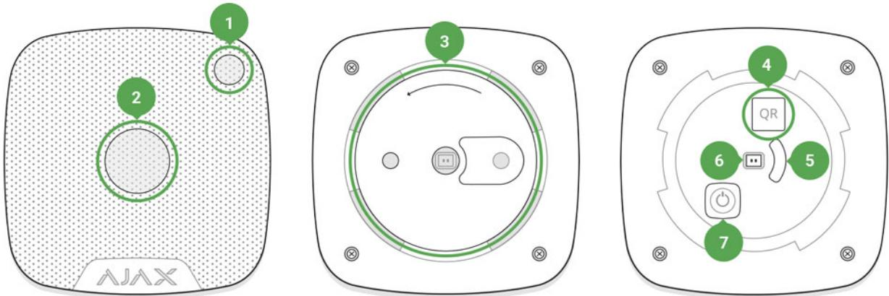
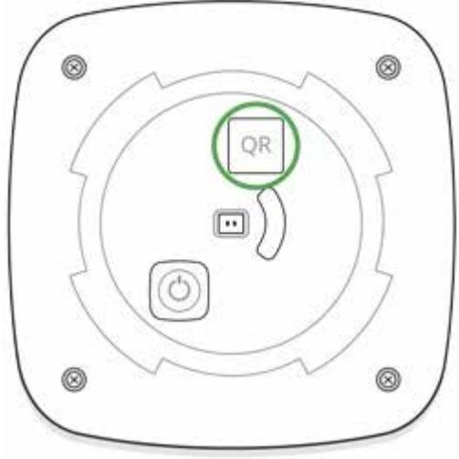
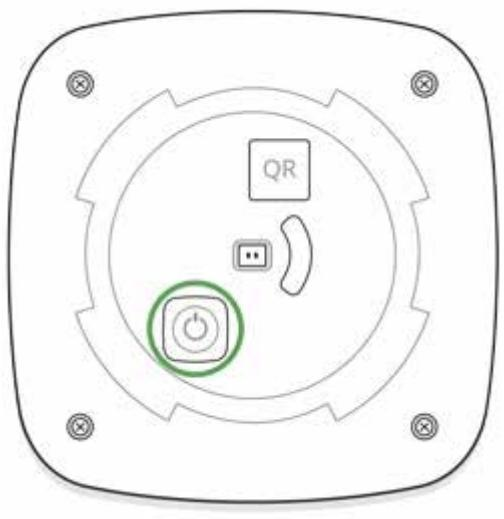
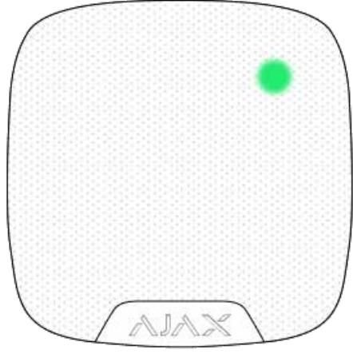
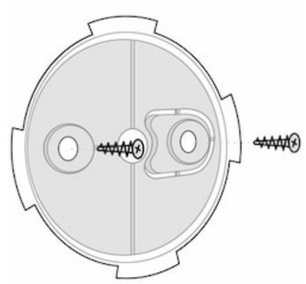

# HomeSiren User Manual

Updated December 7, 2021

**HomeSiren** is a wireless home siren with the capacity up to 105 dB. Developed only for indoor use. It can be quickly installed and set up, is furnished with a LED (plus allows connecting an external LED), and can operate up to 5 years from a battery.

HomeSiren operates within the Ajax security system, by connecting via the protected protocol to the . The communication range is up to 2,000 meters if there are no obstacles. Jeweller hub

The siren is set up via a for iOS and Android-based smartphones. The user is notified of all events through push notifications, SMS messages and calls (if activated). mobile application

Operates only with . Connection to and integration modules is not provided. Ajax hubs ocBridge Plus uartBridge

The Ajax security system is self-sustaining, but the user can connect it to the central monitoring station of a private security company.

Buy home siren HomeSiren

### Functional elements

- **1.** Light indicator
- **2.** Siren buzzer covered with a fabric
- **3.** SmartBracket attachment panel (perforated part is required for actuating the tamper in case of any attempt to tear off the siren from the surface)
- **4.** QR code
- **5.** Tamper button
- **6.** Socket for connecting an outside-mounted light indicator
- **7.** On/off button

## Operating Principle

The siren significantly improves the efficiency of the security system, being the most operational means of response to the intrusion into a room. With a high probability, its alarm signal will be sufficient to frighten away the intruders.

The device is furnished with a loud buzzer – the sound of the siren can be heard from far. Subject to correct installation, it would be hard to dismount and deactivate the actuated siren: the body is firm, the power supply is autonomous,

and the on/off button will be blocked when the security system is set in the guard mode.

### Connecting the Siren to the hub

The HomeSiren siren operates only with the Ajax security system. Up to 10 sirens may be connected to the Ajax hub

### **Before starting connection:**

- **1.** Following the hub instruction recommendations, install the on your smartphone. Create an account, add the hub to the application, and create at least one room. Ajax application
- **2.** Go to the Ajax application.
- **3.** Switch on the hub and check the internet connection (via Ethernet cable and/or GSM network).
- **4.** Ensure that the hub is disarmed and does not start updates by checking its status in the mobile application.

Only users with administrative privileges can add the device to the hub

### **How to connect the siren to the hub:**

- **1.** Select the **Add Device** option in the Ajax application.
- **2.** Name the device, scan/write manually the **QR Code** (located on the body and packaging), and select the location room.

- **3.** Select **Add** the countdown will begin.
- **4.** Switch on the device (by pressing on/off button for 3 seconds).

For the detection and interfacing to occur, the siren should be located within the coverage area of the wireless network of the hub (at a single protected object). If the device was already assigned to another hub, switch off HomeSiren and then perform the standard adding procedure.

Request for connection to the hub is transmitted for a short time at the time of switching on the device.

If the connection to the Ajax hub failed, the siren will switch off after 6 seconds. You may repeat the connection attempt then. To retry the connection, you do not need to turn off the device.

The siren connected to the hub will appear in the list of devices of the hub in the application. Update of the siren statuses in the list depends on the device inquiry time set in the hub settings, with the default value — 36 seconds.

### States

Siren states can be found in the Ajax app:

- **1.** Go to the **Devices** tab.
- **2.** Select HomeSiren from the list.

| Parameter                | Value                                                                                                         |
|--------------------------|---------------------------------------------------------------------------------------------------------------|
| Temperature              | Temperature of the device. Measured on the processor and changes gradually. Displayed in 1°C increment. |
|                          | Acceptable error between the value in the app and temperature at the installation site: 2–4°C              |
| Jeweller Signal Strength | Signal strength between the hub/range extender and siren.                                                  |
|                          | We recommend installing the siren in places with the signal strength of 2-3 bars                           |
| Connection               | Connection status between the hub/range extender and siren:                                                |
|                          | Online — the siren is connected to the hub/range extender                                                  |
|                          | Offl ine — the siren is not connected to the hub/range extender                                         |
| ReX range extender name  | radio Displayed if the siren is working via a signal range extender                                     |
| Battery Charge           | Battery level of the device. Two states available:                                                            |
|                          | ОК                                                                                                            |
|                          | Battery discharged                                                                                            |
|                          | How battery charge is displayed in                                                                            |
|                          | Ajax apps                                                                                                     |
| Lid                      | The tamper mode of the device, which reacts to the detachment of or damage to the body                     |

| Alarm Volume                                           | Volume level in case of alarm                                                                                                                     |
|--------------------------------------------------------|---------------------------------------------------------------------------------------------------------------------------------------------------|
|                                                        | Muted — the siren does not sound when the alarm is raised                                                                                      |
|                                                        | Quiet — 81 dB volume                                                                                                                              |
|                                                        | Loud — 93 dB volume                                                                                                                               |
|                                                        | Very loud — 105 dB volume                                                                                                                         |
|                                                        | The volume level is measured 1 m away from the siren                                                                                           |
| Alarm Duration, sec                                    | Duration of the alarm sound: from 3 to 180 seconds                                                                                             |
| LED indication                                         | LED indication of the siren settings:                                                                                                             |
|                                                        | Disabled — LED indication is off                                                                                                                  |
|                                                        | Armed — the siren blinks only when alarm is enabled                                                                                            |
|                                                        | Always — the siren blinks regardless of the state of the security system                                                                       |
|                                                        |                                                                                                                                                   |
|                                                        | More about indication                                                                                                                             |
| Beep When Arming/Disarming                             | If active, the siren notifies you about the activation and deactivation the system of the guard mode by the LED and a short sound signal |
| Notify about switching the Night mode on/off           | When enabled, the siren notifies you when the system is on and off the Night mode by flashing the LED and making a short beep               |
| Beep on Entry/Exit delay                               | If activated, siren will beep delays (available in devices with firmware version 3.50 and later)                                               |
| Notify about the entry/exit delay in the Night mode | If this option is enabled, the siren beeps to signal about an entry/exit delay in the Night mode                                            |
|                                                        | When enabled, a siren notifies about opening detectors triggering in the Disarmed system mode                                               |
| Chime on opening                                       | What is chime                                                                                                                                     |

|            | completely disabled by the user, or only notifications about triggering of the device tamper button are disabled |
|------------|------------------------------------------------------------------------------------------------------------------------|
| Firmware   | Detector firmware version                                                                                              |
| Device ID  | Device identifier                                                                                                      |
| Device No. | Number of the device loop (zone)                                                                                       |

### Setting Up the Detector

To change the HomeSiren settings in the Ajax app:

- **1.** Select the hub if you have several of them or if you are using the PRO app.
- **2.** Go to the **Devices** tab.
- **3.** Select **HomeSiren** in the list.
- **4.** Go to **Settings** by clicking on the .
- **5.** Set the required parameters.
- **6.** Click **Back** to save the new settings.

| Setting              | Value                                                                                                                                                                                                                                                                                                                                   |
|----------------------|-----------------------------------------------------------------------------------------------------------------------------------------------------------------------------------------------------------------------------------------------------------------------------------------------------------------------------------------|
| First field          | Siren name that can be edited. The name of device you can see at notifications in the event feed. The name can contain up to 12 Cyrillic characters or up to 24 Latin symbols                                                                                                                                               |
| Room                 | Selecting the virtual room to which StreetSiren DoubleDeck is assigned. The room name you can see at notifications in the event feed                                                                                                                                                                                              |
| Alarms in Group Mode | Selecting the group to which the siren is assigned. You can select one or all groups: When assigned to a group, the siren and its indication are related to alarms and events of this group When attached to all groups, the siren and its indication are related to alarms and events of all groups in the system |

|                               | Regardless of the group selected, the siren will Night Mode respond to activation and alarms Learn more                                                                                                                                         |
|-------------------------------|----------------------------------------------------------------------------------------------------------------------------------------------------------------------------------------------------------------------------------------------------------------|
| Alarm Volume                  | Volume level in case of alarm: Muted — the siren does not sound when the alarm is raised Quiet — 81 dB volume Loud — 93 dB volume Very loud — 105 dB volume The volume level is measured 1 m away from the siren                          |
| Alarm Duration, sec           | The setting determines how long the siren sounds, if the alarm is activated (from 3 to 180 seconds per each actuation)                                                                                                                                   |
| LED indication                | LED indication of the siren settings: Disabled — LED indication is off Armed — LED blinks once every 2 seconds only when the system is armed Constantly — LED blinks once every 2 seconds regardless of the mode state More about indication |
| Beeps Settings                | Opens the siren notification settings. A detailed available description of the settings is below                                                                                                                                                      |
| Volume Test                   | Switches the device to the volume test mode What is Volume Level Test                                                                                                                                                                                       |
| Jeweller Signal Strength Test | Switching the siren to the Jeweller signal strength test mode. The test allows you to check the signal level between the hub and HomeSiren and determine the optimal installation location                                                         |

|                         | What is Jeweller Signal Strength                                                                                                                                         |  |
|-------------------------|--------------------------------------------------------------------------------------------------------------------------------------------------------------------------|--|
|                         | Test                                                                                                                                                                     |  |
| Signal Attenuation Test | Switches the siren to the signal fade test mode (available in devices with firmware version 3.50 and later)                                                        |  |
|                         | What is Attenuation Test                                                                                                                                                 |  |
| User Guide              | Opens the HomeSiren User Manual                                                                                                                                          |  |
|                         | Allows the user to disconnect the device without removing it from the system.                                                                                         |  |
|                         | Two options are available:                                                                                                                                               |  |
| Temporary Deactivation  | No — the device operates normally and transmits all events                                                                                                            |  |
|                         | Entirely — the device will not execute system commands or participate in automation scenarios, and the system will ignore device alarms and other notifications |  |
|                         | Lid only — the system will ignore only notifications about the triggering of the device tamper button                                                              |  |
|                         | Learn more about temporary                                                                                                                                               |  |
|                         | deactivation of devices                                                                                                                                                  |  |
| Unpair Device           | Disconnects the siren from the hub and deletes its settings                                                                                                           |  |

### Siren beep settings

| Arming/Disarming                   | When this option is enabled, the siren warns of arming and disarming by lighting of the LED frame and by a short beep                    |
|------------------------------------|------------------------------------------------------------------------------------------------------------------------------------------------|
| Night mode Activation/Deactivation | If enabled, the siren alerts you by backlighting the LED frame and a short beep when arming and disarming the system from the Night mode |
|                                    | What is Night mode                                                                                                                             |

| Entry Delays               | If this option is enabled, the siren beeps to signal about an entry delay                                                                                                                                                                                                     |
|----------------------------|----------------------------------------------------------------------------------------------------------------------------------------------------------------------------------------------------------------------------------------------------------------------------------|
|                            | What is Delay When Entering/Leaving                                                                                                                                                                                                                                           |
| Exit Delays                | If this option is enabled, the siren beeps to signal about an exit delay What is Delay When Entering/Leaving                                                                                                                                                            |
| Entry Delays in Night Mode | If this option is enabled, the siren beeps to signal about an entry delay in the Night mode What is Night mode What is Delay When Entering/Leaving                                                                                                                   |
| Exit Delays in Night Mode  | If this option is enabled, the siren beeps to signal about an exit delay in the Night mode What is Night mode What is Delay When Entering/Leaving                                                                                                                    |
| Chime on opening           | When enabled, the siren beeps 1 to 4 times to indicate that opening detectors in the Disarmed system mode were triggered What is Chime How to set up Chime                                                                                                           |
| Beep volume                | Selecting the volume level of the siren at the time of notification on arming/disarming or delay when entering/leaving and opening: Quiet — 80 dB volume Loud — 93 dB volume Very loud — 98 dB volume The volume level was measured 1 m away from the siren |

### Setting up the processing of detector alarms

Through the Ajax app, you can configure which detector alarms can activate the siren. This can help to avoid situations when the security system notifies of LeaksProtect detector alarm or any other device alarm. The parameter is adjusted in the detector or device settings:

- **1.** Sign in to the Ajax app.
- **2.** Go to the **Devices** menu.
- **3.** Select the detector or device.
- **4.** Go to its settings and set the necessary parameters for activating the siren.

### Setting the tamper alarm response

The siren can respond to the tamper alarm of devices and detectors. The option is disabled by default. Note that the tamper reacts to the opening and closing of the body even if the system is not armed!

#### What is a tamper

### **For the siren to respond to tamper triggering, in Ajax app:**

- **1.** Go to the **Devices** menu.
- **2.** Select the hub and go to its settings .
- **3.** Select the **Service** menu.
- **4.** Go to **Siren Settings**.
- **5.** Enable the **Alert with a siren if the hub or detector lid is open** option.

## Setting the response to pressing the panic button in the Ajax app

The siren can respond to pressing the panic button in Ajax apps. Note that the panic button can be pressed even if the system is disarmed!

#### **For the siren to respond to pressing the panic button:**

- **1.** Go to the **Devices** menu.
- **2.** Select the hub and go to its settings .
- **3.** Select the **Service** menu.
- **4.** Go to **Siren Settings**.
- **5.** Enable the **Alert with a siren if in-app panic button is pressed** option.

### Setting the siren after-alarm indication

The siren can inform about triggerings in the armed system by means of LED indication.

### **The option functions as follows:**

- **1.** The system registers the alarm.
- **2.** The siren plays an alarm (duration and volume depend on settings).
- **3.** The siren LED and external LED (if connected) blinks twice (about once every 3 seconds) until the system is disarmed.

Thanks to this feature, system users and security companies patrols can understand that the alarm has occurred.

The siren after-alarm indication does not work for always active detectors, if the detector was triggered when the system was disarmed.

#### **To enable the siren after-alarm indication, in :** Ajax PRO app

1. Go to siren settings:

- Hub → Settings → Service → Siren Settings
2. Specify what events the sirens will inform about by double blinking before the security system is disarmed:

- Confirmed alarm
- Unconfirmed alarm
- Lid opening

3. Select the sirens needed. Go back to **Siren Settings**. The set parameters will be saved.

- 4. Click **Back**. All values will be applied.

HomeSiren with firmware 5.55.2 and later supports this function.

### How to set Chime

Chime is a sound signal that indicates the triggering of the opening detectors when the system is disarmed. The feature is used, for example, in stores, to notify employees that someone has entered the building.

Notifications are configured in two stages: setting up sirens and setting up opening detectors.

HomeSiren with firmware 5.55.1.0 and later supports this function.

#### **Siren settings**

- **1.** Go to the **Devices** menu.
- **2.** Select the siren.
- **3.** Go to its settings by clicking the gear icon in the upper right corner.
- **4.** Go to the **Beeps Settings** menu.
- **5.** Scroll down and enable the **Chime on opening** option in the **Beep when disarmed** category.
- **6.** Set the volume of the notifications. 3 options are available:
	- Quiet (80 dB at a distance of 1 m).
	- Loud (93 dB at a distance of 1 m).
	- Very loud (98 dB at a distance of 1 m).

The specified **Beep volume** also applies to the volume of siren notifications when arming/disarming and for the entry/exit delays.

- **7.** Click **Back** to save the settings.
- **8.** Repeat steps 2–7 for other sirens on which you want to enable the notifications.

#### **Detectors settings**

- **1.** Go to the **Devices** menu.
- **2.** Select the detector.
- **3.** Go to its settings by clicking the gear icon in the upper right corner.
- **4.** Go to the **Chime Settings** menu.
- **5.** Select the events to be notified by the siren:
	- If a door or a window is open.
	- If an external contact is open (available if the External Contact option is enabled).
- **6.** Select the chime sound (siren tone): 1 to 4 short beeps. Once selected, the Ajax app will play the sound.
- **7.** Click **Back** to save the settings.
- **8.** Repeat steps 2–7 for other detectors on which you need to enable the notifications.

### Indication

| Event                                                                               | Indication                                                                                                                                                                                                                                  |
|-------------------------------------------------------------------------------------|---------------------------------------------------------------------------------------------------------------------------------------------------------------------------------------------------------------------------------------------|
| Alarm                                                                               | Emits an acoustic signal (the duration depends on the settings) and all LED signaling ceases                                                                                                                                             |
| An alarm was detected in the armed system (if after-alarm indication is enabled) | The siren LED and external LED (if connected) blinks twice approximately every 3 seconds until the system is disarmed. The indication turns on after the siren has completely played the alarm signal configured in settings |
| Switching on the device                                                             | LED lights up once                                                                                                                                                                                                                          |
| Switching off the device                                                            | LED will light up for 1 second, then blink three times                                                                                                                                                                                   |
| Registration failed                                                                 | LED lights up and goes out, then the siren switches off                                                                                                                                                                                  |
| Security system set in the armed mode (if the indication is activated)           | Blinks once with a LED and emits a short sound signal                                                                                                                                                                                    |
| Security system is disarmed (if the indication is activated)                     | Blinks twice with a LED and emits two short sound signals                                                                                                                                                                                |
| Siren in the armed mode (if the indication is activated)                         | LED lights up for a short time every 3 seconds                                                                                                                                                                                              |

| Battery low | LED smoothly lights up and goes out when the      |
|-------------|---------------------------------------------------|
|             | system is armed or disarmed (if the indication    |
|             | is activated), the tamper is actuated or alarm is |
|             | given                                             |

### Performance testing

The Ajax security system allows conducting tests for checking the functionality of connected devices.

The tests do not start straight away but within a period of 36 seconds when using the standard settings. The test time start depends on the settings of the devices scanning period (the paragraph on "**Jeweller**" settings in hub settings).

Volume Level Test

Jeweller Signal Strength Test

Attenuation Test

### Installing the Siren

Location of the HomeSiren determines its remoteness from the hub and presence of any obstacles between the devices, hindering the radio signal and sound transmission: walls, inserted floors, large-size objects located within the room.

The device developed only for indoor use.

Check the signal level at the installation location.

The communication range is up to 2000 meters if there are no obstacles. Please consider it when choosing an installation place for HomeSiren.

If the signal level is one division, we cannot guarantee stable operation of the security system. Take possible measures to improve the quality of the signal! As a minimum, move the device — even 20 cm shift can significantly improve the quality of reception.

If after moving the device still has a low or unstable signal strength, use a . radio signal range extender

Recommended installation height — 2.5 meters and more. This will complicate the access to the device for intruders in case of intrusion.

### Installation process

- **1.** Fix the SmartBracket panel on the surface using bundled screws. After selecting other attachment hardware, make sure that they do not damage or deform the panel.

- **2.** Put the siren on the SmartBracket panel and turn it clockwise. When installing in the attachment panel, the tamper will switch and the siren will blink with a LED.
If the light indicator of the siren is not actuated after installation in SmartBracket, check the tamper mode in the Ajax Security System application and then the fixing tightness of the device on the panel.

In case of any attempt to dismount the siren, you will receive the notification.

#### **Do not install the siren:**

- **1.** outside the premises (outdoors)
- **2.** in places where the acoustic signal will be attenuated (inside furniture, behind thick curtains, etc.)
- **3.** nearby any metal objects or mirrors causing attenuation and screening of the signal
- **4.** within any premises with the temperature and humidity beyond the range of permissible limits
- **5.** closer than 1 m from the hub.

### External LED connection

The outside-mounted LED connected to the HomeSiren is paralleled with the built-in LED of the device and completely repeats its indication.

For connection, use the contact on the rear side of the siren body and observe the polarity during the connection. Black terminal wire — "**+**" contact.

**Outlet power supply:** 3 V, 10 mA.

### Siren Maintenance and Battery Replacement

Check the operational capability of the HomeSiren on a regular basis.

Clean the siren body from dust, spider web and other contaminations as they appear. Use soft dry napkin suitable for equipment maintenance.

Do not use for cleaning the siren any substances containing alcohol, acetone, gasoline and other active solvents.

The batteries installed in the siren ensure up to 5 years of autonomous operation (with the inquiry frequency by the hub of 1 minute) or at least 6 hours of the buzzer sound. If the battery is discharged, the security system will send respective notices and the LED will smoothly light up and goes out when the armed mode is activated.

#### How long Ajax devices operate on batteries, and what affects this

#### Battery Replacement

### Tech specs

| Type of notification              | Acoustic and LED                                                                                                                                              |
|-----------------------------------|---------------------------------------------------------------------------------------------------------------------------------------------------------------|
| Sound notification volume         | 81 – 105 dB at a distance of 1 m (adjustable)                                                                                                                 |
| Operating frequency of the buzzer | 3.4 ± 0.5 kHz                                                                                                                                                 |
| Tamper protection                 | Yes                                                                                                                                                           |
| Radio communication protocol      | Jeweller Learn more                                                                                                                                        |
| Radio frequency band              | 866.0 – 866.5 MHz 868.0 – 868.6 MHz 868.7 – 869.2 MHz 905.0 – 926.5 MHz 915.85 – 926.5 MHz 921.0 – 922.0 MHz Depends on the region of sale. |
| Compatibility                     | hubs radio Operates only with all Ajax , and signal range extenders                                                                               |
| Maximum RF output power           | Up to 25 mW                                                                                                                                                   |
| Radio signal modulation           | GFSK                                                                                                                                                          |
| Radio signal range                | Up to 2,000 m (any obstacles absent)                                                                                                                          |
| Battery supply                    | 2 × CR123A, 3 V                                                                                                                                               |
| Battery life                      | Up to 5 years                                                                                                                                                 |

| Socket for connecting an external light indicator | Yes (power supply 3 V, 10 mA)                                                                                               |
|------------------------------------------------------|-----------------------------------------------------------------------------------------------------------------------------|
| Body protection level                                | IP50                                                                                                                        |
| Installation method                                  | Indoors                                                                                                                     |
| Operating temperature range                          | From -10°С to +40°С                                                                                                         |
| Operating humidity                                   | Up to 75%                                                                                                                   |
| Overall dimensions                                   | 75 × 76 × 27 mm                                                                                                             |
| Weight                                               | 97 g                                                                                                                        |
| Service life                                         | 10 years                                                                                                                    |
| Certification                                        | Security Grade 2, Environmental Class II in conformity with the requirements of EN 50131- 1, EN 50131-4, EN 50131-5-3 |

### Compliance with standards

### Complete Set

- **1.** HomeSiren
- **2.** SmartBracket mounting panel
- **3.** Battery CR123A (pre-installed) 2 pcs
- **4.** LED connection clamp
- **5.** Installation Kit
- **6.** Quick Start Guide

### Warranty

Warranty for the "AJAX SYSTEMS MANUFACTURING" LIMITED LIABILITY COMPANY products is valid for 2 years after the purchase and does not apply to the pre-installed battery.

If the device does not work correctly, you should first contact the support service — in half of the cases, technical issues can be solved remotely!

### The full text of the warranty

#### User Agreement

Technical support: support@ajax.systems