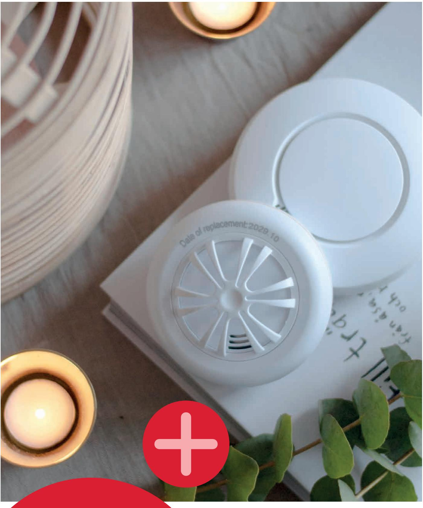
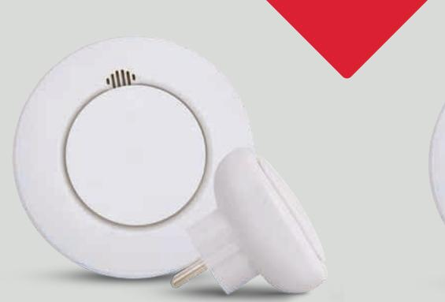
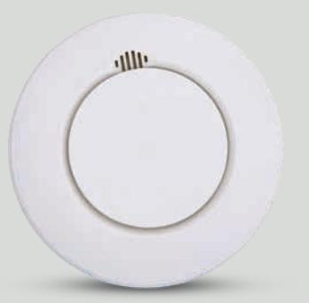
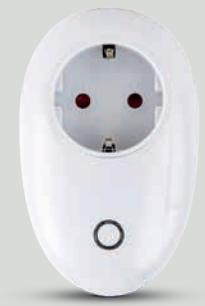

Skydda hemmet på distans med smarta produkter från Housegard Note.

# **Bygg ditt eget smarta hem – enkelt och snabbt med Housegard Note**

Housegard Note är ett enkelt och användarvänligt Smarta Hem-system som förbättrar ditt hems säkerhet.

Startpaketet innehåller brandvarnare och hubb. Till detta kit kan du ansluta övriga smarta produkter som ingår i Housegard Note-familjen, som tex fler brandvarnare, rörelsedetektor, vattenläckagelarm och dörrsensor.

Du kan koppla samman upp till 50 enheter med hjälp av hubben som kopplar upp sig mot internet via WiFi, 2.4 GHz. Via appen får du sedan notiser direkt till din mobil om någon av enheterna larmar eller triggas.

Alla i familjen kan vara inloggade samtidigt och du kan ha flera uppkopplade system i appen, som t.ex. hemmet och sommarstugan.

Housegard Note för Android och iOS finns att ladda ner gratis via Google Play och App Store. Installationen är enkel och tar bara några minuter.

#### Startkit **Brandvarnare & HUBB**

Få meddelande i händelse av brand, var du än befinner dig. Startkit som innehåller allt du behöver för att koppla ihop brandvarnaren med din mobiltelefon. Ladda ner Housegard Note-appen, koppla in hubben i ett eluttag och följ anvisningarna och stegen enligt appen.

| INPUT HUBB         | 100-240 V AC                           |
|--------------------|----------------------------------------|
| PROTOKOLL HUBB     | WiFi, 2.4 GHz                          |
|                    |                                        |
| DETEKTIONSPRINCIP  | Optisk detektions kammare           |
| TESTFUNKTION       | JA                                     |
| PAUSFUNKTION       | JA                                     |
| TEMPERATUROMRÅDE   | 0 °C till +40 °C                       |
| BATTERI            | 2 st AA Alkaliska batterier (ingår) |
| SÄNDNINGSFREKVENS  | 868 MHz                                |
| RADIORÄCKVIDD      | 50 m                                   |
| LARMSIGNAL         | Minst 85 dB / 3 m                      |
| FÖRPACKNING        | Boxpack                                |
| TESTAD OCH GODKÄND | CE, EN 14604, RED                      |
| MODELL             | SA424WS + GW124NX                   |
| ART.NR             | 621033                                 |

## **Brandvarnare**

Smart optisk brandvarnare med inbyggd temperatursensor för trådlös seriekoppling. Reagerar på rök, värme samt snabb värmeökning. Koppla ihop så många varnare du behöver för att säkerställa snabb varning om olyckan skulle vara framme.

| DETEKTIONSPRINCIP  | Optisk detektions kammare           |
|--------------------|----------------------------------------|
| TESTFUNKTION       | JA                                     |
| PAUSFUNKTION       | JA                                     |
| TEMPERATUROMRÅDE   | 0 °C till +40 °C                       |
| BATTERI            | 2 st AA Alkaliska batterier (ingår) |
| SÄNDNINGSFREKVENS  | 868 MHz                                |
| RADIORÄCKVIDD      | 50 m                                   |
| LARMSIGNAL         | Minst 85 dB / 3 m                      |
| FÖRPACKNING        | Boxpack                                |
| TESTAD OCH GODKÄND | CE, EN 14604, RED                      |
| MODELL             | SA424WS                                |
| ART.NR             | 621027                                 |

## **Temperaturvarnare**

Speciellt utvecklad för kök och andra miljöer där matos, rök och damm kan orsaka falsklarm. Temperaturvarnare används som ett komplement till brandvarnaren och passar för placering i kök, tvättstugan, källaren och andra ställen där matos, rök, fukt eller damm kan orsaka falsklarm.

| TESTFUNKTION       | JA                                     |
|--------------------|----------------------------------------|
| PAUSFUNKTION       | JA                                     |
| TEMPERATUROMRÅDE   | +4 °C till +38 °C                      |
| BATTERI            | 2 st AA Alkaliska batterier (ingår) |
| SÄNDNINGSFREKVENS  | 868 MHz                                |
| RADIORÄCKVIDD      | 50 m                                   |
| LARMSIGNAL         | Minst 85 dB / 3 m                      |
| FÖRPACKNING        | Boxpack                                |
| TESTAD OCH GODKÄND | CE, BS5446- 2:2003, RED             |
| ART.NR             | 621028                                 |

## **Sov tryggt – vakna snabbt!**

I en bostad med mer än ett sovrum eller våningsplan kan du behöva flera brandvarnare. När du kopplar samman dina brandvarnare i ett system så larmar alla samtidigt om en varnare triggas. På det sättet hör du larmet oavsett var i hemmet branden startar. Chansen ökar då också att alla i hemmet vaknar snabbt om en brand bryter ut på natten.

## **Strömbrytare**

Smart strömbrytare används för att styra elektriska apparater, t.ex. lampor, fläktar, värmeelement och luftfuktare. Med scenarios kan t.ex. en lampa tändas när rörelsedetektorn triggas.

| INPUT                 | 100-240 V AC         |
|-----------------------|----------------------|
| TEMPERATUR OMRÅDE  | -10 °C till +50 °C   |
| SÄNDNINGS FREKVENS | 868 MHz              |
| RADIORÄCKVIDD         | 50 m                 |
| FÖRPACKNING           | Boxpack              |
| TESTAD OCH GODKÄND | CE, EN 61000, RED |
| MODELL:               | WP324NX              |
| ART.NR                | 621032               |

## **Rörelsedetektor**

Rörelsedetektorn är en pyroelektrisk infraröd sensor, s.k. PIR, som upptäcker rörelse. Med denna kan du t.ex. trigga en smart strömbrytare eller ett inbrottslarm. Om rörelsedetektorn upptäcker rörelse i ett rum, skickar hubben ett larm till din smarttelefon.

| TEMPERATUR OMRÅDE  | -10 °C till +33 °C                     |
|-----------------------|----------------------------------------|
| BATTERI               | 2 st AA Alkaliska batterier (ingår) |
| SÄNDNINGS FREKVENS | 868 MHz                                |
| RADIORÄCKVIDD         | 50 m                                   |
| DETEKTIONS AVSTÅND | 5-10 m                                 |
| DETEKTIONS VINKEL  | 90°                                    |
| FÖRPACKNING           | Boxpack                                |
| TESTAD OCH GODKÄND | CE, EN 61000, IEC 60950, RED        |
| MODELL:               | PIR324NX                               |
| ART.NR                | 621026                                 |

| TESTFUNKTION          | JA                                     |
|-----------------------|----------------------------------------|
| TEMPERATUR OMRÅDE  | +5 °C till +38 °C                      |
| IP-KLASS              | IP65                                   |
| BATTERI               | 2 st AA Alkaliska batterier (ingår) |
| SÄNDNINGS FREKVENS | 868 MHz                                |
| RADIORÄCKVIDD         | 50 m                                   |
| LARMSIGNAL            | Minst 85 dB / 1 m                   |
| FÖRPACKNING           | Boxpack                                |
| TESTAD OCH            | CE, EN 61000,                          |
| GODKÄND               | IEC 60335, RED                         |
| MODELL:               | WA224NX                                |

**Vattenläckagelarm** Vattenalarm används för att upptäcka vattenläckage som orsakats av t.ex. trasiga rör och läckande diskmaskiner. När vattenlarmet upptäcker läckage, kommer det att avge en hög larmsignal, samtidigt som du blir meddelad

via Housegard Note-appen.

#### **Dörr- och fönsterkontakt**

Magnetisk sensor i två delar som monteras på dörr eller fönster. När dörren eller fönstret öppnas, skickas en signal via hubben till din mobiltelefon. I appen kan du även kontrollera om t.ex. ett fönster är öppet eller stängt.

| TEMPERATUR OMRÅDE   | 0 °C till +55 °C                        |
|------------------------|-----------------------------------------|
| TRE TYPER AV STATUS | Dörr/fönster öppnas                  |
|                        | Normal status (Stängd)               |
|                        | Dörr/fönster öppen                   |
| Batteri                | 1 st CR2450 litiumbatteri (ingår) |
| SÄNDNINGS FREKVENS  | 868 MHz                                 |
| RADIORÄCKVIDD          | 50 m                                    |
| FÖRPACKNING            | Boxpack                                 |
| TESTAD OCH GODKÄND  | CE, EN 61000, RED                    |
| MODELL:                | DC324NX                                 |
| ART.NR                 | 621031                                  |

