# Hub 2 (2G) / (4G) User Manual

Updated December 14, 2021

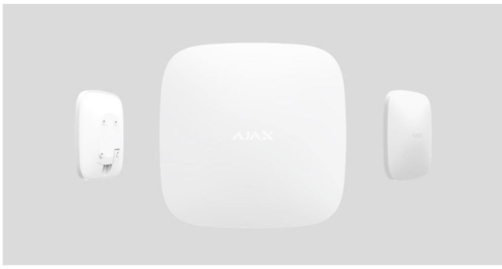

**Hub 2** is a security system control panel that supports photo verification of alarms. It controls the operation of all connected devices and interacts with the user and the security company. The device is designed for indoor installation only.

The hub reports doors opening, breaking of windows, the threat of fire or flood, and automates routine actions using scenarios. If outsiders enter the secure room, Hub 2 will send photos from **MotionCam** / **MotionCam Outdoor** motion detectors and notify a security company patrol.

Hub 2 needs internet access to connect to the Ajax Cloud service. The control panel has three communication channels: Ethernet and two SIM cards. The hub is available in two versions: with 2G and 2G/3G/4G (LTE) modem.

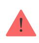

Connect all communication channels to ensure a more reliable connection with Ajax Cloud and secure against interruptions in the work of telecom operators.

You can manage the security system and respond to alarms and event notifications through iOS, Android, macOS, and Windows . The system allows you to choose what events and how to notify the user: by push notifications, SMS, or calls. apps

- How to set up push notifications on iOS
- How to set up push notifications on Android

Buy Hub 2 central unit

# Functional elements

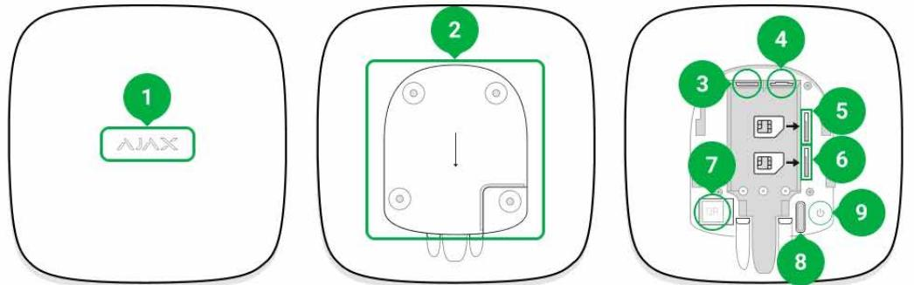

- **1.** Ajax logo with an LED indicator.
- **2.** SmartBracket mounting plate. Slide it down with force to open.

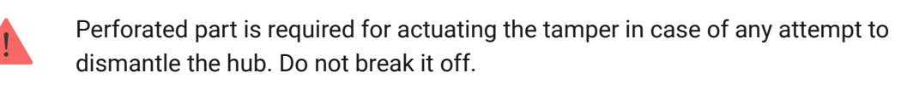

- **3.** Power cable socket.
- **4.** Ethernet cable socket.
- **5.** Slot for micro SIM 2.
- **6.** Slot for micro SIM 1.
- **7.** QR code and ID/service number of the hub.
- **8.** Tamper.

**9.** Power button.

# Operating principle

Hub 2 supports up to 100 Ajax devices connected, which protect against intrusion, fire, or flooding and control electrical appliances according to scenarios or via an app.

The hub controls operation of the security system and all connected devices. For this purpose, it communicates with the system devices via two encrypted radio protocols:

1. **Jeweller** — is a wireless protocol used to transmit events and alarms of Ajax wireless detectors. The communication range is 2000 m without obstacles (walls, doors, or inter-floor constructions).

#### Learn more about Jeweller

2. **Wings** is a wireless protocol used to transmit photos from MotionCam and MotionCam Outdoor detectors. The communication range is 1700 m without obstacles (walls, doors, or inter-floor constructions).

#### Learn more about Wings

Any time the detector triggers, the system raises the alarm in less than a second. In this case, the hub activates the sirens, starts the scenarios, and notifies the security company's monitoring station and all users.

# Anti-sabotage protection

Hub 2 has three communication channels: Ethernet and two SIM cards. This allows connecting the system to Ethernet and two mobile networks. The hub is available in two versions: with 2G and 2G/3G/4G (LTE) modem.

Wired internet and mobile network connection are maintained in parallel to provide more stable communication. This also allows switching to another communication channel without delay if any of them fails.

If there is interference at Jeweller frequencies or when jamming is attempted, Ajax switches to a free radio frequency and sends notifications to the central monitoring station of the security company and system users.

#### What is security system jamming

No one can disconnect the hub unnoticed, even when the facility is disarmed. If an intruder attempts to dismount the device, this will trigger the tamper immediately. Every user and the security company will receive triggering notifications.

#### What is a tamper

The hub checks the Ajax Cloud connection at regular intervals. The polling period is specified in the hub settings. The server may notify the users and the security company in 60 seconds after the connection loss at minimum settings.

#### Learn more

The hub involves a backup battery providing 16 hours of battery life. This allows the system to continue operation even if the power supply is cut off at the facility. To increase battery life or connect the hub to 6V or 12V grids, use **12V PSU** and **6V PSU**.

#### OS Malevich

Hub 2 is run by the real-time operating system OS Malevich. The system is immune to viruses and cyberattacks.

Over-the-air updates of OS Malevich open new opportunities for the Ajax security system. The update process is automatic and takes minutes when the security system is disarmed.

#### How OS Malevich updates

### Video surveillance connection

You can connect Dahua, Hikvision, Safire, EZVIZ and Uniview cameras and DVRs to the Ajax security system. It is possible to integrate third-party video surveillance equipment thanks to the support of the RTSP protocol. You can connect up to 25 video surveillance devices to the system.

#### Learn more

#### Automation scenarios

Use scenarios to automate the security system and reduce the number of routine actions. Set up the security schedule, program actions of automation devices (Relay, WallSwitch, or Socket) in response to an alarm, pressing the Button or by schedule. You can create a scenario remotely in the Ajax app.

#### How to create a scenario in the Ajax security system

#### Connecting to a security company

The Ajax security system can be connected to a central monitoring station (CMS) of the security company. The list of companies that connect the system to the central monitoring station is in the **Security companies** menu (Devices → Hub → Settings → Security companies).

All events are transmitted in SurGard (Contact ID), SIA (DC-09), and **other proprietary protocols**.

Select the company and click **Send a request** or contact the company's representatives offering services at your location to arrange for the connection.

#### LED indication

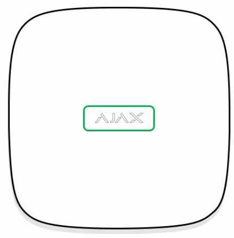

The Ajax logo on the hub front lights up red, white, or green depending on the status of the power supply and Internet connection.

| Indication       | Event                                                                                                    | Note                                                                                                                                                                                                    |
|------------------|----------------------------------------------------------------------------------------------------------|---------------------------------------------------------------------------------------------------------------------------------------------------------------------------------------------------------|
| Lights up white. | Two communication channels are connected: Ethernet and SIM card.                                   | If the external power supply is off, the indicator will flash every 10 seconds. After a loss of power, the hub will not light up immediately, but will start flashing in 180 seconds. |
| Lights up green. | One communication channel is connected: Ethernet or SIM card.                                      | If the external power supply is off, the indicator will flash every 10 seconds. After a loss of power, the hub will not light up immediately, but will start flashing in 180 seconds. |
| Lights up red.   | The hub is not connected to the internet or there is no connection with the Ajax Cloud service. | If the external power supply is off, the indicator will flash every 10 seconds. After a loss of power, the hub will not light up immediately,                                               |

|                                                                                     |                                               | but will start flashing in 180 seconds.                                                    |
|-------------------------------------------------------------------------------------|-----------------------------------------------|-----------------------------------------------------------------------------------------------|
| Lights up 180 seconds after the loss of power, then flashes every 10 seconds. | The external power supply is disconnected. | The LED indication colour depends on the number of communication channels connected. |
| Blinks red.                                                                         | The hub is reset to factory settings.      |                                                                                               |

If your hub has different indication, please contact . They will help you. our technical support

# Ajax account

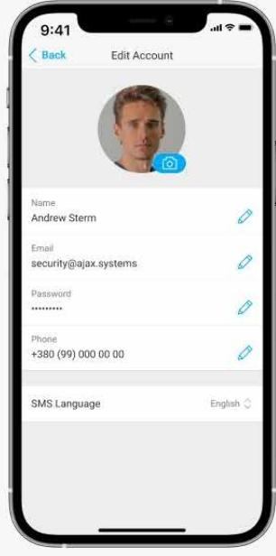

The security system is configured and managed via designed for iOS, Android, macOS, and Windows. Ajax applications

Use the Ajax Security System app to manage one or several hubs. If you intend to operate more than ten hubs, please install (for iPhone and Android) or (for Windows and macOS). You can learn more about Ajax apps and their features . Ajax PRO: Tool for Engineers Ajax PRO Desktop here

To configure the system, install the Ajax app and create an account. Please remember that there is no need to create a new account for each hub. One

account can manage multiple hubs. Where necessary, you can configure individual access rights for each facility.

#### How to register an account

#### How to register a PRO account

Bear in mind that user and system settings and connected devices settings are stored in the hub memory. Changing the hub administrator does not reset the settings of the connected devices.

#### Connecting the hub to Ajax Cloud

#### **Security requirements**

Hub 2 needs internet access to connect to the Ajax Cloud service. This is necessary for the operation of Ajax apps, remote setup and control of the system, and receipt of push notifications by the users.

The central unit is connected via Ethernet and two SIM cards. The hub is available in two versions: with 2G and 2G/3G/4G (LTE) modem. We recommend that you connect all communication channels simultaneously for more stability and availability of the system.

#### **To connect the hub to Ajax Cloud:**

- **1.** Remove the SmartBracket mounting panel by sliding it down with force. Do not damage the perforated portion, as it is needed to trigger the tamper protecting the hub from dismantling.
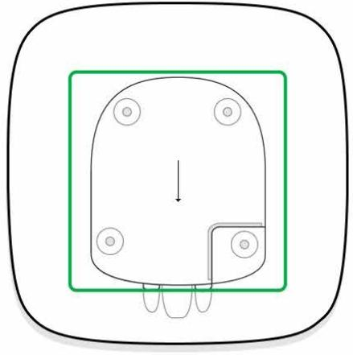

- **2.** Connect power and Ethernet cables to the appropriate sockets and install SIM cards.
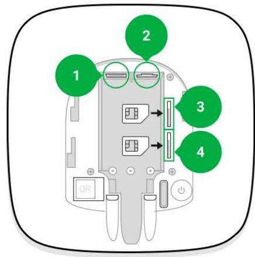

- 1 Power socket
- 2 Ethernet socket
- 3, 4 Slots for installing micro SIM cards
- **3.** Press and hold the power button for 3 seconds until the Ajax logo lights up.

It takes up to 2 minutes for the hub to connect to the internet and upgrade to the latest version of OS Malevich, provided there is stable internet connection. A green or white LED indicates that the hub is running and connected to the Ajax Cloud. Also bear in mind that to be upgraded, the hub must be connected to the external power supply.

### If Ethernet connection fails

If the Ethernet connection is not established, disable proxy and МАС address filtration and activate DHCP in the router settings. The hub will automatically receive an IP address. After that, you will be able to set up a static IP address of the hub in the Ajax app.

# If SIM card connection fails

To connect to the cellular network, you need a micro SIM card with a disabled PIN code request (you can disable it using a mobile phone) and a sufficient amount on your account to pay for the services at your operator's rates.

If the hub does not connect to the cellular network, use Ethernet to configure the network parameters: roaming, APN access point, username, and password. Contact your telecom operator for support to find out these options.

How to set or change APN settings in the hub

# Adding a hub to the Ajax app

| く Back Information                  |     |
|----------------------------------------|-----|
|                                        |     |
| AXX                                    | ల్ల |
| ull Cellular Signal Strength 111 |     |
| Online 다 Connection              |     |
| 100% Battery Charge 0            |     |
| 고 Closed Lid                     |     |
| ማ Connected External Power       |     |

- **1.** Connect the hub to the internet and power supply. Turn on the security central panel and wait until the logo lights up green or white.
- **2.** Open the Ajax app. Give access to the requested system functions to fully use the capabilities of the Ajax app and not to miss alerts about alarms or

events.

- How to set up push notifications on iOS
- How to set up push notifications on Android
- **3.** Click **Add Hub**.
- **4.** Choose a suitable method: manually or using a step-by-step guidance. If you are setting the system up for the first time, use step-by-step guidance.
- **5.** Specify the name of the hub and scan the QR code or enter the ID manually.
- **6.** Wait until the hub is added. The linked hub will be displayed in the **Devices** tab.

After adding a hub to your account, you automatically become the administrator of the device. Changing or removing the administrator does not reset the settings of the hub or delete connected devices.

Administrators can invite other users to the security system and determine their rights. Hub 2 supports up to 100 users.

How to add new users to the hub

Ajax's security system user rights

# Faults counter

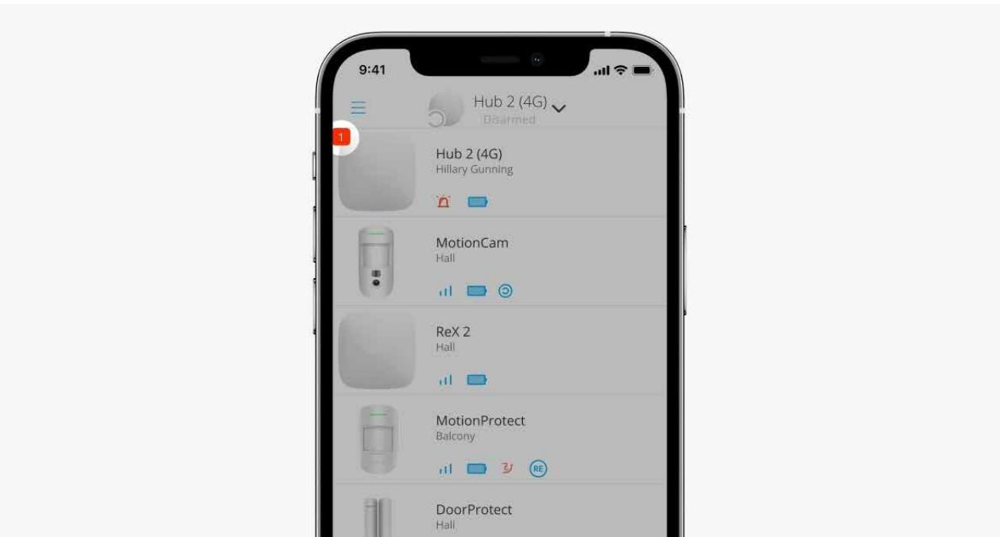

If a hub fault is detected (e.g., no external power supply is available), a faults counter is displayed on the device icon in the Ajax app.

All faults can be viewed in the hub states. Fields with faults will be highlighted in red.

# Hub icons

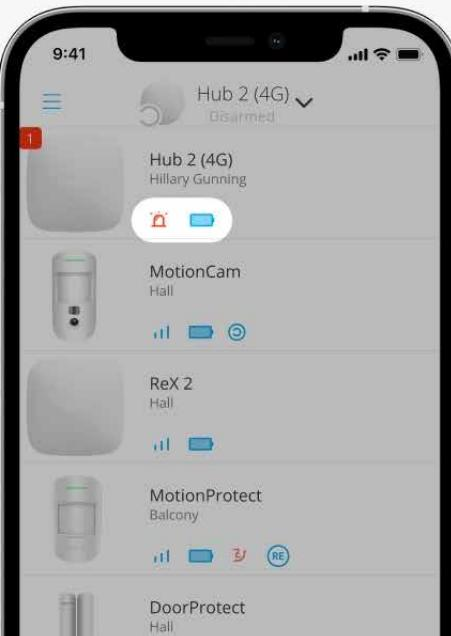

Icons display some of the Hub 2 statuses. You can see them in the **Devices**  tab in the Ajax app.

| Icon | Value                                                              |
|------|--------------------------------------------------------------------|
|      | SIM card operates in 2G network.                                   |
|      | SIM card operates in 3G network. Available for Hub 2 (4G) only. |
|      | SIM card operates in 4G network. Available for Hub 2 (4G) only. |
|      | No SIM cards.                                                      |
|      | The SIM card is faulty, or PIN code has been set up for it.        |
|      | Hub battery charge level. Displayed in increments of 5%.           |

| Learn more                                                                                      |
|-------------------------------------------------------------------------------------------------|
| Hub failure detected. The list is available in the hub states list.                             |
| The hub is directly connected to the central monitoring station of the security company.     |
| The hub is not directly connected to the central monitoring station of the security company. |

### Hub states

| 9:41    |                          |                | 19 =        |
|---------|--------------------------|----------------|-------------|
| く Back  | Information              |                |             |
|         | Area                     |                | @           |
| 111     | Cellular Signal Strength |                |             |
| គ្រ     | Cannection               |                | Online      |
| 0       | Battery Charge           |                | 100%        |
| 正       | Lad                      |                | Closed      |
| 4       | External Poveer          |                | Connected   |
| *       | Average Noise (dBm)      |                | -94/-98/-99 |
| િન્દ્રી | Cellular Data            |                | Connected   |
| (c      | WHERE                    |                | Disabled    |
| កា      | Active                   |                | SIM 1       |
| D       | SIM !                    | Unknown Number |             |

The states include information about the device and its operating parameters. Hub 2 states can be viewed in the : Ajax app

- **1.** Select the hub if you have several of them or if you are using a PRO app.
- **2.** Go to the **Devices** tab.
- **3.** Select **Hub 2** from the list.

| Parameter                | Value                                                   |
|--------------------------|---------------------------------------------------------|
|                          | Clicking on opens the hub malfunctions list.         |
| Malfunction              | The field appears only if a malfunction is detected. |
| Cellular signal strength | Shows the signal strength of the mobile                 |

| network for the active SIM card. |                                                                                                                                                                                                                 |  |  |
|----------------------------------|-----------------------------------------------------------------------------------------------------------------------------------------------------------------------------------------------------------------|--|--|
|                                  | We recommend installing the hub in places with the signal strength of 2-3 bars. If the signal strength is 0 or 1 bar, the hub may fail to dial up or send an SMS about an event or alarm.              |  |  |
| Battery charge                   | Battery charge level of the device. Displayed as a percentage. Learn more                                                                                                                                 |  |  |
| Lid                              | Status of the tamper that responds to hub dismantling: Closed — the hub lid is closed. Opened — the hub is removed from SmartBracket holder. Learn more                                          |  |  |
| External power                   | External power supply connection status: Connected — the hub is connected to external power supply. Disconnected — no external power supply is available.                                           |  |  |
| Connection                       | Connection status between the hub and Ajax Cloud: Online — the hub is connected to Ajax Cloud. Offl ine — the hub is not connected to Ajax Cloud.                                             |  |  |
| Cellular data                    | The hub connection status to the mobile Internet: Connected — the hub is connected to Ajax Cloud via mobile Internet. Disconnected — the hub is not connected to Ajax Cloud via mobile Internet. |  |  |

|                     | If the hub has enough funds on the account or has bonus SMS/calls, it will be able to make calls and send SMS messages even if the Not connected status is displayed in this field.                                                                                                                                                                      |
|---------------------|-------------------------------------------------------------------------------------------------------------------------------------------------------------------------------------------------------------------------------------------------------------------------------------------------------------------------------------------------------------------|
| Active SIM card     | Displays active SIM card: SIM card 1 — if the first SIM card is active. SIM card 2 — if the second SIM card is active. You cannot switch between the SIM cards manually.                                                                                                                                                                           |
| SIM card 1          | The number of the SIM card installed in the first slot. To copy the number, click on it. Bear in mind that the number is displayed if it has been hardwired into the SIM card by the operator.                                                                                                                                                        |
| SIM card 2          | The number of the SIM card installed in the second slot. To copy the number, click on it. Bear in mind that the number is displayed if it has been hardwired into the SIM card by the operator.                                                                                                                                                       |
| Ethernet            | Internet connection status of the hub via Ethernet: Connected — the hub is connected to Ajax Cloud via Ethernet. Disconnected — the hub is not connected to Ajax Cloud via Ethernet.                                                                                                                                                               |
| Average Noise (dBm) | Noise power level at the hub installation site. The first two values show the level at Jeweller frequencies, and the third — at Wings frequencies. The acceptable value is 80 dBm or lower. Installing the hub in places with higher noise levels may lead to loss of signal from connected devices or notifications on jamming attempts. |

| Monitoring Station | The status of direct connection of the hub to the central monitoring station of the security company: Connected — the hub is directly connected to the central monitoring station of the security company. Disconnected — the hub is not directly connected to the central monitoring station of the security company. If this field is displayed, the security company uses a direct connection to receive events and security system alarms. Even if this field is not displayed, the security company still can monitor and receive event notifications via the Ajax Cloud server. Learn more |
|--------------------|-----------------------------------------------------------------------------------------------------------------------------------------------------------------------------------------------------------------------------------------------------------------------------------------------------------------------------------------------------------------------------------------------------------------------------------------------------------------------------------------------------------------------------------------------------------------------------------------------------------------------------------------------|
| Hub model          | Hub model name.                                                                                                                                                                                                                                                                                                                                                                                                                                                                                                                                                                                                                               |
| Hardware version   | Hardware version. Not updated.                                                                                                                                                                                                                                                                                                                                                                                                                                                                                                                                                                                                                |
| Firmware           | Firmware version. Can be updated remotely. Learn more                                                                                                                                                                                                                                                                                                                                                                                                                                                                                                                                                                                      |
| ID                 | Hub identifier (ID or serial number). Also located on the device box, on the device circuit board, and on the QR code under the SmartBracket lid.                                                                                                                                                                                                                                                                                                                                                                                                                                                                                    |

#### Hub settings

| 9:41  |                          | =               |
|-------|--------------------------|-----------------|
| Axk   | Information              |                 |
|       |                          | (0)             |
| 111   | Cellular Signal Strength | =               |
|       | Commention               | Online          |
|       | Buttery Charge           | 10096           |
| 11    | Lici                     | Based           |
|       | Extrustal Power          | Ecifyridated    |
|       | Nerage No(se (dBm)       | 661786789770    |
| (8=2) | Gellellar Plats          | connected       |
|       | WHFI                     | Disabled        |
|       | PATIENT                  | STM Tr          |
|       | Sale 4                   | Unkriown Number |

Hub 2 settings can be changed in the : Ajax app

- **1.** Select the hub if you have several of them or if you are using a PRO app.
- **2.** Go to **Devices** tab and select **Hub 2** from the list.
- **3.** Go to **Settings** by clicking on the gear icon in the upper right corner.
- **4.** Set the required parameters.
- **5.** Click **Back** to save the new settings.

| Avatar   |  |
|----------|--|
| Hub name |  |
| Users    |  |
| Ethernet |  |
| Cellular |  |

**Geofence**

| Groups              |  |
|---------------------|--|
| Security schedule   |  |
| Detection Zone Test |  |
| Jeweller            |  |
| Service             |  |
| Monitoring Station  |  |
| PRO                 |  |
| Security companies  |  |
| User Guide          |  |
| Data Import         |  |
| Unpair hub          |  |

#### Settings reset

Resetting the hub to the factory settings:

- **1.** Turn on the hub if it is off.
- **2.** Remove all users and installers from the hub.
- **3.** Hold the power button for 30 s the Ajax logo on the hub will start blinking red.

- **4.** Remove the hub from your account.
# Malfunctions

Hub 2 may notify about malfunctions, if any. **Malfunctions** field is available in **Device States**. Clicking on opens the list of all malfunctions. Note that the field is displayed if a malfunction is detected.

# Connection of detectors and devices

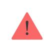

The hub is incompatible with and integration modules. You also cannot connect other hubs to it. uartBridge ocBridge Plus

When adding a hub using a step-by-step guidance, you will be prompted to add devices that will protect the premises. However, you can refuse and return to this step later.

Prior to linking a detector or device to a hub, create at least one room. Rooms are used to group detectors and devices, as well as to increase the information content of notifications. Names of devices and rooms will be displayed in the text of the event or alarm of the security system.

To create a room in the : Ajax app

- **1.** Select the hub if you have several of them or if you are using a PRO Ajax app.
- **2.** Go to the **Rooms** tab.
- **3.** Click **Add Room**.
- **4.** Assign a name to it. If possible, attach or take a picture of the room this will make it easier to find in the list.
- **5.** Click **Save**.

To change the room picture or name or to remove it, go to the room settings by pressing the gear icon in the **Rooms** menu.

# How to connect a detector or device to the hub

- **1.** Select the hub if you have several of them or if you are using a PRO Ajax app.
- **2.** Go to the **Rooms** tab.
- **3.** Open the room and select **Add Device**.
- **4.** Name the device, scan its QR code (or enter it manually), select a group (if group mode is enabled).
- **5.** Click **Add** the countdown for adding a device will begin.
- **6.** Follow the instructions in the app to connect the device.

In order to link a device to the hub, the device must be located within the hub's radio communication range (at the same secured premises). If connection fails, follow the instructions in the user guide for a respective device.

# Events and alarms notifications

The Ajax security system informs the user about alarms and events using three types of notifications: push notifications, SMS, and phone calls. Notification settings can only be changed for registered users that are connected to the hub.

technology. Before buying a SIM card, please make sure that it only supports the GSM standard.

| Type in app        | System events                                                                                                                                                  | Notifications                      |
|--------------------|----------------------------------------------------------------------------------------------------------------------------------------------------------------|------------------------------------|
| Malfunctions       | Loss of connection between the device and the hub Jamming Low battery charge in device or hub Masking Tampering with the detector body | Push notifications SMS          |
| Alarm              | Intrusion Fire Flood Loss of connection between the hub and the Ajax Cloud server                                                               | Calls Push notifications SMS |
| Events             | Turning on / off WallSwitch, , Relay Socket                                                                                                              | Push notifications SMS          |
| Arming / Disarming | Arming / Disarming entire premises or group Turning on Night mode                                                                                        | Push notifications SMS          |

The hub does not notify users of opening detectors triggering in the Disarmed mode when the Chime feature is enabled and configured. Only the sirens connected to the system notify about the opening.

What is Chime

How Ajax notifies users of alerts

# Selection of location for installation

When choosing a location, consider three main factors:

- Jeweller signal strength,
- Wings signal strength,
- cellular signal strength.

Locate Hub 2 in a place with stable Jeweller and Wings signal strength of 2–3 bars with all connected devices (you can view the signal strength with every device in the list of states for a respective device in the Ajax app).

When choosing a place for installation, consider the distance between the devices and the hub and any obstacles between the devices hindering the radio signal passage: walls, intermediate floors, or large-size objects located in the room.

To roughly calculate the signal strength at the place of installation, use our . radio communication range calculator

The cellular signal strength of 2–3 bars is necessary for the correct stable operation of SIM cards installed in the hub. If the signal strength is 0 or 1 bar, we cannot guarantee all events and alarms by calls, SMS, or mobile internet.

> Be sure to check the Jeweller and Wings signal strength between the hub and all devices at the place of installation. If the signal strength is low (a single bar), we cannot guarantee a stable operation of the security system since a device with a low signal strength may lose connection with the hub.

If the signal strength is insufficient, try moving the device (hub or detector) as repositioning by 20 cm can significantly improve the signal reception. If repositioning the device has no effect, try using a . range extender

Hub 2 should be hidden from direct view to reducing the likelihood of sabotage or jamming. Also, keep in mind that the device is intended for indoor installation only.

#### **Do not place Hub 2:**

- Outdoors. Doing so may cause the device to malfunction or not work correctly.
- Near metal objects or mirrors, for example, in a metal cabinet. They can shield and attenuate the radio signal.
- Inside any premises with the temperature and humidity beyond the range of permissible limits. Doing so may cause the device to malfunction or not work properly.
- Close to radio interference sources: less than 1 meter from the router and power cables. This could result in the loss of connection with the hub or devices connected to the range extender.
- In places with low or unstable signal strength. This could result in the loss of connection with connected devices.
- Less than 1 meter away from Ajax wireless devices. This could result in the loss of connection with the detectors.

# Installation

Before installing the hub, make sure that you have selected the optimal location and that it complies with the requirements of this manual.

When installing and operating the device, follow the general electrical safety rules for using electrical appliances and the requirements of electrical safety regulations.

#### **To install the hub:**

- **1.** Fix the SmartBracket mounting panel with bundled screws. When using other fasteners, make sure they do not damage or deform the panel. When attaching, use at least two fixing points. To make the tamper react to attempts to detach the device, be sure to fix the perforated corner of SmartBracket.
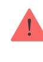

- **2.** Connect the power cable, Ethernet cable, and SIM cards to the hub. Turn on the device.
- **3.** Secure the cables with a plastic retainer plate. This will reduce the likelihood of sabotage, as it takes a lot more to tear away a secured cable.
- **4.** Slide Hub 2 onto the mounting panel. After installation, check the tamper status in the Ajax app and then the quality of the panel fixation. You will receive a notification if an attempt is made to tear the hub off the surface or remove it from the mounting panel.
- **5.** Fix the hub on the SmartBracket panel with bundled screws.

#### Maintenance

Check the operational capability of the Ajax security system regularly. The optimal frequency of checks is once every three months. Clean the body from dust, cobwebs, and other contaminants as they emerge. Use a soft and dry cloth that is suitable for equipment care.

Do not use any substances containing alcohol, acetone, petrol, and other active solvents for cleaning the hub.

If the hub battery becomes faulty, and you wish to replace it, use the following guidance:

How to replace hub battery

# Technical Specifications

**General settings**

| Classification                               | Security system control panel                                                                                                                                  |  |
|----------------------------------------------|----------------------------------------------------------------------------------------------------------------------------------------------------------------|--|
| Colour                                       | White, black                                                                                                                                                   |  |
| Installation method                          | Indoors                                                                                                                                                        |  |
| Communication with Ajax Cloud                |                                                                                                                                                                |  |
| Hub 2 (2G) communication channels            | 2 SIM cards 2G (GSM900/DCS1800 (B3/B8)) Ethernet                                                                                                         |  |
| Hub 2 (4G) communication channels            | 2 SIM cards 2G (GSM900/DCS1800 (B3/B8)) 3G (WCDMA 850/900/2100 (B1/B5/B8)) LTE (FDD B1/B3/B5/B7/B8/B20/B28) Ethernet                               |  |
| Communication with devices                   |                                                                                                                                                                |  |
| Communication protocols                      | Encrypted two-way radio protocols: Jeweller — for transmitting events and alarms. Wings — for transmitting photos.                                       |  |
| Radio communication range                    | Up to 2000 m without obstacles Learn more                                                                                                                   |  |
| Radio frequency band                         | 866.0 – 866.5 MHz 868.0 – 868.6 MHz 868.7 – 869.2 MHz 905.0 – 926.5 MHz 915.85 – 926.5 MHz 921.0 – 922.0 MHz (depending on the sales region) |  |
| Radio signal modulation                      | GFSK                                                                                                                                                           |  |
| Maximum effective radiated power (ERP)       | ≤ 25 mW                                                                                                                                                        |  |
| Polling interval                             | 12–300 s (set by administrator in the app)                                                                                                                  |  |
| Time for alarm delivery from detector to hub | 0.15 s                                                                                                                                                         |  |

Time for photo delivery from detector to hub up to 9 s at default settings

#### Learn more

#### **Capabilities**

| Number of connected devices                           | up to 100 including range extenders and sirens                                                                                                                      |  |  |
|-------------------------------------------------------|---------------------------------------------------------------------------------------------------------------------------------------------------------------------|--|--|
| Number of connected ReX                               | up to 5                                                                                                                                                             |  |  |
| Number of connected sirens                            | up to 10                                                                                                                                                            |  |  |
| Number of security groups                             | up to 9                                                                                                                                                             |  |  |
| Number of users                                       | up to 50                                                                                                                                                            |  |  |
| Video surveillance                                    | up to 25 cameras or DVRs                                                                                                                                            |  |  |
| Number of rooms                                       | up to 50                                                                                                                                                            |  |  |
|                                                       | up to 32                                                                                                                                                            |  |  |
| Number of scenarios                                   | Learn more                                                                                                                                                          |  |  |
| Central Monitoring Station communication protocols | SurGard (Contact ID) SIA (DC-09) Other proprietary protocols Learn more                                                                                    |  |  |
| Power supply                                          |                                                                                                                                                                     |  |  |
| Power supply                                          | 110–240 V with a pre-installed power supply unit 12 V with an alternative power supply unit 12V PSU 6 V with an alternative power supply unit 6V PSU |  |  |
| Backup battery                                        | Li-Ion 2 Ah (up to 16 h of battery life with Ethernet disabled)                                                                                               |  |  |
| Energy consumption from the grid                      | 10 W                                                                                                                                                                |  |  |
| Anti-sabotage protection                              |                                                                                                                                                                     |  |  |
| Tamper                                                | +                                                                                                                                                                   |  |  |
|                                                       |                                                                                                                                                                     |  |  |

| Radio frequency hopping     | +                   |  |  |
|-----------------------------|---------------------|--|--|
| Fraud protection            | +                   |  |  |
| Lid                         |                     |  |  |
| Operating temperature range | From -10°C to +40°C |  |  |
| Operating humidity          | Up to 75%           |  |  |
| Dimensions                  | 163 × 163 × 36 mm   |  |  |
| Weight                      | 362 g               |  |  |
| Service life                | 10 years            |  |  |

#### Compliance with standards

# Complete set

- **1.** Hub 2 (2G) or Hub 2 (4G).
- **2.** Power cable.
- **3.** Ethernet cable.
- **4.** Installation kit.
- **5.** SIM card (supplied depending on the region).
- **6.** Quick Start Guide.

# Warranty

Warranty for the AJAX SYSTEMS MANUFACTURING Limited Liability Company products is valid for 2 years after the purchase.

If the device does not function properly, we recommend that you first contact the support service as technical issues can be resolved remotely in half of the cases!

#### Warranty obligations

User Agreement

**Contact Technical Support:**

- e-mail
- Telegram