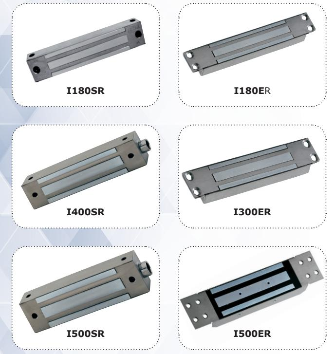

*External maglocks*

**I180ER**

**I180SR**

**I300ER**

**I400SR**

**I500ER**

**I500SR**

1

# **1] GENERAL INFORMATION**

- *Stainless steel.*
- *Surface mounting or mortice**.*
- *Monitored.*
- *Holding force:* 180, 300, 400 or 500kg**.
- *Security rope**.*
- *High corrosion resistance.*
- *Delivered with armature plate.*
- *No mechanical wear.*
- *Ease of installation.*
- *Recommended for outdoor use.*
- *Fail safe (Door unlocked when power off).*
- *Built-in electronic protection to eliminate back EMF.*
- Electromagnetic lock dimensions (L x W x D):
	- I180SR = 175 x 32,5 x 22mm
	- I400SR = 230 x 43,5 x 29,5mm
	- I500SR = 230 x 61 x 41mm
	- I180ER = 201 x 32 x 22mm
	- I300ER = 228 x 38 x 27mm
	- I500ER = 288,5 x 64 x 37,5mm
- Armature dimensions (L x W x D):
	- 180kg = 130 x 32 x 9mm
	- 300kg = 185 x 38 x 11mm
	- 400kg = 185 x 45 x 12mm
	- 500kg = 185 x 60 x 12mm
- Power supply: 12/24V dc.
- Power absorption:
- 12 V DC = 550mA,
- 24 V DC = 275mA.

| Refs   | Holding force | Monitored |
|--------|---------------|-----------|
| I180SR | 180kg         |           |
| I400SR | 400kg         |           |
| I500SR | 500kg         |           |
| I180ER | 180kg         |           |
| I300ER | 300kg         |           |
| I500ER | 500kg         |           |

- ARD212 BS602 **Recommended power supplies** *EC certification WEEE IP54 RoHS*
# **2] REMINDERS AND RECOMMENDATIONS**

The function of an electromagnetic lock is to ensure the locking of an access point. This document is a guide of installation which will allow you to secure the installation according to the characteristics of the product, the site and the environmental requirements.

#### **APPROVAL RELATIVE TO EMERGENCY EXITS**

In the case of an installation of electromagnetic lock on emergency exits, it is imperative to make sure that these exit points will be automatically free in case of fire alarm, to open in the event of a fire alarm to allow evacuation of the premises. The electromagnetic lock installed on emergency exits must be in accordance with the fire approval department (Ex: In France = NF 61-937).

*For more information, contact CDVI, the local fire officer or the safety officer responsible for the building.* 

*** Depending on the version.*

#### **POWER SUPPLY**

An electromagnetic lock always operates in DC current, a very low safety voltage. The Diax® electromagnetic lock is recommended for use with power supplies manufactured by CDVI, however, other power supplies may be used on condition that they are of equivalent quality and characteristics rectified, filtered, regulated and protected by fuse in primary and secondary sectors.

#### **MOUNTING RECOMMENDATIONS**

- Define the level of security of the access.
- Determine the maximum strength of holding force to this level of security.
- Select the Diax® electromagnetic lock according to the environment, the inside, the outside, the climatic constraints, (For example: stainless steel dedicated to an outside use).
- Always install the electromagnetic lock on the secure side of the place to be secured.
- Indeed make sure that the frame and opening, receiving or supporting the electromagnetic lock, armature plate and their accessories, are solid and resistant to damage or wear over a period of time.
- Consider any bracketry required for the assembly according to the type of support receiving the electromagnetic lock and armature plate.
- Define the passage of cables to ensure the protection against the vandalism and the environmental requirements (in particular through flexible hoses of door, glands, gutters, cross cables, plastic tubes).

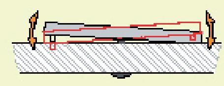

#### *Armature plate*

- *It is vital to fix the electromagnetic lock and armature plate solidly on their supports.*
- *- Make sure that the magnet and the armature meet evenly over their entire mating surfaces.*
- *The Armature plate must be able to pivot slightly about its center mounting screw to compensate for any door misalignment.*

#### *Security ropes*

*The electromagnetic lock undergoes repeated shocks and the vibration at the points of fixation on the frame (frequencies of openings / closures, attempt of opening wears closed and attempts of vandalism) which can loosen the fixing bolts/ screws. To prevent the risk of the electromagnetic block from falling, install both security ropes supplied, to guarantee the safety of the users (see attached plan).*

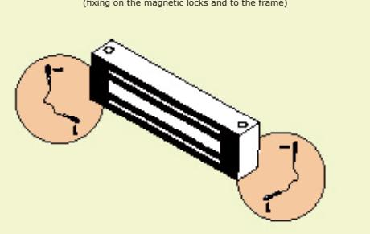

**Security ropes**

#### **MAINTENANCE**

The Electro magnet and armature plate have a specific treatment which strengthens the protection against wear and corrosion. These products do not require high maintenance. Nevertheless to ensure optimum performance, it is recommended to clean regularly the surfaces in contact of the electro magnet and armature plate with a cloth and non abrasive products. If traces of corrosion appear, it is recommended to clean and oil the contact surfaces. Check and tighten regularly all the fixings of the Electro magnet and ensure that while the armature is able to pivot on its mounting, the fixing bolt is not liable to loosen (we recommend thread-lock for all fixing bolts).

# **3] PACKAGE CONTENTS**

## **VERSION** I180ER

| Mortice magnetic lock | Armature plate | Stainless steel Screw 5x8 | Cap nut | Guide piece | Stainless steel screw with rubber washer 5x35 | Stainless steel Roll pin 5x16 | Stainless steel washer 6x13 | Rubber washer 6x10 | Joggle bracket | 3mm key | Installation Manual |
|--------------------------|-------------------|---------------------------------|---------|----------------|--------------------------------------------------------|-------------------------------------|--------------------------------------|--------------------------|-------------------|------------|------------------------|
| 1                        | 1                 | 8                               | 1       | 1              | 1                                                      | 2                                   | 2                                    | 1                        | 2                 | 1          | 1                      |

## **VERSION** I300ER

| Mortice magnetic lock | Armature plate | Stainless steel Screw 5x8 | Cap nut | Guide piece | Stainless steel screw with rubber washer 8x25 | Stainless steel Roll pin 5x16 | Stainless steel washer 10x22 | Rubber washer 9x15 | Joggle bracket | 5mm key | Installation Manual |
|--------------------------|-------------------|---------------------------------|---------|----------------|--------------------------------------------------------|-------------------------------------|---------------------------------------|--------------------------|-------------------|------------|------------------------|
| 1                        | 1                 | 8                               | 1       | 1              | 1                                                      | 2                                   | 2                                     | 1                        | 2                 | 1          | 1                      |

## **VERSION** I500ER

| Mortice magnetic lock | Armature plate | Stainless steel Screw 5x8 | Cap nut | Guide piece | Stainless steel screw with rubber washer 8x25 | Stainless steel Roll pin 5x16 | Stainless steel washer 10x22 | Rubber washer 9x15 | 5mm key | Installation Manual |
|-----------------------------|-------------------|------------------------------------|---------|----------------|-----------------------------------------------------------|----------------------------------------|---------------------------------------|--------------------------|------------|------------------------|
| 1                           | 1                 | 8                                  | 1       | 1              | 1                                                         | 2                                      | 2                                     | 1                        | 1          | 1                      |

### **VERSION** I180SR

| Surface mount magnetic lock    | Armature plate                    | Fixing plate        | Stainless steel screw 3x10 (security ropes) | Cap nut    | Guide piece | Steel screw nut 6x11 | Seal up anchor      | black steel screw 5x35 | Stainless steel screw 5x35 | Stainless steel screw with rubber washer 5x35 | Stainless steel Roll pin 5x16 |
|--------------------------------------|--------------------------------------|------------------------|---------------------------------------------------------|------------|----------------|----------------------------|------------------------|---------------------------------|----------------------------------|--------------------------------------------------------|-------------------------------------|
| 1                                    | 1                                    | 1                      | 2                                                       | 1          | 1              | 1                          | 4                      | 1                               | 2                                | 1                                                      | 2                                   |
|                                      |                                      |                        |                                                         |            |                |                            |                        |                                 |                                  |                                                        |                                     |
| Stainless steel Strut 10x15 | Stainless steel washer 6x13 | Hole cover plate | Rubber washer 6x10                                | 3mm key | 4mm key     | Security rope           | Installation Manual |                                 |                                  |                                                        |                                     |
| 2                                    | 2                                    | 4                      | 1                                                       | 1          | 1              | 2                          | 1                      |                                 |                                  |                                                        |                                     |

#### I400SR - I500SR

| Surface mount magnetic lock  | Armature plate                    | Stainless steel screw 3x10 (security ropes) | Cap nut                  | Guide piece | Steel screw nut 6x11 | Seal up anchor      | black steel screw 6x35 | Stainless steel screw 6x40 | Stainless steel screw 6x50 | Stainless steel screw with rubber washer 8x35 | Stainless steel Roll pin 5x16 |
|---------------------------------------|--------------------------------------|---------------------------------------------------------|--------------------------|----------------|----------------------------|------------------------|---------------------------------|-------------------------------------|-------------------------------------|-----------------------------------------------------------|----------------------------------------|
| 1                                     | 1                                    | 2                                                       | 1                        | 1              | 1                          | 4                      | 1                               | 2                                   | 2                                   | 1                                                         | 2                                      |
|                                       |                                      |                                                         |                          |                |                            |                        |                                 |                                     |                                     |                                                           |                                        |
| Stainless steel washer 10x22 | Stainless steel Strut 10x15 | Hole cover plate                                  | Rubber washer 9x15 | 5mm key     | Security rope           | Installation Manual |                                 |                                     |                                     |                                                           |                                        |
| 2                                     | 2                                    | 4                                                       | 1                        | 1              | 2                          | 1                      |                                 |                                     |                                     |                                                           |                                        |

# **4] OPTIONAL ACCESSORIES (ONLY FOR ARMATURE PLATE)**

|             | SURFACE MOUNT         |                                    |  |  |  |  |  |
|-------------|-----------------------|------------------------------------|--|--|--|--|--|
|             |                       |                                    |  |  |  |  |  |
| References  | Z1                    | Z3Z4Z5                             |  |  |  |  |  |
| Description | "Z" bracket for 180kg | "Z" bracket for 300, 400 and 500kg |  |  |  |  |  |

# **5] ELECTRICAL CONNECTIONS**

| Terminal block | Correspondence       | I500E | I180ER - I180SR I300ER - I400SR I500SR - I500ER |
|-------------------|----------------------|-------|-------------------------------------------------------|
| +                 | 12 or 24V dc         |       |                                                       |
| -                 | - 0 V                |       |                                                       |
| N.C               | NC (Normally closed) | -     |                                                       |
| COM               | COM                  | -     |                                                       |
| N.O               | NO (Normally open)   | -     |                                                       |

*The NO/NC signal only switches when the door is closed with the power to it on.*

*Check the jumper position before connecting the lock to the input current. A wrong position could damage the lock. This type of damage is not covered by the warranty.*

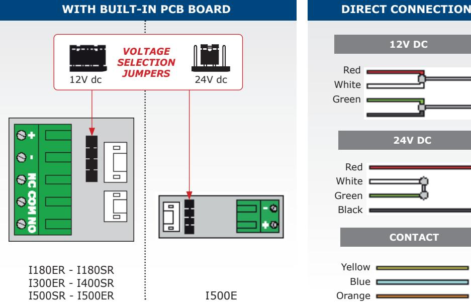

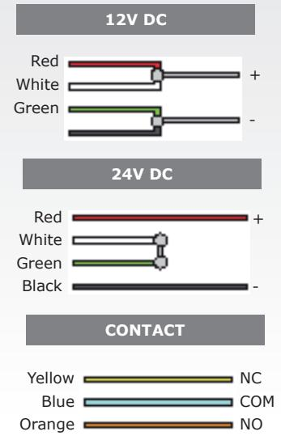

## **6] INSTALLATION**

## **SURFACE MOUNT VERSIONS:** I180SR - I300SR - I400SR - I500SR

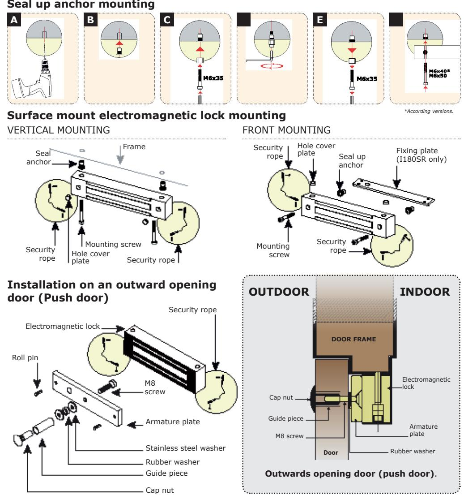

## **Installation on an inward opening door (Pull door)**

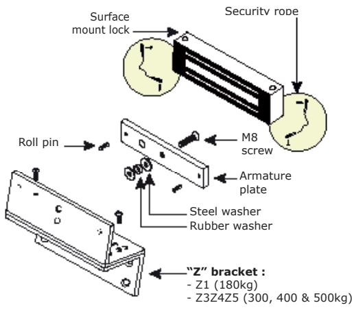

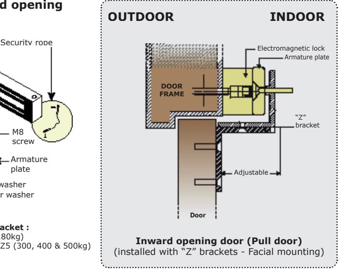

## **MORTICE VERSIONS:** I180ER - I300ER - I500ER

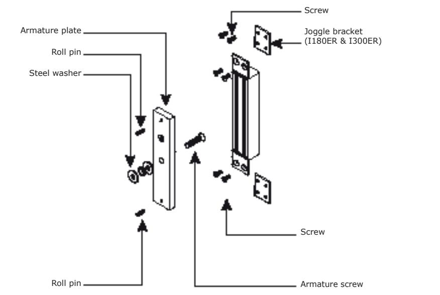

# **7] FAULT FINDING**

| PROBLEM                    | POSSIBLE CAUSE                                                 | SOLUTION                                                                                                                                                                                                                                              |  |  |  |  |  |
|----------------------------|----------------------------------------------------------------|-------------------------------------------------------------------------------------------------------------------------------------------------------------------------------------------------------------------------------------------------------|--|--|--|--|--|
| Door locking impossible | The lock is not receiving DC current.                          | - Check that the wires are connected to the right terminals. - Check that the power supply is compatible. - Check that the lock is connected to the circuit correctly.                                                                          |  |  |  |  |  |
| Holding                    | The lock and the armature are not lined up with each other. | - Check that the lock is connected to the circuit correctly. - Check that the electromagnet and the armature are properly aligned. - Check that the contact faces are free from dirt and rust. - Check that the armature is soft mounted. |  |  |  |  |  |
| force reduced           | Low voltage or armature jammed.                                | - Check that the lock is receiving the correct power supply satisfactorily. - check the tightening of the armature and the condition of the rubber.                                                                                          |  |  |  |  |  |
| Faulty reed switch      | Voltage too low. Misalignment.                                 | - Check the power supply. - Cable cross section to be determined according to the power supply and the locking. - e.g.: 2 x 1.5mm2 ≥ 10m.                                                                                                    |  |  |  |  |  |

# **8] LIMITED LIFETIME WARRANTY [EXTRACT]***

CDVI warrants this product to be free from defects in material and workmanship, when it has been installed in accordance with the manufacturer's instructions and has not been modified or tampered with. Only product recognized by CDVI to be defective should be returned under these warranty terms if accompanied by an RMA (Return Material Authorization Number) provided by CDVI. CDVI, at its option, shall repair or replace the defective product at CDVI premises or at any CDVI approved service center. This warranty does not cover any damage due to accident, misuse, abuse or negligence. This warranty is valid only if the product is registered, within 1 month from delivery to the final costumer. To obtain full details of this warranty and to register the product to commence the "Limited Lifetime Warranty", complete the enclosed registration card and return it, either by e-mail or post, to the relevant CDVI address or completion of the on line registration at www.cdvigroup.com. Repair or replacement of the defective product is the exclusive remedy. CDVI shall not be liable for any incidental or consequential damages arising from any defect in, or malfunction of, its product. In no event the entire liability can not exceed the purchase price of the product. The CDVI local country contact details can be found on line by visiting www.cdvigroup.com or on the back cover of the installation manual.

**DISCLAIMER OF WARRANTY:** EXCEPT AS STATED ABOVE, CDVI MAKES NO WARRANTIES, EITHER EXPRESS OR IMPLIED, AS TO ANY MATTER WHATSOEVER, INCLUDING THE CONDITION OF ITS PRODUCTS, THE TRANSPORTATION, THEIR MERCHANTABILITY OR FITNESS FOR ANY PARTICULAR PURPOSE.

# **1] PRODUKTSPECIFIKATION**

- *Rostfri.*
- *Utanpåliggande eller infälld*.*
- *Indikering.*
- *Hållkraft:* 180, 400, 300 eller 500 kg*.
- *Inkluderad säkerhetsvajer.*
- *Levereras med ankarplatta.*
- *Inga rörliga delar.*
- *Enkel att installera.*

 *Rekommenderas för utomhusbruk. Omvänd funktion (dörren är upplåst när strömmen är bruten). Inbyggt elektronikskydd.*

- Elektromagnetens dimensioner (L x B x H):
	- I180SR = 175 x 32,5 x 22mm
	- I400SR = 230 x 43,5 x 29,5mm
	- I500SR = 230 x 61 x 41mm
	- I180ER = 201 x 32 x 22mm
	- I300ER = 228 x 38 x 27mm
	- I500ER = 288,5 x 64 x 37,5mm
- Ankarplattans dimensioner (L x B x H):
	- 180kg = 130 x 32 x 9mm
	- 300kg = 185 x 38 x 11mm
	- 400kg = 185 x 45 x 12mm
- 500kg = 185 x 60 x 12mm Strömförsörjning: 12/24 V dc
- Strömförbrukning:
	- 12 V DC = 550 mA
	- 24 V DC = 275 mA

| Refs   | Holding force | Monitored |
|--------|---------------|-----------|
| I180SR | 180kg         |           |
| I400SR | 400kg         |           |
| I500SR | 500kg         |           |
| I180ER | 180kg         |           |
| I300ER | 300kg         |           |
| I500ER | 500kg         |           |

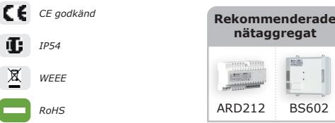

# **2] INFORMATION OCH REKOMMENDATIONER**

Elektromagnetens funktion är att öka säkerheten genom att se till att passerkontrollen är ordentligt låst. Det här är en installationsguide som ger vägledning hur man anpassar installationen efter rådande förutsättningar med avseende på produkten, platsen den placeras på och den omgivande miljön samtidigt som man uppnår största möjliga säkerhetsnivå.

## **STANDARD FÖR NÖDUTGÅNGAR**

Om en elektromagnet monteras vid en nödutgång är det nödvändigt att kontrollera att dörren automatiskt låses upp vid ett brandlarm för att möjliggöra evakuering. En elektromagnet som sitter på en nödutgång måste installeras i enlighet med gällande brandsäkerhetslagar och förordningar (Ex : SS-EN1155). *För mer information, kontakta CDVI, svenska brandskyddsföreningen eller säkerhetsansvarig för byggnaden.* 

*** Beroende på version.*

## **STRÖMFÖRSÖRJNING**

En elektromagnet drivs alltid med likström (DC), en säker svagströms matning. Det rekommenderas att Diax® elektromagneter används tillsammans med nätaggregat tillverkade av CDVI. Det går att använda andra nätaggregat om de uppfyller kraven på motsvarande kvalitet och egenskaper, - likriktad, filtrerad, regulerad och med dubbelautomatsäkring (primär och sekundär).

#### **MONTERINGSINSTRUKTIONER**

- Bestäm säkerhetsnivån på passerkontrollen.
- Den maximala styrkan på hållkraften anpassas till vald säkerhetsnivå.
- Välj Diax® elektromagnet utifrån omgivningen, interiört, exteriört, klimat förutsättningar, … (Till exempel : rostfritt stål för utomhusbruk).
- Installera alltid elektromagneten på insidan på en säker plats.
- Kontrollera att dörrposten och dörrkarmen, som stöttar eller håller elektromagneten, ankarplattan med tillbehör, är robusta och står emot slitage över tid.
- Välj fästen utifrån funktion och dörrkarm som elektromagneten och ankarplattan skall monteras på.
- Bestäm hur kablar ska dras på ett säkert sätt för att skyddas från vandalism och olika väderförhållanden (t ex genom flexibla karmöverföringar, kabelrännor, plaströr, …).

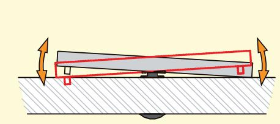

#### *Ankarplattan*

- *Det är mycket viktigt att elektromagneten och ankarplattan är ordentligt fästa i underlaget.*
- *Se till att elektromagneten och ankarplattan möts jämnt fördelat över hela kontaktytan för att optimera hållkraften.*
- *Ankarplattan måste kunna vicka runt monteringsskruven i mitten, för att kompensera om dörren inte är helt rak.*

#### *Säkerhetsvajrar*

*Elektromagnetens fästen utsätts för upprepade vibrationer och andra påfrestningar under sin livstid. Öppningsfrekvensen, stängningar, försök att öppna låst dörr samt vandaliseringsförsök orsakar slitningar och kan resultera i att monteringsskruvarna blir lösa. För att förhindra elektromagneten från att falla ner montera de två säkerhetsvajrarna som följer med. Detta för att garantera säkerheten för användarna (se bild).*

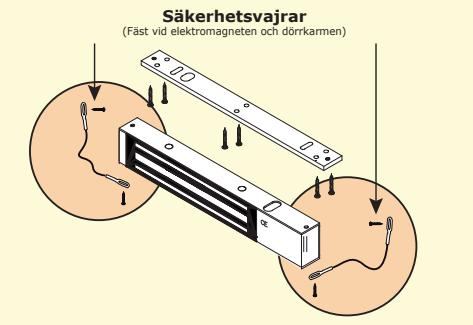

## **SKÖTSEL**

Elektromagneten och ankarplattan är specialbehandlade för att motstå rostbildning och slitage. De här produkterna kräver inte mycket underhåll. För maximal effekt bör kontaktytorna på elektromagneten och ankarplattan torkas regelbundet med en trasa och milt rengöringsmedel. Om spår av rost uppstår, rekommenderar vi att kontaktytorna rengörs och oljas in. Kontrollera och skruva åt alla monteringsskruvarna på elektromagneten regelbundet. Kontrollera även att ankarplattan kan vicka runt monteringsskruven. Vi rekommenderar att låsbrickor används till alla monteringsskruvarna.

# **3] MONTERINGSSATS**

## **VERSION** I180ER

| Infälld elektro- magnet | Ankar-plat- ta | Rostfri skruv M5x8 | Fästbult M5 | Distans hylsa | Rostfri skruv med gum- mi-bricka M5x35 | Rostfri Styrpinne 5x16 | Rostfri bricka 6x13 | Gum- mibricka 6x10 | Montage platta | Fast nyckel 3 mm | Installa tions-ma nual |
|-------------------------------|-------------------|--------------------------|----------------|------------------|-------------------------------------------------|------------------------------|---------------------------|--------------------------|-------------------|---------------------|------------------------------|
| 1                             | 1                 | 8                        | 1              | 1                | 1                                               | 2                            | 2                         | 1                        | 2                 | 1                   | 1                            |

## **VERSION** I300ER

| Infälld elektro- magnet | Ankar-plat- ta | Rostfri skruv M5x8 | Fästbult | Distans hylsa | Rostfri skruv med gum- mi-bricka M8x25 | Rostfri Styrpinne 5x16 | Rostfri bricka 10x22 | Gum- mibricka 9x15 | Monta- ge-platta | Fast nyckel 5 mm | Installa tions-ma nual |
|-------------------------------|-------------------|--------------------------|----------|------------------|-------------------------------------------------|------------------------------|----------------------------|--------------------------|---------------------|---------------------|------------------------------|
| 1                             | 1                 | 8                        | 1        | 1                | 1                                               | 2                            | 2                          | 1                        | 2                   | 1                   | 1                            |

## **VERSION** I500ER

| Infälld elektro- magnet | Ankar-plat- ta | Rostfri skruv M5x8 | Fästbult | Distans hylsa | Rostfri skruv med gum- mi-bricka M8x25 | Rostfri Styrpinne 5x16 | Rostfri bricka 10x22 | Gum- mibricka 9x15 | Fast nyckel 5 mm | Installa tions-ma nual |
|-------------------------------|-------------------|--------------------------|----------|------------------|-------------------------------------------------|------------------------------|----------------------------|--------------------------|---------------------|------------------------------|
| 1                             | 1                 | 8                        | 1        | 1                | 1                                               | 2                            | 2                          | 1                        | 1                   | 1                            |

#### **VERSION** I180SR

| Utanpå-lig- gande elektro- magnet |                           | Ankarplatta Monterings- fäste | Rostfri skruv 3x10 (säkerhets- vajer) | Fästbult            | Dis- tans-hylsa     | Dis- tans-hylsa 6x11 | Tät- nings-hylsa          | Svart me- tall-skruv 5x35 | Rostfri skruv 5x35 | Rostfri skruv med gum- mi-bricka, 5x35 | Rostfri styrpinne 5x16 |
|--------------------------------------------|---------------------------|-------------------------------|---------------------------------------------------|---------------------|---------------------|----------------------------|------------------------------|---------------------------------|--------------------------|----------------------------------------------|------------------------------|
| 1                                          | 1                         | 1                             | 2                                                 | 1                   | 1                   | 1                          | 4                            | 1                               | 2                        | 1                                            | 2                            |
|                                            |                           |                               |                                                   |                     |                     |                            |                              |                                 |                          |                                              |                              |
| Rostfri bricka 10x15                 | Rostfri bricka 6x13 | Täckplugg                     | Gum- mibricka 6x10                          | Fast nyckel 3 mm | Fast nyckel 4 mm | Säker- hets-vajer       | Installa tions-ma nual |                                 |                          |                                              |                              |
| 2                                          | 2                         | 4                             | 1                                                 | 1                   | 1                   | 2                          | 1                            |                                 |                          |                                              |                              |

#### **VERSION** I400SR - I500SR

| Utanpå-lig gande elektro magnet | Ankarplatta                | Rostfri skruv 3x10 (säkerhets vajer) | Fästbult                | Dis tans-hylsa   | Dis tans-hylsa 6x11 | Tät nings-hylsa           | Svart me tall-skruv 6x35 | Rostfri skruv 6x40 | Rostfri skruv 6x50 | Rostfri skruv med gum mibricka 8x35 | Rostfri styrpinne 5x16 |
|------------------------------------------|----------------------------|--------------------------------------------------|-------------------------|---------------------|---------------------------|------------------------------|--------------------------------|--------------------------|--------------------------|-------------------------------------------------|------------------------------|
| 1                                        | 1                          | 2                                                | 1                       | 1                   | 1                         | 4                            | 1                              | 2                        | 2                        | 1                                               | 2                            |
|                                          |                            |                                                  |                         |                     |                           |                              |                                |                          |                          |                                                 |                              |
| Rostfri bricka 10x22               | Rostfri bricka 10x15 | Täckplugg                                        | Gum mibricka 9x15 | Fast nyckel 5 mm | Säkerhets vajer        | Installa tions-ma nual |                                |                          |                          |                                                 |                              |
| 2                                        | 2                          | 4                                                | 1                       | 1                   | 2                         | 1                            |                                |                          |                          |                                                 |                              |

# **4] TILLBEHÖR**

|             | UTANPÅLIGGANDE MONTAGE           |                                                  |  |  |  |  |
|-------------|----------------------------------|--------------------------------------------------|--|--|--|--|
|             |                                  |                                                  |  |  |  |  |
| Produktnamn | Z1                               | Z3Z4Z5                                           |  |  |  |  |
| Beskrivning | "Z"-format vinkelfäste för 180kg | "Z"-format vinkelfäste för 300, 400 och 500kg |  |  |  |  |

# **5] INKOPPLINGAR**

| Plint | Anslutningar           | I500E | I180ER - I180SR I300ER - I400SR I500SR - I500ER |
|-------|------------------------|-------|-------------------------------------------------------|
| +     | 12 eller 24 V DC       |       |                                                       |
| -     | - 0 V                  |       |                                                       |
| NC    | NC (Omvänd funktion)   | -     |                                                       |
| COM   | COM                    | -     |                                                       |
| NO    | NO (Rättvänd funktion) | -     |                                                       |

*Indikeringen fungerar bara när dörren är stängd och strömsatt.*

**Fabriksinställning 12 V DC**

*Kontrollera att byglingen sitter rätt placerad innan elektromagneten förses med ström.*

*En felaktigt placerad bygel kan skada elektromagneten. Den här typen av skada täcks inte av garantin.*

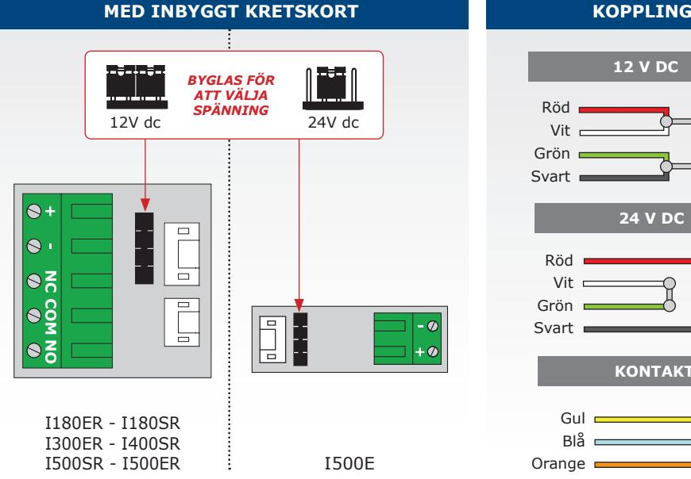

**12 V DC** Röd + Vit - Grön Svart **24 V DC** Röd + Vit - Grön Svart **KONTAKT**

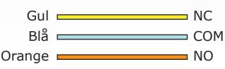

# **6] MONTERING**

## **UTANPÅLIGGANDE VERSIONER :** I180SR - I300SR - I400SR - I500SR

## **Montera tätningshylsor**

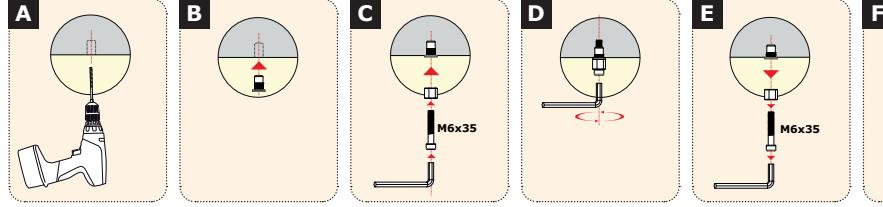

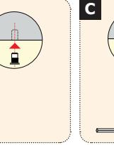

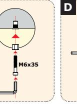

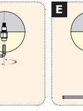

skruv

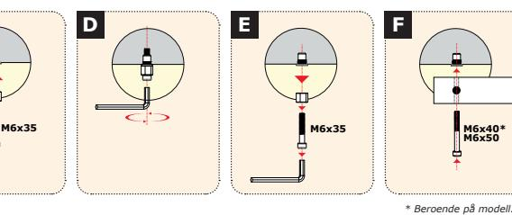

# **Montering av utanpåliggande elektromagnet**

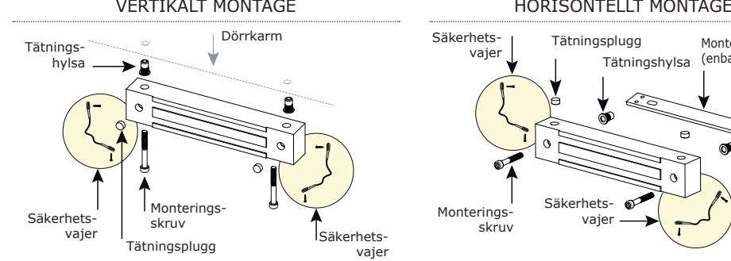

# **Montering på utåtgående dörr**

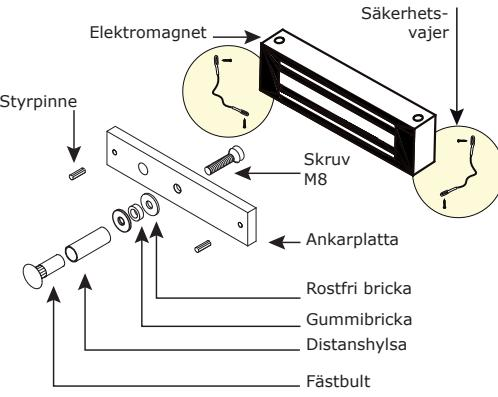

## Säkerhetsvajer Monterings-Säkerhetsvajer Dörrkarm Monteringsplatta (enbart I180SR) Tätningsplugg Tätningshylsa

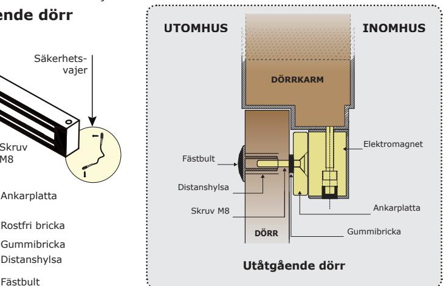

# **Montering på inåtgående dörr**

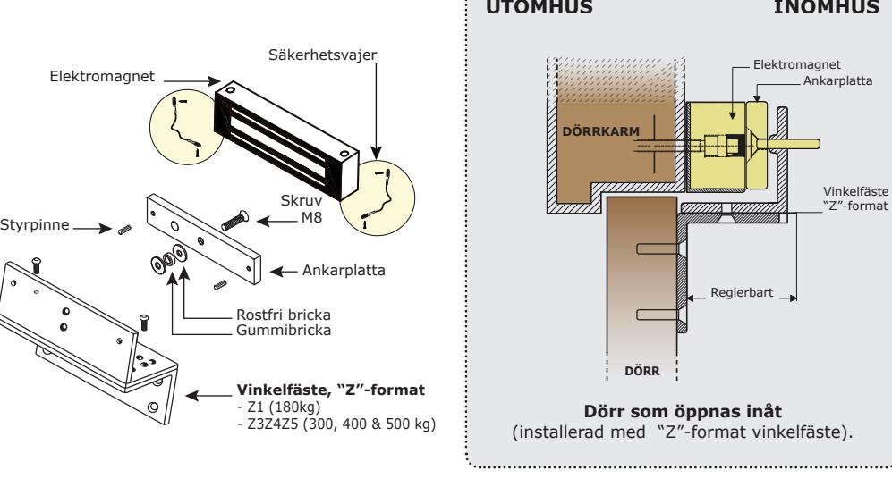

## **INFÄLLDA VERSIONER :** I180ER - I300ER - I500ER

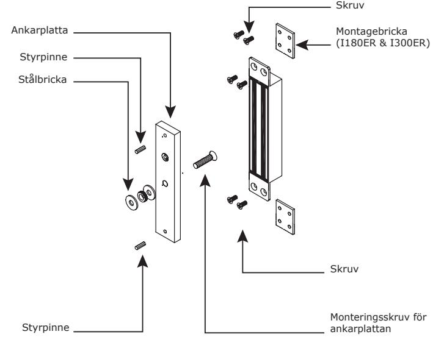

# **7] FELSÖKNING**

| PROBLEM                     | TROLIG ORSAK                                                              | LÖSNING                                                                                                                                                                                                                                                                           |
|-----------------------------|---------------------------------------------------------------------------|-----------------------------------------------------------------------------------------------------------------------------------------------------------------------------------------------------------------------------------------------------------------------------------|
| Dörren går inte att låsa | Elektromagneten får inte matarspänning DC.                             | - Kontrollera att kablarna är anslutna till rätt utgångar. - Kontrollera att nätaggregatet är rätt dimensionerat. - Kontrollera att elektromagneten får rätt spänningsmatning.                                                                                              |
| Hållkraften                 | Elektromagneten och ankarplattan är inte helt parallella med varandra. | - Kontrollera att elektromagneten får rätt spänningsmatning. - Kontrollera att elektromagneten och ankarplattan är parallella och möts ordentligt. - Kontrollera att kontaktytorna är rena och fria från rost. - Kontrollera att ankarplattan kan vicka runt skruven. |
| nedsatt                     | Låg spänningsmatning, eller ankarplattan övertäckt.                    | - Kontrollera att elektromagneten får rätt spänningsmatning. - Kontrollera att ankarplattan är fäst ordentligt och att delarna av gummi är mjuka.                                                                                                                           |
| Felaktig indikering      | För låg spänningsmatning. Kontaktytorna möts inte helt.                | - Kontrollera nätaggregatet. - Kontrollera kabelns dimensioner mellan nätaggregatet och elektromagneten. - ex: 2 x 1,5mm2 ≥ 10m                                                                                                                                          |

# **8] BEGRÄNSAD LIVSTIDSGARANTI [UTDRAG]***

CDVI garanterar att denna produkt är fri från fel i material och utförande, när den är installerad i enlighet med tillverkarens anvisningar och inte har ändrats eller manipulerats. Endast produkter godkända från CDVI som är deffekta, kan returneras enligt dessa villkor. Produkten skall skickas med ett RMA nummer (returnummer) som tillhandahålls av CDVI. CDVI skall efter eget val, reparera eller ersätta den defekta produkten på CDVI egen fabrik, eller enligt CDVI auktoriserat servicecenter. Denna garanti täcker inte skador på grund av olyckshändelse, felaktig användning, missbruk eller försummelse. Denna garanti är enbart giltigt om produkten är registrerad senast 1 månad efter leverans till slutkund. För att få fullständig information om denna garanti, och att registrera produkten för att påbörja "begränsad livstids garanti" fyll i det bifogade registreringsbeviset och återsänd detta, antingen via post eller e-mail till närmaste CDVI kontor, eller registrera online på www.cdvigroup.com. Reparation eller utbyte av den defekta produkten är de två alternativ som finns. CDVI ansvarar inte för oförutsedda skador eller följdskador. Inte under några som helst omständigheter kan skulden överstiga det totala inköpspriset för produkten. Du kan hitta ditt lokala CDVI kontor genom att besöka www.cdvigroup.se eller på baksidan av installationsmanualen.

**GARANTIFRISKRIVNING:** Med undantag från ovanstående, ger CDVI inga garantier, varken uttryckligt eller underförstått, oavsett grund, vilket inkluderar produktens skick, transport, dess säljbarhet eller lämplighet för ett särskilt ändamål.

| NOTES |  |
|-------|--|
|       |  |
|       |  |
|       |  |
|       |  |
|       |  |
|       |  |
|       |  |
|       |  |
|       |  |
|       |  |
|       |  |
|       |  |
|       |  |
|       |  |
|       |  |
|       |  |
|       |  |
|       |  |
|       |  |
|       |  |
|       |  |
|       |  |
|       |  |
|       |  |
|       |  |
|       |  |
|       |  |
|       |  |
|       |  |
|       |  |
|       |  |
|       |  |
|       |  |
|       |  |
|       |  |
|       |  |

External maglocks

## **ANTECKNINGAR**

**CDVI Group** FRANCE (Headquarters) Phone: +33 (0) 1 48 91 01 02

**CDVI FRANCE + EXPORT** +33 (0) 1 48 91 01 02 www.cdvi.com

**CDVI AMERICAS [CANADA - USA]** +1 (450) 682 7945 www.cdvi.ca

#### **CDVI BENELUX [BELGIUM - NETHERLANDS - LUXEMBOURG]**

+32 (0) 56 73 93 00 www.cdvibenelux.com

**CDVI TAIWAN** +886 (0) 42471 2188 www.cdvichina.cn

**CDVI SUISSE** +41 (0) 21 882 18 41 www.cdvi.ch

#### **CDVI CHINA**

+86 (0) 10 84606132/82 www.cdvichina.cn

#### **CDVI IBÉRICA [SPAIN - PORTUGAL]** +34 (0) 935 390 966

www.cdviberica.com

#### **CDVI ITALIA** +39 (0) 321 90 573 - www.cdvi.it

**CDVI MAROC** +212 (0) 5 22 48 09 40 www.cdvi.ma

#### **CDVI NORDICS [SWEDEN - DENMARK - NORWAY - FINLAND]** +46 (0) 31 760 19 30

www.cdvi.se

www.cdvi.co.uk

#### **CDVI UK [UNITED KINGDOM - IRELAND]** +44 (0) 1628 531300

**CDVI POLSKA** +48 (0) 12 659 23 44 www.cdvi.com.pl

*All the information contained within this document (pictures, drawings, features, specifications and dimensions)could be perceptibly different and can be changed without prior notice.*

# **www.cdvigroup.com**