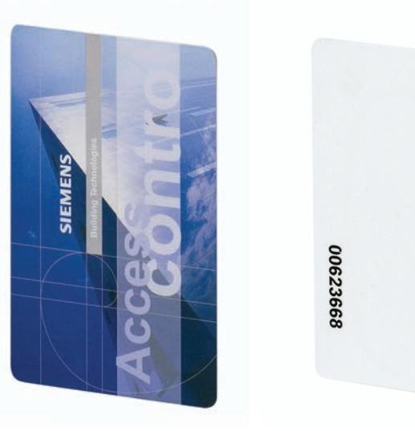

# **IB41-EM, IB42-EM** Access Control **EM laminated card with or without print**

- z **Passive proximity Card**
- z **EM 4102 reading technology**
- z **Magnetic stripe**
- z **Laminated with or without print**

### **IB41-EM - Pre-printed EM laminated card with print**

The IB41-EM is a pre-printed ISO cards is compliant with EM4102 reading technology. It also includes a magnetic strip. Can be used with the readers PP500-EM, HD500-EM, PR500-EM, SP500-EM, PP500-EM, PD30-EM and PD40-EM.

Note: The card number is printed on the back of the card. Quantity in order: 1

#### **IB42-EM - Blank printable EM laminated card without print**

The IB42-EM is a blank printable ISO card that is compliant with EM4102 reading technology. It also includes a magnetic strip. Can be used with the readers PP500-EM, HD500-EM, PR500-EM, SP500-EM, PP500-EM, PD30-EM and PD40-EM.

Note: The card number is printed on the back of the card. Quantity in order: 1

Fire Safety & Security Products

#### **Technical data**

## **IB41-EM, IB42-EM**

Dimensions (W x H x D) 54 x 86 x 0.76 mm

#### **Details for ordering**

| Type    | Part no         | Designation                     |
|---------|-----------------|---------------------------------|
| IB41-EM | S24246-D4904-A1 | EM laminated card with print    |
| IB42-EM | S24246-D4901-A1 | EM laminated card without print |

Issued by Siemens Building Technologies Fire & Security Products GmbH & Co. oHG D-76181 Karlsruhe www.buildingtechnologies.siemens.com

© 2009 Copyright by Siemens Building Technologies Fire & Security Products GmbH & Co. oHG Data and design subject to change without notice. Supply subject to availability.

Document no. **A6V10074296** Edition 05.2009