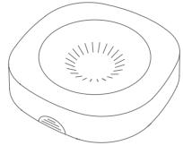
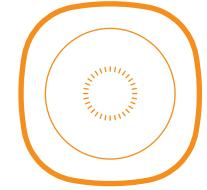
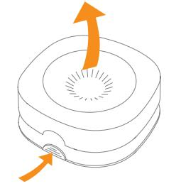
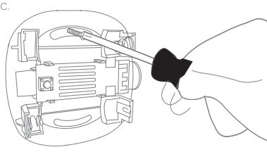
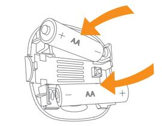
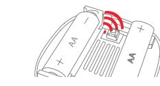
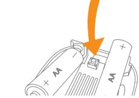
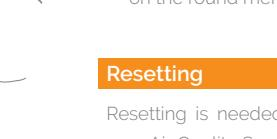
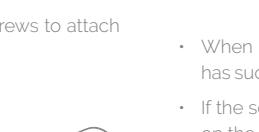

# **Air Quality Sensor**

# **INSTALLATION MANUAL**

Version 1.6

# **Product description**

The Air Quality Sensor monitors indoor air quality through continuous detection of volatile organic compound (VOC) levels.

The sensor provides information on the VOC levels, so adverse health affects caused by unhealthy indoor air can be prevented.

By monitoring indoor air quality, the Air Quality Sensor helps you ensure that the air inside the room is clean and healthy.

# **Precautions**

- Do not remove the product label as it contains important information.
- Be aware that electronics are sensitive to static electricity, so aim to discharge before touching, and avoid touching any components inside the device.
- Avoid placing the sensor close to radiators or electromagnetic fields.
- Do not paint the sensor.
- To ensure appropriate calibration, the sensor must be exposed to clean air for at least 10 minutes on a weekly basis.

# **Placement**

a.

### **PLACE THE SENSOR**

- Indoors at a temperature between 0-50°C.
- Inside the room, in which you want to monitor VOC levels.
- On a wall, where it is reachable for battery replacement and maintenance.

# **Mounting**

b.

d.

- 1. Open the casing of the Air Quality Sensor by pushing the switch and pulling the top of the casing..

- 2. Use double-sided tape or screws to attach

3. Insert batteries respecting the polarities.

- 4. Make sure that the sensor has joined a network before closing the casing.
### **Connecting**

- When the batteries are inserted, the Air Quality Sensor will start searching (up to 15 minutes) for a Zigbee network to join.
- Make sure that the Zigbee network is open for joining devices and will accept the sensor.
- While the sensor is searching for a Zigbee network to join, the LED flashes red.

- the sensor on the wall. When the LED stops flashing, the sensor has successfully joined the Zigbee network.
	- If the scanning has timed out, a short press on the round menu button will restart it.

Resetting is needed if you want to connect your Air Quality Sensor to another gateway or if you need to perform a factory reset to avoid abnormal behavior.

### **STEPS FOR RESETTING**

- 1. Open the casing of the sensor.
- 2. Press and hold the round menu button inside the device.

- 3. While you are holding the button down, the LED first flashes once, then two times in a row, and finally numerous times in a row.
- 4. Release the button while the LED is flashing numerous times in a row.
- 5. After you release the button, the LED shows one long flash, and the reset is completed.

## **Fault finding & cleaning**

- In case of a bad or wireless weak signal, change the location of the Air Quality Sensor. Otherwise you can relocate your gateway or strengthen the signal with a smart plug.
- If the search for a gateway has timed out, a short press on the button will restart it.

# **Battery replacement**

The device will blink twice every minute when the battery is low.

**CAUTION:** Risk of explosion if batteries are replaced by an incorrect type. Dispose of the batteries in accordance with instructions.

**CAUTION:** When removing cover for battery change - Electrostatic Discharge (ESD) can harm electronic components inside

- Open the casing of the Air Quality Sensor to replace the batteries.
- Replace the batteries respecting the polarities.
- Close the casing of the sensor.

### **Disposal**

Dispose the product and batteries properly at the end of their lives. This is electronic waste which should be recycled.

- 
e.

- 
- 

f.

50 cm 150 cm

WALL

### **VOC Levels**

|   | LEVEL     | TVOC [Μµg/m3 ] | HYGIENIC RATING             | RECOMMENDATION                                |
|---|-----------|-------------------|-----------------------------|-----------------------------------------------|
| 5 | Unhealthy | 10'000 - 25'000   | Situation not acceptable | Intense ventilation necessary                 |
| 4 | Poor      | 3'000 - 10'000    | Major objections            | Intensified ventilation / airing necessary |
| 3 | Moderate  | 1'000 - 3'000     | Some objections             | Intensified ventilation recommended        |
| 2 | Good      | 300 -1'000        | No relevant objections   | Ventilation/airing recommended             |
| 1 | Excellent | < 300             | No objections               | Target value                                  |

### **IC statement**

### **English**

This device contains licence-exempt transmitter(s)/receiver(s) that comply with Innovation, Science and Economic Development Canada's licence-exempt RSS(s). Operation is subject to the following two conditions:

- 1. This device may not cause interference.
- 2. This device must accept any interference, including interference that may cause undesired operation of the device.

This equipment complies with IC RSS-102 radiation exposure limits set forth for an uncontrolled environment. This equipment should be installed and operated with minimum distance 20 cm between the radiator and your body.

### **Français**

L'émetteur/récepteur exempt de licence contenu dans le présent appareil est conforme aux CNR d'Innovation, Sciences et Développement économique Canada applicables aux appareils radio exempts de licence. L'exploitation est autorisée aux deux conditions suivantes :

- 1. L'appareil ne doit pas produire de brouillage;
- 2. L'appareil doit accepter tout brouillage radioélectrique subi, même si le brouillage est susceptible d'en compromettre le fonctionnement.

Cet équipement est conforme aux limites d'exposition aux radiations IC CNR-102 établies pour un environnement non contrôlé. Cet équipement doit être installé et utilisé avec une distance minimale de 20 cm entre le radiateur et votre corps.

### **CE certification**

The CE mark affixed to this product confirms its compliance with the European Directives which apply to the product and, in particular, its compliance with the harmonized standards and specifications.

### **IN ACCORDANCE WITH THE DIRECTIVES**

- Radio Equipment Directive (RED) 2014/53/EU
- RoHS Directive 2015/863/EU amending 2011/65/EU
- REACH 1907/2006/EU + 2016/1688

### **Other certifications**

Zigbee 3.0 certified

### **All rights reserved.**

Develco Products assumes no responsibility for any errors, which may appear in this manual. Furthermore, Develco Products reserves the right to alter the hardware, software, and/or specifications detailed herein at any time without notice, and Develco Products does not make any commitment to update the information contained herein. All the trademarks listed herein are owned by their respective owners.

Distributed by Develco Products A/S Tangen 6 8200 Aarhus Denmark