# **AC 700**

### **INSTALLATIONSANVISNING**

**Revision 1**

# **INNEHÅLL**

| INSTALLATIONSANVISNING FÖR AC 700 NCBKDHFKCHSDKHFCKJ | ÖVERSIKT                 | 3  |
|---------------------------------------------------------|--------------------------|----|
|                                                         | INLEDNING                | 3  |
|                                                         | ÖVERSIKT GRUNDENHET      | 3  |
|                                                         | CENTRALENHETSVARIANTER   | 4  |
|                                                         | TEKNISKA DATA            | 7  |
|                                                         | MASTER OCH SLAV          | 7  |
|                                                         | TEKNISKA DATA            | 7  |
|                                                         | MONTERING                | 7  |
|                                                         | SPÄNNINGSMATNING         | 7  |
|                                                         | INKOPPLING AV LÄSARE     | 8  |
|                                                         | LÄSARTYPER               | 8  |
|                                                         | DTMF                     | 8  |
|                                                         | APTUS485                 | 8  |
|                                                         | AVPROVNING               | 8  |
|                                                         | INGÅNGAR OCH UTGÅNGAR    | 9  |
|                                                         | INKOPPLING AV INGÅNGAR   | 9  |
|                                                         | INKOPPLING AV UTGÅNGAR   | 9  |
|                                                         | INDIKERING               | 9  |
|                                                         | AVSTÖRNING               | 9  |
|                                                         | KOMMUNIKATION            | 10 |
|                                                         | ALLMÄNT                  | 10 |
|                                                         | DIREKT RS-232            | 10 |
|                                                         | MODEM                    | 10 |
|                                                         | NÄTVERK                  | 10 |
|                                                         | INSTÄLLNINGAR            | 11 |
|                                                         | MASTER & SLAV            | 11 |
|                                                         | CENTRALENS MINNE         | 11 |
|                                                         | KOMMUNIKATION MED SLAVAR | 12 |
|                                                         | SAMMANKOPPLING RS-485    | 12 |
|                                                         | KABELREKOMMENDATIONER    | 12 |
|                                                         | GARANTI & SERVICE        | 12 |

## **ÖVERSIKT 3**

#### **INLEDNING**

Denna anvisning redogör för hur centralenhet AC 700 skall installeras. AC 700 finns i ett antal utförande, beroende på bestyckning. Anvisningen är giltig för samtliga varianter av AC 700. Nedan följer en lista på de olika produktbeteckningarna:

AC 700 M / AC 700 S / TC 700 M Ringa / TC 700 S Ringa / TC 700 M2+2 / TC 700 S2+2 BC 700 M Boka / BC 700 S Boka / BC 700 M / BC 700 S / BC 700 MUT BC 700 SUT AC 700 M2D / AC 700 M4D / AC 700 S2D / AC 700 S4D / TC 700 M2+2D / TC 700 M4D TC 700 S2+2D / TC 700 S4D / BC 700 MD / BC 700 MUTD / BC 700 M4UTD / BC 700 SD BC 700 SUTD / BC 700 S4UTD.

#### **ÖVERSIKT GRUNDENHET**

Nedan visas en typisk inkoppling av en 2-dörrars enhet, som är det enklaste utförandet utan någon extra bestyckning.

**Obs!** Alla ingångar och utgångar är fritt programmerbara. Koppla in de funktioner ni vill ha till de olika in och utgångarna, t.ex. öppnaknappar, dörrkontakter och ellås. Programmera sedan databasen i enlighet med dina inkopplingar.

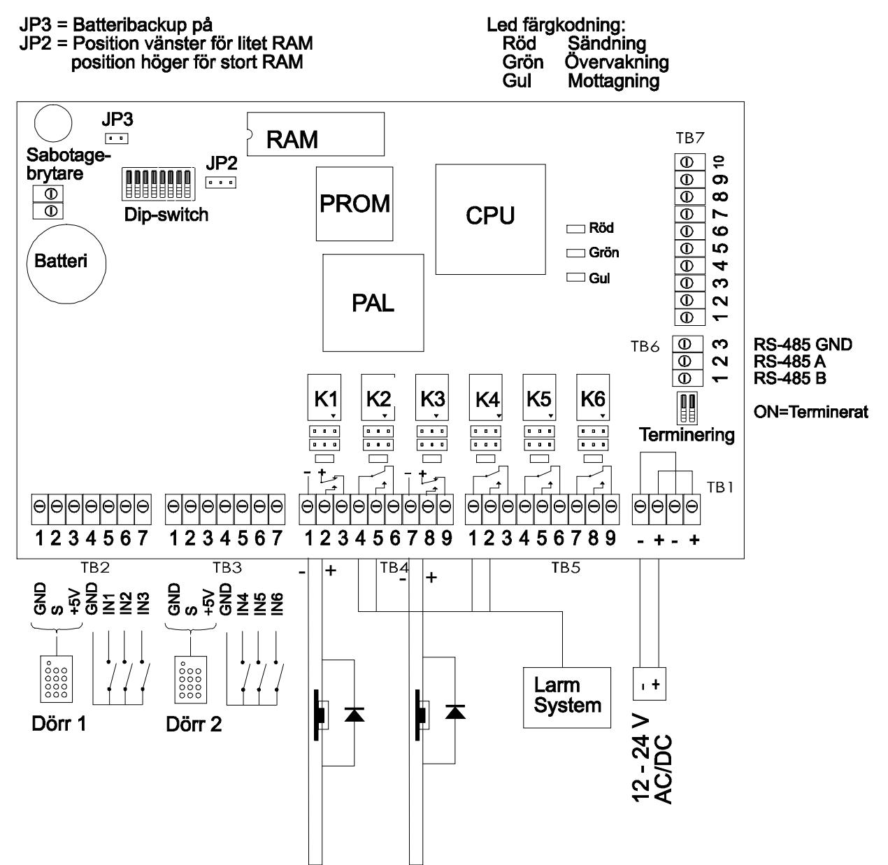

### **CENTRALENHETSVARIANTER**

De olika varianterna av AC 700-centraler bygger i grunden på samma hårdvaruplattform som bestyckats olika. Nedan följer en översikt över vilka bestyckningsmöjligheter som finns.

**AC 700 M , AC 700 S, BC 700 MUT, BC 700 SUT, BC 700 M BOKA, BC 700 S BOKA**

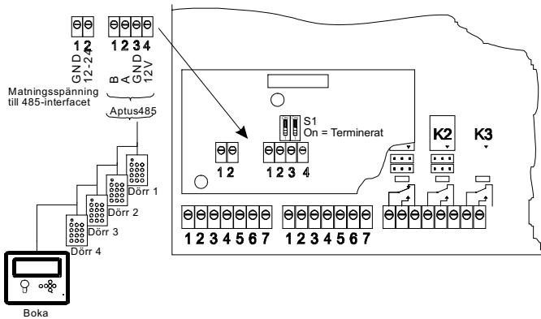

Centralen bestyckad med ett 485-interface för upp till fyra dörrar. Via detta ansluts läsare och eller bokningstavlan Boka till Aptus485 bussen. Observera att interfacekortet måste matas med 12-24VDC för att kunna leverera 12V ut till läsare eller bokningstavla på Aptus485-bussen.

### **TC 700 M2+2, TC 700 S2+2**

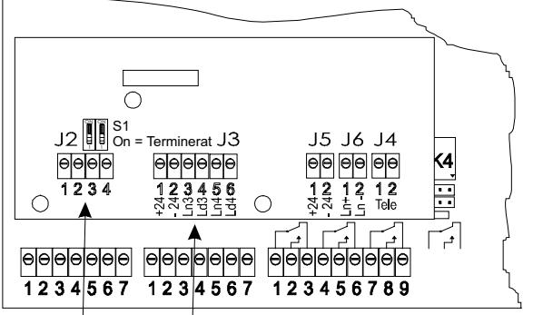

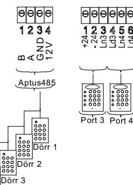

Dörr 4

Centralen är bestyckad med ett 485PTinterface. Via detta ansluts porttelefoner för två dörrar, dörr 3 och dörr 4. Dessutom kan läsare för dörr 1, 2, 3 och 4 anslutas via Aptus485-bussen. **Obs!** 485PT-interfacet måste matas med 24V DC på J5. Telefonlinje ansluts till J4. Trådbundna svarsapparater, AT 20, ansluts till J5 och J6.

#### **BC 700 M, BC 700 S**

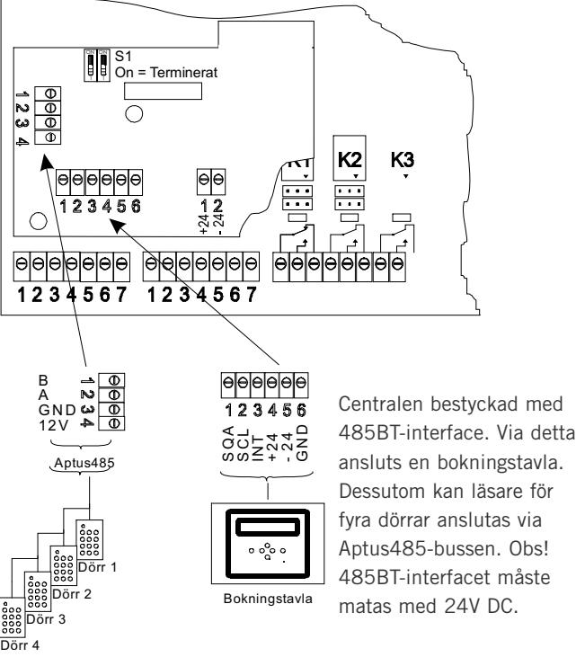

**TC 700 M RINGA, TC 700 S RINGA**

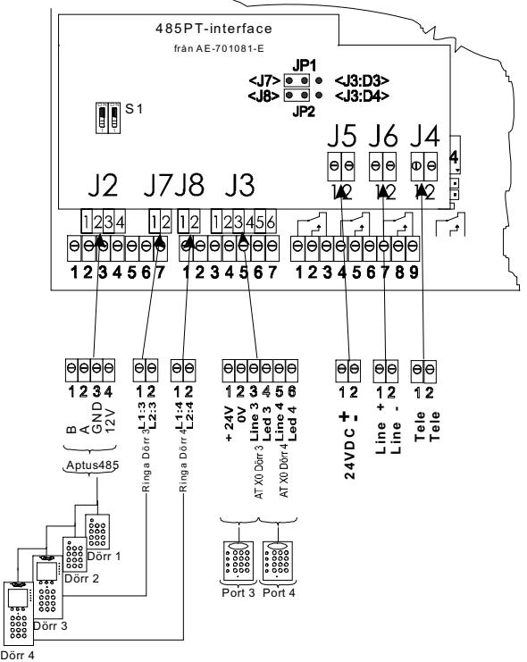

#### Forts. TC 700 M Ringa, TC 700 S Ringa

Centralen är bestyckad med ett 485PT-interface för Ringa. Via detta ansluts porttelefon Ringa för två dörrar, dörr 3 och dörr 4. Ringa skall anslutas till linje och till Aptus485-bussen. Läsare för dörr 1, 2, 3 och 4 ansluts via Aptus485-bussen.

**Obs!** 485PT-interfacet måste matas med 24V DC på J5. Telefonlinje ansluts till J4.

Trådbundna svarsapparater, AT 20 eller AT 21, ansluts till J5 och J6. Porttelefon AT 10, AT 30, AT 70 kan anslutas via J3 om bygeln för den dörren ställs om och Ringa ej är ansluten till samma dörr.

#### **AC 700 M4D, AC 700 S4D, BC 700 S4UTD, BC 700 M4UTD**

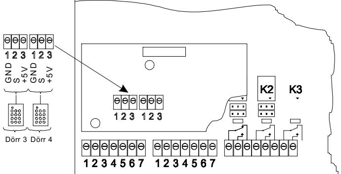

Centralen bestyckad med ett 4-dörrars interface. Till detta kan läsare med DTMF-kommunikation anslutas för dörr 3 och dörr 4.

#### **TC 700 M4D, TC 700 S4D**

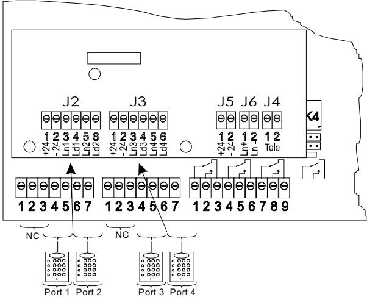

Centralen bestyckad med ett 4-dörrars PT-interface. Till detta kan du ansluta porttelefoner för fyra dörrar. Observera att det inte går att ansluta läsare till denna central. **Obs,** interfacet måste matas med med 24V DC.

#### **BC 700 MD, BC 700 SD**

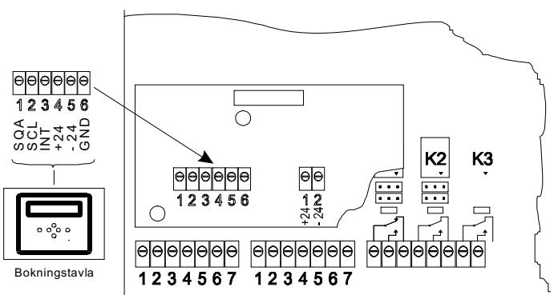

Centralen bestyckad med ett BT-inteface. Till detta kan du ansluta en bokningstavla. **Obs,** interfacet måste matas med med 24V DC.

#### **TC 700 M2+2D, TC 700 S2+2D**

Centralen bestyckad med ett 2-dörrars PT-interface. Till detta kan du ansluta porttelefoner för 2 dörrar,Dörr 3 och Dörr 4. Till Dörr 1 och Dörr 2 kan du fortfarande ansluta kortläsare för DTMF-kommunikation.

#### **CENTRALER UTAN INTERFACEKORT**

Vissa centraltyper använder sig ej av något interfacekort. Dessa är AC 700 M2D / AC 700 S2D / BC 700 MUTD / BC 700 SUTD.

#### **MASTER OCH SLAVNCBKDHFKCHSDKHFCKJ**

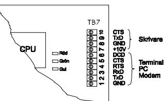

### **XX 700 MXX**

En mastercentral innehåller kommunikationsgränsnitt mot överordnad dator. Till TB7 ansluts RS-232 till PC eller modem. (TB7:1-7) Här ansluts också en eventuell skrivare. (TB7:8-10)

#### **XX 700 SXX**

Slavcentralen utnytjar ej kommunikationsgränsnittet på TB7.

**GUIDE**

**AC:** Passerkontroll, **BC:** Bokningscentral, **TC:** Porttelefoncentral **700:** Centralens generation, tidigare **500** och **600**.

**M:** Master, **S:** Slav.

**2:** Avsedd för 2 dörrar, **4:** Avsedd för 4 dörrar, **2+2:** 2 porttelefondörrar och 2 läsardörrar. **-:** 4 dörrar med Aptus485-buss.

**UT:** Bokningscentralen är utan tavla.

**D:** Centralen använder enbart DTMF-läsare, inga Aptus485-läsare. **Boka:** Central avsedd för bokningstavla Boka 1306 eller Boka 1316. **Ringa:** Central avsedd för porttelefon Ringa 1307 eller Ringa 1707.

### **TEKNISKA DATA 7**

### **MASTER OCH SLAV**

En central är antingen slav eller master. Master kallas den central som kommunicerar direkt med MultiAccess. Slavarna kommunicerar via sin master. Mastern kan hantera max 31 slavar.

Mastercentralerna har ett M i sin produktbeteckning, t.ex AC 700 M. Slavcentralerna har på samma sätt ett S, t.ex. AC 700 S.

#### **TEKNISKA DATA**

| Strömförsörjning: | 12-24V AC / DC +/-15%                           |
|-------------------|-------------------------------------------------|
|                   | Undantag:                                       |
|                   | Centraler med BT-interface, 485BT-interface,    |
|                   | PT-interface, 485PT-interface:                  |
|                   | 24V DC Stabiliserad och Filtrerad               |
|                   | Centraler med 485-interface:                    |
|                   | 12 - 24V DC FiltreradUndantag                   |
| Strömförbrukning: | max 0.4 A                                       |
| Utgångar:         | 6 växlande Reläer 28V 1A                        |
| Ingångar:         | 2 för dörrenheter (DTMF)                        |
|                   | 6 för inkoppling av tryckknapp, dörrövervakning |
|                   | osv.                                            |
|                   |                                                 |
|                   |                                                 |
| Kommunikation:    | RS485 mellan centralenheter                     |
|                   | RS232 till PC/terminal (endast master)          |
|                   | (Kan ersättas med nätverkskomm.)                |
|                   | RS232 till seriell skrivare. 9600 baud, 8 data  |
|                   | bitar, 1 stoppbit ingen paritet (endast master) |
|                   | Krypterad RS485 till kortläsare, bokningstavla  |
|                   | och porttelefon via Aptus485-buss.              |
|                   |                                                 |
| Miljökrav:        | 0 till +40 grader Celsius, 10 till 90 % relativ |
|                   | luftfuktighet                                   |
| Mått:             | 260 x 190 x 55 mm                               |
|                   |                                                 |
| Vikt:             | 2.2 Kg                                          |
|                   |                                                 |

AC 700 centralen monteras med 4 st skruvar på väggen i skyddat område.

Anslut en kabel från skyddsjord till lådans botten. Använd 1.5 mm2 kabel (eller grövre). Se figur:

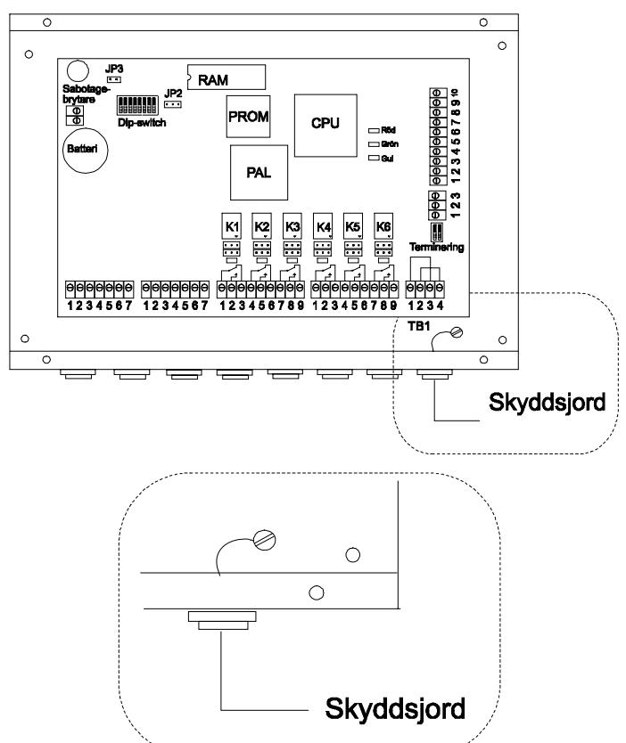

#### **SPÄNNINGSMATNING**

AC 700 skall matas med 12-24 V AC/DC. Anslut matningsspänningen till TB1, position 1 och 2. Vid bruk av likspänning skall - anslutas till position 1 och + till position 2.

Slå på spänningen och kontrollera att lysdioderna på kortet börjar att blinka. Efter 2-30 sekunder skall gul LED lysa konstant, grön LED skall blinka regelbundet och på mastern skall röd LED blinka något oregelbundet. På slavarna skall röd LED börja blinka först när slaven har kontakt med mastern. Bryt sedan matningsspänningen.

**Obs!** Porttelefoncentral, TC 700 och Bokningscentral, BC 700 kräver 24V DC Stabiliserad och Filtrerad.

Passercentral med 485-interface kräver 12 - 24V DC Filtrerad.

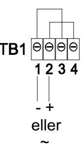

### **INKOPPLING AV LÄSARE**

### **LÄSARTYPER**

Till AC 700 centralerna kan anslutas läsare som kommunicerar via DTMF eller via Aptus485-buss.

#### **DTMF**

Detta är den typ av läsarkommunikation som traditionellt använts för Aptus kortläsare. DTMF-läsare kan anslutas till alla centraltyper utom TC 700 M4D och TC 700 S4D.

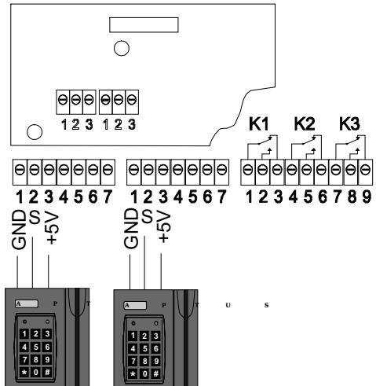

För kommunikation mellan AC 700 och läsaren används 3 ledare. 0V (GND), Signal och +5V. Övriga ledare till/från läsaren (beroende vilken typ det är) är för sabotagekontakt, extra lysdiodsstyrning och värmepaket i läsaren.

Läsaren kan normalt monteras 100 meter ifrån centralenheten. Kontrollera den specifika läsarens inkopplingsanvisning för exakta avstånd och vilken kabeltyp och area som Aptus rekommenderar

#### **APTUS485**

I och med centralenhet AC 700 stöds också krypterad kommunikation med läsare via Aptus485-bussen. Vill du ansluta sådana läsare skall du se till att din centralenhet ej har ett D i sin beteckning, eftersom dessa endast stöder DTMF-läsare.

Om din centralenhet är avsedd för den krypterade Aptus485 bussen,så är den bestyckad med ett interface-kort som innehåller anslutning för Aptus485-buss. Det finns tre varianter av interfacekort som innehåller bussen: 485-Interface, 485PT-interface och 485BTinterface. På figuren uppe till höger visas ett 485-interface. 485PToch 485BT-interface används när Aptus485-bussen skall anslutas till porttelefoncentral eller bokningscentral.

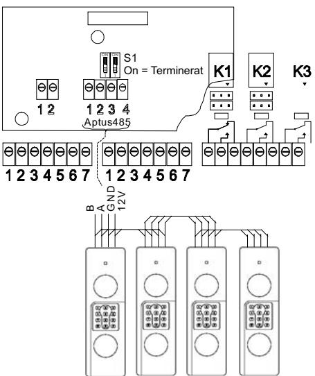

Via den fyrpoliga skruvplinten ansluts läsare avsedda för Aptus485 buss. Läsare för fyra dörrmiljöer kan anslutas till denna buss. Bussen använder 4 ledare: 485B, 485A, GND och 12V. Observera att läsarna får sin spänningsförsörjning via Aptus485, varför kabelarea och spännings-aggregat måste dimensioneras utifrån belastning och avstånd. Totallängden på Aptus485-bussen skall hållas under 200 meter. Maximalt kan 1.5A dras via denna spänningsutgång.

Bäst resultat nås om bussen verkligen installeras som en buss, dvs. med endast 2 ändpunkter, vilka skall termineras på därför avsedda switchar. Om man gör avsteg från buss-principen får inget enskilt stick överstiga 100m. Terminering görs i så fall i ändpunkterna av den längsta sammanhängande sträckan. Skall terminering göras i centralen sätts båda positonerna i S1 = On.

Interfacekortet måste ha matningsspänning ansluten till den 2-poliga skruvplinten. Skruv1: 0V, Skruv2: 12-24V.

**Obs!** 485BT- och 485PT-interfacen skall matas med 24V.

#### **AVPROVNING**

När läsarna är inkopplade ansluter ni matningsspänningen och kontrollerar läsarnas funktion.

Läs en nyckelbricka (TAG) i läsaren, eller slå en kod följt av *:

{DTMF} Läsaren blinkar först gult därefter rött 2ggr.

{Aptus485} Först kort gult blink (ca 1sek) därefter rött 2ggr. Om det röda uteblir och det gula pågår i ca 5sek, så har läsaren inte korrekt kommunikation med centralen.

Rött indikerar att nyckelbrickan eller koden ej är giltig (inlagd) vilket vi inte heller hade väntat oss.

# **INGÅNGAR OCH UTGÅNGAR**

#### **INKOPPLING AV INGÅNGAR**

AC 700 har sex ingångar för öppnaknappar, dörrövervakning och liknande. Ingångarna kan programmeras helt fritt i programvaran.

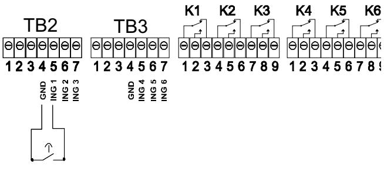

För att aktivera en ingång kopplas den till jord.

Exempel: För att aktivera ingång nummer ett, anslut TB2 nummer 5 (Ingång 1) till TB2 nummer 4 (GND).

#### **INKOPPLING AV UTGÅNGAR**

I AC 700 finns sex utgångar i form av reläer med växlande funktion. Alla utgångar kan programmeras till valfri funktion via MultiAccess. Anslut motorlås, slutbleck osv, till den utgång ni avsatt för ändamålet. Via byglar kan varje utgång ställas in för att ge en potentialfri växling eller mata ut spänning,se figurer nedan.

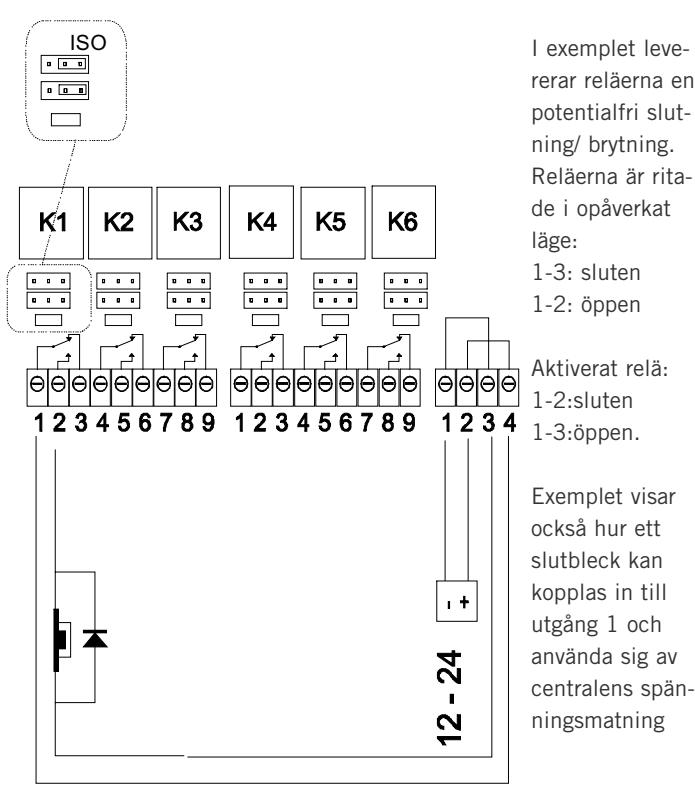

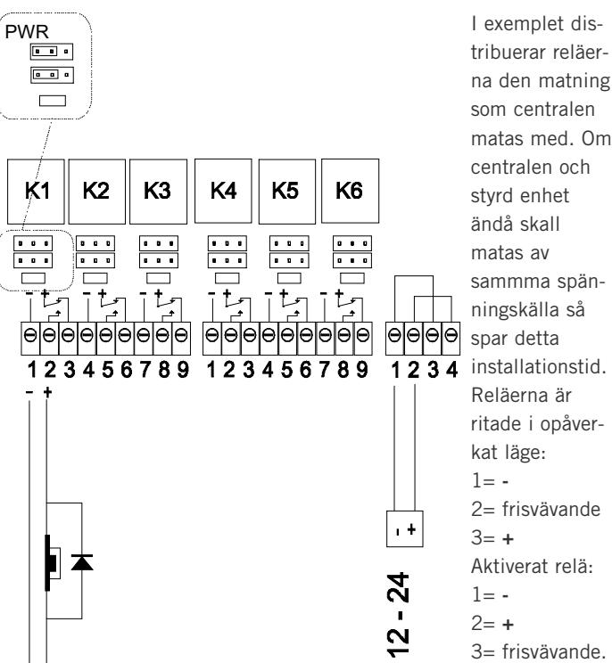

#### **INDIKERING**

Att en utgång är aktiv, reläet draget, visas genom en tänd lysdiod. Denna är placerad alldeles innanför skruvplinten för aktuell utgång.

#### **AVSTÖRNING**

En avstörning i form av en kondensator eller diod skall monteras vid enheten som styrs av utgången. Detta skyddar elektroniken, undviker störningar i matningsspänningen samt ökar livslängden för reläerna

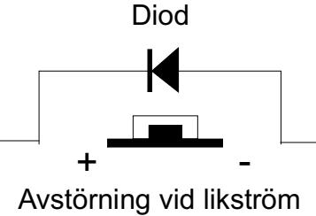

Kondensator

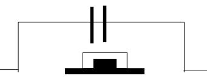

Avstörning vid växelspänning

Avstörningen skall monteras direkt vid störningskällan.

Om matning sker med likström skall diod användas. Om matning istället sker med växelspänning skall kondensator användas.

Använd de dioder och kondensatorer som är medskickade.

**Obs!** Tänk på att dioden är polariserad, måste sättas på rätt håll. (Strecket mot +)

## **KOMMUNIKATION 10**

#### **ALLMÄNT**

Den centralenhet som är master måste kopplas in så att den kan kommunicera med MultiAccess. Via kommunikationen sänder MultiAccess ut all programmering så att centralerna i systemet får avsedd funktion. Mastern skickar i sin tur över data till slavcentralerna.

Kommunikationen master - MultiAccess kan göras på några olika sätt: direkt RS-232, modem (fast eller uppringt) eller nätverk.

#### **DIREKT RS-232**

Använd någon av COM-portarna i MultiAccess-datorn. Anslut Aptus programmeringskabel mellan COM-porten och TB7 på centralen.

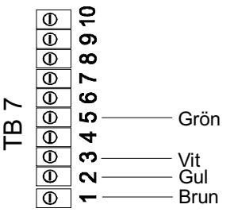

Specificerad längd för RS 232 som används är 15 meter. Det kan fungera med längre avstånd,kanske upp till 50 meter.

Vid längre avstånd bör korthållsmodem (trådbundet) eller telemodem användas.

#### **MODEM**

Du kan kommunicera via modem till mastercentralen. Modemet kan vara trådbundet eller uppringt,

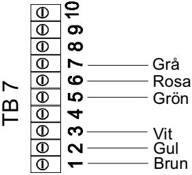

Anslut Aptus modemkabel mellan modemet och TB7 på centralen.

Ett uppringt modem skall vara initierat till autosvar, vilket redan är gjort om ni beställt ett mastermodem från Aptus.

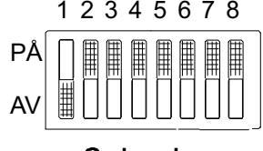

Om uppringt modem skall användas måste Omkopplare 1 flyttas från AV till PÅ.

#### **NÄTVERK**

Om kommunikationen med mastern sker över nätverk, kan det antingen göras genom att ansluta ett externt nätverksmodem, e.g. Netcon, eller också byggs ett nätverksinterface in i centralen. Det finns 2 typer av interface:

AANI eller AANI/3: Kommunicerar med TCP/IP på max 100Mbit.

#### **INDIKATIONER BASKORT**

AC 700 är försedd med tre lysdioder som visar kommunikationstatus och progamstatus. Dessa är:

**Röd: Sändning** Lysdioden lyser upp när centralen skickar data på RS485 bussen.

**Gul: Mottagning** När data tas emot blinkar lysdioden, annars är den tänd.

**Grön: Övervakning** Lysdiodenblinkar med olika mönster för att indikrera olika situationer. Se figuren nedan.

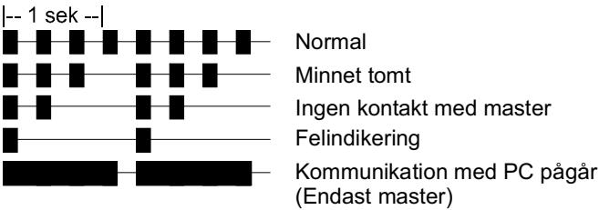

Felindikering visas om hårdvarufel detekterats, eller om centralen har en felaktig konfiguration. Ställer du in adress 0 på en slav kommer också felindikeringen.

#### **INDIKATIONER INTERFACEKORT**

Interfacekort med APTUS485-buss, dvs. 485-Interface, 485PT-Interface och 485BT-Interface, innehåller 2 lysdioder för att övervaka kommunikationen med enheter på APTUS485-bussen. Dessa är: **Röd: Sändning** Lysdioden tänds när data skickas. Normalt skall denna blinka snabbt.

**Gul: Mottagning** Lysdioden blinkar när data tas emot, annars är den släckt.

### **INSTÄLLNINGAR 11**

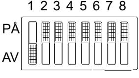

#### **MASTER**

#### **Omkopplare 1:**

Vid bruk av modem skall omk. 1 vara i PÅ läge. Vid direkt anslutning till datorns serieport skall omk. 1 vara i AV läge.

#### **Omkopplare 2,3,4,5:**

**NCBKDHFKCHSDKHFCKJ**

Läge AV.

#### **Omkopplare 6,7:**

Inställning av kommunikationshastiget mellan master och dator.

#### 0=AV, 1=PÅ

| Omk |  |  | 6 7 Hastighet |
|-----|--|--|---------------|
|-----|--|--|---------------|

- 0 0 9600 Baud
- 0 1 4800 Baud
- 1 0 2400 Baud
- 1 1 115200 Baud

#### **Omkopplare 8:**

Återställning av programmeringskod. Normalt skall omk. 8 vara i AV läge.

Vid behov att återställa koden till fabriksvärdet 123456, förs omk. 8 till PÅ läge i 2-3 sekunder och därefter åter till AV läge.

Dessutom nollställs krypteringsnyckel.

Återställningen görs med centralen spänningsatt.

#### **Omkopplare 1,2,3,4,5**

Adressval:

Samtliga centraler måste ha en unik adress för att man skall kunna koppla samman dem. Med omkopplarna ställer man in adresserna enligt följande tabell.

| Omk. |  | 1 2 3 4 5 | Adress     |
|------|--|-----------|------------|
|      |  | 0 0 0 0 0 | Används ej |
|      |  | 0 0 0 0 1 | Slav 1     |
|      |  | 0 0 0 1 0 | Slav 2     |
|      |  | 0 0 0 1 1 | Slav 3     |
|      |  | 0 0 1 0 0 | Slav 4     |
|      |  | 0 0 1 0 1 | Slav 5     |
|      |  | 0 0 1 1 0 | Slav 6     |
|      |  | 0 0 1 1 1 | Slav 7     |
|      |  | 0 1 0 0 0 | Slav 8     |
|      |  | 0 1 0 0 1 | Slav 9     |
|      |  | 0 1 0 1 0 | Slav 10    |
|      |  | 0 1 0 1 1 | Slav 11    |
|      |  | 0 1 1 0 0 | Slav 12    |
|      |  | 0 1 1 0 1 | Slav 13    |
|      |  | 0 1 1 1 0 | Slav 14    |
|      |  | 0 1 1 1 1 | Slav 15    |
|      |  | 1 0 0 0 0 | Slav 16    |
|      |  | 1 0 0 0 1 | Slav 17    |
|      |  | 1 0 0 1 0 | Slav 18    |
|      |  | 1 0 0 1 1 | Slav 19    |
|      |  | 1 0 1 0 0 | Slav 20    |
|      |  | 1 0 1 0 1 | Slav 21    |
|      |  | 1 0 1 1 0 | Slav 22    |
|      |  | 1 0 1 1 1 | Slav 23    |
|      |  | 1 1 0 0 0 | Slav 24    |
|      |  | 1 1 0 0 1 | Slav 25    |
|      |  | 1 1 0 1 0 | Slav 26    |
|      |  | 1 1 0 1 1 | Slav 27    |
|      |  | 1 1 1 0 0 | Slav 28    |
|      |  | 1 1 1 0 1 | Slav 29    |
|      |  | 1 1 1 1 0 | Slav 30    |
|      |  | 1 1 1 1 1 | Slav 31    |
|      |  |           |            |

#### **Omk 6 7 Slavkommunikation**

0 0 RS-485 (Standard)

#### **Omkopplare 8:**

**SLAV** Läge AV.

#### **CENTRALENS MINNE**

AC700 levereras med stort RAM, (minne), och JP2 är också inställt för detta. Tänk dock på att alla centraler i ett system måste använda sig av samma minnesstorlek. Om du skall använda en ny 700-centralen i ett befintligt system där centralerna har litet minne kan du sätta JP2 i vänsterläge för att anpassa minnet. Alternativet är att montera stort minne i de äldre enheterna.

### **KOMMUNIKATION MED SLAVAR**

### **SAMMANKOPPLING AV MASTER OCH SLAVAR (RS-485)**

Centralerna utbyter information genom ett kommunikationsnät enligt RS485 specifikation. Denna kommunikation är mycket tålig mot störningar, men man bör ändå undvika att förlägga kommunikationskabeln parallellt med kraftkabel längre sträckor.

#### **KABELREKOMMENDATIONER**

#### **Dörrenheter**

Kontrollera den specifika läsarens inkopplingsanvisning.

#### **Kabel till strömförsörjning och slutbleck**

Till varje master kan man ansluta 31 st slavar. Centralerna kopplas ihop med partvinnad kabel till en slinga. Observera att det inte är tilllåtet att koppla slingan så att det uppstår ett stjärnnät. I den partvinnade kabeln skall A och B bilda ett par och GND ett par. Observera! Till en AC 700 master kan endast slavar av typen AC 700 anslutas.

Använd gärna kabel med överdrivet stor kabelarea för att undvika spänningsfall. Om ett slutbleck anslutes 100 m från centralen och har en strömförbrukning på 300mA vid 24 V så bör en kabelarea väljas till slutblecket på minst 2x0.75 mm2. Om flera centraler skall försörjas från samma ström-försörjning, genom seriekoppling, skall man välja en kabel med en ledararea på 1.5 till 2.5 mm2.

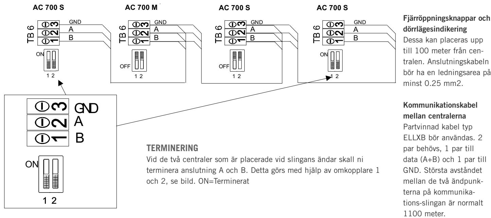

**Obs!** Centralerna behöver inte sitta i adressordning utan placeras i den ordning man finner lämplig med tanke på kabeldragningen.

#### **GARANTI**

APTUS Elektronik AB lämnar 2 års garanti på material och fabrikationsfel på samtliga produkter. Övrigt enligt leveransbestämmelser NL01.

#### **SERVICE**

För service hänvisar APTUS Elektronik AB till ansvarig återförsäljare som utöver egen kompetens har kontinuerlig kontakt med APTUS Elektronik AB.