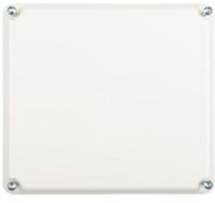

## IO-5022 GEN2 2 IN/2 UTGÅNG

Artikelnummer: 20100022, E-nummer: 5872028

I/O enhet (in/ut enhet) med 2 ingångar och 2 utgångar.

Används för att ansluta tillbehör såsom ellås, öppnaknapp, dörravkänning, dörrautomatik, hisstyrning och andra ev. tillbehör.

Ansluts mot UC-50 via lokalbuss RS-485.

| Utförande:            | Vit, PC ABS Plastlåda   |
|-----------------------|-------------------------|
| Systemkrav R-CARD M5: | Rek. M5 5.49.4          |
| Anslutningar:         | 2 Ingångar & 2 Utgångar |
| Kommunikation:        | UC via RS-485           |
| Matningsspänning:     | 10 - 30 VDC             |
| Strömförbrukning:     | Vila 26mA - Max 34mA    |
| Vikt:                 | 478g                    |
| Temperaturområde:     | +5°C til +40°C          |
| Mått (BxHxD):         | 201x181x50 mm           |