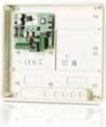

## IO-5022 2 IN/2 UTGÅNG

Artikelnummer: 20100119, E-nummer: 5875146

In/utenhet med två utgångar och två ingångar. Ansluts mot UC-50 via lokalbuss RS485.

| Mått (mm, BxHxD): | 200x180x50                             |
|-------------------|----------------------------------------|
| Temperaturområde: | +5 °C till +60 °C                      |
| Ingångar:         | 2 ingångar (dubbelbalanserad 2,2K ohm) |
| Utgångar:         | 2 utgångar (relä)                      |
| Kommunikation:    | Lokalbuss RS485                        |
| Matningsspänning: | Max 35mA                               |
| Strömförbrukning: | 10-24 V AC/DC                          |