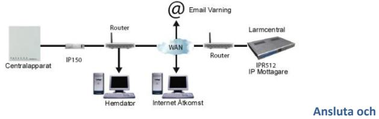
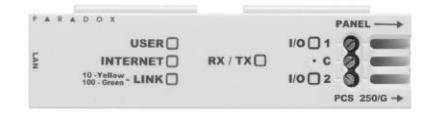
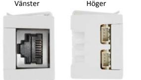
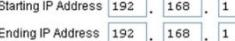
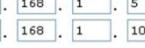
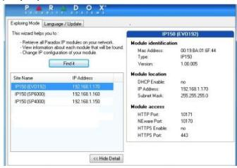
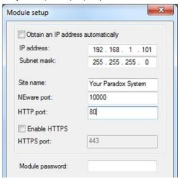
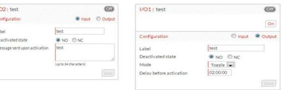
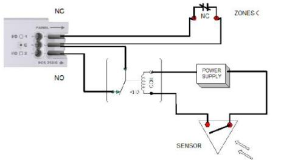
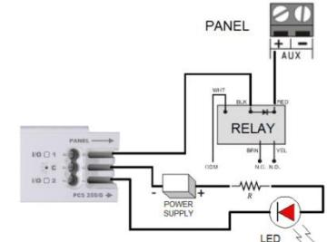

# **IP150 Internet Modul**

Installations Manual V1.3 – IP150-EI01 2013-9-9

### **Beskrivning**

IP150 Internet Modulen är en HTTPs-baserad IP kommunikations enhet som låter dig kontrollera och övervaka ditt larmsystem via en webbläsare (t.ex Google Chrome). IP150 ger dig åtkomst till ditt system var du än är och låter dig ta emot SSL krypterade email varningar när systemet känner av aktivitet. Var du än är har du åtkomst till till- och frånkoppling med mera.

### **Innan du börjar**

Innan du börjar, se till att du har en dator med åtkomst till internet. Du behöver följande för att ställa in din IP150 internet modul:

- En dator med internet åtkomst (krävs för fjärråtkomst)
- Router
- 4-pin Seriell kabel (inkluderad)
- CAT-5 Ethernet kabel (max 90m, inkluderas ej)
- Paradox IP Exploring Tools mjukvaran (krävs för fjärråtkomst) mjukvaran kan laddas ner från vår hemsida (www.paradox-security.se)
- Fast IP adress eller registrering till ParadoxMyHome (se **Steg 3: Ställa in ParadoxMyHome**)

#### **Figur 1: IP Kommunikations översikt**

#### **installera IP150**

#### **Figur 2: IP150 Översikt**

Framsida

Box montering

**För att ansluta och montera IP150:** 

- **1) Anslut 4-pin seriella kabeln mellan centralens seriella ingång och IP150 enhetens central anslutning (se Höger sidovy i Figur 2).**
**2) Anslut Ethernet kabeln mellan routern och IP150 nätverks anslutningen (se Vänster sidovy i Figur 2).** 

- **3) Inbyggda LED lampor tänds för att visa IP150 enhetens status (se Framsida i Figur 2).**
**4) Fäst IP150 högst upp på Metall skalet (se Box installation i Figur 2).** 

# **LED Indikatorer**

| LED       | Beskrivning                                                                                                                    |                     |                           |  |  |  |
|-----------|--------------------------------------------------------------------------------------------------------------------------------|---------------------|---------------------------|--|--|--|
| Användare | PÅ när användare är ansluten                                                                                                   |                     |                           |  |  |  |
|           | LED status                                                                                                                     | Internet Anslutning | ParadoxMyHome aktiverad   |  |  |  |
|           | På                                                                                                                             | Ansluten            | Ansluten                  |  |  |  |
|           | Blinkande                                                                                                                      | Ansluten            | Ej ansluten               |  |  |  |
| Internet  | Av                                                                                                                             | Ej ansluten         | Ej ansluten               |  |  |  |
|           | LED status                                                                                                                     | Internet Anslutning | ParadoxMyHome Avaktiverad |  |  |  |
|           | På                                                                                                                             | Ansluten            | Ej ansluten               |  |  |  |
|           | Av                                                                                                                             | Ej ansluten         | Ej ansluten               |  |  |  |
| Link      | Gult: Giltig link vid 10MB/S Grönt: Giltig link vid 100MB/s LED blinkar vid data trafik. Blinkar Gul/grönt: DHCP Fel. |                     |                           |  |  |  |
| Rx/Tx     | På efter första lyckade kommunikationen; Blinkar när data sänds eller tas emot; Av när ingen anslutning finns.           |                     |                           |  |  |  |
| I/O 1     | På när aktiverad                                                                                                               |                     |                           |  |  |  |
| I/O 2     | På när aktiverad                                                                                                               |                     |                           |  |  |  |

# **Återställa IP150 till standard**

För att återställa IP150 modulen till grundinställningarna, sätt in en nål, ett utsträckt gem eller liknande i hålet mellan de två I/O LED lamporna. Tryck försiktigt ner tills du känner motstånd; håll ner den i runt 5 sekunder, släpp när I/O och Rx/Tx lamporna börjar blinka och tryck sedan ner den igen. I/O och Rx/Tx fortsätter vara tända under återställningen.

#### **IP Rapportering**

När IP rapportering används kan IP150 enheten polla larmcentralen. För att aktivera IP rapportering måste IP150 enheten registreras till larmcentralens IP mottagare (IPR512). Telefonrapportering kan användas samtidigt som, eller som backup för, IP rapportering. Innan IP150 kan registreras måste följande information hämtas från larmcentralen:

- Kontonummer ett kontonummer för varje område som används. IP/GPRS rapportering använder en annan grupp kontonummer än de som används för telefonrapportering.
- IPadress(er) 12-siffrigt (ex: för 195.4.8.250 ange 195.004.008.250), IP adresserna anger vilka av larmcentralens IP mottagare som används för IP rapportering.
- IP port(ar) 5 siffriga (för 4 siffriga nummer ange 0 innan första siffran). IP porten anger vilken port som används av larmcentralens IP mottagare.
- Mottagarlösenord upp till 32 tecken, används för att kryptera IP150 registrerings processen
- Säkerhets profil(er) 2siffriga nummer. Säkerhetsprofilen anger hur ofta larmcentralen pollas av
- IP150 enheten. Säkerhets profils nummer och pollnings frekvens definieras av larmcentralen.

#### **Ställa in IP Rapportering**

- 1) Försäkra att centralens rapportkods format är ställt till Ademco Contact ID: MG/SP/E: Adress [810]
- EVO: Adress [3070]
- 2) Ange IP rapporterings konto numret (ett för varje område):
- MG/SP/E: Adress [918]/[919]
- EVO: Adress [2976] till [2983]
- 3) Under Allmänna IP Alternativs adressen, ställ in IP anslutnings övervaknings alternativ och uppringnings alternativ, och försäkra att IP rapportering är aktiverad (se följande tabeller).

#### **MG/SP/E**: adress [806]

|     | IP Linje Övervaknings Alternativ         |                                                               |                                        |                                    |  |  |
|-----|------------------------------------------|---------------------------------------------------------------|----------------------------------------|------------------------------------|--|--|
| [5] | [6]                                      |                                                               |                                        |                                    |  |  |
| AV  | AV                                       | Avaktiverad                                                   |                                        |                                    |  |  |
| AV  | PÅ                                       | När frånkopplad: Endast fel När tillkopplad: Endast fel    |                                        |                                    |  |  |
| PÅ  | AV                                       | Når frånkopplad: Endast fel När tillkopplad: Ljudligt larm |                                        |                                    |  |  |
| PÅ  | PÅ                                       | Tyst larm blir ljudligt larm                                  |                                        |                                    |  |  |
|     |                                          |                                                               | AV                                     | PÅ                                 |  |  |
| [7] | Använd uppringare rapportering (telefon) |                                                               | Som backup för IP/GPRS rapportering | Tillsammans med IP rapportering |  |  |
| [8] | IP/GPRS Rapportering                     |                                                               | Avaktiverad                            | Aktiverad                          |  |  |

#### **EVO**: Adress [2975] IP Linje Övervaknings Alternativ [5] [6] AV AV Avaktiverad AV PÅ När frånkopplad: Endast fel När tillkopplad: Ljudligt larm PÅ AV Når frånkopplad: Ljudligt larm (standard) När tillkopplad: Ljudligt larm PÅ PÅ Tyst larm blir ljudligt larm AV PÅ [7] Använd uppringare rapportering (telefon) Som backup för IP/GPRS rapportering Tillsammans med IP rapportering [8] IP/GPRS Rapportering Avaktiverad Aktiverad

4) Ange larmcentralens IP adress(er). IP port(ar), mottagarlösenord och säkerhetsprofiler (denna information fås från larmcentralen).

| MG/SP/E Adresser |       |       | MG/SP/E Adresser |              |    |    |                             |    |
|------------------|-------|-------|------------------|--------------|----|----|-----------------------------|----|
| IP Mottagare     | #1    | #2    | Backup           | IP Mottagare | #1 | #2 | #3                          | #4 |
| IP Adress 1      | [929] | [936] | [943]            | IP Adress 1  |    |    | [2984] [2986] [2988] [2990] |    |
| IP Port 1        | [930] | [937] | [944]            | IP Port 1    |    |    |                             |    |
| IP Adress 2      | [931] | [938] | [945]            | IP Adress 2  |    |    |                             |    |
| IP Port 2        | [932] | [939] | [946]            | IP Port 2    |    |    |                             |    |
| IP Lösenord      | [933] | [940] | [947]            | IP Lösenord  |    |    |                             |    |
| IP Profil        | [934] | [941] | [948]            | IP Profil    |    |    |                             |    |

5) Registrera IP150 modulen till larmcentralen. För att registrera, gå in i adressen härunder och tryck [Tillkoppla]. Registrerings statusen visas tillsammans med registreringsfel som kan ha uppstått.

| MG/SP/E Registrering |    |             |        | EVO Registrering                                |    |    |    |    |
|----------------------|----|-------------|--------|-------------------------------------------------|----|----|----|----|
| IP Mottagare #       | #1 | #2          | Backup | IP Mottagare #                                  | #1 | #2 | #3 | #4 |
| Registreringsstatus  |    | [935] [942] | [949]  | Registreringsstatus [2985] [2987] [2989] [2991] |    |    |    |    |

NOTIS: En IP150 som används i ett MG/SP/E system pollar alltid med kontonumret som tillhör område 1. När du använder ett EVO system används kontonumret för område 1 som standard, men detta kan ändras på adress [3020]. Alla rapporterade systemhändelser visas som om de kommer från detta område.

# **Fjärråtkomst**

IP150 ger fjärråtkomst för kontroll och övervakning av centralapparaten via webbläsare eller Datormjukvara. Detta låter användare nå systemet var de än är i världen. Följande instruktioner visar hur du ställer in fjärranslutning.

#### **Steg 1: Ställa in Routern**

- Detta steg ställer in routern så att IP150 kan fungera korrekt.
- 1) Försäkra att routern är ansluten enligt routerns instruktioner.
- 2) Gå in i routerns inställnings gränssnitt. Se routerns manual för exakta instruktioner, oftast kan du nå den genom att ange routerns statiska IP adress i adressraden för din webbläsare. I detta exempel använder vi 192.168.1.1 som din routers IP adress.
- 3) I routerns inställnings sida, se DHCP inställningarna (utseendet kan variera beroende på routertyp)

Om DHCP är aktiverat, verifiera att IP adress räckvidden lämnar minst en IP adress tillgänglig utanför IP räckvidden. Räckvidden ovanför lämnar adresserna 2 till 4 och 101 till 254 utanför. Välj en IP adress utanför DHCP räckvidden som du vill använda för IP150 enheten. Om DHCP är avaktiverat använder IP150 standardadressen 192.168.1.250. Denna adress kan ändras via Paradox IP Exploring Tools mjukvaran.

- 4) På routerns inställningssida, gå till Port Forwarding ("port mapping", "port redirection", "porttilldelning") delen. Lägg till en tjänst/regel, ställ Port till 80 och ange den statiska IP adressen som du valde för IP150. Om port 80 redan används kan du använda en annan, till exempel 81 eller 82,

| Name    | Internet Module |           |           |     |  |
|---------|-----------------|-----------|-----------|-----|--|
| Type    |                 | TCP/UDP V |           |     |  |
| Port    | 80              |           | (1~65534) |     |  |
| Port    | 80              |           | (1~65534) |     |  |
| Address | 192             | 168       | 1         | 101 |  |

men då måste IP150 enhetens inställningar ändras i steg 2. Vissa Internet Leverantörer blockerar port 80, detta kan betyda att IP150 enheten fungerar lokalt med port 80 men inte över internet. Om detta är fallet, ändra porten till ett annat nummer. Upprepa detta steg med port 10 000. Om du använder en säker anslutning (https) måste du även öppna port 443.

#### **Steg 2: Ställa in IP150**

1) Öppna Paradox IP Exploring Tools på en dator ansluten till samma nätverk som IP150 enheten. 2) Tryck på Find It. Din IP150 visas i listan.

3) Högerklicka IP150 modulen och välj Modulinställningar, ange den statiska IP adressen du valde i steg 1.3. Ange IP150 enhetens lösenord (standard: paradox) och tryck OK. Om ett meddelande om att IP adressen redan används visas, ändra adressen till något annat och ändra Port Forwarding inställningarna i routern (steg 1.4) och fortsätt sedan.

4) Ställ in övrig information som till exempel port, subnet mask, etc. För att hitta denna information i ett windows system, öppna Kommandotolken (Start > Program > Tillbehör > kommandotolken) och ange kommandot IPCONFIG /ALL.

NOTIS: för ökad kommunikationssäkerhet, var god ändra standard PC lösenordet och Central ID för centralen. IP150 stödjer SMTP/ESMTP/SSL/TLS protokoll.

#### **Steg 3: Ställa in ParadoxMyHome (valfritt)**

Detta steg behövs inte om IP adressen du får från din Internet Service leverantör är statisk. Med ParadoxMyHome kan du nå systemet över internet med en dynamisk IP adress. IP150 modulen pollar ParadoxMyHome servern för att hålla kommunikations informationen uppdaterad. Som standard är ParadoxMyHome tjänsten avaktiverad (aktiveras på IP150 modulens inställnings sida).

För att ställa in ParadoxMyHome tjänsten:

- 1) Gå till www.paradoxmyhome.com, tryck på Request Login och ange informationen som krävs.
- 2) Starta Paradox IP Exploring Tools mjukvaran och högerklicka IP150 enheten
- 3) Välj Register to ParadoxMyHome.
- 4) Ange informationen som krävs, Ange ett unikt SiteID för modulen.
- 5) När registreringen är klar kan du nå IP150 sidan genom att gå in på: www.paradoxmyhome.com/[SiteID]

Om det uppstår problem med att ansluta till IP150 enheten, förkorta pollnings fördröjningen (ställs in på IP150 enhetens websida), så att IP informationen tillgänglig för ParadoxMyHome anslutningen är aktuell. En kortare fördröjning mellan pollningar ger ökad internettrafik i ditt system.

### **Steg 4: Använda en Webbläsare för att ansluta till systemet**

När modulen har ställts in kan den nås antingen via det lokala nätverket eller genom internet via larmsystemets användarkod eller användarens IP150 lösenord.

#### **Intern anslutning:**

1) Ange IP adressen tilldelad till IP150 enheten i adressraden för din webbläsare. Om du har använt en annan port än 80 måste du ange [:(portnr)] i slutet (ex: http://192.168.1.250:81). För försäkra en säker anslutning, används https:// eller dubbelklicka enheten i IP Exploring Tools mjukvaran.

2) Ange larmsystemets användarkod och IP150 enhetens användarlösenord (standard: paradox). NOTIS: En varning om att webbsidans certifiering är osäker kan visas, detta är acceptabelt, välj fortsätt.

#### **Extern anslutning**

1) Gå till www.paradoxmyhome.com/[SiteID] (ersätt [SiteID] med det SiteID du valt när du registrerade din enhet till ParadoxMyHome tjänsten)

2) Ange larmsystemets användarkod och IP150 enhetens lösenord (standard: paradox).

# **Ingångar och utgångar**

I/O terminalerna kan ställas in via IP150 webbsidan. Varje I/O kan definieras som antingen ingång eller utgång. I/O terminalerna kan BARA ställas in via IP150 enhetens webbsida. De är fristående från centralen och kan inte associeras med centralhändelser. En utgång kan bara aktiveras från IP150 enhetens webbsida. Utgångs eller ingång aktivering kan rapporteras via Email. När terminalerna är ställda som ingång eller utgång kan de ställas in som N.O eller N.C (se figur 3). För utgångar måste en 12V strömkälla anslutas (se Figur 5). Utgångar är klassade för 50mA. Metoden för aktivering är antingen Växlande eller Puls. Om den är ställd till Växlande kan en fördröjning innan aktivering ställas in och om den är ställd till puls kan en fördröjning och en varaktighet ställas in. Se Figur 4 och 5 för exempel av ingångs och utgångs anslutningar.

#### Figur 3: Ingångs/Utgångs Inställningar

#### Figur 4: Ingångs Anslutnings Exempel

Figur 5: Utgångs Anslutnings Exempel

## **Händelselogg**

Tre typer av händelser loggförs (endast de 64 senaste händelserna visas): - Rapportering ( sorteras efter färg: Lyckad, misslyckad, pågår, avbruten av centralapparat) - Central händelser (kan även ses via PC mjukvaran eller i knappsatser) -IP150 lokala händelser

# **Tekniska Specifikationer**

Följande tabell ger tekniska specifikationer för IP150 Internet Modulen

| Specifikation          | Beskrivning                                                                |
|------------------------|----------------------------------------------------------------------------|
| Central Kompatibilitet | Alla Digiplex EVO centraler (V2.02+ för IP rapportering)                   |
|                        | Alla Spectra SP centraler (V3.42+ för IP rapportering)                     |
|                        | Alla MG5000/MG5050 centraler (V4.0 för IP rapportering)                    |
|                        | Alla Esprit E55 (stödjer ej IP rapportering)                               |
|                        | Esprit E65 V2.10+                                                          |
| Webbläsar krav         | Optimerad för Internet Explorer 9 eller högre och Mozilla Firefox 18 eller |
|                        | högre. 1024 x768 upplösning minimikrav                                     |
| Kryptering             | AES 256-bit, MD5 och RC4                                                   |
| Strömförbrukning       | 100mA                                                                      |
| Ingångs Spänning       | 13.8VDC, hämtas från centralens seriella ingång                            |
| Skal Dimensioner       | 10.9cm x 2.7 cm                                                            |
| Certifiering           | EN 50136 ATS 5 Klass II                                                    |

# PARADOX SECURITY AB EKHOLMSVÄGEN 36 ; 127 48 SKÄRHOLMEN Telefon 08 / 556 465 50 Fax 08 / 556 465 59 www.paradox-security.se