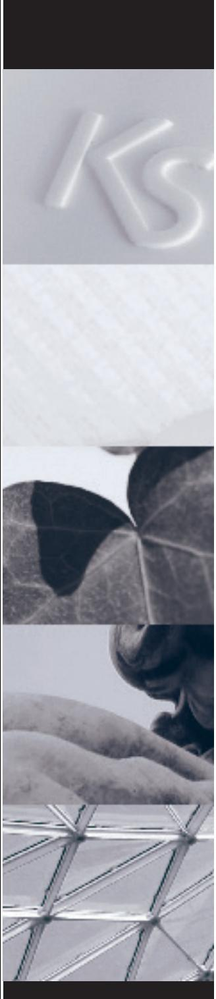

# IR-detektor unum

Installation

## **Beskrivning**

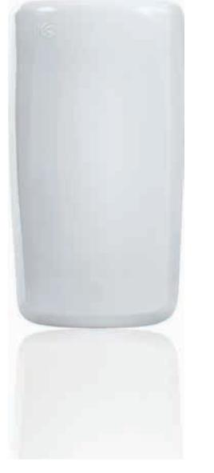

Rörelsedetektorerna i **unum**-serien är professionella och har den senaste tekniken, de bästa komponenterna och materialen. Det ger högsta tillförlitlighet och minimal risk för obefogade larm. Dessutom är **unum**-detektorerna de enda på marknaden med osynlig lins, d.v.s. den är integrerad i kapslingens framstycke tack vare E.L.T. (Embedded Lens Technology). Detektering av rörelser sker genom linsen EvenEyeTM och registreras av en infraröd (IR) sensor. Signalen omvandlas i en DSP ASIC-konverter (patentsökt) till en digital signal med bästa tillförlitlighet och stabilitet. Slutligen tolkas signalen i en "ASCI HighBar" mikroprocessor som ger bästa skydd mot obefogade larm och samtidigt bästa detektering av rörelse.

## **Montering**

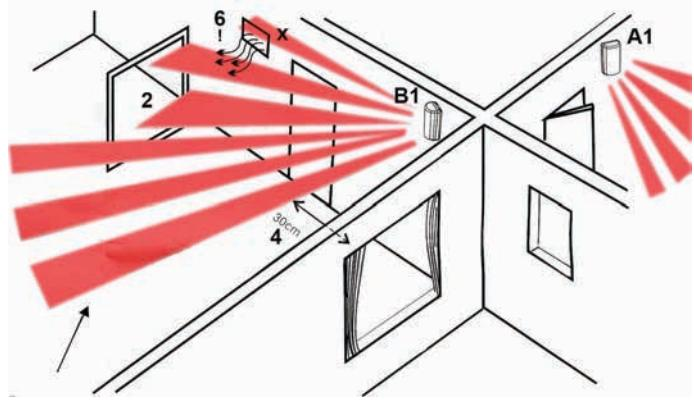

## **Väggmontering**

- A1. Detektorn monteras plant på vertikal vägg ( ± 2° ).
#### **Montering med fäste** (tillbehör)

- B1. Montering med väggfäste med kulled (tillval) på nästan vertikal vägg ( ± 15° ). Detektorn riktas vertikalt ( ± 2° ).
Se avsnittet "Montering av väggfäste".

#### **All montering**

- 1. Monteringshöjd 2,3 eller 3 meter över området som ska detekteras.
- 2. Se till att det är fri sikt över det detekterade området (C2). **OBS!** Glas blockerar detektering med IR-sensorn och metall blockerar detektering av mikrovågssensorn.
- 3. Väggtemperaturen ska vara ungefär samma som i det bevakade området.
- 4. Den ska riktas så att den inte "ser" mot fönster eller reflekterat solljus.
- 5. Den ska inte monteras nära värmeradiatorer eller ventilationsutsläpp.
- 6. Detektorn ska monteras så att en tänkt inkräktare passerar genom minst två avkänningsfält.
- 7.
- 8.

## **Öppning av kapslingen**

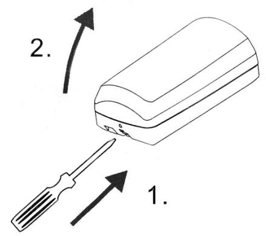

Skruva bort skruven i kapslingens nederkant.

Använd en skruvmejsel och tryck i springan (1) och vrid skruvmejseln något. Lyft bort kapslingens framstycke (2).

#### **Demontering av kretskortet**

Kretskortet demonteras från kapslingens bakstycke genom att snäppfästet 1 lossas och kortet dras snett upp åt höger.

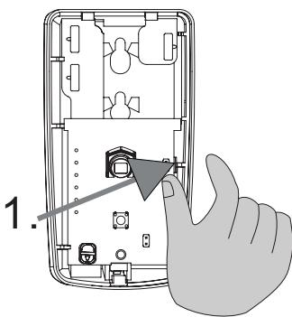

## **Förbered bakstycket för montering**

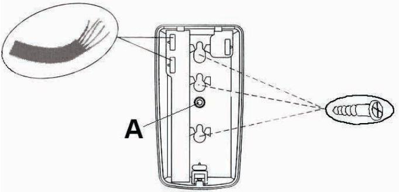

Bestäm vilka hål som ska användas.

- 1. Vid **väggmontering** används t.ex. en dorn eller pryl för att slå ut de hål som ska användas.
- 2. Vid **hörnmontering** i 45º ska minst två hål borras i bakstyckets fasade hörna.
- 3. Vid montering med **väggfäste** (tillbehör) ska ett 3 mm hål borras i bakstyckets mitt (A). Se vidare i avsnittet "Montering med väggfäste".
- 4. Slå ut de hål med en dorn eller pryl i bakstyckets kabelkanal som behövs för ledningsdragning.

## **Förbered ledningen**

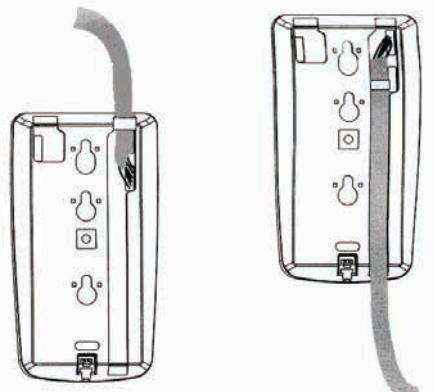

Ta bort ca 8 cm av kabelns mantel. För igenom ledarna genom bakstycket. Placera ledningen i bakstyckets kabelkanal och lås fast den med ett buntband.

# **Väggmontering**

Skruva fast bakstycket på väggen eller i ett hörn.

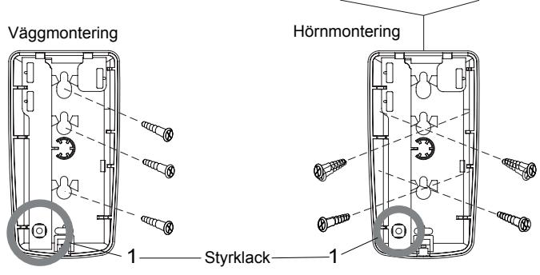

Ställ in PC-kretskortet i läge "0" eller "1" beroende på monteringshöjd, ca. 2,3 m eller 3,0 m, genom att vrida styrklacken 1.

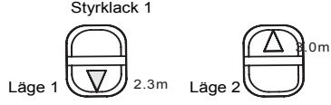

# **Montering med väggfäste** (tillbehör)

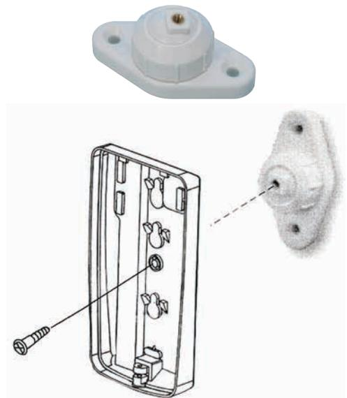

Skruva upp fästet på önskad plats. Skruva fast bakstycket på fästet med den skruv som medföljer fästet.

# **Inkoppling**

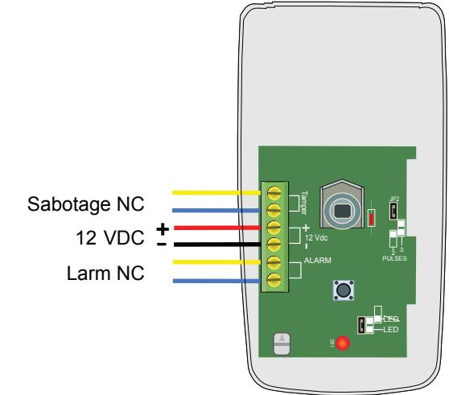

Anslut ledningarna till detektorns plintar.

**Programmeringsbyglar** Byglarna **JP1** och **JP2** ska programmeras efter behov.

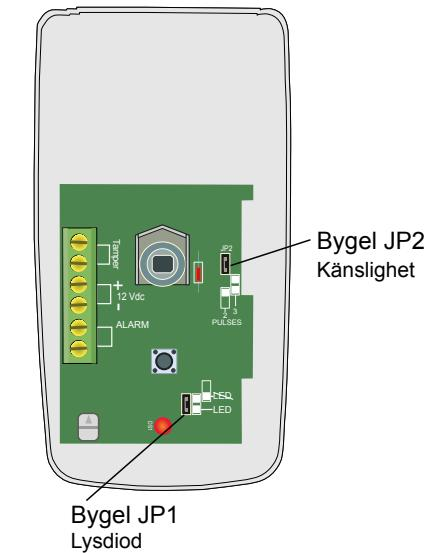

- **JP1** Larmindikering.Koppla in den röda lysdioden med bygeln JP1. Lysdioden indikerar när detektorn detekterar rörelse.
- **JP2** IR-detektorns känslighet (Pulsräknare).
- Om en eventuell inkräktare kan passera nära detektorn eller om hög känslighet önskas ska bygeln tas bort. Med bygeln på plats är känsligheten normal och denna inställ ning används i normala installationer.

I tabellen är fabriksinställningarna markerade med grått.

| Funktion             | Bygel | På       | Borta  |
|----------------------|-------|----------|--------|
| Lysdiod, detektering | 1     | Tänd     | Släckt |
| Känslighet           | 2     | Standard | Hög    |

#### **Lysdiodsindikering**

| Lysdiod | Detektorläge | Indikering                                               |
|---------|--------------|----------------------------------------------------------|
|         | Uppvärmning  | Släckt                                                   |
| Röd     | Larm         | Lyser 3 - 5 sekunder Om lysdioden är inkopplad. |
|         | Normal       | Släckt                                                   |

## **Uppstart**

Vid start av detektorn tar det två minuter i uppvärmningstid innan unum fungerar fullt ut. Under uppvärmningstiden lyser den röda lysdioden som indikerar larm.

## **Gångtest**

**Normalt driftläge**: Koppla in den röda lysdioden med bygeln JP1. Lysdioden indikerar när detektorn detekterar rörelse. **Specialdriftläge** (antisvängningsfunktionen DFIR aktiverad): Koppla från och till strömförsörjningen och utför därefter gångtestet direkt efter att uppvärmningen är klar. Detektorn är då i ett gångtestläge under 30 minuter. Gå genom det optiska detekteringsområdet för att testa DFIR-systemet. Varje gång gränsen till ett avkänningsområde passeras ska den gröna lysdioden blinka. Gå genom detekteringsområdet för att testa mikrovågsdetekteringen. Vid detektering av rörelse ska den gula lysdioden blinka. Den röda lysdioden lyser vid larm. Justera mikrovågsdetektorns känslighet med potentiometern "MW RANGE" vid behov. 30 minuter efter att strömförsörjningen anslutits kopplas den gula och gröna lysdioden bort.

**OBS!** Vi rekommenderar att ett gångtest utförs minst en gång per år.

## **Detekteringsområde**

12 m i den riktning som IR-sensorn är riktad.

12 m i 45° i från den riktning som IR-sensorn är riktad.

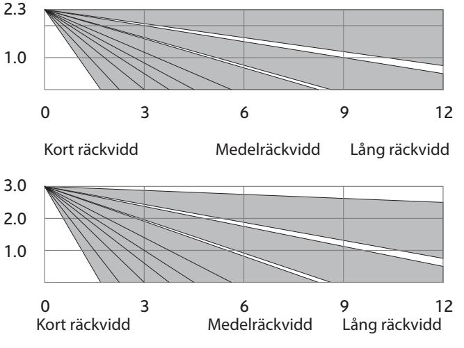

Detekteringsområde (ovanifrån, i meter)

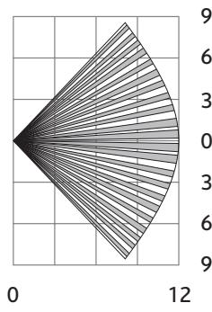

**Antal avkänningsfält** Lång räckvidd: 44 st. Medelräckvidd: 36 st. Kort räckvidd: 18 st.

# **Tekniska data**

| IR-sensor:          | Pyroelektriskt dubbelelement.                                      |
|---------------------|--------------------------------------------------------------------|
| Spänning:           | 8 - 16 VDC.                                                        |
| Strömförbrukning:   | 24 mA vila@ 12 VDC.                                                |
| Larmrelä:           | Halvledarrelä (NC) 100 mA @ 30 VDC                              |
| Sabotagebrytare:    | NC-kontakt 50 mA @ 30 VDC.                                      |
| Rörelsedetektering: | "HighBar" mikroprocessor ger bästa skydd mot obefogade larm. |
| HF-skydd :          | 20 V/m, 10-1000 MHz 10 V/m, 1-2 GHz.                            |
| Vitljusimmunitet:   | 6500 lux.                                                          |
| Pulsräkning:        | 2 eller 3 rörelser.                                                |
| Arbetstemperatur:   | -10 till +55 °C.                                                   |
| Kapsling:           | Bakstycke ABS-plast, fram stycke HDPE-plast.                    |
| Mått (H x B x D):   | 113 × 60 × 45 mm.                                                  |

## **Certifiering**

Europa / RoHS, CE, EN50131-2-2 Klass 2

## **Beställning**

| IR-detektor unum     | 12200 |  |
|----------------------|-------|--|
| Justerbart väggfäste | 12206 |  |